# Изучаем DDD - предметно-ориентированное проектирование

[Context Mapper - Documentation](https://contextmapper.org/docs/home/)

## Содержание

- [Часть 1. Стратегическое проектирование](#part1)
  - [Глава 1. Анализ предметной области](#ch1)
    - [Типы поддоменов](#ch1-1)
    - [Сравнение поддоменов](#ch1-2-1)
      - [Конкурентное преимущество](#ch1-2-1)
      - [Сложность](#ch1-2-3)
      - [Изменчивость](#ch1-2-4)
      - [Стратегия решения (solution)](#ch1-2-5)
    - [Определение границ поддоменов](#ch1-3)
  - [Глава 2. Экcпертные знания о предметной области](#ch2)
    - [Задачи бизнеса (business problems)](#ch2-1)
    - [Выявление экспертных знаний](#ch2-2)
    - [Общение и обмен знаниями](#ch2-2)
    - [Единый язык (ubiquitous language)](#ch2-3)
      - [Сценарии](#ch2-3-1)
      - [Согласованность](#ch2-3-2)
    - [Модель предметной области](#ch2-4)
    - [Инструменты](#ch2-5)
      - [Сложности использования единого языка](#ch2-5-1)
  - [Глава 3. Как осмыслить сложность предметной области](#ch3)
    - [Проблема противоречивых моделей](#ch3-1)
    - [Ограниченный контекст](#ch3-2)
    - [Сравнение ограниченных контекстов и поддоменов](#ch3-4)
    - [Связь между поддоменами и ограниченными контекстами](#ch3-5)
    - [Границы](#ch3-6)
      - [Физиские границы](#ch3-6-1)
      - [Границы владения](#ch3-6-1)
  - [Глава 4. Интеграция ограниченных контекстов](#ch4)
    - [Сотрудничество (Cooperation)](#ch4-1)
      - [Партнерство (Partnership)](#ch4-1-1)
      - [Общее ядро (Shared Kernel)](#ch4-1-2)
    - [Потребитель-Поставщик (Customer-supplier)](#ch4-2)
      - [Конформист (Conformist)](#ch4-2-1)
      - [Предохранительный слой (Anticorruption layer)](#ch4-2-2)
      - [Сервис с открытым протоколом (Open-Host Service)](#ch4-2-3)
    - [Разные пути (Separate Ways)](#ch4-3)
    - [Карта контекстов (Context Map)](#ch4-4)
- [Часть 2. Тактический замысел](#part2)
  - [Глава 5. Реализация простой бизнес-логики](#ch5)
    - [Транзакционный сценарий (transaction script)](#ch5-1)
    - [Активная запись (active record)](#ch5-2)
  - [Глава 6. Проработка сложной бизнес-логики](#ch6)
    - [Модель предметной области (Domain Model)](#ch6-1)
      - [Объекты-значения (Value Objects)](#ch6-1-1)
      - [Сущности (Entities)](#ch6-1-2)
      - [Агрегаты (Aggregates)](#ch6-1-3)
        - [Соблюдение согласованности](#ch6-1-3-1)
        - [Граница транзакции](#ch6-1-3-2)
        - [Иерархия сущностей](#ch6-1-3-3)
        - [Ссылки на другие агрегаты](#ch6-1-3-4)
        - [Корень агрегата](#ch6-1-3-5)
        - [События предметной области](#ch6-1-3-6)
        - [Единый язык](#ch6-1-3-7)
      - [Доменные сервисы (domain service)](#ch6-1-4)
    - [Управление сложностью](#ch6-2)
  - [Глава 7. Моделирование фактора времени](#ch7)
    - [События как источник данных (Event Sourcing)](#ch7-1)
    - [Модель предметной области, основанная на событиях](#ch7-2)
  - [Глава 8. Архитектурные паттерны](#ch8)
    - [Слоистая архитектура](#ch8-1)
    - [Порты и адаптеры (Ports and adapters)](#ch8-2)
      - [Принцип инверсии зависимостей (Dependency inversion principle)](#ch8-2-1)
      - [Интеграция инфраструктурных компонентов](#ch8-2-2)
      - [Вариации](#ch8-2-3)
      - [Использование](#ch8-2-4)
    - [Разделение ответственности команд и запросов (Command-Query Responsibility Segregation)](#ch8-3)
      - [Мультипарадигменное моделирование (Polyglot modelling)](#ch8-3-1)
      - [Реализация](#ch8-3-2)
      - [Проецирование моделей чтения](#ch8-3-3)
        - [Синхронные проекции](#ch8-3-3-1)
        - [Асинхронные проекции](#ch8-3-3-2)
      - [Разделение моделей](#ch8-3-4)
      - [Когда предпочтительнее использовать CQRS](#ch8-3-5)
    - [Область применения](#ch8-4)
  - [Глава 9. Паттерны взаимодействия](#ch9)
    - [Преобразование моделей](#ch9-1)
    - [Преобразование моделей без сохранения состояния](#ch9-2)
      - [Синхронный режим](#ch9-2-1)
      - [Асинхронный режим](#ch9-2-2)
    - [Преобразование моделей с отслеживанием состояния](#ch9-3)
      - [Агрегирование входящих данных](#ch9-3-1)
      - [Объединение нескольких источников](#ch9-3-2)
    - [Интеграция агрегатов](#ch9-4)
      - [Паттерн исходящих сообщений (Outbox)](#ch9-4-1)
      - [Сага](#ch9-4-2)
      - [Диспетчер процессов](#ch9-4-3)
- [Часть 3. Применение предметно-ориентированного проектирования на практике](#part3)
  - [Глава 10. Эвристика проектирования](#ch10)
    - [Ограниченные контексты](#ch10-1)
    - [Паттерны реализации бизнес-логики](#ch10-2)
    - [Архитектурные паттерны](#ch10-3)
    - [Стратегия тестирования](#ch10-4)
    - [Дерево тактических проектных решений](#ch10-5)
  - [Глава 11. Эволюция проектных решений](#ch11)
    - [Изменения в предметных областях](#ch11-1)
    - [Стратегические аспекты проектирования](#ch11-2)
    - [Тактические аспекты проектирования](#ch11-3)
      - [Преобразование транзакционного сценария в активную запись](#ch11-3-1)
      - [Преобразование активной записи в модель предметной области](#ch11-3-2)
      - [Преобразование модели предметной области в модель предметной области, основанную на событиях](#ch11-3-3)
    - [Организационные изменения](#ch11-4)
    - [Знания предметной области](#ch11-5)
    - [Рост проекта](#ch11-6)
  - [Глава 12. EventStorming](#ch12)
  - [Глава 13. Предметно-ориентированное проектирование на практике](#ch13)
    - [Стратегический анализ](#ch13-1)
      - [Осмысление предметной области](#ch13-1-1)
        - [Основные поддомены (core subdomains)](#ch13-1-1-1)
        - [Универсальные поддомены](#ch13-1-1-2)
        - [Вспомогательные поддомены (supporting subdomains)](#ch13-1-1-3)
      - [Изучение текущего проекта](#ch13-1-2)
    - [Определение стратегии модернизации](#ch13-2)
      - [Стратегическая модернизация](#ch13-2-1)
      - [Тактическая модернизация](#ch13-2-2)
      - [Развитие единого языка](#ch13-2-3)
    - [Законспирированное предметно-ориентированное проектирование](#ch13-3)
      - [Единый язык](#ch13-3-1)
      - [Ограниченные контексты](#ch13-3-2)
- [Часть 4. Взаимоотношения с другими методологиями и паттернами](#part4)
  - [Глава 14. Микросервисы](#ch14)
    - [Предметно-ориентированное проектирование и границы микросервисов](#ch14-1)
      - [Ограниченные контексты](#ch14-1-1)
      - [Поддомены](#ch14-1-2)
    - [Сокращение публичных интерфейсов микросервисов](#ch14-2)
      - [Сервис с открытым протоколом](#ch14-2-1)
      - [Предохранительный слой](#ch14-2-2)
  - [Глава 15. Событийно-ориентированная архитектура](#ch15)
    - [События](#ch15-1)
    - [Проектирование событийно-ориентированной интеграции](#ch15-2)
  - [Глава 16. Сеть данных (Data Mesh)](#ch16)
    - [Сравнение аналитической модели данных (OLAP) с моделью транзакционных данных (OLTP)](#ch16-1)
      - [Таблица фактов](#ch16-1-1)
      - [Таблица измерений](#ch16-1-2)
      - [Аналитические модели](#ch16-1-3)
    - [Платформы управления аналитическими данными](#ch16-2)
      - [Хранилище данных — Data Warehouse](#ch16-2-1)
      - [Озеро данных — Data Lake](#ch16-2-2)
      - [Проблемы архитектур хранилища данных и озера данных](#ch16-2-3)
    - [Сеть данных (Data mesh)](#ch16-3)
      - [Разбиение данных по предметным областям](#ch16-3-1)
      - [Данные как продукт](#ch16-3-2)
      - [Обеспечение автономии](#ch16-3-3)
      - [Построение экосистемы](#ch16-3-4)
      - [Совмещение сети данных (data mesh) и предметно-ориентированного проектирования](#ch16-3-5)
- [Заключение](#part5)

## <a id="part1">Часть 1. Стратегическое проектирование</a>

### <a id="ch1">Глава 1. Анализ предметной области</a>

- **Предметная область** — это сфера деятельности компании, сервисы, которые она предоставляет своим клиентам. Часто компании действуют в нескольких областях.

- **Поддомены (subdomains)** — это четко определённые бизнес-области внутри предметной области. Для успеха компании требуется взаимодействие нескольких поддоменов (например, кроме основного поддомена могут быть поддомены недвижимости, управления персоналом, финансов и пр.).

Важность стратегического подхода к определению поддоменов и их границ. Поддомены помогают разбить бизнес на части для более эффективного проектирования программного продукта.

Примеры из жизни и бизнеса иллюстрируют, как понимать структуру предметной области и выделять поддомены, фокусироваться на важных аспектах, которые дают конкурентное преимущество.

Перед тем, как приступать к разработке, критически важно понять бизнес и цели компании, чтобы обеспечить создание эффективного решения, отражающего реальную предметную область и её стратегические приоритеты.

#### <a id="ch1-1">Типы поддоменов</a>

- Основные (core subdomains): то, что отличает компанию от конкурентов, даёт конкурентное преимущество. Основные поддомены обычно сложны в реализации и стратегически важны.
- Универсальные (generic subdomains): решенные задачи, то что все компании делают одинаково. Не дают конкурентных преимуществ (например, аутентификация и авторизация пользователей).
- Вспомогательные (supporting subdomains): поддерживают основной бизнес, но сами по себе не дают преимуществ (например, каталог наработок компании для онлайн-рекламы).

#### <a id="ch1-2">Сравнение поддоменов</a>

##### <a id="ch1-2-1">Конкурентное преимущество</a>

Конкурентное преимущество обеспечивается компаниям только основными поддоменами (core subdomains).

Универсальные поддомены (generic subdomains) по определению не могут быть источником каких-либо конкурентных преимуществ.

У вспомогательных поддоменов (supporting subdomains) низкие входные барьеры, и они не могут обеспечить конкурентное преимущество.

##### <a id="ch1-2-2">Сложность</a>

Бизнес-логика вспомогательных поддоменов (supporting subdomains) не слишком сложна для понимания. Для базовых ETL-операций и CRUD-интерфейсов она совершенно очевидна и зачастую не выходит за рамки проверки входных данных или преобразования данных из одной структуры в другую.

Универсальные поддомены (generic subdomains) намного сложнее. На решение их задач другими организациями уже было потрачено много времени и усилий.

Основные поддомены (core subdomains) отличаются особой сложностью. Их копирование конкурентами должно быть максимально затруднено, поскольку от этого зависит прибыльность компании.

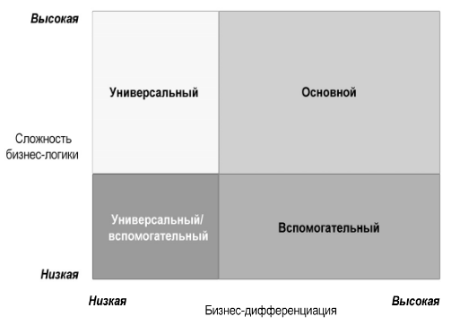

##### <a id="ch1-2-3">Изменчивость</a>

Основные поддомены, как уже выяснилось, могут часто меняться. Если проблему можно решить с первой попытки, то это, наверное, не будет считаться серьезным конкурентным преимуществом, поскольку конкуренты быстро наверстают упущенное. Работа над основными поддоменами никогда не завершается - это необходимо для развития бизнеса.

Вспомогательные поддомены не подвержены частым изменениям.

Универсальные поддомены могут со временем изменяться. Могут совершенствоваться меры безопасности, исправляться ошибки или внедряться совершенно новые решения их проблем.

##### <a id="ch1-2-4">Стратегия решения (solution)</a>

Основные поддомены позволяют компании конкурировать с другими игроками в ее сфере деятельности. Но для работы компании в избранном бизнесе необходимы все поддомены.

Основные поддомены должны реализовываться в самой компании. Их нельзя приобрести или позаимствовать, поскольку это подорвало бы само понятие конкурентного преимущества. Также было бы неразумно отдавать реализацию основного поддомена на аутсорсинг. Это стратегическая инвестиция - поддержка стороннего решения может прекратиться. Для работы над основными поддоменами компании нужно назначать наиболее квалифицированные кадры. Внедрение основных поддоменов с привлечением собственных сил позволяет компании оперативно вносить изменения и развивать решение.

Поскольку требования к основным поддоменам склонны к частым и постоянным изменениям, решение должно быть таким, чтобы его было удобно сопровождать и легко развивать. То есть основные поддомены требуют реализации самых передовых методов проектирования.

Так как универсальные поддомены относятся к разряду сложных, но уже решенных задач, выгоднее купить готовый продукт или взять на вооружение решение с открытым исходным кодом, чем тратить время и ресурсы на реализацию универсального поддомена собственными силами.

Вспомогательные поддомены не предназначены для создания конкурентных преимуществ, поэтому реализации этих подобластей собственными силами лучше было бы избежать. Но, в отличие от обычных поддоменов, здесь готовых решений не существует. Поэтому компаниям приходится браться за реализацию вспомогательных поддоменов. Однако на них можно сэкономить, благодаря простой бизнес-логике и нечастым изменениям. Вспомогательные поддомены для своей разработки не требуют привлечения высококвалифицированных опытных специалистов и предоставляют прекрасную возможность для обучения перспективных талантов. Простота бизнес-логики также превращает вспомогательные поддомены в хороших кандидатов на аутсорсинг.

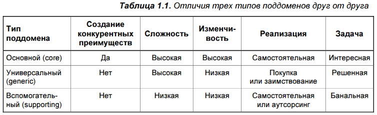

#### <a id="ch1-3">Определение границ поддоменов</a>

Идентификация поддоменов и их типов существенно облегчает принятие различных проектных решений при создании программных продуктов.

Поддомены и их типы определяются непосредственно бизнесом компании. Хорошей отправной точкой являются отделы компании и другие организационные подразделения. Однако на практике в функциях подразделения можно выделить разные направления деятельности, часть их которых будет основным поддоменом, другие - вспомогательными или универсальными. Другая крайность - постоянно углубляться в более низкие уровни детализации.

С технической точки зрения поддомены напоминают наборы взаимосвязанных, согласующихся сценариев использования (use cases), как правило, с одними и теми же участниками, объектами хозяйствования и родственным набором используемых данных.

В качестве ведущего принципа, позволяющего остановить поиск все более мелких поддоменов, можно воспользоваться следующим определением: поддомен — это набор согласующихся сценариев использования. Именно этим определяются наиболее точные границы поддоменов.

Также при разработке программного обеспечения, необходимо учитывать, что поддомены в бизнесе не обязательно могут иметь отражение для разрабатываемого софта.

### <a id="ch2">Глава 2. Экcпертные знания о предметной области</a>

Глубокое понимание предметной области, построение единого языка и эффективное общение с экспертами бизнеса являются основой для успешного стратегического и тактического проектирования программных продуктов. Это снижает риски непонимания и ошибок, обеспечивает создание адекватной модели и качественной реализации бизнес-логики.

#### <a id="ch2-1">Задачи бизнеса (business problems)</a>

Программные системы призваны решать бизнес-задачи, которые шире математических задач и включают оптимизацию процессов, управление ресурсами, принятие решений и др. Задачи ставятся как на уровне всей предметной области, так и на уровне отдельных поддоменов. Цель компании — предоставить решение задач своих клиентов (предметная область). Поддомены представляют собой более мелкие предметные области, целью которых является предоставление решений (solution) для конкретных бизнес-компетенций (capabilities).

#### <a id="ch2-2">Выявление экспертных знаний</a>

Эксперты в предметной области имеют глубокие знания и опыт, которые разработчики не обязаны полностью усваивать, но должны понимать через эффективное общение и использовать язык экспертов. Без этого сложно создавать программные решения, полностью удовлетворяющие потребности бизнеса.

#### <a id="ch2-3">Общение и обмен знаниями</a>

В проектах по разработке часто наблюдается недостаток продуктивного общения между бизнесом и разработчиками, зачастую из-за посредников (аналитиков, менеджеров), что приводит к потере важной информации и неэффективному «переводу» требований в код. Типичная подготовка требований - аналитическая модель, дизайн продукта, модель реализации, на основе которой создается код.

Для успешного проекта важна прямая совместная работа и использование единого языка.

#### <a id="ch2-4">Единый язык (ubiquitous language)</a>

**Единый язык** - это общий язык, который используется всеми участниками проекта — бизнес-экспертами, аналитиками, разработчиками — для описания бизнес-понятных концепций и процессов. Он помогает устранить неоднозначность терминов и синхронизировать понимание предметной области, что значительно снижает риски неправильной реализации.

Самое главное, чтобы экспертам предметной области при рассуждениях о той или иной предметной области было удобно пользоваться единым языком, который будет представлять как саму предметную область, так и ментальные модели экспертов предметной области.

##### <a id="ch2-4-1">Сценарии</a>

Все сценарии должны быть сформулированы на языке бизнеса и не содержать технических терминов.

##### <a id="ch2-4-2">Согласованность</a>

- Единый язык требует единого значения для каждого понятия, например, понятие "policy" должно быть смоделировано и для политики доступа и для страхового договора.
- Два понятия в едином языке не могут использоваться, заменяя друг друга. Например, "user" может означать: пользователь, посетитель, администратор, учетная запись. Каждое понятие лучше использовать явным образом в его конкретном контексте.
- Согласованные сценарии использования и описание бизнес-процессов.
- Постоянное развитие и уточнение языка по мере изучения предметной области.

#### <a id="ch2-5">Модель предметной области</a>

Модель — это не копия реального мира, а созданная человеком конструкция (абстракция), которая помогает разобраться в системах реального мира. У всех моделей есть цель, а эффективная модель содержит только те детали, которые необходимы для достижения этой цели.

Единый язык становится основой для построения модели предметной области, которая отражает реальные бизнес-функции и логику. Моделирование — это процесс непрерывного улучшения понимания и выявления деталей.

#### <a id="ch2-6">Инструменты</a>

В качестве глоссария для сохранения данных по единому языку и его документирования можно воспользоваться вики-страницей. Такой глоссарий упростит процесс адаптации новых специалистов команды. В условиях изменения единого языка к обновлению глоссария следует привлекать всех специалистов команды. Это идет вразрез с централизованным подходом, при котором ответственность за ведение глоссария возлагается только на руководителей групп или архитекторов.

Ограничение глоссария - лучше подходит для «существительных», хотя фиксация поведения бывает более информативна

Поведение - реальная бизнес-логика с ее правилами, предположениями и инвариантами. Для него лучше подходят сценарии использования или или Gherkin-тесты.

Имеются инструменты статического анализа кода, способные проверять использование понятий единого языка. Ярким примером такого инструмента является NDepend.

При всей своей пользе все эти инструменты вторичны по отношению к фактическому использованию единого языка в повседневном общении.

##### <a id="ch2-6-1">Сложности использования единого языка</a>

Зачастую самые важные знания не лежат на поверхности. Они нигде не задокументированы и не систематизированы и существуют только лишь в сознании экспертов предметной области. У самих экспертов могут быть неясности и даже пробелы в собственном понимании бизнес-сферы. Например, определение только «позитивных» сценариев без рассмотрения граничных случаев.

В существующих проектах общий язык уже может сложиться, но при этом не отвечать всем требованиям единого языка, описанным выше.

Если компания находится не в англоязычной среде (имеется в виду, что разработку ведет англоязычная команда), лучше воспользоваться английскими существительными как минимум для наименования объектов в предметной области.

Обсуждается необходимость использования практических методов и инструментов для закрепления единого языка в команде, а также сложности, возникающие при работе с терминами и коммуникацией.

### <a id="ch3">Глава 3. Как осмыслить сложность предметной области</a>

Ограниченные контексты — фундаментальный инструмент DDD, позволяющий справиться с комплексностью бизнеса и программных систем. Они дают основу для согласованного и бесконфликтного использования единого языка, позволяют командам разрабатывать автономные и хорошо скоординированные модели.

#### <a id="ch3-1">Проблема противоречивых моделей</a>

В больших и сложных бизнесах часто возникают противоречия и неоднозначности в терминологии и понимании одних и тех же понятий разными экспертами и командами. Например, понятие "lead" для отдела маркетинга означает уведомление, что есть потенциальный покупатель, для отдела продаж - отдельный сложный объект со своим бизнес-процессом (работа с клиентом, заключением сделки). Использование одного термина приводит к недопониманию.

Для решения проблемы используются подходы:
- разработка единой модели - модель получается слишком большой и сложной в сопровождении
- добавление префикса, чтобы получилось два понятия, например, "marketing lead" и "sales lead" - не всегда можно определить, какую модель использовать. Второй недостаток - не соответствие единому языку, в разговорной речи префиксы не будут использоваться.

Предлагаемое решение - использовать паттерн ограниченного контекста (bounded context).

#### <a id="ch3-2">Ограниченный контекст</a>

**Ограниченный контекст** — это чётко определённая граница, внутри которой единый язык единообразно применяется к моделям предметной области. В разных контекстах одни и те же термины могут иметь разные значения.


**Ограниченный контекст** — это чётко определённая граница, внутри которой единый язык единообразно применяется к моделям предметной области. В разных контекстах одни и те же термины могут иметь разные значения.

Ограниченный контекст имеет собственные границы владения — одну команду или группу, которая отвечает за поддержку и развитие этой части системы и языка. Одну и ту же команду не следует делить на сопровождение нескольких контекстов, но команда может управлять несколькими ограниченными контекстами.

Единый язык не является «единым» в том смысле, что он должен использоваться и применяться повсеместно во всей организации. Единый язык не является универсальным. Единый язык применим только в границах своего ограниченного контекста.

Определение области применения единого языка — его ограниченного контекста — является стратегическим проектным решением. Границы могут быть широкими, в соответствии с контекстами самой предметной области, или узкими, при разделении предметной области на менее крупные области задач.

Необходимо сделать так, чтобы модели были полезными, а размеры ограниченных контекстов соответствовали потребностям вашего бизнеса и организационным ограничениям. Но при этом нужно избегать разбиения связанной функциональности на несколько ограниченных контекстов. Чтобы избежать такой неэффективной декомпозиции, нужно следовать эмпирическому правилу для поиска поддоменов (см. главу 1): определите наборы связанных сценариев использования (coherent use cases), которые работают с одними и теми же данными, и избегайте их разбиения на несколько ограниченных контекстов.

#### <a id="ch3-3">Сравнение ограниченных контекстов и поддоменов</a>

В предыдущих главах рассматривалось разделение предметной области на поддомены, в этой главе добавляется разделение на ограниченные контексты.

**Поддомены** — делят предметную область на основные, универсальные и вспомогательные поддомены.

**Ограниченные контексты** — определяются в процессе проектирования, чтобы получить из предметной области (business domain) более мелкие, управляемые области задач (problem domains).

Обычно один поддомен может включать несколько ограниченных контекстов, и наоборот.

#### <a id="ch3-4">Связь между поддоменами и ограниченными контекстами</a>

Для небольшой системы одна модель может охватывать всю предметную область. Когда появляются конфликтующие модели, можно следовать ментальным моделям экспертов предметной области и разбивать системы на ограниченные контексты.

Важно помнить, что поддомены выявляются, а ограниченные контексты проектируются. Поддомены определяются бизнес-стратегией. Но программное решение и его ограниченные контексты могут быть спроектированы с учетом конкретного проекта и ограничений.

#### <a id="ch3-5">Границы</a>

Архитектурное проектирование — это системное проектирование. А системное проектирование — это контекстуальное проектирование, и оно по своей сути касается границ (что будет внутри, что снаружи, что будет охватывать, а что перемещаться через границы) и компромиссов.

Ограниченный контекст — это управляемый предметной областью инструмент проектирования для определения физических границ и границ владения.

##### <a id="ch3-5-1">Физиские границы</a>

Ограниченные контексты служат не только границами модели, но и физическими границами реализующих их систем. Каждый ограниченный контекст должен быть реализован как отдельный сервис или проект, т. е. он реализуется, развивается и версионируется независимо от других ограниченных контекстов.

##### <a id="ch3-5-2">Границы владения</a>

Распределение работы между командами — еще одно стратегическое решение, которое может приниматься с использованием паттерна ограниченного контекста.

Ограниченный контекст должен принадлежать только одной команде. Но одна команда может владеть сразу несколькими ограниченными контекстами.

### <a id="ch4">Глава 4. Интеграция ограниченных контекстов</a>

В главе показано, как эффективно организовать взаимодействие между разделёнными частями системы, имеющими собственные модели и языки. Использование правильных паттернов интеграции и построение устойчивых контрактов между ограниченными контекстами позволяют командам работать автономно, но при этом сохранять согласованность и качество всего продукта. Предохранительный слой играет ключевую роль в защите внутренней модели от загрязнения извне, что важно для долгосрочной поддерживаемости и масштабируемости системы.

Суть паттернов обусловливается характером сотрудничества между командами, работающими над ограниченными контекстами. Паттерны будут разделены на три группы, каждая из которых представляет собой тип командного взаимодействия: сотрудничество (cooperation), потребитель-поставщик (customer-supplier) и разные пути (separate ways).

#### <a id="ch4-1">Сотрудничество (Cooperation)</a>

Возможно для команд с хорошо налаженным взаимодействием. Можно использовать паттерны:

##### <a id="ch4-1-1">Партнерство (Partnership)</a>

Двусторонняя координация, без навязывания языка, совместное согласование API и интеграции. Интеграция ограниченных контекстов координируется по ситуации. Одна команда может уведомить вторую команду об изменении API, а вторая команда адаптируется к нему в духе сотрудничества — без драм и конфликтов.

##### <a id="ch4-1-2">Общее ядро (Shared Kernel)</a>

Cовместно разрабатываемая и поддерживаемая общая часть модели, согласованная между контекстами. Несмотря на то что границы модели определяются ограниченными контекстами, бывают случаи, когда одна и та же модель поддомена (subdomain) или часть этой модели будет реализована сразу в нескольких ограниченных контекстах. Общая модель разрабатывается в соответствии с потребностями всех ограниченных контекстов.

В идеале общее ядро (shared kernel) будет состоять только из интеграционных контрактов и структур данных, предназначенных для передачи данных через границы ограниченных контекстов.

Общее ядро (shared kernel) реализуется так, что любая модификация его исходного кода тут же отражается во всех использующих его ограниченных контекстах. Для этого можно использовать общий исходный код, или библитеку.

Интеграция изменений должна вестись непрерывно, поскольку общее ядро принадлежит множеству ограниченных контекстов.

Поскольку паттерн вводит сильную зависимость между задействованными ограниченными контекстами, его следует применять только в том случае, когда затраты на дублирования выше затрат на координацию.

#### <a id="ch4-2">Потребитель-Поставщик (Customer-supplier)</a>

Вторая группа паттернов сотрудничества — паттерны типа потребитель-поставщик (customer-supplier). Поставщик услуг находится «выше по течению», а клиент или потребитель — «ниже по течению».

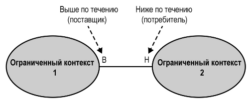

В отличие от схемы сотрудничества, обе команды (выше и ниже по течению) могут добиться успеха независимо друг от друга. Следовательно, в большинстве случаев получается дисбаланс сил: интеграционный контракт может диктовать либо вышестоящая, либо нижестоящая команда.

В этом разделе рассмотрены паттерны трех типов, предназначенные для устранения подобных различий в силе команд: конформист (conformist), предохранительный слой (anticorruption layer) и сервис с открытым протоколом (open-host service).

##### <a id="ch4-2-1">Конформист (Conformist)</a>

В ряде случаев при сложившемся балансе сил предпочтение отдается вышестоящей (upstream) команде, у которой нет никакой реальной мотивации поддерживать потребности своих клиентов. Если нижестоящая (downstream) команда может принять модель вышестоящей (upstream) команды, отношения ограниченных контекстов называются конформистскими (conformist).

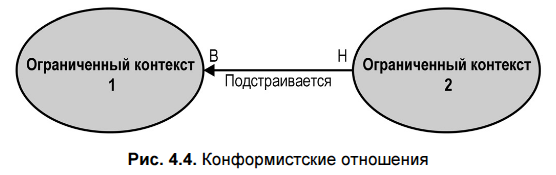

##### <a id="ch4-2-2">Предохранительный слой (Anticorruption layer)</a>

Как и в случае с паттерном конформист, баланс сил в этих отношениях попрежнему смещен в сторону вышестоящего сервиса. Но в данном случае нижестоящий ограниченный контекст не желает под нее подстраиваться. Взамен модель вышестоящего ограниченного контекста может быть с помощью предохранительного слоя (anticorruption layer) преобразована в модель, приспособленную к его собственным нуждам.

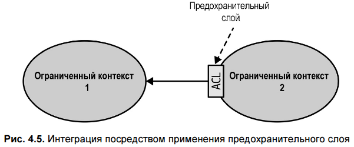

Предохранительный слой (Anticorruption Layer) предназначен для тех сценариев, когда прилагать усилия для подстройки под модель поставщика нежелательно или нецелесообразно, например:

- исходящий (downstream) ограниченный контекст содержит основной поддомен (core subdomain)
- восходящая (upstream) модель неэффективна или не соответствует нуждам потребителя
- контракт поставщика меняется слишком часто

##### <a id="ch4-2-3">Сервис с открытым протоколом (Open-Host Service)</a>

Этот паттерн предназначен для случаев, когда главная роль принадлежит потребителям. Такое разобщение позволяет поставщику развивать свою реализацию и общедоступные модели разными темпами.

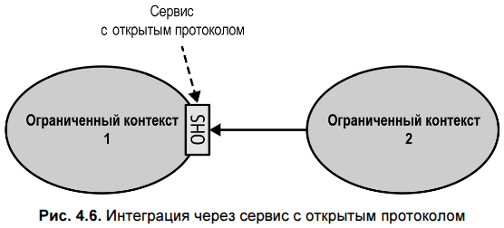

Отделение модели интеграции позволяет вышестоящему ограниченному контексту в одно и то же время предоставлять сразу несколько версий опубликованного языка, допуская постепенный переход потребителя на новую версию.

#### <a id="ch4-3">Разные пути (Separate Ways)</a>

Последний вариант сотрудничества — полный отказ от какого-либо сотрудничества. Ниже приведены примеры причин отказа от сотрудничества:

- Проблемы общения - трудности общения, обусловленные размерами организации или ее внутренней политикой.
- Универсальный поддомен (Generic Subdomain) - рассматриваемый поддомен является универсальным (generic), а универсальное решение легко поддается интеграции, может оказаться, что его локальная интеграция в каждом ограниченном контексте будет более рентабельной.
- Различия в моделях - модели могут быть настолько разными, что конформистские отношения становятся невозможными, а реализация предохранительного уровня (anticorruption layer) обойдется дороже, чем дублирование функциональности.

#### <a id="ch4-4">Карта контекстов (Context Map)</a>

После анализа паттернов интеграции ограниченных контекстов системы их можно нанести на контекстную карту. Например:

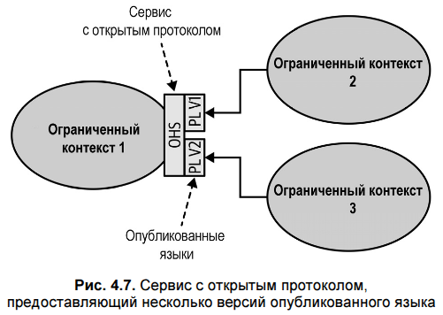

В идеале карта контекстов должна вводиться в проект с самого начала и обновляться с учетом добавлений новых ограниченных контекстов и изменений в уже существующем контексте. Карта контекстов может вестись и поддерживаться в виде кода с использованием инструмента, подобного Context Mapper.

Составление контекстной карты может быть непростой задачей. Если ограниченный контекст системы охватывает несколько поддоменов или даже внутри одного поддомена, могут быть задействованы несколько интеграционных моделей.

## <a id="part2">Часть 2. Тактический замысел</a>

### <a id="ch5">Глава 5. Реализация простой бизнес-логики</a>

Для реализации простой бизнес-логики можно использовать паттерны — транзакционный сценарий и активная запись.

#### <a id="ch5-1">Транзакционный сценарий (transaction script)</a>

Организует бизнес-логику по процедурам, где каждая процедура обрабатывает один запрос от пользователя.

Общедоступный интерфейс системы можно рассматривать в качестве набора бизнес-транзакций, доступных для выполнения потребителями. Эти транзакции могут извлекать информацию из системы, изменять ее и т.п. Паттерн выстраивает бизнес-логику системы на основе процедур, где каждая процедура реализует операцию, выполняемую потребителем системы через публичный интерфейс. По сути, публичные операции (интерфейс) системы используются как границы инкапсуляции.


Единственным непреложным требованием к процедурам является их транзакционное поведение. Каждая операция должна завершаться либо успехом, либо неудачей, но никогда не приводить к недопустимому состоянию.

Основные ошибки:
- отсутствие транзакционного поведения
- распределенные транзакции - охватывают сразу несколько хранилищ данных, сложны, трудномасштабируемы, не устойчивы к ошибкам (например, сохранение результата в бд и отправка сообщения в шину данных)
- неявные распределенные транзакции - сложно выявить, решение зависит от конкретной реализации

Пример неявной распределенной транзакции - rest вызывает метод, который считывает число и бд, увеличивает на 1 и сохраняет в бд. Не смотря на то, что результат void, в случае ошибки клиент получает исключение и это тоже считается результатом. Если сбой происходит после сохранения в бд, клиент при повторном вызове ожидает другое значение счетчика в бд. Решение в данном случае - сделать реализацию идемпотентной. Другое решение - оптимистичная блокировка, возвращать текущее значение счетчика клиенту и сохранять новое значение, если предыдущее совпадает со значением в бд.

Паттерн транзакционного сценария хорошо подойдет самым элементарным предметным областям, в которых бизнес-логика напоминает простые процедурные операции. Реализация сложной бизнес-логики в виде транзакционного сценария приводит решение к антипаттерну (большой ком грязи, big ball of mud).

#### <a id="ch5-2">Активная запись (active record)</a>

Активная запись (active record) также пригодится в случаях простой бизнес-логики. В отличии от транзакционного сценария взаимодействует со сложной структурой данных, например, запись распределена в множестве нормализованных таблиц с разными типами отношений. В результате объекты реализуют методы доступа для записей в связанных таблицах. Название паттерна дано на основании того факта, что каждая структура данных является «активной», т. е. в нем реализуется логика доступа к данным. При этом отличительной особенностью объекта активной записи является разделение структур данных и поведения (бизнес-логики).

По окончании сценария операция должна либо успешно завершиться, либо дать сбой, т. е. вести себя как атомарная транзакция.

Цель паттерна — инкапсулировать сложность сопоставления объекта в памяти на схему базы данных.

Поскольку по своей сути активная запись представляет собой транзакционный сценарий, оптимизирующий доступ к базам данных, этот паттерн может поддерживать только относительно простую бизнес-логику, такую как CRUD-операции, которые в лучшем случае смогут проверить пользовательский ввод.

### <a id="ch6">Глава 6. Проработка сложной бизнес-логики</a>

Модель предметной области и её ключевые строительные блоки помогают решать задачи сложной бизнес-логики. Модель призвана сохранять целостность, согласованность и управляемость данных в рамках ограниченных бизнес-компонентов (агрегатов), при этом обеспечивая понимание процессов и взаимосвязей. Доменные сервисы дополняют модель, позволяя реализовывать операции вне объектов модели. Эта глава закладывает фундамент для построения устойчивой, масштабируемой и понятной архитектуры программного обеспечения на основе предметно-ориентированного проектирования.

#### <a id="ch6-1">Модель предметной области (Domain Model)</a>

В паттерне модели предметной области вместо работы с CRUD-операциями решаются вопросы сложных переходов между состояниями, бизнес-правилами и инвариантами (незыблемыми правилами).

Модель предметной области — это объектная модель, включающая в себя как поведение, так и данные. Строительными блоками такой объектной модели являются тактические паттерны DDD — агрегаты (aggregates), объекты-значения (value-objects), события предметной области (domain events) и доменные сервисы (domain services).

##### <a id="ch6-1-1">Объекты-значения (Value Objects)</a>

Это объект, который можно идентифицировать по составляющим его значениям, не требует идентификатора.

Если для представления понятий предметной области полагаться исключительно на элементарные типы данных стандартной библиотеки языка, такие как строки, целые числа или словари, то это будет считаться одержимостью примитивами.

Пример плохой реализации (логика проверки значений будет дублироваться или засорять класс сущности):

```c#
class Person
{
 private int _id;
 private string _firstName;
 private string _lastName;
 private string _landlinePhone;
 private string _mobilePhone;
 private string _email;
 private int _heightMetric;
 private string _countryCode;

 public Person(...) {...}
}
```

Пример хорошей реализации (лучшая читаемость, логика проверки находится в самих объектах-значениях, объекты-значения выражают концепции предметной области):

```c#
class Person {
 private PersonId _id;
 private Name _name;
 private PhoneNumber _landline;
 private PhoneNumber _mobile;
 private EmailAddress _email;
 private Height _height;
 private CountryCode _country;

 public Person(...) { ... }
}

static void Main(string[] args)
{
 var dave = new Person(
 id: new PersonId(30217),
 name: new Name("Dave", "Ancelovici"),
 landline: PhoneNumber.Parse("023745001"),
 mobile: PhoneNumber.Parse("0873712503"),
 email: Email.Parse("dave@learning-ddd.com"),
 height: Height.FromMetric(180),
 country: CountryCode.Parse("BG"));
}
```

Объекты-значения делают код более выразительным и инкапсулируют бизнес-логику, имеющую свойство дублироваться в разных местах. Поскольку объекты-значения неизменяемы, их поведение не имеет побочных эффектов и является потокобезопасным. Поэтому применять такие объекты рекомендуется везде, где это только возможно.

##### <a id="ch6-1-2">Сущности (Entities)</a>

Сущность является противоположностью объекта-значения. Для нее требуется явно указанное поле идентификации, чтобы различать разные экземпляры объекта. Сущности являются важными строительными блоками, одноко в DDD используются не сами по себе, а в составе агрегата.

##### <a id="ch6-1-3">Агрегаты (Aggregates)</a>

Тоже сущность: для него требуется явное поле идентификации, и ожидается, что его состояние в течение жизненного цикла экземпляра будет изменяться.

###### <a id="ch6-1-3-1">Соблюдение согласованности</a>

Чтобы обеспечить согласованность данных, паттерн агрегата проводит четкую границу между агрегатом и «внешним миром»: агрегат является границей обеспечения согласованности. Логика агрегата должна проверять все входящие модификации и гарантировать непротиворечивость изменений его бизнес-правилам.

Согласованность обеспечивается тем, что изменять состояние агрегата может исключительно его собственная бизнес-логика. Внешним по отношению к агрегату процессам или объектам разрешено только лишь чтение состояния агрегата.

Методы изменения состояния, представленные в открытом интерфейсе агрегата, часто называют командами (command).

Это делает слой приложения (application layer), который управляет операциями над агрегатами, довольно простым: ему нужно загрузить текущее состояние, выполнить требуемое действие, сохранить измененное состояние и вернуть результат операции вызывающему коду.

Для согласованного состояния агрегата важно выполнять проверку конкурентного доступа (concurrency check).

Для работы с агрегатами больше подходят документоориентированные базы данных.

###### <a id="ch6-1-3-2">Граница транзакции</a>

Агрегат также действует как границы транзакции. Один экземпляр агрегата на каждую транзакцию заставляет тщательно проектировать границы агрегата, гарантируя, что дизайн учитывает инварианты и правила бизнес-области. Необходимость фиксации изменений сразу в нескольких агрегатах сигнализирует о неправильно выбранных границах транзакции и, следовательно, о неправильных границах агрегата.

###### <a id="ch6-1-3-3">Иерархия сущностей</a>

Cущности используются исключительно как часть агрегата, а не в качестве независимого паттерна.

Существуют бизнес-сценарии, в которых общую транзакционную границу должны иметь сразу несколько объектов, например когда одновременно могут быть изменены оба объекта или же бизнес-правила одного объекта зависят от состояния другого объекта. Все связанные таким образом объекты должны быть частью одного агрегата.

*Примечание. Если изменение одной части приложения влияет на состояние всего приложения целиком, необходимо воспользоваться механизмами взаимодействия агрегатов, например, через события предметной области (см. ниже). Реализации публикации событий рассматривается в главе 9. При конкурентной обработке запросов можно воспользоваться оптимистичной блокировкой.*

###### <a id="ch6-1-3-4">Ссылки на другие агрегаты</a>

Поскольку все объекты, содержащиеся в агрегате, имеют одну и ту же транзакционную границу, то если агрегат станет слишком большим, могут возникнуть проблемы производительности и масштабируемости.

Вся информация, которая может быть согласована по прошествии некоторого времени (согласованность в конечном счете, eventual consistency), должна находиться за пределами агрегата, например в другом агрегате.


Следует придерживаться того правила, чтобы агрегаты были как можно меньше и включали только те объекты, которые в соответствии с бизнес-логикой агрегата должны находиться в строго согласованном состоянии.

Для ссылки на другой агрегат следует использовать его идентификатор, это гарантирует, что объект не находятся в границах текущего агрегата, и для каждого агрегата определены собственные транзакционной границы.

###### <a id="ch6-1-3-5">Корень агрегата</a>

Состояние агрегата можно изменить только путем выполнения одной из его команд. Поскольку агрегат представляет собой иерархию сущностей, то в качестве общедоступного интерфейса агрегата — его корня, должна быть назначена только одна из них.

###### <a id="ch6-1-3-6">События предметной области</a>

В дополнение к открытому интерфейсу агрегата другой механизм для взаимодействия - события предметной области.

Событие предметной области — это сообщение с описанием важного события, произошедшего в бизнес-области.

Поскольку события предметной области описывают то, что уже произошло, их названия следует формулировать в прошедшем времени.

Цель события предметной области (domain event) — дать описание тому, что произошло в предметной области, и предоставить все необходимые данные, связанные с событием.

###### <a id="ch6-1-3-7">Единый язык</a>

Агрегаты должны отражать единый язык. Термины, используемые в агрегатах, должны быть сформулированы на языке ограниченного контекста.

##### <a id="ch6-1-4">Доменные сервисы (domain service)</a>

Можно столкнуться с бизнес-логикой, которая либо не принадлежит ни одному агрегату или объекту-значению, либо представляется имеющей отношение сразу к нескольким агрегатам.

Доменный сервис — это объект без состояния, в котором реализуется бизнес-логика.

Важно помнить о правиле одного экземпляра за транзакцию остается в силе.

Службы предметной области не имеют ничего общего с микросервисами, сервисно-ориентированной архитектурой или с почти что любым другим использованием слов «служба» или «сервис» в сфере разработки - это просто объект без состояния, используемый для размещения бизнес-логики.

#### <a id="ch6-2">Управление сложностью</a>

При рассмотрении вопроса сложности системы основное внимание уделяется оценке сложности контроля поведения системы и предсказанию этого поведения. Эти два аспекта отражаются в степенях свободы системы. Степени свободы системы — это опорные точки описания ее состояния.

```c#
// 5 степеней свободы
public class ClassA
{
 public int A { get; set; }
 public int B { get; set; }
 public int C { get; set; }
 public int D { get; set; }
 public int E { get; set; }
}

// 2 степени свободы (A, D)
public class ClassB
{
 private int _a, _d;

 public int A
 {
 get => _a;
 set {
 _a = value;
 B = value / 2;
 C = value / 3;
 }
 }

 public int B { get; private set; }

 public int C { get; private set; }

 public int D
 {
 get => _d;
 set {
 _d = value;
 E = value * 2
 }
 }
 public int E { get; private set; }
}
```

Преимущества агрегата в том, что его бизнес-логика инкапсулирует и защищает бизнес-инварианты, уменьшая степень свободы.

### <a id="ch7">Глава 7. Моделирование фактора времени</a>

Event Sourcing представляет собой мощный паттерн для отслеживания и управления изменениями в предметной области, который обеспечивает гибкость, прозрачность и устойчивость системы к ошибкам. Однако внедрение этого паттерна требует учёта дополнительных технических и организационных сложностей.

Паттерн модели предмет-ной области, основанной на событиях (event-sourced domain model), придерживается тех же предпосылок, что и паттерн простой модели предметной области. В нем такая же сложная бизнес-логика, принадлежащая основному поддомену (core subdomain), используются те же тактические паттерны, что и в модели предметной области: объекты-значения (value object), агрегаты (aggregate) и события предметной области (domain events).

Разница этими паттернами реализации заключается в способе сохранения состояния агрегатов. В модели предметной области, основанной на событиях, для управления состояниями агрегатов используется паттерн «События как источник данных» (Event Sourcing): вместо сохранения состояния агрегата модель генерирует события предметной области, описывающие каждое изменение, и использует их в качестве доверенного источника данных для агрегата.

#### <a id="ch7-1">События как источник данных (Event Sourcing)</a>

Паттерн «События как источник данных» (Event Sourcing) вводит в модель данных фактор времени. Вместо схемы, отражающей текущее состояние агрегатов, система, в которой источником текущего состояния являются события, сохраняет события, фиксирующие каждое изменение в жизненном цикле агрегата.

Используя сохраненные данные событий можно создавать несколько проекций данных - например, для поиска - если два подразделения работают с одним объектом, при поиске каждый из них может делать запросы по данным подразделения, данные, которые соответствуют запросу, но относятся к другому подразделению, отображаться не будут.

Чтобы паттерн «События как источник данных» работал, все изменения состояния объекта должны быть представлены и сохранены как события. Эти события становятся для системы источником истины.

Базу данных, используемую для сохранения событий, принято называть хранилищем событий (event store).

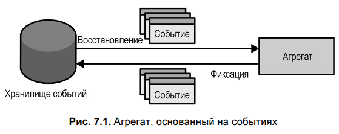

Хранилище событий не должно разрешать изменять или удалять события. Должно поддерживать как минимум следующие операции: извлечение всех событий, принадлежащих определенной бизнес-сущности, добавление событий.

#### <a id="ch7-2">Модель предметной области, основанная на событиях</a>

Исходная модель предметной области работает через отображение состояния своих агрегатов и порождает события предметной области. Модель предметной области, основанная на событиях, использует события предметной области исключительно для моделирования жизненных циклов агрегатов.

Сценарий, по которому проводится каждая операция с агрегатом, основанным на событиях, имеет вид:

- Загрузка событий предметной области агрегата
- Воссоздание состояния — проецирование событий в представление состояния
- Выполнение команды бизнес-логики агрегата, порождение новых событий предметной области
- Фиксация новых событий предметной области в хранилище событий

Преимущества:

- Путешествие во времени
- Глубокое понимание сути происходящего
- Журнал аудита
- Расширенное оптимистичное управление параллельными вычислениями (при конфликте сохранения есть больше данных, чтобы отменить одно из обновлений, или выполнить слияние)

Недостатки:

- Кривая обучения
- Развитие модели
- Архитектурная сложность

Проецирование событий в представление состояния действительно требует расходов вычислительной мощности, и по мере добавления новых событий в список агрегатов эта потребность будет расти. В большинстве систем падение производительности будет заметно только после 10 000+ событий на агрегат. При этом в подавляющем большинстве систем средний срок жизни агрегата не превышает 100 событий.

В редких случаях, когда проецирование состояний выливается в проблему производительности, можно реализовать другой паттерн: срез состояния (snapshot). В нем реализуются шаги:

- Процесс выполняет непрерывный перебор новых событий в хранилище, генерирует соответствующие проекции и сохраняет их в кеше.
- Проекция в памяти (in-memory) необходима для выполнения действия над агрегатом. При этом:
 - Процесс извлекает проекцию текущего состояния из кеша.
 - Процесс извлекает события, имевшие место после последней версии среза состояния из хранилища событий.
 - К срезу состояния (snapshot) в памяти применяются дополнительные события.

При использовании модели основанной на событиях генерируется большой объем данных. Поскольку все операции, связанные с агрегатом, выполняются в контексте одного агрегата, хранилище событий можно сегментировать по идентификаторам агрегата.

Хранилище событий предназначено только для добавления, но может возникнуть бизнес запрос на удаление персональных данных. Запрос может быть удовлетворен с помощью паттерна «забываемой» полезной нагрузки (forgettable payload): вся конфиденциальная информация включается в события в зашифрованном виде. Ключ шифрования хранится во внешнем хранилище типа ключ-значение, т. е. в хранилище ключей, где ключ — это идентификатор определенного агрегата, а значение — ключ шифрования. Когда конфиденциальные данные должны быть удалены, ключ шифрования удаляется из хранилища ключей. В результате конфиденциальная информация, содержащаяся в событиях, становится недоступной.


### <a id="ch8">Глава 8. Архитектурные паттерны</a>

Для обеспечения масштабируемости, простоты сопровождения, ясности реализации бизнес-решений необходимо корректно организовать связь между тактическими паттернами бизнес-логики и организационными архитектурными паттернами, правильно структурировать приложение и выстроить взаимодействие внутри него.

Бизнес-логика — наиболее важная, но не единственная часть программной системы. Разнообразие задач, решение которых возлагается на кодовую базу, облегчает распределение ее бизнес-логики между различными компонентами: часть логики должна реализовываться в пользовательском интерфейсе или базе данных или же быть продублированной в разных компонентах.

Благодаря применению архитектурных паттернов вводятся организационные принципы для различных аспектов кодовой базы и устанавливаются четкие границы между ними, при этом формируются ответы на вопросы, как именно бизнес-логика связана с вводом, выводом и другими инфраструктурными компонентами системы.

#### <a id="ch8-1">Слоистая архитектура</a>

При использовании слоистой архитектуры (layered architecture) кодовая база выстраивается в горизонтальные слои, каждый из которых решает одну из следующих технических задач: взаимодействие с пользователями (presentation layer — PL), реализация бизнес-логики (business logic layer — BLL) и хранение данных (data access layer — DAL).

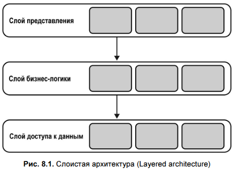

В современных системах слой представления имеет более широкий охват: в него входят все средства для запуска взаимодействия программы, как синхронного, так и асинхронного. Например:

- Графический интерфейс пользователя (GUI)
- Интерфейс командной строки (CLI)
- Интерфейс для интеграции с другими системами (API)
- Подписка на события в брокере сообщений
- Топики сообщений для публикации исходящих событий

Слой бизнес-логики (business logic layer) отвечает за реализацию и инкапсуляцию бизнес-логики программы. Здесь реализуются паттерны бизнес-логики, рассмотренные в главах 5–7, например активные записи или модель предметной области.

Слой доступа к данным (data access layer) обеспечивает доступ к механизмам хранения информации. В современных системах задачи слоя шире, чем просто хранение данных в БД. Например, документоориентированное хранилище NoSQL может выступать в качестве рабочей базы данных, поисковый индекс использоваться для динамических запросов, а база данных, находящаяся в оперативной памяти, может быть использована для высокопроизводительных операций.

Также слой доступа к данным включает интеграцию с различными внешними поставщиками информации, необходимую для решения функциональных задач программы: API-интерфейсы, предоставляемые внешними системами, или сервисы облачных провайдеров.

Слои интегрированы в коммуникационную модель типа «сверху вниз». Каждый слой может иметь зависимость только от слоя, находящегося непосредственно под ним. Тем самым обеспечивается разделение задач реализации и уменьшение обмена знаниями между слоями.

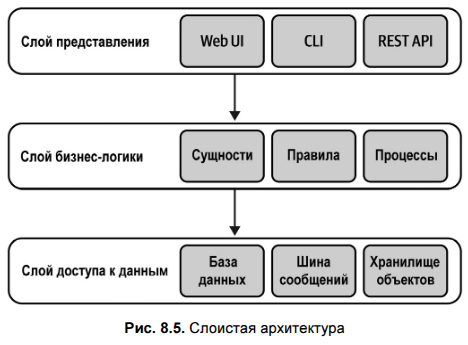

Обычно паттерн слоистой архитектуры расширяется дополнительным, сервисным слоем (Service layer). Сервисный слой выступает в качестве фасада слоя бизнес-логики: он предоставляет интерфейс, который соответствует методам публичного интерфейса, инкапсулируя вызовы нижележащих слоев. В него можно вынести управление транзакциями для получения согласованного ответа.

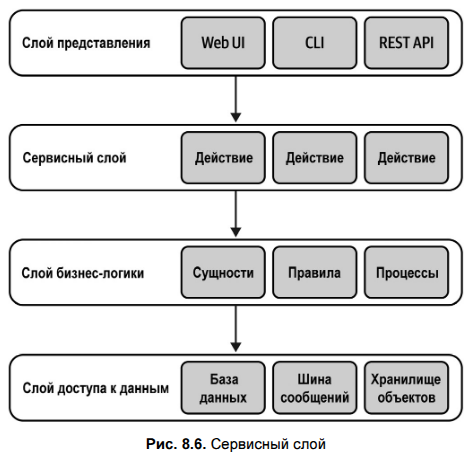

Наличие явного сервисного слоя дает ряд преимуществ:

- Один и тот же сервисный слой может повторно использоваться сразу несколькими публичными интерфейсами.
- Повышается модульность кода, все связанные методы собираются в одном месте.
- Происходит дополнительное разделение слоев представления и бизнес-логики.
- Упрощается тестирование функциональности бизнес-логики.

Необходимость в сервисном слое возникает не всегда. Например, когда бизнес-логика реализована в виде транзакционного сценария, то она по сути уже представляет собой сервисный слой.

Благодаря зависимости между слоями бизнес-логики и доступа к данным он хорошо подходит для систем, бизнес-логика которых реализована с использованием транзакционного сценария или паттерна активной записи.

Однако паттерн затрудняет реализацию модели предметной области, где бизнес-сущности (агрегаты и объекты-значения) не должны иметь никакой зависимости от базовой инфраструктуры. В слоистой архитектуре для выполнения этого требования нужно будет перепрыгивать через слои. Реализовать модель предметной области в слоистой архитектуре в принципе возможно, но лучше использовать другой паттерн, например, "Порты и адаптеры".

Слоистую архитектуру часто путают с архитектурой N-Tier (многоуровневой). Слои и уровни (tiers) концептуально различаются: слой — это логическая граница, а уровень — физическая граница. Все слои в слоистой архитектуре связаны одним и тем же жизненным циклом: они реализуются, развиваются и развертываются как единое целое. Уровень — это независимо развертываемый сервис, сервер или система. На примере показана интеграция физических сервисов, задействованных в системе.

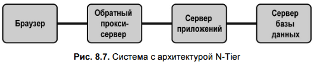

#### <a id="ch8-2">Порты и адаптеры (Ports and adapters)</a>

Архитектура портов и адаптеров устраняет недостатки слоистой архитектуры и больше подходит для реализации более сложной бизнес-логики.

По сути, и слой представления, и слой доступа к данным представляют собой интеграцию с внешними компонентами: базами данных, внешними сервисами и фреймворками пользовательского интерфейса.

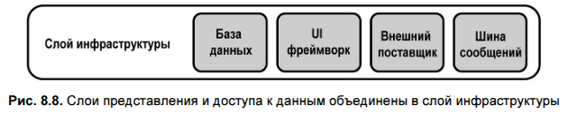

##### <a id="ch8-3">Принцип инверсии зависимостей (Dependency inversion principle)</a>

Принцип инверсии зависимостей (dependency inversion principle — DIP) гласит, что высокоуровневые модули, реализующие бизнес-логику, не должны зависеть от низкоуровневых модулей (что и происходит в слоистой архитектуре - слой бизнес-логики зависит от слоя инфраструктуры).

##### <a id="ch8-4">Интеграция инфраструктурных компонентов</a>

Исправить ситуация можно, если бизнес-логику сделать независимой от других слоев, объеденить слой представления и доступа к данным в слой инфраструктуры, а также добавить сервисный слой (или прикладной, чтобы не путать с терминами слоистой архитектуры).

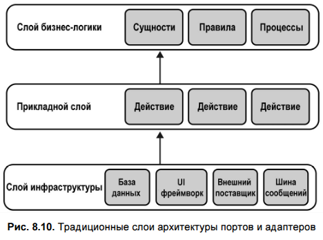

Название порты и адаптеры паттерн получил из-за взаимодействия инфраструктурных компонентов с бизнес-логикой.

Вместо того, чтобы ссылаться на инфраструктурные компоненты или вызывать их напрямую, слой бизнес-логики определяет «порты», которые должны быть реализованы на слое инфраструктуры. А на слое инфраструктуры реализуются «адаптеры»: конкретные реализации интерфейсов портов для работы с различными технологиями.

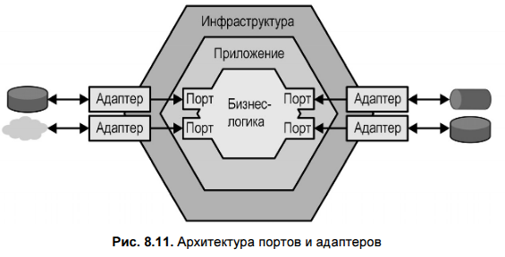

```c#
namespace App.BusinessLogicLayer
{
public interface IMessaging
{
 void Publish(Message payload);
 void Subscribe(Message type, Action callback);
}
}

namespace App.Infrastructure.Adapters
{
public class SQSBus: IMessaging { ... }
}
```

##### <a id="ch8-5">Вариации</a>

Архитектура портов и адаптеров также известна как гексагональная архитектура, луковичная архитектура и чистая архитектура. Все эти паттерны основаны на одних и тех же принципах проектирования, имеют одни и те же компоненты и характеризуются одинаковыми отношениями между ними, но, как и в случае со слоистой архитектурой, терминология может различаться:

- Прикладной слой = сервисный слой = слой пользовательского сценария
- Слой бизнес-логики = слой предметной области = слой ядра

##### <a id="ch8-6">Использование</a>

Отделение бизнес-логики от всех технологических вопросов делает архитектуру портов и адаптеров идеально подходящей для бизнес-логики, реализованной с помощью паттерна модели предметной области.

#### <a id="ch8-3">Разделение ответственности команд и запросов (Command-Query Responsibility Segregation)</a>

Паттерн разделения ответственности команд и запросов (command-query responsibility segregation — CQRS) основан на тех же принципах организации бизнес-логики и инфраструктуры, что и паттерн портов и адаптеров. Но он отличается способом управления данными системы. Паттерн позволяет представлять данные системы в нескольких персистентных моделях.

##### <a id="ch8-3-1">Мультипарадигменное моделирование (Polyglot modelling)</a>

Использование единственной модели для всех нужд системы может быть затруднительно, а то и вовсе невозможно. Например, OLTP и OLAP могут потребовать разные представления данных. Еще одна причина для работы с несколькими моделями может быть связана с понятием мультипарадигменного хранения данных (polyglot persistence) - в разный случаях может быть удобным использовать разные типы баз данных.

Паттерн CQRS тесно связан с источником событий (event sourcing). Первоначально CQRS был определен для преодоления ограничений в выполнении запросов при использовании модели, основанной на событиях (event sourced domain model) - когда за один раз можно было запрашивать события только одного экземпляра агрегата.

CQRS применим даже в том случае, если бизнес-логика реализована с использованием любого другого паттерна.

##### <a id="ch8-3-2">Реализация</a>

Паттерн разделяет обязанности моделей системы. Существуют два типа моделей: модель выполнения команд и модели чтения.

**Модель выполнения команд** - CQRS выделяет единую модель для выполнения операций, которые изменяют состояние системы (системные команды). Эта модель используется для реализации бизнес-логики, проверки соблюдения правил и соблюдения инвариантов. Модель выполнения команд также является единственной моделью, представляющей строго непротиворечивые данные — источником истины (source of truth). Должна быть предоставлена возможность считывания строго согласованного состояния бизнес-объекта и поддержка оптимистичного управления конкурентным доступом для обновления этих объектов.

**Модели чтения (проекции)** - Система может определить столько моделей, сколько нужно для предоставления данных пользователям или информации другим системам. Это предварительно кешированная проекция. Правильная реализация CQRS позволяет стереть все данные проекции и восстановить ее с нуля. Она также позволяет расширить систему дополнительными проекциями в будущем — моделями, которые нельзя было предусмотреть изначально. Модели чтения доступны только для чтения.

##### <a id="ch8-3-4">Проецирование моделей чтения</a>

Cистема должна проецировать изменения из модели выполнения команд на все свои модели чтения. Проекция моделей чтения аналогична понятию материализованного представления (materialized view) в реляционных базах данных.

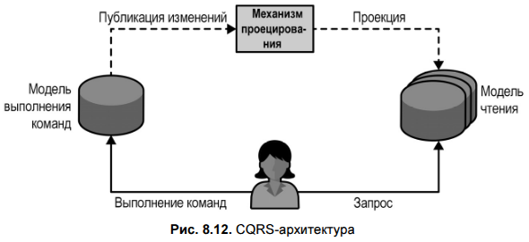

Существует два способа создания проекций: синхронный и асинхронный.

###### <a id="ch8-3-4-1">Синхронные проекции</a>

Обновление данных происходит по модели догоняющей подписки (catch-up subscription):

- Механизм проецирования запрашивает в OLTP-базе новые или обновленные записи после последнего контрольной точки (checkpoint).
- Механизм проецирования использует обновленные данные для создания или обновления моделей чтения.
- Механизм проецирования сохраняет контрольную точку последней обработанной записи. Это значение будет использоваться во время следующей итерации для добавления или изменения записей после последней обработанной записи.

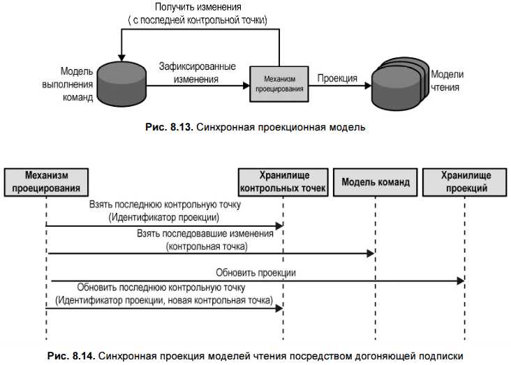

Чтобы догоняющая подписка работала, модель выполнения команд должна ставить контрольную точку (checkpoint) на все новые или обновленные записи базы данных. Механизм хранения также должен поддерживать запрос записей на основе контрольных точек.

###### <a id="ch8-3-4-2">Асинхронные проекции</a>

В сценарии асинхронной проекции модель выполнения команд публикует все зафиксированные изменения в шину сообщений.

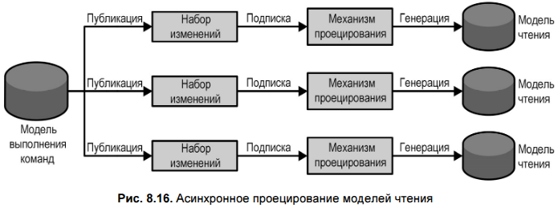

Несмотря на очевидные преимущества метода асинхронного проектирования в вопросах масштабирования и производительности, он сильнее подвержен ошибкам, возникающим при конкурентном доступе. Если сообщения обрабатываются не по порядку или дублируются, в модели чтения будут проецироваться несогласованные данные.

Этот метод также усложняет добавление новых проекций или регенерацию существующих. Поэтому всегда рекомендуется реализовывать синхронную проекцию, а в случае необходимости надстраивать над ней дополнительную асинхронную проекцию.

##### <a id="ch8-3-5">Разделение моделей</a>

В отношении систем на основе CQRS бытует весьма распространенное заблуждение, заключающееся в том, что команда может только изменять данные, а данные могут быть извлечены для отображения только через модель чтения. Команда всегда должна сообщать вызывающей стороне об успешном или неудачном результате ее выполнения. Единственное ограничение заключается в том, что возвращаемые данные должны исходить из строго согласованной модели, а именно из модели выполнения команд.

##### <a id="ch8-3-6">Когда предпочтительнее использовать CQRS</a>

Применение паттерна CQRS может подойти тем приложениям, которым необходимо работать с одними и теми же данными сразу в нескольких моделях, потенциально хранящихся в базах данных разных типов.

С точки зрения практического применения паттерн поддерживает основную ценность предметно-ориентированного проектирования, заключающуюся в работе с наиболее эффективными моделям предметной области.

С точки зрения инфраструктуры CQRS позволяет воспользоваться возможностями различных типов баз данных.

CQRS в силу своих особенностей вполне естественно подходит для моделей предметной области, основанных на событиях (event sourced domain model). Модель «События как источник данных» (Event Sourcing) делает невозможной выборку записей на основе состояний агрегатов, но CQRS открывает такую возможность, проецируя состояния в базы данных.

#### <a id="ch8-4">Область применения</a>

Рассматриваемые паттерны — слоистая архитектура, архитектура портов и адаптеров и CQRS — не должны выступать в роли общесистемных организационных принципов. Их не следует считать обязательными высокоуровневыми архитектурными паттернами для всего ограниченного контекста.

Рассмотрим ограниченный контекст, показанный на рис. 8.17, охватывающий сразу несколько поддоменов. Даже для поддоменов одного типа может потребоваться разная бизнес-логика и разные архитектурные паттерны (см. главу 10). В дополнение к уровням, разделяющим систему по горизонтали, можно еще ввести дополнительное вертикальное разбиение - по ограниченному контексту. Соответствующие вертикальные границы делают монолитный ограниченный контекст модульным и не дают ему превратиться в так называемый большой ком грязи.


### <a id="ch9">Глава 9. Паттерны взаимодействия</a>

Паттерны исходящих сообщений (outbox pattern) являются надежным способом публикации событий предметной области, принадлежащих агрегатам. Они гарантируют четкую публикацию событий предметной области даже в случае сбоев различных процессов.

Сагу можно использовать для реализации простых бизнес-процессов, в которые вовлечено несколько компонентов. Более сложные бизнес-процессы могут быть реализованы с использованием паттерна диспетчера процессов. Оба паттерна основаны на асинхронных реакциях на события предметной области и отправке команд.

#### <a id="ch9-1">Преобразование моделей</a>

Ограниченный контекст — это граница модели, где используется единый язык (ubiquitous language). Для интеграции разных ограниченных контекстов применяются различные паттерны.

Если команды, работающие с двумя контекстами, сотрудничают, возможны два подхода: партнерство (совместное согласование протоколов и оперативное решение вопросов) и создание общего ядра (shared kernel).

В отношениях клиент-поставщик (customer-supplier) баланс сил может быть смещен либо к поставщику, либо к потребителю. Если нисходящий контекст не может использовать модель поставщика напрямую, применяются преобразования моделей. Это может быть предохранительный слой (anticorruption layer, ACL) на стороне потребителя или сервис с открытым протоколом (open-host service, OHS) на стороне поставщика.

Преобразование моделей бывает двух типов: без сохранения состояния («на лету» при запросах) и с сохранением состояния (требует базы данных). Ниже рассматриваютс оба типа.

#### <a id="ch9-2">Преобразование моделей без сохранения состояния</a>

Для преобразования моделей без сохранения состояния в ограниченном контексте, которому принадлежит преобразование (OHS для вышестоящего компонента, ACL для нижестоящего компонента), реализуется паттерн проектирования прокси (proxy) для перехвата входящих и исходящих запросов и сопоставления исходной модели с целевой моделью ограниченного контекста.

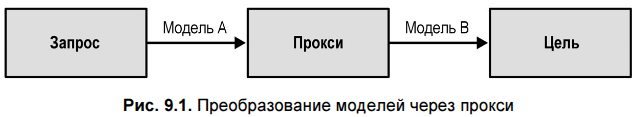

Реализация прокси зависит от того, в каком режиме осуществляется взаимодействие между ограниченными контекстами, в синхронном или в асинхронном.

##### <a id="ch9-2-1">Синхронный режим</a>

При синхронном режиме взаимодействия выполняется встраивание логики преобразования в кодовую базу ограниченного контекста. В сервисе с открытым протоколом (open-host service) преобразование в публичный язык происходит при обработке входящих запросов, а на уровне предохранительного слоя (anticorruption layer) — при вызове вышестоящего ограниченного контекста.

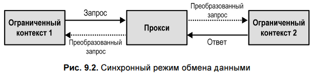

Иногда более экономичным и удобным вариантом может стать перенос логики преобразования на внешний компонент, например на паттерн API-шлюза (API Gateway).

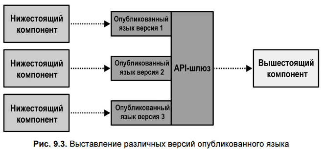

Предохранительный слой (anticorruption layer), реализованный с помощью API-шлюза, может использоваться несколькими нижестоящими ограниченными контекстами. В таких случаях предохранительный слой (anticorruption layer) действует как ограниченный контекст, специально предназначенный для интеграции.

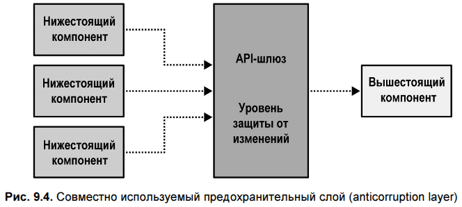

Такие ограниченные контексты, отвечающие в основном за преобразование моделей для более удобного использования другими компонентами, часто называют контекстами обмена.

##### <a id="ch9-2-2">Асинхронный режим</a>

Для преобразования моделей, используемых в режиме асинхронного обмена данными, можно реализовать прокси: промежуточный компонент, подписывающийся на сообщения, поступающие из исходного ограниченного контекста, который выполняет все необходимые преобразования и пересылает полученные сообщения целевому подписчику.

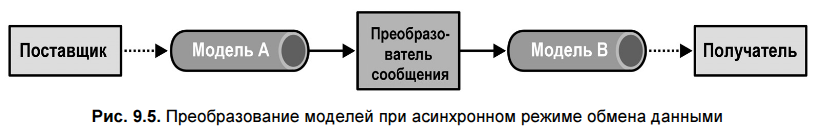

Распространенной ошибкой является разработка и предоставление опубликованного языка (published language) для объектов модели и разрешение публикации событий предметной области в их исходном виде, что раскрывает модель реализации ограниченного контекста. Преобразование в асинхронном режиме можно использовать для перехвата событий предметной области и преобразования их в опубликованный язык (published language).

Перевод сообщений на опубликованный язык (published language) позволяет различать закрытые события, предназначенные для внутренних потребностей ограниченного контекста, и открытые события, предназначенные для интеграции с другими ограниченными контекстами.

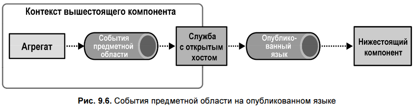


#### <a id="ch9-3">Преобразование моделей с отслеживанием состояния</a>

##### <a id="ch9-3-1">Агрегирование входящих данных</a>

Например, для оптимизации производительности ограниченный контекст заинтересован в агрегировании входящих запросов и их пакетной обработке.

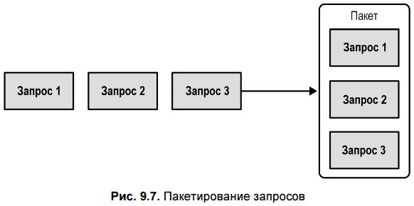

Объединение нескольких детализированных сообщений в одно.

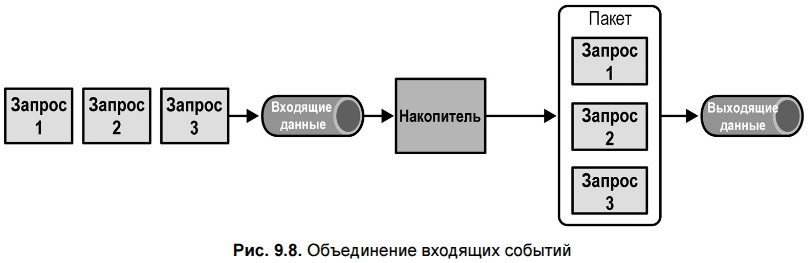

Для отслеживания входящих данных и соответствующей их обработки логике преобразования требуется собственное постоянное хранилище.

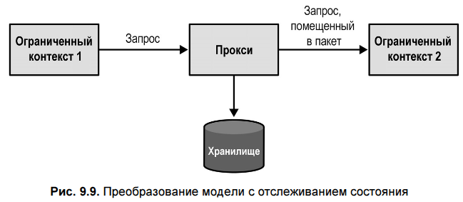

В некоторых случаях для преобразования с отслеживанием состояния можно вместо создания собственного решения воспользоваться готовыми продуктами, например платформой потоковой обработки (Kafka, AWS Kinesis и т. д.) или решением для пакетной обработки (Apache NiFi, AWS Glue, Spark и т. д.).

##### <a id="ch9-3-2">Объединение нескольких источников</a>

В ограниченном контексте может потребоваться обработка данных, накопленных сразу из нескольких источников, включая и те, что поступают из других ограниченных контекстов. Типичным примером такой обработки является применение паттерна backend-for-frontend1, в котором пользовательский интерфейс должен объединять данные, поступающие сразу от нескольких сервисов.

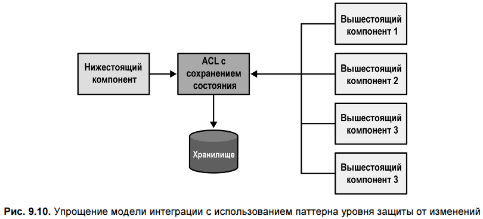

#### <a id="ch9-4">Интеграция агрегатов</a>

Одним из способов взаимодействия между агрегатами и всей остальной системой является публикация событий предметной области.

Типичные ошибки при публикации событий:

- генерация события из агрегата
 - событие будет отправлено до того, как новое состояние агрегата будет зафиксировано в базе данных
 - возможно транзакцию базы данных не удастся зафиксировать
- событие генерируется сразу после коммита транзакции агрегата
 - процесс, выполняющий логику, по какой-то причине может не опубликовать события предметной области

Данные ошибки могут быть исключены с помощью паттерна исходящих сообщений (outbox pattern).

##### <a id="ch9-4-1">Паттерн исходящих сообщений (Outbox)</a>

Алгоритм паттерна:

- Состояния обновленного агрегата и новые события предметной области фиксируются в одной и той же атомарной транзакции
- Ретранслятор сообщений извлекает только что зафиксированные события предметной области из базы данных
- Ретранслятор публикует события предметной области на шине сообщений
- При успешной публикации ретранслятор либо помечает события как опубликованные в базе данных, либо полностью их удаляет

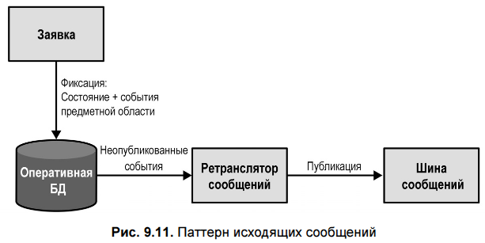

При использовании реляционной базы данных лучше воспользоваться ее способностью атомарно фиксировать две таблицы и применить для хранения сообщений специально выделенную таблицу:

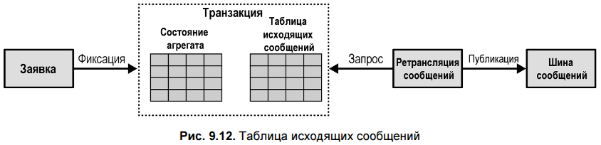

Публикующий ретранслятор (publishing relay) может извлекать новые события предметной области как по запросу (pull-based), так и по уведомлению (push-based):

- Pull: запрос к поставщику (producer) - Ретранслятор может постоянно запрашивать базу данных на предмет неопубликованных событий.
- Push: отслеживание журнала транзакций - Для упреждающего вызова публикующего ретранслятора (publishing relay) при добавлении новых событий можно воспользоваться набором функций базы данных. Например, некоторые реляционные базы данных позволяют получать уведомления об обновленных или вставленных записях путем отслеживания журнала транзакций базы данных. А некоторые базы данных NoSQL представляют зафиксированные изменения в виде потоков событий.

Паттерн исходящих сообщений (outbox pattern) гарантирует как минимум однократную (at least once) доставку сообщений: если ретранслятор выйдет из строя сразу после публикации сообщения, но до того, как оно будет помечено в базе данных как опубликованное, это же сообщение будет опубликовано снова при следующей итерации.

##### <a id="ch9-4-2">Сага</a>

Один из основных принципов построения агрегатов заключается в ограничении каждой транзакции одним экземпляром агрегата. Но бывают случаи, когда нужно реализовать бизнес-процесс, охватывающий сразу несколько агрегатов.

Сага - бизнес-процесс, который может длиться от нескольких миллисекунд до нескольких лет. Здесь имеет значение не время, а наличие нескольких транзакций. Транзакции могут обрабатываться не только агрегатами, но и любым компонентом, генерирующим события предметной области и отвечающим на команды. Сага отслеживает события, генерируемые соответствующими компонентами, и выдает последующие команды другим компонентам.

Хотя сага в конечном итоге выполнит соответствующие команды, никакие две транзакции нельзя считать атомарными. Это соотносится с еще одним принципом построения агрегатов:

*Строго согласованными можно считать только данные в пределах границ агрегата. А все, что вне этих границ, может считаться согласованным только в конечном счете.*

Следует избегать злоупотребления сагами с целью компенсации неверно выбранных границ агрегатов.

##### <a id="ch9-4-3">Диспетчер процессов</a>

Строго говоря, сага сопоставляет события соответствующим командам.

Паттерн диспетчера процессов предназначен для реализации процесса, основанного на бизнес-логике. Он определяется как центральный процессор, поддерживающий состояние последовательности и определяющий следующие этапы обработки.

Если сага для выбора правильного курса действий содержит инструкции if-else, скорее всего, это диспетчер процессов. Другое отличие - экземпляр саги, как правило создается неявно при отслеживании определенного события, диспетчер процессов не может быть привязан к одному исходному событию.

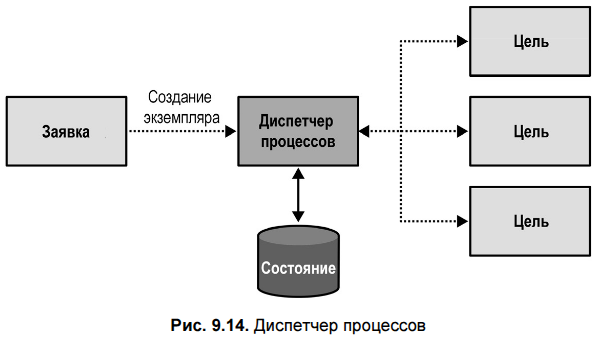

## <a id="part3">Часть 3. Применение предметно-ориентированного проектирования на практике</a>

### <a id="ch10">Глава 10. Эвристика проектирования</a>

Эвристика — это совокупность приёмов и методов, которые облегчают и упрощают решение различных познавательных, практических и творческих задач, при этом результат не гарантируется на 100%.

#### <a id="ch10-1">Ограниченные контексты</a>

Под определение корректного ограниченного контекста (bounded context) могут подходить как широкие, так и узкие границы, охватываемые применением непротиворечивого единого языка (ubiquitous language). Для определения размера ограниченного контекста не стоит стараться сделать его наименьшим размером. Скорей наоборот, на этапе проектирования требования еще четко не определены, поэтому есть смысл сделать их несколько шире - реструктуризация логических границ обходится значительно дешевле, чем переопределение физических границ.

Такая эвристика применяется в основном к ограниченным контекстам, охватывающим основные поддомены (core subdomains), поскольку как универсальные (generic), так и вспомогательные (supporting) подобласти отличаются большей сформулированностью и гораздо меньшей изменчивостью.

При создании ограниченного контекста, содержащего основной поддомен (core subdomain), от непредвиденных изменений можно защититься, включив в него другие поддомены, с которыми основной поддомен взаимодействует чаще всего.

#### <a id="ch10-2">Паттерны реализации бизнес-логики</a>

Способы моделирования бизнес-логики (главы 5-7): транзакционный сценарий (transaction script), активная запись (active record), модель предметной области (domain model), паттерны модели предметной области, основанной на событиях (event-sourced domain model).

Эффективная эвристика выбора подходящего паттерна реализации бизнес-логики состоит в том, чтобы ответить на вопросы:

- Отслеживаются ли поддоменом деньги или другие денежные операции, должен ли он предоставлять надлежащий журнал аудита или требуется ли бизнесу глубокий анализ ее поведения?
- Отличается ли бизнес-логика поддомена особой сложностью?
- Включает ли поддомен сложные структуры данных?

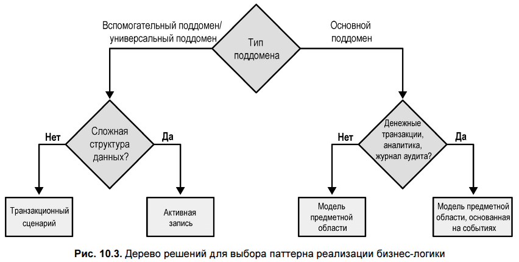

Примеры определения разницу между простой и сложной бизнес-логикой:

- сложная бизнес-логика включает в себя составные бизнес-правила, инварианты и алгоритмы, при простом подходе выполняется как правило только проверка входных данных
- сложность единого языка, в простом случае - описание CRUD-операций, в сложном случае - описание бизнес-правил

Принятие решения о паттерне реализации бизнес-логики - способ проверки предположений о типе поддомена. Если поддомен считается основным, но используется паттерн транзакционного сценария или активной записи, или наоборот, поддомен считается вспомогательным, но использует паттерн модели предметной области - нужно пересмотреть тип поддомена.

#### <a id="ch10-3">Архитектурные паттерны</a>

Архитектурные паттерны (глава 8): слоистая архитектура, порты и адаптеры, CQRS.

- Для модели предметной области, основанной на событиях, требуется CQRS.
- Модель предметной области требует использования архитектуры портов и адаптеров.
- Паттерн активной записи удачнее всего сочетается с многоуровневой архитектурой с дополнительным прикладным уровнем (сервисом) для логики, управляющей активными записями.
- Паттерн транзакционного сценария может быть реализован с минимальной слоистой архитектурой, состоящей всего из трех уровней.

Единственным исключением из предыдущей эвристики является шаблон CQRS. Он может быть полезен не только для модели предметной области, основанной на событиях (event-sourced domain model), но и для любого другого паттерна, если поддомену требуется представление о своих данных в нескольких моделях хранения.

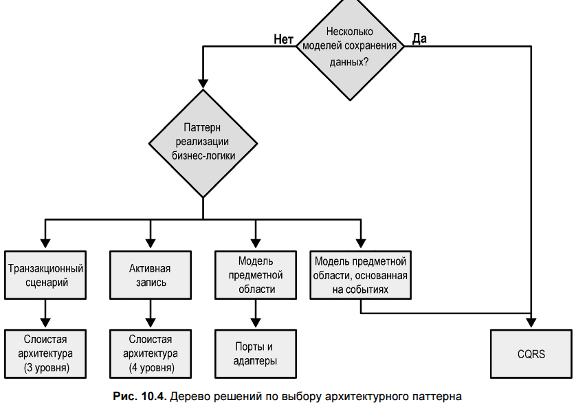

#### <a id="ch10-4">Стратегия тестирования</a>

Представлением о паттерне реализации бизнес-логики и об архитектурном шаблоне можно воспользоваться в качестве эвристики для выбора стратегии тестирования кодовой базы.

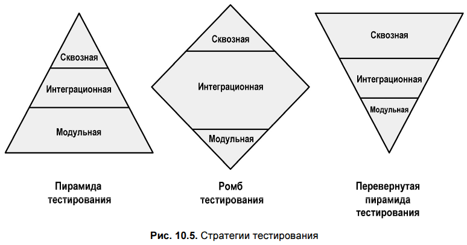

Разница между стратегиями тестирования на рисунке заключается в том, что они акцентируют внимание на различных типах тестов: модульных, интеграционных и сквозных.

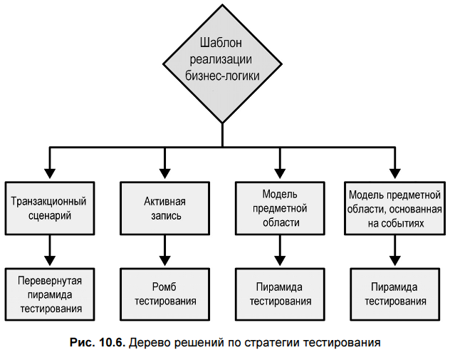

#### <a id="ch10-5">Дерево тактических проектных решений</a>

Паттерны бизнес-логики, архитектурные паттерны и эвристики стратегии тестирования можно, объединить и обобщить с помощью дерева тактических проектных решений. Стоит помнить, что эвристика - не жесткое правило.

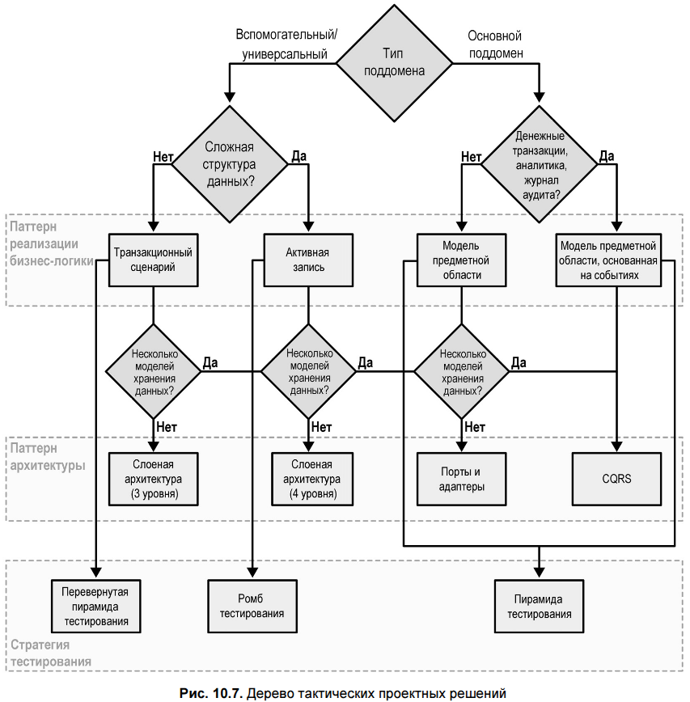

### <a id="ch11">Глава 11. Эволюция проектных решений</a>

#### <a id="ch11-1">Изменения в предметных областях</a>

Тип используемого поддомена влияет на стратегические и тактические проектные решения:

- Как спроектировать границы ограниченных контекстов.
- Как организовать интеграцию контекстов.
- Какие паттерны (pattern) проектирования следует использовать с учетом сложности бизнес-логики.

После появления на рынке функционала, который закрывает какую-либо часть основного домена бизнес-приложения, данная часть основного домена переходит в универсальный поддомен.

Пример перехода из универсального поддомена в основной - бизнес использовал услуги эквайринга одного из банков, создание собственного банка дает больше возможностей по работе с клиентами.

Пример перехода из вспомогательного поддомена в универсальный - подсистема работала со справочниками, реализующими стандартные CRUD-операции, со временем появилось open-source решение, хорошо покрытое тестами, предоставляющие расширенные функции поиска на реализацию которых не хватало времени.

Переход из вспомогательного в основной возможен, если функционал начинает приносить значительную прибыль.

Из основного во вспомогательный происходит переход, если сложность поддомена не была оправданной.

Из универсального во вспомогательный может быть выполнен переход, если сопровождение стороннего решения оказывается слишком затратным, а требования минимальны.

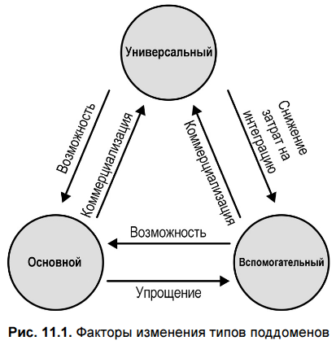

#### <a id="ch11-2">Стратегические аспекты проектирования</a>

Изменение типа поддомена напрямую влияет на его ограниченный контекст и, следовательно, на соответствующие стратегические проектные решения.

Основные поддомены должны защищать свои модели с помощью предохранительного слоя (anticorruption layer) и защищать потребителей от частых изменений в моделях реализации с помощью сервиса с открытым протоколом (open-host service).

Вспомогательные поддомены можно передать на аутсорсинг или использовать в качестве тренажера для новых сотрудников.

Основные поддомены должны быть реализованы внутри компании, как можно ближе к источникам знаний о предметной области.

#### <a id="ch11-3">Тактические аспекты проектирования</a>

Основным показателем изменения типа поддомена является неспособность существующего технического дизайна поддерживать текущие потребности бизнеса.

##### <a id="ch11-3-1">Преобразование транзакционного сценария в активную запись</a>

Оба паттерна реализованы на одном принципе - бизнес-логика реализована в виде процедурного сценария. Разница лишь в моделировании структуры данных. Для перехода модель данных необходимо привести к паттерну "Активная запись" (глава 5

##### <a id="ch11-3-2">Преобразование активной записи в модель предметной области</a>

Если бизнес-логика, манипулирующая активными записями, становится сложной и отмечается все больше случаев несоответствий и дублирования, реализацию следует преобразовать в паттерн модели предметной области (domain model).

- Выделить объекты-значения (value-objects).
- Проанализировать структуру данных и найти границы транзакций. Чтобы убедиться, что вся логика изменения состояния является явной, сделайте все функции задания значений активных записей закрытыми, чтобы значения можно было изменять только изнутри самой активной записи.
- Когда вся бизнес-логика, изменяющая состояние, перемещена в границы соответствующих объектов, определить, какие иерархии необходимы для обеспечения строго согласованной проверки бизнес-правил и инвариантов - кандидаты в агрегаты.
- Найти наименьшие границы транзакций, т. е. наименьшее количество данных, необходимое для обеспечения строгой согласованности (глава 16).
- Для каждого агрегата его корень или точку входа для его публичного интерфейса.

##### <a id="ch11-3-3">Преобразование модели предметной области в модель предметной области, основанную на событиях</a>

Когда есть модель предметной области с правильно спроектированными границами агрегатов, ее можно преобразовать в модель, основанную на событиях (event sourced domain model). Вместо прямого изменения данных агрегата смоделируйте события предметной области, необходимые для представления жизненного цикла агрегата.

Наиболее сложным аспектом преобразования модели предметной области в модель предметной области, основанную на событиях, является история существующих агрегатов: миграция «безвременного» состояния в модель, основанную на событиях.

Можно применить подход "генерации прошлых переходов состояния". Это влечет за собой создание приблизительного потока событий для каждого агрегата.

Альтернативный подход - "моделирование событий миграции" - состоит в том, чтобы смириться с отсутствием знаний о прошлых событиях и явно смоделировать их как событие (прим. - событие инициализации).

#### <a id="ch11-4">Организационные изменения</a>

Изменения в структуре организации могут повлиять на уровни общения и совместной работы команд и, как следствие, на способы интеграции ограниченных контекстов. В этом случае возможен переход от модели партнерства к отношениям потребитель-поставщик или даже к модели разных путей.

#### <a id="ch11-5">Знания предметной области</a>

Основной принцип предметно-ориентированного проектирования - для успешной разработки требуется знание предметной области.

Приобретение знаний предметной области является одним из самых сложных аспектов разработки программного обеспечения, особенно это касается основных поддоменов. Логика основного поддомена не только сложна, но и подвержена частым изменениям.

Со стратегической позиции проектирования полезной эвристикой является проектирование границ ограниченных контекстов в соответствии с уровнем знаний предметной области. Затраты на разбиение системы на ограниченные контексты, оказавшиеся со временем неверно выбранными, могут быть весьма высокими. Поэтому, когда логика предметной области неясна и подвержена частым изменениям, имеет смысл проектировать ограниченные контексты с более широкими границами. По мере приобретения более подробных знаний предметной области и снижения изменчивости бизнес-логики, эти широкие ограниченные контексты можно разбить на контексты с меньшим охватом или на микросервисы.

При обнаружении новых аспектов предметной области их следует использовать для развития дизайна и повышения его стабильности.

Устаревание документации, увольнение сотрудников, ad hoc добавление новых функций приводит к тому, что кодавая база принимает статус legacy. Важно заранее предотвращать такую деградацию знаний предметной области. Эффективным инструментом для восстановления знаний является практика EventStorming (глава 12).

#### <a id="ch11-6">Рост проекта</a>

Рост проекта является признаком здоровой системы. Постоянное добавление новых функций говорит об успешности системы. Но по мере роста кодовая база проекта может превратиться в большой ком грязи - беспорядочный, расползающийся, состоящий из костылей и изоленты лапшекод (спагетти-код). Подобные системы имеют явные признаки беспорядочного роста из-за необходимости постоянного внесения хаков и костылей.

Неконтролируемый рост является результатом расширения функциональности программной системы без пересмотра ее проектных решений.

Управление сложностью развивающегося проекта необходимо управлять с помощью инструментов и методов предметно-ориентированного проектирования.

- Определить границы поддоменов.
- Ограниченные контексты - шаблон позволяет воспользоваться различными моделями предметной области. По мере развития и роста проекта ограниченные контексты нередко теряют свою направленность и накапливают логику, связанную с разными задачами - это называется непреднамеренной сложностью. Необходимо пересматривать границы ограниченных контекстов, находить возможности упрощения модели.
- Эмпирическое правило для агрегатов - должны быть как можно меньше и включать только те объекты, которые должны находиться в строго согласованном состоянии в рамках предметной области.

(Примеч. - своими словами, агрегат - набор сущностей, которые изменяются согласованно в рамках одной транзакции).

### <a id="ch12">Глава 12. EventStorming</a>

EventStorming - интерактивный семинар для эффективного обмена знаниями и выработки общего понимания предметной области. Главная ценность EventStorming заключается в коллективном обмене знаниями, согласовании ментальных моделей разных участников и формировании единого языка, который служит основой для разработки моделей предметной области и программных систем.

EventStorming требует большого свободного пространства, например, стены с рулонной бумагой или большой белой доски, а также множества стикеров разных цветов и маркеров для записи.

Процесс EventStorming состоит из 10 этапов:

1. Неструктурированное исследование — мозговой штурм для выявления событий предметной области в прошедшем времени, без структурирования. Оранжевый цвет стикеров.
2. Хронологический порядок — выстраивание событий в логическом временном порядке. Сначала выстраивается позитивный сценарий, затем альтернативные (с ошибками, другими бизнес-решениями и т.п.). События на оранжевых стикерах корректируются, дополняются, удаляются. Последовательность может быть дополнена стрелками.
3. Выделение проблемных мест (pain points) — определение узких мест в процессе, требуют внимания и улучшения. Перевернутые розовые стикеры в виде ромба. Проблемные места могут быть добавлены на любом последующем этапе.
4. Выделение ключевых событий (pivotal events) — важные события, меняющие контекст процесса, служат индикаторами для границ ограниченных контекстов. Отмечаются вертикальной чертой, разделяющей события до и после ключевого события.
5. Выявление команд (commands) - действия, вызывающие события, записываются на светло-голубых стикерах и часто помещаются перед соответствующими событиями. Формулируются в повелительном наклонении. Если команда выполняется действующим лицом (actor) в определенной роли, то информация о действующем лице (actor) размещается на маленьком желтом стикере перед соответствующей командой.
6. Выделение правил (policies) — автоматизированные правила, которые запускают команды при наступлении определенных событий. Если события и команды находятся далеко друг от друга, на пространстве моделирования можно нарисовать соединяющую стрелку.
7. Модели чтения (read models) — представления данных, необходимые для принятия решений действующими лицами. Зеленые стикеры. Поскольку команда выполняется после того, как действующее лицо просмотрит модель чтения, модели чтения располагаются перед командами.
8. Выявление внешних систем (external systems) - любая система, не являющаяся частью исследуемой предметной области. Система может выполнять команды (что считается вводом) или получать уведомления о событиях (что считается выводом). Розовые стикеры. К концу этого этапа все команды должны либо выполняться действующими лицами (actor)), либо инициироваться правилами (policy), либо вызываться внешними системами (external system).
9. Выявление агрегатов. Агрегат получает команды и порождает события.
10. Выявление ограниченных контекстов. Поиск агрегатов, относящихся друг к другу либо по причине представления тесно связанных функций, либо по причине их связывания каким-то из правил (policy). Группы агрегатов образуют естественных кандидатов на границы ограниченных контекстов.

EventStorming скорее рецепт, а не набор жестких правил. Настоящая ценность EventStorming заключается в самом процессе — обмене знаниями между различными заинтересованными сторонами, согласовании их ментальных моделей, обнаружении конфликтующих моделей и, что не менее важно, формулировании единого языка (ubiquitous language).

Проведение EventStorming будет менее успешным, если изучаемый бизнес-процесс прост или вполне очевиден, например заключается в выполнении ряда последовательных шагов без какой-либо интересной бизнес-логики или сложности.

### <a id="ch13">Глава 13. Предметно-ориентированное проектирование на практике</a>

Одно из заблуждений - предметно-ориентированное проектирование пременимо только для новых проектов. Другое заблуждение - работа с ним выполняется по принципу "все или ничего".

#### <a id="ch13-1">Стратегический анализ</a>

##### <a id="ch13-1-1">Осмысление предметной области</a>

Определить сферу деятельности компании:

- Какова предметная область (business domain) деятельности организации?
- Кто ее клиенты?
- Какую услугу или ценность организация предоставляет клиентам?
- С какими компаниями или продуктами конкурирует организация?

Выявить поддомены - структурные элементы бизнеса, используемые организацией для достижения своих высокоуровневых целей.

Хорошей исходной эвристикой является организационная структура компании: ее отделы и другие организационные единицы. Идентифицировать все основные поддомены совсем необязательно. Это будет нецелесообразно или даже невозможно сделать даже для компании среднего размера. Лучше будет определить общую структуру, но при этом уделить больше внимания поддоменам, представляющим наибольшую важность для программных систем, над которыми ведется работа.

###### <a id="ch13-1-1-1">Основные поддомены (core subdomains)</a>

Определение основных поддоменов - то чем компания отличается от конкурентов, уникальная особенность, конкурентное преимущество. Преимущество не обязательно должно иметь техническую природу.

Еще одна эвристика определения основных поддоменов - выявление программных компонентов с наихудшим дизайном, balls of mud, которые бизнес не хотел переписывать с нуля из-за сопутствующих рисков. Такие компоненты нельзя поменять на уже готовые системы, иначе это уже был бы универсальный поддомен.

###### <a id="ch13-1-1-2">Универсальные поддомены</a>

Чтобы определить универсальные поддомены, нужно поискать готовые решения, услуги по подписке или интегрировать в систему программное обеспечение с открытым исходным кодом.

###### <a id="ch13-1-1-3">Вспомогательные поддомены (supporting subdomains)</a>

Определяются из оставшихся программных компонентов, которые нельзя заменить готовыми решениями, но которые напрямую не дают никаких конкурентных преимуществ.

##### <a id="ch13-1-2">Изучение текущего проекта</a>

После ознакомления с пространством задач (problem space), исследуется реализации и принятых в её рамках проектных решений. Начать следует с компонентов высокого уровня. Ими не обязательно должны быть ограниченные контексты (bounded contexts) в смысле предметно-ориентированного проектирования, это скорее границы, используемые для разбиения бизнес-области на подсистемы.

- Оценка тактического замысла - для каждого высокоуровневого компонента следует проверить, какие бизнес-поддомены он содержит и какие технические решения были приняты, т. е. ответить на вопрос: какие паттерны используются для реализации бизнес-логики и описания архитектуры компонента? Соответствует ли выбранное решение сложности изначальной задачи? Есть ли области, где необходимы более сложные паттерны проектирования?

- Оценка стратегического замысла - составление карты контекстов (context map), представив высокоуровневые компоненты в виде ограниченных контекстов. Выявление отношений между компонентами с позиции паттернов интеграции ограниченных контекстов.

По карте контекстов определить неоптимальные стратегические решения, например:

- Над одним и тем же высокоуровневым компонентом работает сразу несколько команд.
- Продублированы реализации основных поддоменов.
- Основной поддомен реализован сторонней компанией.
- Частые сбои в интеграции выливаются в конфликты.
- Внешними сервисами и унаследованными системами навязываются неудобные модели.

Знания о бизнес-области могут быть утрачены, для их восстановления следует предпринять попытку с проведением EventStorming.

#### <a id="ch13-2">Определение стратегии модернизации</a>

Попытки переписать систему с нуля редко приводят к успеху. Лучше подход - когда масштабный замысел сочетается с малыми начинаниями. Качественное проектирование распространяется далеко не на всю большую систему, поэтому нужно принять решение, куда именно следует приложить усилия по модернизации. Обязательным условием для принятия такого решения является наличие границ, разделяющих поддомены системы.

Границы не обязательно должны быть физическими, превращающими каждый поддомен в полноценный ограниченный контекст. Лучше начать как минимум с того, чтобы выровнять логические границы (ограничивающие пространства имен, модули и пакеты, в зависимости от технологического стека) с границами поддоменов.

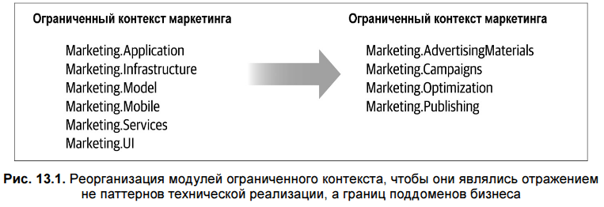

Перестановка модулей системы — относительно безопасная форма рефакторинга. Бизнес-логика остается прежней, а типы просто перемещаются в более удачную структуру.

##### <a id="ch13-2-3">Стратегическая модернизация</a>

Поиск где можно извлечь наибольшую пользу от превращения логических границ в физические. Следует задаться вопросами:

- Сколько команд работает над одной и той же кодовой базой?
- Пользуются ли разные компоненты конфликтующими моделями?

Когда работа по созданию минимально необходимых ограниченных контекстов будет завершена, следует изучить отношения и паттерны интеграции между ними.

Обратить внимание на проблемы, которые могут быть решены за счет применения паттернов интеграции контекстов:

- Отношения потребитель-поставщик (customer-supplier)
- Предохранительный слой (anticorruption layer)
- Сервис с открытым протоколом (open-host service)
- Разные пути (separate ways)

##### <a id="ch13-2-4">Тактическая модернизация</a>

Найти самые «наболевшие» несоответствия в ценностях для бизнеса и стратегиях реализаций, например когда паттерны реализации основных поддоменов (транзакционный сценарий или же активная запись) не соответствуют сложности модели.

##### <a id="ch13-2-5">Развитие единого языка</a>

Единый язык необходим для успешной модернизации проекта. Для восстановления знаний может помочь EventStorming.

После сбора знаний о предметной области и ее моделями, следует решить, какие паттерны реализации бизнес-логики больше всего подходят для бизнес-функциональности.

Следующее решение касается стратегии модернизации: постепенной замены целых компонентов системы (паттерн «Душитель», Strangler) или постепенного рефакторинга существующего решения.

Идея заключается в создании нового ограниченного контекста — душителя — и его применении для реализации новых требований и постепенной миграции в его функциональность устаревшего контекста. Одновременно с этим, за исключением исправлений и других чрезвычайных ситуаций, останавливается доработка и развитие устаревшего ограниченного контекста. В конечном итоге вся функциональность переносится в новый ограниченный контекст. И новый, и устаревший контекст может пользоваться одной и той же базой данных, чтобы избежать сложной интеграции между контекстами, которая во многих случаях может повлечь за собой распределенные транзакции.

Вместо масштабной переработки намного безопаснее будет проводить миграцию небольшими последовательными этапами. Рефакторинг модели предметной области не обязан быть атомарным изменением.

Выявить возможные объектов-значений. Неизменяемые объекты могут существенно упростить решения, даже если пока еще не используется полноценная модель предметной области.

#### <a id="ch13-3">Законспирированное предметно-ориентированное проектирование</a>

Подразумевает использование предметно-ориентированное проектирования не как организационную стратегию, а как часть своего профессионального набора инструментов.

##### <a id="ch13-3-1">Единый язык</a>

Выискивание противоречивых терминов и требование их разъяснения. Неформальное общение с экспертами по предметной области, переход на их язык.

##### <a id="ch13-3-2">Ограниченные контексты</a>

При выборе вариантов декомпозиции, определите принципы, лежащие в основе паттерна ограниченного контекста:

- лучше разрабатывать проблемно-ориентированные модели, а не одну модель для всех сценариев
- ограниченный контекст не должен содержать конфликтующие модели
- работа нескольких команд над одной и той же кодовой базой неэффективна из-за конфиликтов

Та же аргументация может использоваться и для паттернов интеграции ограниченных контекстов: необходимо убедиться, что задача, решаемая каждым паттерном, ясна и понятна.

Несмотря на множество преимуществ, модель «события как источник данных» (event sourcing) достаточно радикальное решение. Оптимальный выбор заключается в том, чтобы предметная область сама управляла решением об использовании данной модели.

## <a id="part4">Часть 4. Взаимоотношения с другими методологиями и паттернами</a>

### <a id="ch14">Глава 14. Микросервисы</a>

Микросервисы в контексте DDD — это способ строго реализовать стратегическое и тактическое проектирование на практике, сохраняя гибкость системы и управляемую сложность за счет разделения на четко ограниченные контексты.

Согласно [OASIS](https://docs.oasis-open.org/opencsa/sca-j/javadoc/org/oasisopen/sca/annotation/Service.html) сервис — это механизм, обеспечивающий доступ к одной или нескольким бизнес-компетенциям (capability), предоставляемый с использованием предписанного интерфейса (prescribed interface). Интерфейс может быть синхронным или асинхронным. Четко выраженного интерфейса вполне достаточно для описания функциональности, реализованной сервисом.

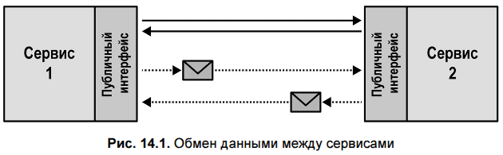

По аналогии, микросервис - это сервис с публичным микроинтерфейсом. Сокращение функциональности сервиса также ограничивает круг причин для его изменений и делает сервис более автономным для разработки, управления и масштабирования. Это объясняет, почему в микросервисах никто, кроме самого микросервиса, не может получить прямой доступ к его базе данных. Открытый доступ к базе данных делает публичный интерфейс огромным - SQL гибкий язык, предоставляет практически бесконечное количество запросов.

Может показаться, что ограничение интерфейсов сервисов всего лишь одним методом приведет к созданию идеальных микросервисов. Однако на практике при обработке такого метода придется публиковать событие, которое должно обработаться другими микросервисами - усложняется интеграция.

> Вопрос снижения сложности гораздо шире простой попытки минимизации локальной сложности каждой части программы. Куда более важным типом сложности является глобальная сложность, под которой понимается сложность общей структуры программы или системы.

Свести к минимуму глобальную сложность, как ни странно, легко. Нужно лишь исключить любые взаимодействия между компонентами системы, т. е. реализовать весь функционал в одном монолитном сервисе. Это может привести к большому кому грязи (big ball of mud): возможно, это и будет наивысший уровень локальной сложности. Пример выше (один микросервис - один метод) - другая крайность (распределенный ком грязи).

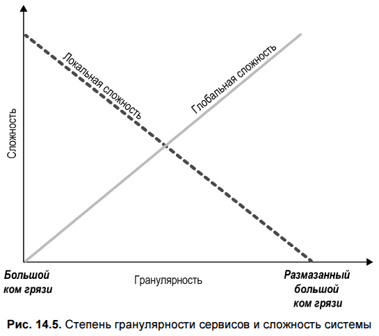

Чтобы спроектировать удачную систему на основе микросервисов, нужно оптимизировать как локальную, так и глобальную сложность. Локальный оптимум заключается в цели проектирования, выражающейся в оптимизации любого отдельно взятого сервиса. Глобальный оптимум призван сбалансировать оба вида сложностей.

Модуль в программной системе или любой системе определяется, собственно говоря, своей функцией и логикой. Функцией определяется предназначение модуля, т. е. его бизнес-функциональность. А логикой является бизнес-логика модуля, т. е. тем, как в модуле реализуется его бизнес-функциональность.

В книге «The Philosophy of Software Design» Джон Оустерхаут (John Ousterhout) рассматривает понятие модульности и предлагает простую, но мощную визуальную эвристику для оценки конструкции модуля: глубину. Предлагается визуализировать модуль в виде прямоугольника. Верхний край прямоугольника является представлением функции модуля или сложности его публичного интерфейса (чем шире прямоугольник, тем больше функциональность). Площадь прямоугольника является представлением логики модуля или реализации его функциональности.

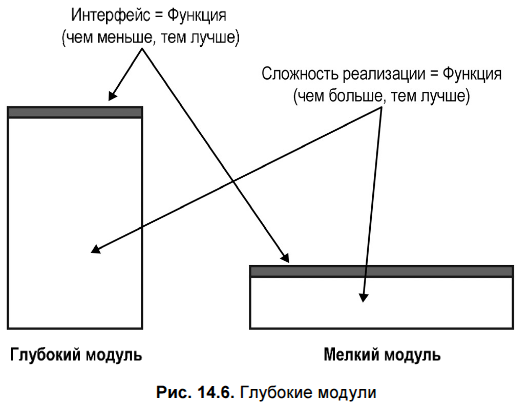

Согласно этой модели эффективные модули глубоки: в простом публичном интерфейсе инкапсулируется сложная логика. Неудачные модули слишком мелки: в публичном интерфейсе мелкого модуля инкапсулируется гораздо меньшая сложность.

Помимо иной терминологии, понятие глубоких модулей отличается от микросервисов тем, что модулями могут обозначаться как логические, так и физические границы, тогда как микросервисы имеют строго физические границы. В остальном обе концепции и принципы проектирования совершенно одинаковы.

С позиции общесистемной сложности глубокий модуль уменьшает глобальную сложность системы, а мелкий модуль ее увеличивает, вводя компонент, не инкапсулирующий его локальную сложность.

#### <a id="ch14-1">Предметно-ориентированное проектирование и границы микросервисов</a>

Применительно к микросервисам многие из паттернов предметно-ориентированного проектирования, рассмотренные в предыдущих главах, связаны с границами:

- ограниченный контекст (bounded context) является границей модели
- поддомен ограничивает бизнес-компетенции (capabilities)
- агрегаты (aggregate) и объекты значения (value object) определяют границы транзакций

##### <a id="ch14-1-2">Ограниченные контексты</a>

И микросервисы, и ограниченные контексты определяются физическими границами. И микросервисы и ограниченные контексты разрабатываются одной командой. Конфликтующие модели не могут быть реализованы в микросервисе.

Микросервис являются ограниченным контекстом. Но не каждый ограниченный контекст является микросервисом. Ограниченные контексты обозначают границы самого большого допустимого монолита. Такой монолит не следует путать с большим комом грязи (big ball of mud), т.к. он является жизнеспособным вариантом проекта, защищающим согласованность его единого языка (ubiquitous language) или модели его предметной области. Ограниченный контекст с достаточно большими границами может состоять из нескольких микросервисов.

Ниже показана взаимосвязь ограниченных контекстов и микросервисов. Безопасной считается область между ограниченными контекстами и микросервисами. В ней находятся допустимые варианты конструкции.

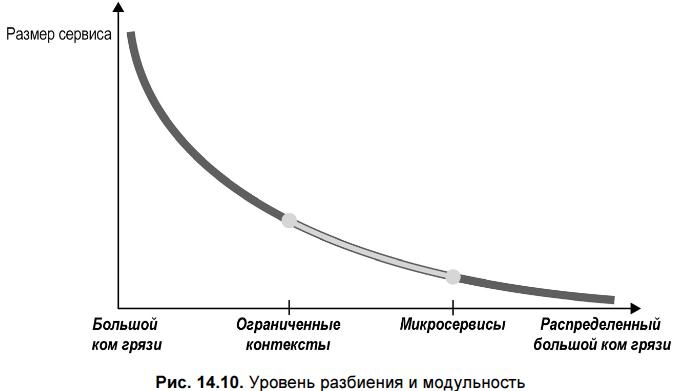

В отличие от ограниченных контекстов, устанавливающих наиболее широкие возможные границы, паттерн «Агрегат» делает совершенно обратное. Граница агрегата — самая узкая из всех возможных границ.

Агрегат является неделимой единицей бизнес-функции, инкапсулирующей все сложности своих внутренних бизнес-правил, инвариантов и бизнес-логики. В отличии от агрегата отдельный сервис следует рассматривать в контексте его взаимодействия с другими компонентами системы.

##### <a id="ch14-1-3">Поддомены</a>

Более сбалансированный эвристический подход к разработке микросервисов заключается в подстраивании сервисов под границы поддоменов. С позиции предметной области поддомены конкретизируют бизнес-компетенции (capabilities) без объяснения того, как эти бизнес-компетенции реализуются. С технической точки зрения поддомены представляют собой наборы согласованных сценариев использования.

Конкретизация поддоменов и акцент на функциональности — т. е. ответ на вопрос «Что?», а не «Как?» — делают поддомены естественными глубокими модулями (deep module).

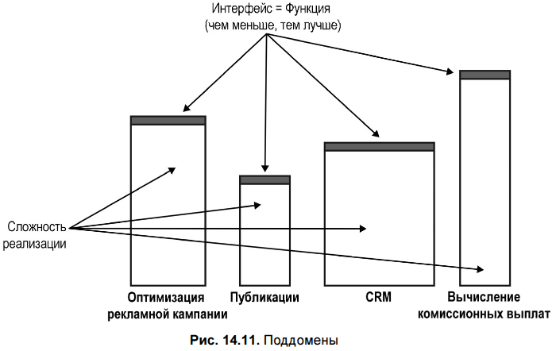

Увязывание микросервисов с поддоменами — безопасный эвристический подход, позволяющий найти оптимальные решения для большинства микросервисов. При этом порой более эффективными будут другие границы, например пребывание в более широких лингвистических границах ограниченного контекста или же из-за специфических нефункциональных требований. Решение зависит также от структуры организации, бизнес-стратегии и нефункциональных требований.

#### <a id="ch14-2">Сокращение публичных интерфейсов микросервисов</a>

Паттерн «Сервис» с открытым протоколом (open-host service) и предохранительный слой (anticorruption layer) могут упростить публичные интерфейсы микросервисов.

##### <a id="ch14-2-1">Сервис с открытым протоколом</a>

Сервис с открытым протоколом (open-host service) отделяет модель ограниченного контекста предметной области от модели, используемой для интеграции с другими компонентами системы.

Внедрение модели, ориентированной на интеграцию, т. е. внедрение общедоступного языка (published language), снижает глобальную сложность системы.

Наличие более простого публичного интерфейса (функции) в качестве надстройки над той же самой реализацией (логикой) делает сервис «глубже» и способствует созданию более эффективной конструкции микросервиса.

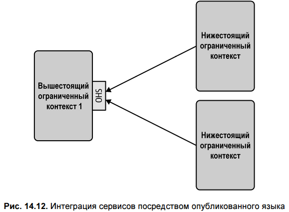

##### <a id="ch14-2-2">Предохранительный слой</a>

Предохранительный слой (anticorruption layer, ACL) позволяет снизить сложность интеграции сервиса с другими ограниченными контекстами. Традиционно предохранительный слой относится к защищаемому им ограниченному контексту. Но это представление можно сдвинуть еще дальше и реализовать в виде отдельного сервиса.

ACL-сервис, показанный ниже, снижает как локальную сложность ограниченного контекста-потребителя, так и глобальную сложность системы. Cложность ограниченного контекста-потребителя отделена от сложности интеграции, которая помещается в ACL-сервис.

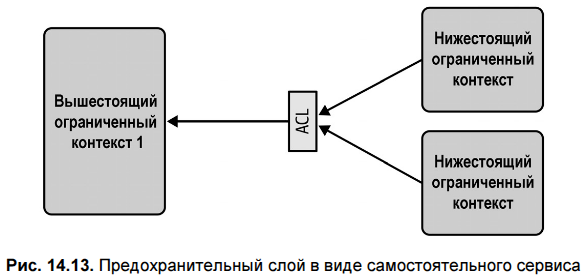

### <a id="ch15">Глава 15. Событийно-ориентированная архитектура</a>

Событийно-ориентированная архитектура (event-driven architecture, EDA) - представляет собой архитектурный стиль, в котором компоненты системы взаимодействуют друг с другом асинхронно, обмениваясь сообщениями о событиях. Вместо синхронного вызова эндпоинтов (endpoints) сервисов компоненты публикуют события, чтобы уведомлять другие элементы системы об изменениях в предметной области системы. Типичным примером потока выполнения, управляемого событиями, является паттерн саги (saga pattern, см. главу 9).

Важно подчеркнуть разницу между событийно-ориентированной архитектурой и паттерном «События как источник данных» (event sourcing). «События как источник данных» — это метод регистрации изменений состояния в виде серии событий. EDA относится к взаимодействию сервисов, а «События как источник данных» происходит внутри сервиса.

#### <a id="ch15-1">События</a>

В EDA-системе обмен событиями является ключевым механизмом обмена данными с целью интеграции компонентов и превращения их в систему.

События похожи на сообщения, но не являются тем же самым. Сообщения бывают двух типов:

- Событие - Сообщение, описывающее уже произошедшее изменение.
- Команда - Сообщение, описывающее операцию, которую необходимо выполнить.

Поскольку событие описывает что-то, что уже произошло, название события должно быть сформулировано в прошедшем времени: например, DeliveryScheduled (доставка запланирована) и т.п.

Событие — это структура данных, которую можно сериализовать и передать с помощью выбранной платформы обмена сообщениями.

Типы событий:

- Уведомление (event notification) - ообщение об изменении в предметной области. Уведомление не должно быть излишне подробным: цель — уведомить заинтересованные стороны о событии, но уведомление не должно содержать всю информацию.

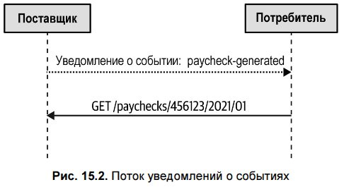

- Передача состояния с помощью события (Event-carried state transfer, ECST) - уведомляют подписчиков об изменениях во внутреннем состоянии поставщика, включают все данные, отражающие изменение состояния. ECST-сообщения могут поступать в двух формах - полный срез информации, только обновленные поля. Независимо от формы ECST-сообщений, потребители могут хранить локальный кэш состояний объектов и работать с ним. Концептуально использование сообщений с передачей состояний с помощью события представляет собой механизм асинхронной репликации данных.

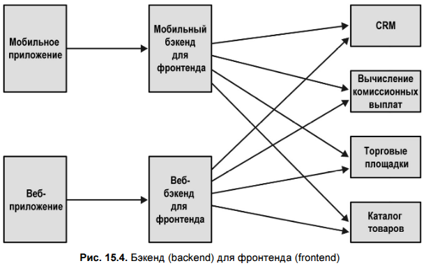

- События предметной области (domain event) - одновременно похожи как на уведомления, так и на ECST-сообщения: в них не только дается описание важного события в бизнес-области, но и содержатся все характеризующие это событие данные. Данные, включенные в события предметной области, не предназначены для описания состояния агрегата. В них описывается бизнес-событие, произошедшее в течение его жизненного цикла.

#### <a id="ch15-2">Проектирование событийно-ориентированной интеграции</a>

Проектирование программных продуктов в основном связано с границами. Границы определяют, что будет внутри, что останется снаружи и, что более важно - что будет переходить через границы, т. е. как будет происходить интеграция компонентов.

События в системе, основанной на EDA-архитектуре, являются первостепенными элементами дизайна, влияющими не только на способ интеграции компонентов, но и на сами границы этих компонентов.

Недостатки в проектировании событийно-ориентированной интеграции, которых нужно избегать:

- Временнáя связанность (связанность по времени) - когда необходимо, чтобы событие обрабатывалось компонентами системы в определенной последовательности.
- Функциональная связанность - например, две системы обрабатывающие одно событие должны реализовывать одинаковую проекцию данных на основе этого события, другими словами - дублирование логики, реализующее одинаковый функционал.
- Связанность на уровне реализации - при изменении модели предметной области источника сообщений необходимо обновлять все связанные компоненты, которые подписаны на данные сообщения.

Непродуманное введение событий в систему не избавляет ее ни от связанности, ни от отказов. Пример плохо спроектированной интеграции:

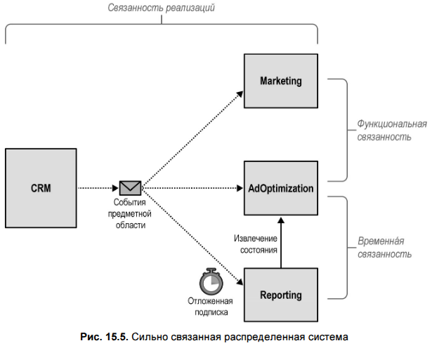

И связанность реализаций, и функциональная связанность могут быть устранены путем инкапсуляции логики проецирования в коде поставщика событий, в ограниченных контекстах CRM. Вместо раскрытия подробностей своей реализации CRM может последовать паттерну контракта, ориентированного на потребителя: спроецировать модель, необходимую потребителям, и сделать ее частью опубликованного языка ограниченного контекста, превратив все в интеграционную модель, не связанную с внутренней моделью реализации.

Чтобы устранить временнýю связанность контекстов AdsOptimization и Reporting, компонент AdsOptimization может публиковать уведомления о событиях, активизируя тем самым компонент Reporting для получения им необходимых данных.

Пример исправленной интеграции:

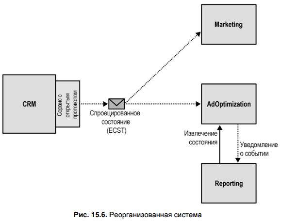

Чтобы избежать ошибок при проектировании необходимо предполагать наихудшии сценарии:

- Сеть будет медленной.
- Серверы выйдут из строя в самый неподходящий момент.
- События будут поступать не по порядку.
- События будут дублироваться.

Можно применять следующие практики:

- Для надежной публикации сообщений воспользоваться паттерном «Ящик исходящих сообщений» (outbox pattern) - все данные, которые необходимо отправить сохраняются в специальной таблице бд, при этом внутри одной транзакции с бизнес-данными. Отдельный компонент (outbox processor) считывает сообщения и отправляет в брокер.
- При публикации сообщений необходимо убедиться, что подписчики смогут избавиться от дубликатов сообщений, а также выявить и переупорядочить неупорядоченные сообщения.
- Для оркестровки трансграничных контекстных процессов, воспользоваться сагой и диспетчером процессов.

Следует избегать раскрытия подробностей реализации при публикации событий предметной области. Следует рассматривать события в качестве неотъемлемой части публичного интерфейса ограниченного контекста.

При проектировании публичных интерфейсов ограниченных контекстов следует использовать различные типы событий в зависимости от бизнес-требований.

Сообщения передачи состояния с помощью события позволяют привести модель реализации к более компактной форме, которая передает потребителям только востребованную ими информацию.

Для еще большей минимизации открытого интерфейса можно воспользоваться уведомлениями о событиях.

Для связи с внешними ограниченными контекстами событиями предметной области нужно пользоваться как можно реже.

Другие эвристики для выбора типа сообщений:

- Если компоненты могут довольствоваться данными, согласованными по принципу согласованности в конечном счете (eventual consistency), используйте сообщения передачи состояния с помощью события (ECST-сообщения).
- Если потребителю необходимо прочитать последние изменения в состоянии поставщика сообщения, выдайте сообщение с уведомлением о событии с последующим запросом данных.

### <a id="ch16">Глава 16. Сеть данных (Data Mesh)</a>

В системах на основе Data Mesh также как и для OLTP систем важен комплексный подход к управлению данными, предметно-ориентированное проектирование помогает структурировать и упростить эту задачу, повышая эффективность и качество аналитики.

#### <a id="ch16-1">Сравнение аналитической модели данных (OLAP) с моделью транзакционных данных (OLTP)</a>

Транзакционные модели строятся вокруг различных сущностей из предметной области системы, реализуя их жизненные циклы и организуя их взаимодействие друг с другом. Они обслуживают транзакционные системы и должны быть оптимизированы для поддержки бизнес-транзакций в режиме реального времени.

Аналитическая модель предназначена для получения представления о бизнес-метриках и, что более важно, о том, как бизнес может оптимизировать свои операции для извлечения большей выгоды.

С позиции структуры данных в OLAP-моделях отдельно взятые бизнес-объекты игнорируются, а все внимание сосредоточивается на бизнес-операциях с моделированием таблиц фактов и таблиц измерений.

Пример OLTP-структуры:

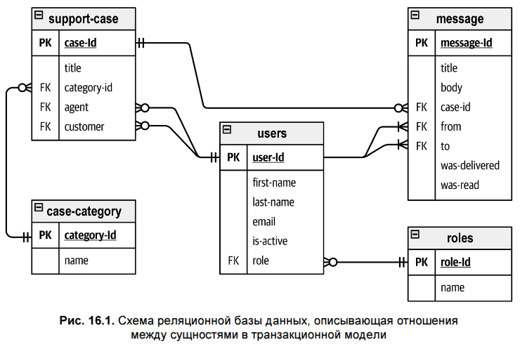

##### <a id="ch16-1-1">Таблица фактов</a>

Факты представляют собой уже произошедшую деловую активность. Факты аналогичны понятию событий предметной области в том смысле, что событие уже произошло. В отличие от событий предметной области, в фактах отсутствует стилистическое требование называть их глаголами в прошедшем времени.

Как и события предметной области, записи фактов никогда не удаляются и не изменяются: аналитические данные предназначены только для добавления.

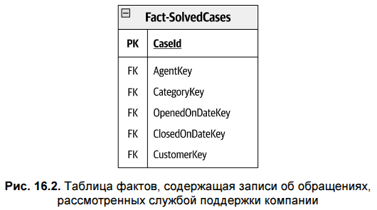

Другое существенное различие между моделями OLAP и OLTP заключается в степени детализации данных. Транзакционные системы требуют для обработки бизнес-транзакций самых точных данных. Для аналитических моделей во многих случаях использования более эффективны сводные данные.

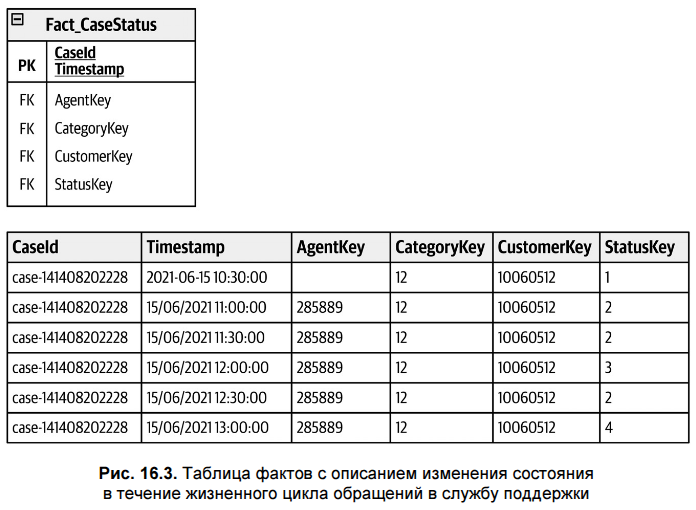

##### <a id="ch16-1-2">Таблица измерений</a>

Если факт представляет собой бизнес-процесс или действие (выражаемое глаголом), то измерение (dimension) дает описание факта (со свойствами прилагательного). Измерения предназначены для описания атрибутов фактов, и на них ссылаются как на внешний ключ из таблицы фактов в таблицу измерений. Атрибуты, смоделированные как измерения, представляют собой любые измерения или данные, повторяющиеся в разных записях фактов и не способные уместиться в одном столбце.

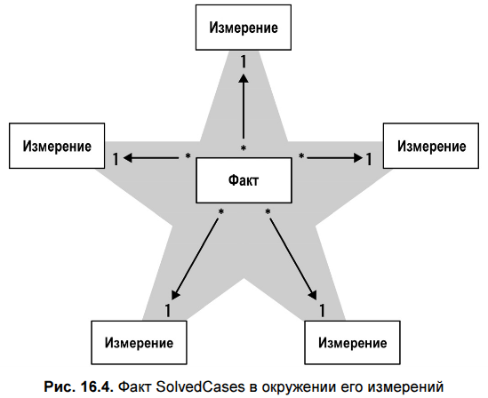

##### <a id="ch16-1-3">Аналитические модели</a>

Структура таблицы на предыдущем рисунке называется схемой «звезда». Она основана на отношениях «многие к одному», установленных между фактами и их измерениями: каждая запись измерения используется многими фактами, а внешний ключ факта указывает на запись одного из измерений.

Другой аналитической моделью является схема снежинки. Измерения являются многоуровневыми: каждое измерение дополнительно нормализуется в более мелкие измерения.

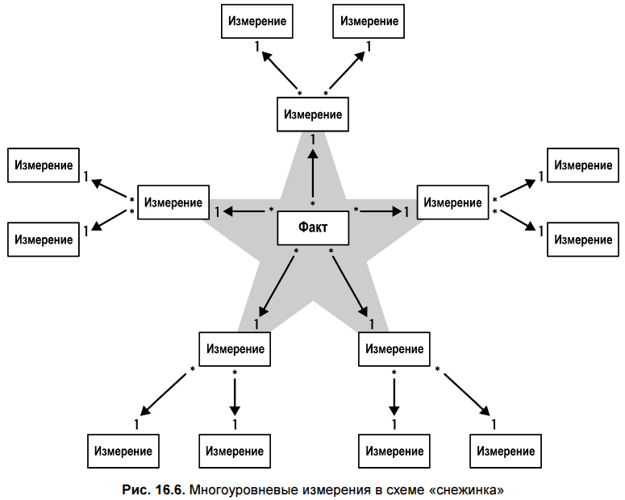

В результате дополнительной нормализации схема «снежинка» будет занимать меньше места для хранения данных измерения и ее будет легче поддерживать. Но запрос данных, составляющих факты, потребует объединения большего количества таблиц, и, следовательно, понадобится больший объем вычислительных ресурсов.

#### <a id="ch16-2">Платформы управления аналитическими данными</a>

Две наиболее распространенные архитектуры аналитических данных: data warehouse (хранилище данных) и data lake (озеро данных).

##### <a id="ch16-2-1">Хранилище данных — Data Warehouse</a>

Данные сначала извлекаются из всех рабочих систем предприятия, затем эти исходные данные трансформируются в аналитическую модель и полученный результат загружается в базу данных, ориентированную на анализ этих данных. Именно эта база данных и является хранилищем данных (data warehouse, DWH).

Эта архитектура управления данными основана главным образом на сценариях извлечения-преобразования-загрузки (extract-transform-load, ETL). В дополнение к преобразованию исходных данных в модель, основанную на фактах и измерениях, этап преобразования может включать в себя дополнительные операции, такие как удаление конфиденциальных данных, устранение дубликатов записей, изменение порядка событий, объединение мелких событий и др.

В ряде случаев преобразование может потребовать временного хранения входящих данных в так называемой области промежуточного хранения (staging area).

Выборка данных выполняется с помощью SQL.

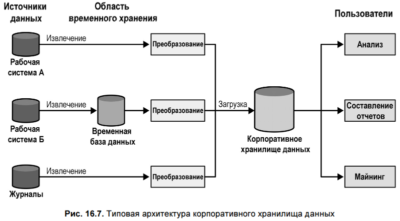

В основу архитектуры хранилища данных заложена цель построения модели для всего предприятия. Такой подход имеет смысл только для самых маленьких организаций. Гораздо более эффективным и масштабируемым подходом будет разработка модели для конкретной задачи.

Задача построения всеобъемлющей модели может быть частично решена за счет использования витрин данных (data mart). Это база данных, в которой хранится информация, необходимая для конкретных аналитических потребностей, например для анализа отдельно взятого бизнес-подразделения. В модели витрины данных, показанной ниже, одна витрина заполняется непосредственно ETL-процессом из транзакционной системы, а другая витрина извлекает свои данные из хранилища данных.

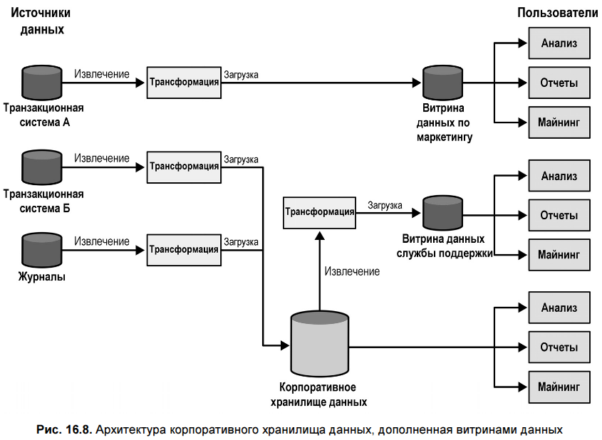

Другим недостатком архитектуры хранилища данных является то, что ETL-процессы формируют сильную связанность аналитических (OLAP) и транзакционных (OLTP) систем. Доступ к данным, потребляемым ETL-сценариями, осуществляется не только через публичные интерфейсы. Зачастую DWH-системы просто извлекают все необходимые данные из баз данных транзакционных систем. Схема, используемая в транзакционной базе данных, относится к деталям внутренней реализации, а не к публичному интерфейсу. В результате даже незначительное изменение схемы неизменно «ломает» ETL-скрипты хранилища данных.

##### <a id="ch16-2-2">Озеро данных — Data Lake</a>

Архитектура озера (Data Lake) данных также основана на концепции приема данных транзакционных систем и преобразования их в аналитическую модель. Система на основе озера данных принимает данные транзакционной системы. Но вместо того, чтобы сразу осуществлять их преобразование в аналитическую модель, она сохраняет данные в «сыром» виде.

В результате задача специалистов по данным и специалистов по бизнес-аналитике состоит в том, чтобы разобраться с данными в озере и реализовать ETL-скрипты, которые будут создавать аналитические модели и передавать их в хранилище данных.

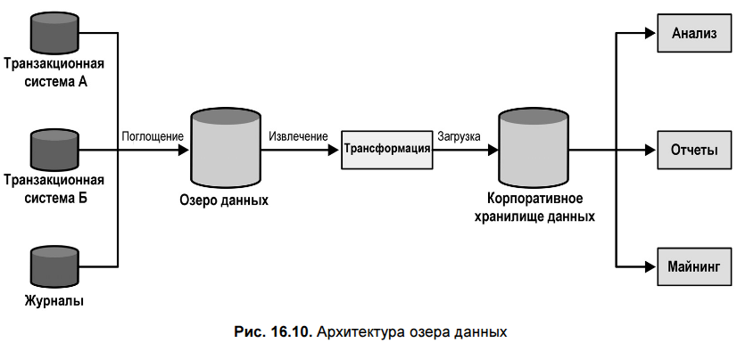

Поскольку данные транзакционных систем сохраняются в исходном, необработанном виде и трансформируются только после этого, то благодаря этому озеро данных позволяет работать с несколькими аналитическими моделями, предназначенными для разных задач.

Вместе с тем отложенное создание аналитических моделей усложняет всю систему.

Поскольку озера данных не содержат схем (на входящие данные не накладываются никакие схемы) и не контролируют качество входящих данных, информация в озере данных при определенных уровнях масштабирования становится хаотичной.

Озера данных упрощают получение данных, но существенно усложняют их использование.

##### <a id="ch16-2-3">Проблемы архитектур хранилища данных и озера данных</a>

Архитектуры хранилища данных (Data Warehouse) и озера данных (Data Lake) основаны на предположении, что чем больше данных поступает для аналитики, тем больше информации получает организация. Однако если данных слишком много, то обе модели могут плохо работать.

С точки зрения моделирования обе архитектуры посягают на границы транзакционных систем и создают зависимости от деталей своей реализации. Возникающая в результате этого связанность с моделями реализации приводит к конфликтам интересов команд транзакционных и аналитических систем.

Частые изменения транзакционной модели (присущее предметно-ориентированному проектированию) приводят к проблемам в аналитической модели.

Эти ограничения, присущие хранилищам данных и озерам данных, вдохновили на создание новой архитектуры управления аналитическими данными: сети данных (data mesh).

#### <a id="ch16-3">Сеть данных (Data mesh)</a>

Архитектура сети данных (data mesh) в некотором смысле представляет собой предметно-ориентированное проектирование применительно к аналитическим данным.

Архитектура сети данных (data mesh) основана на четырех основных принципах:
- разбиение данных по предметным областям
- рассмотрение данных как продукта
- обеспечение автономии
- построение экосистемы.

##### <a id="ch16-3-1">Разбиение данных по предметным областям</a>

Подходы, используемые как в хранилище данных, так и в озере данных, направлены на объединение всех данных предприятия в одну большую модель. Такой подход похож на транзакционную модель в DDD.

Вместо создания монолитной аналитической модели архитектура сети данных требует использования нескольких аналитических моделей и поддерживать их согласованность с источником данных. Это приводит границы владения аналитическими моделями в соответствие с границами ограниченных контекстов. Когда модель анализа разбивается в соответствии с имеющимися в системе ограниченными контекстами, генерация данных анализа становится обязанностью соответствующих групп разработчиков.

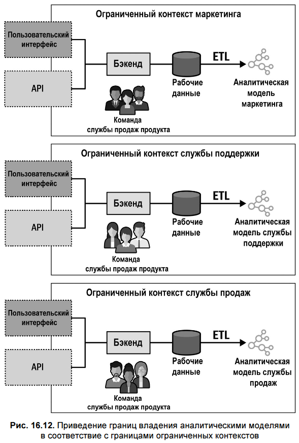

Каждый ограниченный контекст владеет своей транзакционной (OLTP) и аналитической (OLAP) моделями. Следовательно, та команда, которая владеет транзакционной моделью, теперь отвечает и за ее преобразование в аналитическую модель.

##### <a id="ch16-3-2">Данные как продукт</a>

Классические архитектуры управления данными затрудняют исследование, понимание и выборку качественных аналитических данных.

Восприятие данных в качестве продукта требует относиться к аналитическим данным как к одним из важнейших активов компании. В системе на основе сети данных (data mesh) ограниченные контексты обслуживают аналитические данные через конкретные выходные порты.

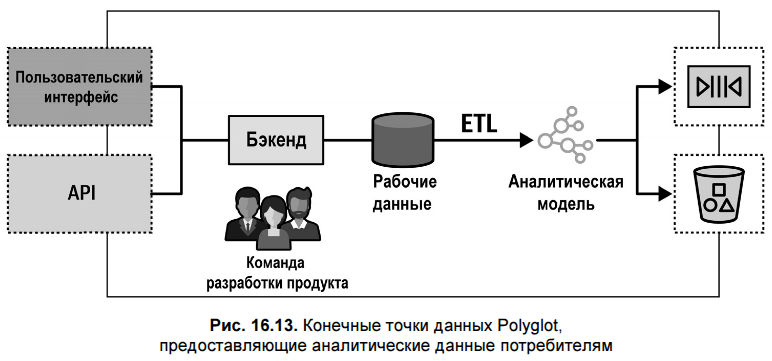

Цель архитектуры управления распределенными данными состоит в том, чтобы предоставить возможность объединения детализированных аналитических моделей для решения задач организации в анализе данных.

##### <a id="ch16-3-3">Обеспечение автономии</a>

У команд разработчиков должна быть возможность не только создавать свои собственные продукты данных, но и использовать продукты данных, обслуживаемые другими командами разработчиков ограниченных контекстов.

Неэффективно, если каждая команда создает собственное решение для аналитики данных. Необходима платформа, позволяющая абстрагироваться от сложностей создания, выполнения и обслуживания совместимых продуктов данных. Для этого выделяется отдельная команда.

##### <a id="ch16-3-4">Построение экосистемы</a>

Завершающим шагом к созданию системы сети данных является назначение объединенного органа управления для обеспечения функциональной совместимости и экосистемного мышления в области аналитических данных. Группа отвечает за определение правил, обеспечивающих работоспособную и функционально совместимую экосистему.

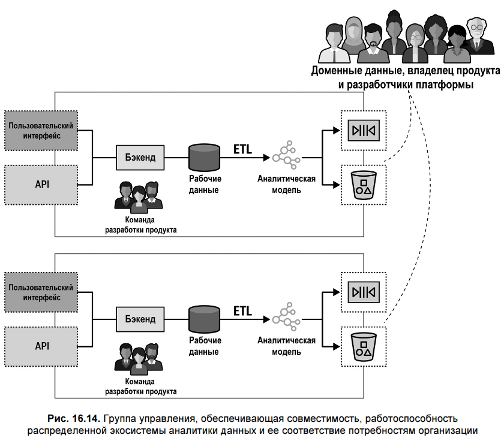

##### <a id="ch16-3-5">Совмещение сети данных (data mesh) и предметно-ориентированного проектирования</a>

Некоторые из паттернов предметно-ориентированного проектирования, могут во многом поддерживать реализацию архитектуры сети данных:
- единый язык
- предоставление данных ограниченного контекста в модели, отличной от его транзакционной модели, является паттерном сервиса с открытым протоколом

CQRS упрощает создание нескольких моделей одних и тех же данных.

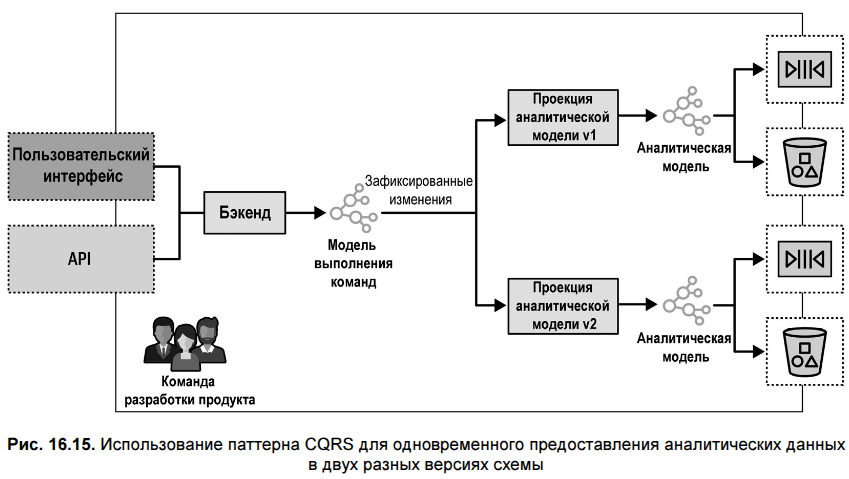

Поскольку архитектура data mesh объединяет модели различных ограниченных контекстов для реализации аналитических сценариев использования, паттерны интеграции ограниченных контекстов для транзакционных моделей применимы и к аналитическим моделям - совместные усилия, предохранительный слой, разные пути.

## <a id="part5">Заключение</a>


