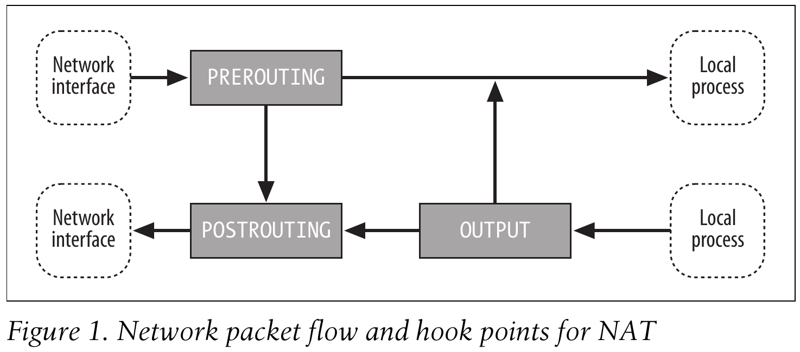
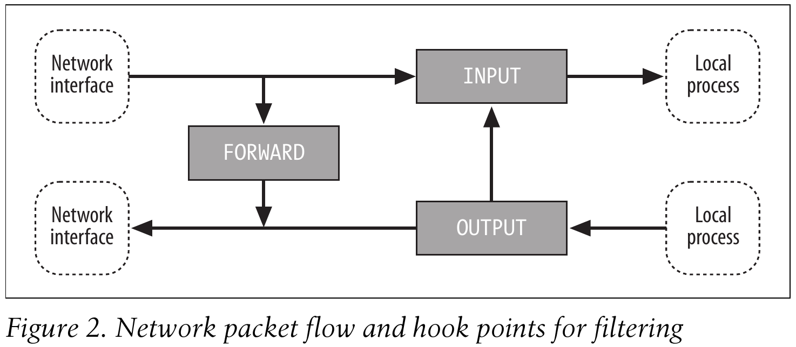
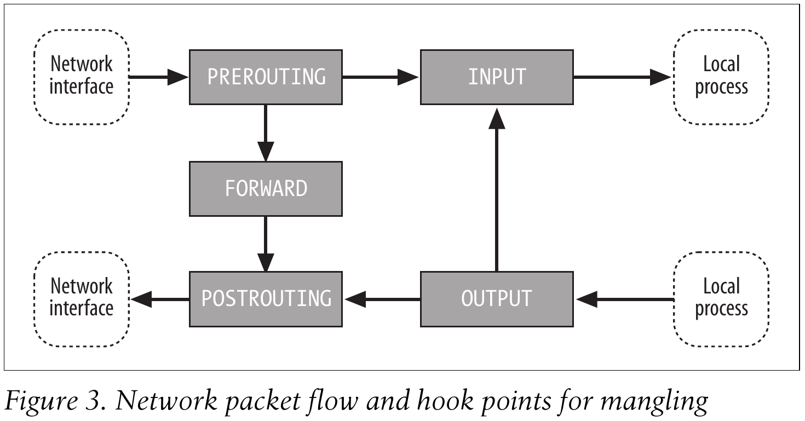

# 📘 Подробный конспект: Linux iptables Pocket Reference

## 🔹 Введение

**Netfilter** — подсистема ядра Linux для обработки сетевых пакетов.  
**iptables** — утилита командной строки для настройки Netfilter (версия 1.2.7a, ядра 2.4/2.6).

> 📌 Важно: в тексте «iptables» может означать как утилиту, так и фреймворк Netfilter в целом.

---

## 🔹 Архитектура iptables

### Три основных компонента:

| Компонент | Описание |
|-----------|----------|
| **Таблицы** | Группируют правила по функциям: `filter`, `nat`, `mangle` |
| **Цепи (chains)** | Последовательности правил, привязанные к точкам обработки пакетов |
| **Правила** | Состоят из **соответствий (matches)** и **целей (targets)** |

### Встроенные таблицы:

| Таблица | Назначение | Встроенные цепи |
|---------|------------|-----------------|
| `filter` | Фильтрация трафика (разрешить/запретить) | `INPUT`, `FORWARD`, `OUTPUT` |
| `nat` | Трансляция сетевых адресов (NAT) | `PREROUTING`, `POSTROUTING`, `OUTPUT` |
| `mangle` | Модификация заголовков пакетов | Все 5 цепей |

> ⚠️ Таблица по умолчанию — `filter`. Если не указана `-t table`, правила применяются к ней.

---

## 🔹 Точки привязки (Hook Points)

Пять точек в пути обработки пакетов ядром:

| Точка | Когда срабатывает |
|-------|------------------|
| `PREROUTING` | Сразу после получения пакета с интерфейса |
| `INPUT` | Перед доставкой пакета локальному процессу |
| `FORWARD` | При маршрутизации через шлюз (между интерфейсами) |
| `OUTPUT` | После создания пакета локальным процессом |
| `POSTROUTING` | Непосредственно перед отправкой пакета в сеть |

---

  

  

  

---

## 🔹 Потоки пакетов по таблицам

### 🔄 Маршрутизация (forwarding):
```
mangle/PREROUTING → nat/PREROUTING → mangle/FORWARD → filter/FORWARD → mangle/POSTROUTING → nat/POSTROUTING
```

### ⬇️ Входящие пакеты (input):
```
mangle/PREROUTING → nat/PREROUTING → mangle/INPUT → filter/INPUT
```

### ⬆️ Исходящие пакеты (output):
```
mangle/OUTPUT → nat/OUTPUT → filter/OUTPUT → mangle/POSTROUTING → nat/POSTROUTING
```

### 🔄 Локальная коммуникация:
```
mangle/OUTPUT → nat/OUTPUT → filter/OUTPUT → filter/INPUT → mangle/INPUT
```

---

## 🔹 Правила (Rules)

### Структура правила:
```bash
iptables -t <table> -A <chain> <matches> -j <target>
```

**Пример:**
```bash
iptables -t nat -A PREROUTING -i eth1 -p tcp --dport 80 -j DNAT --to-destination 192.168.1.3:8080
```

| Компонент | Значение |
|-----------|----------|
| `-t nat` | Работать с таблицей nat |
| `-A PREROUTING` | Добавить правило в цепь PREROUTING |
| `-i eth1` | Интерфейс входа: eth1 |
| `-p tcp` | Протокол: TCP |
| `--dport 80` | Порт назначения: 80 |
| `-j DNAT` | Цель: изменить адрес назначения |
| `--to-destination` | Новый адрес:порт |

### Политика цепи (Policy)
- Определяет действие, если пакет не совпал ни с одним правилом
- Для встроенных цепей: только `ACCEPT` или `DROP`
- По умолчанию: `ACCEPT`
- Для пользовательских цепей: неявная политика `RETURN`

---

## 🔹 Соответствия (Matches)

### Базовые (встроенные) IP-соответствия:

| Опция | Описание |
|-------|----------|
| `-s адрес[/маска]` | Источник |
| `-d адрес[/маска]` | Назначение |
| `-p протокол` | Протокол: `tcp`, `udp`, `icmp`, номер или имя |
| `-i интерфейс` | Входной интерфейс |
| `-o интерфейс` | Выходной интерфейс |
| `-f` | Второй и последующие фрагменты |

### Расширенные соответствия (требуют `-m`):

| Расширение | Назначение |
|------------|------------|
| `conntrack` | По состоянию отслеживания соединений (`--ctstate NEW,ESTABLISHED...`) |
| `state` | Упрощённый аналог conntrack (`--state`) |
| `limit` | Ограничение по частоте (`--limit 10/s --limit-burst 5`) |
| `multiport` | Несколько портов (`--dports 22,80,443`) |
| `recent` | Отслеживание недавней активности по IP |
| `mac` | По MAC-адресу источника (`--mac-source`) |
| `length` | По длине пакета |
| `tcp`/`udp` | По портам (`--dport`, `--sport`, `--syn`) |
| `icmp` | По типу/коду ICMP |
| `string` | По строке в содержимом пакета |
| `time` | По времени/дням недели |
| `ttl` | По значению TTL |

> 💡 Инверсия: перед опцией можно добавить `!` для отрицания: `! -s 192.168.1.0/24`

---

## 🔹 Цели (Targets)

### Встроенные цели:

| Цель | Действие |
|------|----------|
| `ACCEPT` | Пропустить пакет дальше |
| `DROP` | Тихо отбросить пакет (без ответа) |
| `REJECT` | Отбросить + отправить ICMP-ответ |
| `RETURN` | Вернуться в вызвавшую цепь |
| `QUEUE` | Передать пакет в userspace (libipq) |

### Расширенные цели:

| Цель | Таблица | Назначение |
|------|---------|------------|
| `DNAT` | `nat` | Изменить адрес/порт назначения |
| `SNAT` | `nat` | Изменить адрес/порт источника (статический IP) |
| `MASQUERADE` | `nat` | SNAT для динамических адресов |
| `REDIRECT` | `nat` | Перенаправить на локальный порт (прокси) |
| `LOG` | Любая | Записать информацию в syslog |
| `MARK` | `mangle` | Установить метку пакета для маршрутизации |
| `TOS`/`DSCP` | `mangle` | Изменить поле Type of Service |
| `TTL` | `mangle` | Изменить Time To Live |
| `TCPMSS` | `mangle` | Корректировать MSS для PMTU |

---

## 🔹 Отслеживание соединений (Connection Tracking)

### Состояния соединений:

| Состояние | Описание |
|-----------|----------|
| `NEW` | Новый запрос на соединение |
| `ESTABLISHED` | Пакеты в обоих направлениях уже прошли |
| `RELATED` | Новое соединение, связанное с существующим (FTP-data, ICMP error) |
| `INVALID` | Пакет не относится ни к одному известному соединению |

### Пример правила для государственного фаервола:
```bash
# Разрешить установленные и связанные соединения
iptables -A INPUT -m state --state ESTABLISHED,RELATED -j ACCEPT
# Разрешить новые SSH-соединения
iptables -A INPUT -p tcp --dport 22 -m state --state NEW -j ACCEPT
# Отбросить всё остальное
iptables -A INPUT -j DROP
```

### Модули-помощники (helpers):
- `ip_conntrack_ftp` — FTP
- `ip_conntrack_irc` — IRC
- `ip_conntrack_tftp` — TFTP
- `ip_conntrack_amanda` — Amanda backup

> ⚠️ Требуется загрузка модулей: `modprobe ip_conntrack_ftp`

---

## 🔹 Сетевая трансляция адресов (NAT)

### Источник: `SNAT` и `MASQUERADE`
```bash
# Статический IP
iptables -t nat -A POSTROUTING -o eth0 -j SNAT --to-source 203.0.113.1

# Динамический IP (PPPoe, DHCP)
iptables -t nat -A POSTROUTING -o ppp0 -j MASQUERADE
```

### Назначение: `DNAT` (порт-форвардинг)
```bash
# Веб-сервер внутри сети
iptables -t nat -A PREROUTING -i eth0 -p tcp --dport 80 \
  -j DNAT --to-destination 192.168.1.10:80

# Не забыть разрешить FORWARD!
iptables -A FORWARD -p tcp -d 192.168.1.10 --dport 80 -j ACCEPT
```

### Прозрачный прокси
```bash
# Перенаправить весь HTTP на локальный Squid (порт 3128)
iptables -t nat -A PREROUTING -i eth1 -p tcp --dport 80 \
  -j REDIRECT --to-port 3128
```

---

## 🔹 Практические применения

### 📊 Учёт трафика (Accounting)
```bash
# Счётчики для всего внешнего трафика
iptables -A FORWARD -i eth1
iptables -A FORWARD -o eth1
iptables -A INPUT -i eth1
iptables -A OUTPUT -o eth1

# Просмотр: iptables -L -v -n
```

### 🎯 Ограничение частоты (Rate Limiting)
```bash
# Не более 5 ping-запросов в секунду
iptables -A INPUT -p icmp --icmp-type echo-request \
  -m limit --limit 5/s --limit-burst 10 -j ACCEPT
iptables -A INPUT -p icmp --icmp-type echo-request -j DROP
```

### 🛡️ Защита от сканирования портов
```bash
# Блокировать после 10 попыток за 60 секунд
iptables -A INPUT -p tcp --syn -m recent --name scan --set
iptables -A INPUT -p tcp --syn -m recent --name scan \
  --update --seconds 60 --hitcount 10 -j DROP
```

### ⚖️ Балансировка нагрузки (простая)
```bash
# Распределение по трём серверам (round-robin)
iptables -t nat -A PREROUTING -p tcp --dport 80 -m nth --every 3 --packet 0 \
  -j DNAT --to-destination 192.168.1.10
iptables -t nat -A PREROUTING -p tcp --dport 80 -m nth --every 3 --packet 1 \
  -j DNAT --to-destination 192.168.1.11
iptables -t nat -A PREROUTING -p tcp --dport 80 -m nth --every 3 --packet 2 \
  -j DNAT --to-destination 192.168.1.12
```

---

## 🔹 Команды iptables: справочник

### Основные подкоманды:

| Опция | Действие |
|-------|----------|
| `-A цепь` | Добавить правило в конец цепи |
| `-I цепь [номер]` | Вставить правило (по умолчанию в начало) |
| `-D цепь номер/правило` | Удалить правило |
| `-R цепь номер` | Заменить правило |
| `-L [цепь]` | Список правил |
| `-F [цепь]` | Очистить цепь (удалить все правила) |
| `-N цепь` | Создать пользовательскую цепь |
| `-X [цепь]` | Удалить пользовательскую цепь |
| `-P цепь цель` | Установить политику по умолчанию |
| `-Z [цепь]` | Обнулить счётчики |

### Полезные флаги:

| Флаг | Описание |
|------|----------|
| `-t таблица` | Указать таблицу (`filter`, `nat`, `mangle`) |
| `-v` | Подробный вывод |
| `-n` | Не резолвить адреса/порты (быстрее) |
| `--line-numbers` | Показать номера правил в `-L` |
| `-c пакеты байты` | Задать начальные значения счётчиков |

### Примеры:
```bash
# Просмотр всех правил с номерами и счётчиками
iptables -L -v -n --line-numbers

# Удалить правило №3 из INPUT
iptables -D INPUT 3

# Сохранить конфигурацию
iptables-save > /etc/iptables.rules

# Восстановить
iptables-restore < /etc/iptables.rules
```

---

## 🔹 Утилиты сохранения/восстановления

### `iptables-save`
```bash
# Сохранить все таблицы
iptables-save > /etc/iptables.rules

# Только таблицу nat
iptables-save -t nat > nat.rules

# Со счётчиками
iptables-save -c > rules_with_counters.txt
```

### `iptables-restore`
```bash
# Загрузить правила (с очисткой таблиц)
iptables-restore < /etc/iptables.rules

# Добавить без очистки
iptables-restore -n < additional_rules.txt

# Со счётчиками
iptables-restore -c < rules_with_counters.txt
```

---

## 🔹 Настройка в дистрибутивах

### Red Hat / CentOS:
```bash
# Файл правил: /etc/sysconfig/iptables
# Управление службой:
service iptables start|stop|restart|save

# Автозагрузка в runlevels 3,4,5:
chkconfig --levels 345 iptables on
```

### Ядро: необходимые опции конфигурации
```
CONFIG_NETFILTER=y
CONFIG_IP_NF_IPTABLES=y
CONFIG_IP_NF_FILTER=y
CONFIG_IP_NF_NAT=y
CONFIG_IP_NF_MANGLE=y
CONFIG_IP_NF_CONNTRACK=y
```

> ⚠️ Не включайте `CONFIG_NET_FASTROUTE` — обходит хуки Netfilter!

---

## 🔹 Инструменты для отладки

| Утилита | Назначение |
|---------|------------|
| `tcpdump` | Перехват и анализ пакетов |
| `nmap` | Сканирование портов и хостов |
| `ping` / `traceroute` | Проверка доступности и маршрута |
| `iptables -L -v -n` | Просмотр правил и счётчиков |
| `/proc/net/ip_conntrack` | Таблица отслеживаемых соединений |
| `dmesg \| grep iptables` | Логи ядра, связанные с фильтрацией |

---

## 🔹 Чеклист безопасности

✅ Включить пересылку пакетов (для шлюза):
```bash
echo 1 > /proc/sys/net/ipv4/ip_forward
# Или в /etc/sysctl.conf:
net.ipv4.ip_forward = 1
```

✅ Политика по умолчанию — `DROP`, разрешать только нужное:
```bash
iptables -P INPUT DROP
iptables -P FORWARD DROP
iptables -P OUTPUT ACCEPT  # или тоже DROP с явными правилами
```

✅ Разрешить loopback:
```bash
iptables -A INPUT -i lo -j ACCEPT
iptables -A OUTPUT -o lo -j ACCEPT
```

✅ Разрешить установленные соединения:
```bash
iptables -A INPUT -m state --state ESTABLISHED,RELATED -j ACCEPT
```

✅ Логировать подозрительные пакеты (перед DROP):
```bash
iptables -A INPUT -j LOG --log-prefix "IPT_DROP: " --log-level 4
```

---

> ⚠️ **Важно**: Документ описывает iptables для ядер 2.4/2.6. В современных системах (ядра 3.x+/4.x/5.x) используется `nftables` как преемник, но iptables остаётся поддерживаемым через слой совместимости.

---

## Типовые команды iptables

---

### Просмотр правил
Проверка текущих правил межсетевого экрана.

| Команда | Описание |
|---------|----------|
| `sudo iptables -L` | Показать правила |
| `sudo iptables -L -n` | Показать правила без разрешения имён |
| `sudo iptables -L -v` | Подробный вывод |
| `sudo iptables -L -n --line-numbers` | Показать правила с номерами строк |
| `sudo iptables -S` | Показать правила в виде команд |
| `sudo iptables -t nat -L -n -v` | Просмотр правил NAT |

---

### Политики по умолчанию
Установка политик по умолчанию для цепочек.

| Команда | Описание |
|---------|----------|
| `sudo iptables -P INPUT DROP` | По умолчанию отклонять входящий трафик |
| `sudo iptables -P FORWARD DROP` | По умолчанию отклонять пересылаемый трафик |
| `sudo iptables -P OUTPUT ACCEPT` | По умолчанию разрешать исходящий трафик |

---

### Разрешение трафика
Разрешение распространённого входящего трафика.

| Команда | Описание |
|---------|----------|
| `sudo iptables -A INPUT -i lo -j ACCEPT` | Разрешить трафик loopback (локальной петли) |
| `sudo iptables -A INPUT -m conntrack --ctstate ESTABLISHED,RELATED -j ACCEPT` | Разрешить установленные и связанные соединения |
| `sudo iptables -A INPUT -p tcp --dport 22 -j ACCEPT` | Разрешить SSH |
| `sudo iptables -A INPUT -p tcp --dport 80 -j ACCEPT` | Разрешить HTTP |
| `sudo iptables -A INPUT -p tcp --dport 443 -j ACCEPT` | Разрешить HTTPS |
| `sudo iptables -A INPUT -p icmp -j ACCEPT` | Разрешить ping (ICMP) |
| `sudo iptables -A INPUT -s 192.168.1.0/24 -j ACCEPT` | Разрешить трафик из подсети |

---

### Блокировка трафика
Отклонение или отбрасывание трафика.

| Команда | Описание |
|---------|----------|
| `sudo iptables -A INPUT -s 203.0.113.10 -j DROP` | Отбросить трафик с указанного IP-адреса |
| `sudo iptables -A INPUT -s 203.0.113.0/24 -j DROP` | Отбросить трафик из указанной подсети |
| `sudo iptables -A INPUT -p tcp --dport 23 -j DROP` | Заблокировать Telnet |
| `sudo iptables -A INPUT -p tcp --dport 25 -j REJECT` | Отклонить SMTP (с уведомлением отправителя) |
| `sudo iptables -A INPUT -m mac --mac-source XX:XX:XX:XX:XX:XX -j DROP` | Заблокировать трафик с указанного MAC-адреса |

---

### Перенаправление портов (DNAT)
Перенаправление трафика на другой хост или порт.

| Команда | Описание |
|---------|----------|
| `sudo iptables -t nat -A PREROUTING -p tcp --dport 80 -j DNAT --to-destination 192.168.1.10:80` | Перенаправить порт на другой хост |
| `sudo iptables -t nat -A PREROUTING -p tcp --dport 8080 -j REDIRECT --to-port 80` | Перенаправить локальный порт на другой порт |
| `sudo iptables -t nat -A PREROUTING -p tcp --dport 443 -j REDIRECT --to-ports 8443` | Пример перенаправления порта 443 на 8443 для использования в Docker контейнере |
| `sudo iptables -A FORWARD -p tcp -d 192.168.1.10 --dport 80 -j ACCEPT` | Разрешить пересылаемый трафик |

---

### NAT (Маскарадинг)
Включение NAT для исходящего трафика.

| Команда | Описание |
|---------|----------|
| `sudo iptables -t nat -A POSTROUTING -o eth0 -j MASQUERADE` | Включить NAT для указанного интерфейса |
| `sudo iptables -t nat -A POSTROUTING -s 192.168.1.0/24 -o eth0 -j SNAT --to-source 203.0.113.1` | Статический NAT с указанием исходного адреса |
| `sudo sysctl -w net.ipv4.ip_forward=1` | Включить пересылку IP-пакетов |

---

### Ограничение скорости (Rate Limiting)
Ограничение частоты соединений для предотвращения злоупотреблений.

| Команда | Описание |
|---------|----------|
| `sudo iptables -A INPUT -p tcp --dport 22 -m limit --limit 3/min --limit-burst 3 -j ACCEPT` | Ограничить попытки подключения по SSH |
| `sudo iptables -A INPUT -p tcp --dport 80 -m connlimit --connlimit-above 50 -j DROP` | Ограничить количество соединений с одного IP |
| `sudo iptables -A INPUT -p icmp -m limit --limit 1/sec -j ACCEPT` | Ограничить частоту ping-запросов |

---

### Логирование
Запись совпавших пакетов в журнал для отладки.

| Команда | Описание |
|---------|----------|
| `sudo iptables -A INPUT -j LOG --log-prefix "IPT-DROP: "` | Логировать отброшенные пакеты с префиксом |
| `sudo iptables -A INPUT -p tcp --dport 22 -j LOG --log-prefix "SSH: " --log-level 4` | Логировать доступ по SSH с указанием уровня |
| `sudo iptables -A INPUT -m limit --limit 5/min -j LOG` | Логирование с ограничением частоты |

---

### Удаление и вставка правил
Управление порядком правил и их удаление.

| Команда | Описание |
|---------|----------|
| `sudo iptables -D INPUT 3` | Удалить правило под номером 3 в цепочке INPUT |
| `sudo iptables -D INPUT -p tcp --dport 80 -j ACCEPT` | Удалить правило по точному соответствию |
| `sudo iptables -I INPUT 1 -p tcp --dport 22 -j ACCEPT` | Вставить правило в начало цепочки (позиция 1) |
| `sudo iptables -R INPUT 3 -p tcp --dport 443 -j ACCEPT` | Заменить правило под номером 3 |
| `sudo iptables -F` | Очистить все правила во всех цепочках |
| `sudo iptables -F INPUT` | Очистить только цепочку INPUT |

---

### Сохранение и восстановление
Сохранение правил для применения после перезагрузки.

| Команда | Описание |
|---------|----------|
| `sudo iptables-save > /etc/iptables/rules.v4` | Сохранить текущие правила в файл |
| `sudo iptables-restore < /etc/iptables/rules.v4` | Восстановить правила из файла |
| `sudo apt install iptables-persistent` | Установить автоматическое сохранение правил на Debian/Ubuntu |
| `sudo service iptables save` | Сохранить правила на RHEL и совместимых дистрибутивах |

---

> **Примечание:** Все команды iptables следует выполнять с правами суперпользователя (через `sudo` или из-под root).