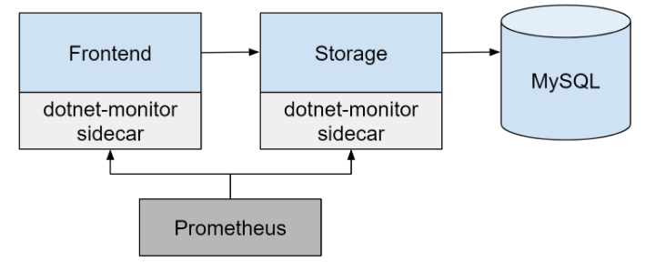
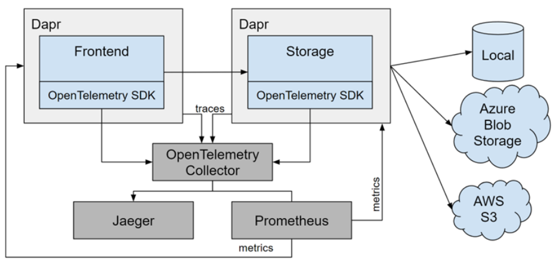
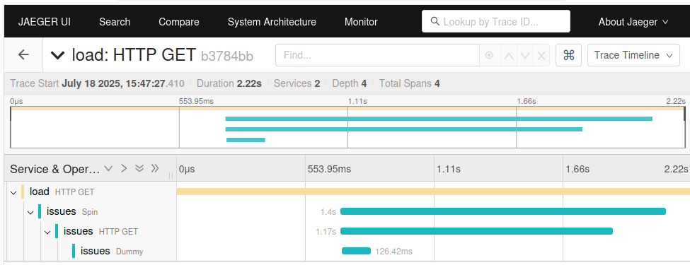
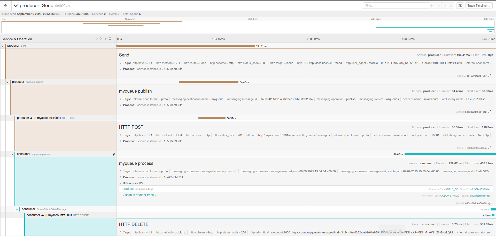
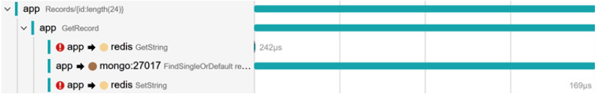

# Modern Distributed Tracing in .NET

[https://github.com/PacktPublishing/Modern-Distributed-Tracing-in-.NET](https://github.com/PacktPublishing/Modern-Distributed-Tracing-in-.NET)  
[https://github.com/open-telemetry/opentelemetry-dotnet](https://github.com/open-telemetry/opentelemetry-dotnet)  
[Youtube - Code in action](https://www.youtube.com/playlist?list=PLeLcvrwLe184womf_blBh9-1XHqssEJei)  
[Иллюстрации к книге](https://packt.link/BBBNm)  
[Хабр - OpenTelemetry на практике](https://habr.com/ru/companies/ru_mts/articles/537892/)
[OpenTelemetry semantic conventions](https://opentelemetry.io/docs/specs/semconv/)

## Содержание

- [Часть 1. Введение в распределенную трассировку](#part1)
  - [Глава 1. Отслеживание в современных приложениях](#ch1)
    - [Почему логов и счетчиков недостаточно](#ch1-1)
    - [Введение в распределенную трассировку](#ch1-2)
    - [Трассировка - строительные блоки](#ch1-3)
    - [Обзор передачи контекста](#ch1-4)
      - [Внутрипроцессная передача (In-process propagation)](#ch1-4-1)
      - [Передача контекста между процессами](#ch1-4-2)
        - [W3C Trace Context](#ch1-4-2-1)
        - [B3](#ch1-4-2-2)
        - [Baggage](#ch1-4-2-3)
    - [Обеспечение согласованности и структуры](#ch1-5)
    - [Обзор анализа производительности](#ch1-6)
      - [Базовый уровень (baseline)](#ch1-6-1)
      - [Исследования проблем производительности](#ch1-6-2)
  - [Глава 2. Встроенные возможности мониторинга в .NET](#ch2)
    - [Простой пример приложения](#ch2-1)
      - [Корреляция журналов (log correlation)](#ch2-1-1)
      - [Логирование по требованию с помощью dotnet-monitor](#ch2-1-2)
    - [Мониторинг с помощью счетчиков среды выполнения](#ch2-2)
    - [Автоматическое накопление метрик с помощью OpenTelemetry](#ch2-3)
      - [Распределенная трассировка](#ch2-3-1)
      - [Метрики](#ch2-3-2)
    - [Обзор автоматически сгенерированной телеметрии](#ch2-4)
      - [Отладка](#ch2-4-1)
      - [Производительность](#ch2-4-2)
  - [Глава 3. Экосистема наблюдаемости .NET](#ch3)
    - [Использование инструментария для популярных библиотек](#ch3-1)
      - [Добавление инструментария в приложение](#ch3-1-1)
      - [Redis](#ch3-1-2)
      - [AWS SDK, Asure SDK](#ch3-1-3)
    - [Использование инфраструктуры (Dapr)](#ch3-2)
      - [Конфигурирование секретов](#ch3-2-1)
      - [Настройка наблюдаемости с Dapr](#ch3-2-2)
      - [Трассировка](#ch3-2-3)
      - [Метрики](#ch3-2-3)
    - [Настройка serverless окружения](#ch3-3)
  - [Глава 4. Низкоуровневый анализ производительности с помощью утилит диагностики](#ch4)
    - [Обзор общих проблем производительности](#ch4-1)
      - [Утечки памяти](#ch4-1-1)
      - [Истощения пула потоков](#ch4-1-2)
      - [Профилирование](#ch4-1-3)
      - [Неэффективный код](#ch4-1-4)
      - [Отладка блокировок](#ch4-1-5)
      - [Использование утилит диагностики в продакшене](#ch4-1-6)
- [Часть 2. Применение инструментария в .NET приложениях](#part2)
  - [Глава 5. Конфигурация и слой управления](#ch5)
    - [Управление стоимостью профилирования с помощью сэмплирования](#ch5-1)
      - [Head-based выборка](#ch5-1-1)
      - [Tail-based выборка](#ch5-1-2)
    - [Обогащение и фильтрация телеметрии](#ch5-2)
      - [Обработчик спанов (span processor)](#ch5-2-1)
      - [Кастомизация инструментария](#ch5-2-2)
      - [Ресурсы](#ch5-2-3)
      - [Метрики](#ch5-2-4)
    - [Кастомизация контекста](#ch5-3)
    - [Обработка конвейера с использованием OpenTelemetry Collector](#ch5-4)
  - [Глава 6. Трассировка кода](#ch6)
    - [Трассировка с использованием System.Diagnostics или обертки OpenTelemetry API](#ch6-1)
      - [Трассировка с помощью System.Diagnostics](#ch6-1-1)
      - [Экспорт активности через OpenTelemetry](#ch6-1-2)
      - [Прослушивание активности через ActivityListener](#ch6-1-3)
      - [Создание активностей](#ch6-1-4)
      - [Трассировка с помощью обертки OpenTelemetry API](#ch6-1-5)
      - [Использование контекста](#ch6-1-6)
      - [Запись событий](#ch6-1-7)
      - [Корреляция спанов и ссылок](#ch6-1-8)
      - [Тестирование инструментария](#ch6-1-9)
  - [Глава 7. Добавление пользовательских метрик](#ch7)
    - [Метрики в .NET — прошлое и настоящее](#ch7-1)
      - [Кардинальность](#ch7-1-1)
      - [Когда использовать метрики](#ch7-1-2)
      - [Сбор метрик](#ch7-1-3)
    - [Использование счетчиков](#ch7-2)
      - [Класс Counter](#ch7-2-1)
      - [Класс UpDownCounter](#ch7-2-2)
      - [Класс ObservableCounter](#ch7-2-3)
      - [Класс ObservableUpDownCounter](#ch7-2-4)
    - [Использование асинхронного гейджа (gauge)](#ch7-3)
    - [Использование гистограмм](#ch7-4)
  - [Глава 8. Запись структурированных и коррелированных логов](#ch8)
    - [Эволюция логирования в .NET](#ch8-1)
      - [Console](#ch8-1-1)
      - [Trace](#ch8-1-2)
      - [EventSource](#ch8-1-3)
      - [ILogger](#ch8-1-4)
    - [Логирование с помощью ILogger](#ch8-2)
    - [Семантическое логирование](#ch8-3)
    - [Оптимизация логирования](#ch8-4)
    - [Сбор логов с помощью OpenTelemetry](#ch8-5)
    - [Управление затратами на логирование](#ch8-6)
      - [Конвейер логирования](#ch8-6-1)
      - [Бекенды](#ch8-6-2)
- [Часть 3. Наблюдаемость для типичных облачных сценариев](#part3)
  - [Глава 9. Лучшие практики наблюдаемости в облаке](#ch9)
    - [Краткое содержание](#ch9-1)
    - [Основные тезисы](#ch9-2)
    - [Примеры применения телеметрии в разных сценариях](#ch9-3)
    - [Семантические конвенции OpenTelemetry](#ch9-4)
      - [Определение семантических конвенций](#ch9-4-1)
      - [Семантические конвенции для HTTP-запросов](#ch9-4-2)
      - [Метрики HTTP](#ch9-4-3)
      - [Общие соображения по инструментированию](#ch9-4-4)
      - [Трейсы](#ch9-4-5)
      - [Атрибуты](#ch9-4-6)
      - [Метрики](#ch9-4-7)
  - [Глава 10. Трассировка сетевых вызовов](#ch10)
    - [Инструментирование клиентских вызовов](#ch10-1)
      - [Унарные операции](#ch10-1-1)
      - [Настройка инструментации](#ch10-1-2)
    - [Инструментирование серверных вызовов](#ch10-2)
    - [Инструментирование потоковых вызовов (Streaming Calls)](#ch10-3)
    - [Исследование проблем](#ch10-4)
    - [Ключевые библиотеки и инструменты](#ch10-5)
  - [Глава 11. Инструментирование сценариев обмена сообщениями](#ch11)
    - [Наблюдаемость в сценариях обмена сообщениями](#ch11-1)
      - [Семантические соглашения](#ch11-1-1)
    - [Инструментирование продюсера](#ch11-2)
      - [Распространение контекста трассировки](#ch11-2-1)
      - [Трассировка публикации сообщений](#ch11-2-2)
      - [Метрики продюсера](#ch11-2-3)
    - [Инструментирование потребителя](#ch11-3)
      - [Трассировка операций потребителя](#ch11-3-1)
      - [Метрики потрибителя](#ch11-3-2)
        - [Продолжительность, пропускная способность и частота ошибок](#ch11-3-2-1)
        - [Измерение задержки потребителя](#ch11-3-2-2)
        - [Размер очереди](#ch11-3-2-3)
      - [Инструментирование сценариев пакетной обработки](#ch11-4)
        - [Пакетирование на уровне транспорта](#ch11-4-1)
        - [Обработка пакетов](#ch11-4-2)
      - [Анализ производительности в сценариях обмена сообщениями](#ch11-5)
  - [Глава 12. Инструментирование вызовов баз данных](#ch12)
    - [Инструментирование вызовов баз данных](#ch12-1)
      - [Семантические соглашения OpenTelemetry для баз данных](#ch12-1-1)
      - [Реализация трассировки](#ch12-1-2)
    - [Трассировка вызовов кэша](#ch12-2)
      - [Инструментирование составных вызовов](#ch12-2-1)
    - [Добавление метрик](#ch12-3)
      - [Запись метрик Redis](#ch12-3-1)
    - [Анализ производительности](#ch12-4)

## <a id="part1">Часть 1. Введение в распределенную трассировку</a>

### <a id="ch1">Глава 1. Отслеживание в современных приложениях</a>

#### <a id="ch1-1">Почему логов и счетчиков недостаточно</a>

**Журналы** (logs) легко создавать, но они слишком многословны, что может повлиять на производительность. Их также трудно фильтровать, запрашивать или визуализировать.

**События** (events) похожи на логи, но имеют определенную структуру, поэтому для них можно создавать эффективные запросы по полям схемы, однако они также многословны и имеют такие же проблемы с производительностью, что и логи.

**Метрика** - это значение чего-либо, агрегированное по измерениям и за определенный период времени. Метрики оказывают незначительное влияние на производительность, имеют небольшой объем, который не сильно растет при масштабировании, низкие затраты на хранение и малое время выполнения запросов. Они отлично подходят для приборных панелей и оповещений, но не для исследования проблем или детальной аналитики.

**Счетчик** представляет собой единичный временной ряд - это метрика без измерений, которая обычно используется для сбора данных об использовании ресурсов, таких как загрузка процессора или использование памяти.

Для мониторинга монолитной или небольшой распределенной системы можно использовать метрики для отслеживания работоспособности системы, оповещений и события для отслеживания использования системы, а также логи для анализа проблем.

Современные требования к системам мониторинга приложений:

- Систематизированный анализ проблем (systematic debugging) - проблемы должны решаться в общем виде независимо от источника (отчета об ошибке или оповещения по метрике), нужно иметь возможность отследить проблемный запрос между разными компонентами распределенной системы, или пройти по стеку вызовов.

- Получение данных по специализированным вопросам - если произошел сбой у пользователей, необходимо понимать причину сбоя, какой бы она ни была. Как правило для этого нет необходимости добавлять новый элемент телеметрии, обычно достаточно добавить новое свойство в контекст или событие, но это должно быть редкостью.

- Системы с самодокументированием - современные системы динамичные с постоянными обновлениями, множеством зависимостей, телеметрия в этом случае становится источником правды. В этом случае она имеет достаточно информации в контексте, а провайдер должен быть в состоянии достаточно хорошо визуализировать данные.

- Автоматизированный инструментарий - подразумевает использование общих инструментов, в то время как телеметрия и контекст являются специфичными для приложения.

#### <a id="ch1-2">Введение в распределенную трассировку</a>

**Распределенная трассировка** - это техника, которая объединяет структурирование, корреляцию и причинно-следственные связи при сборе телеметрии. Определяется специальное событие, которое называется спаном (span), также определяются причинно-следственные связи между спанами. Спаны следуют общим соглашениям, которые используются для визуализации и анализа трассировок.

##### Спан

Спан описывает операцию такую как входящий или исходящий HTTP запрос, вызов базы данных, вызов операции I/O или любой другой вызов. Наиболее важные свойства спана:

- Название, должно описывать тип операции в человеко-читаемом формате
- Время начала и продолжительность
- Статус, отражает успех, неудачу или отсутствие статуса
- Тип спана (span kind), позволяет различать клиентские, серверные и внутренние вызовы, а также выделять производителя и потребителя в асинхронных сценариях
- Аттрибуты (теги или аннотация), содержат данные, специфичные для операции
- Контекст спана, идентифицирует его и передается везде, где используется корреляция - как родительский или дочерних спан
- События, содержащие дополнительную информацию об операциях со спаном
- Линки (links) объединяют трейсы (traces) и спаны, когда родительско-дочерние операции не работают, например в пакетных сценариях.

> В .NET спан представлен классом System.Diagnostics.Activity. Класс System.Span не имеет отношения к распределённой трассировке.

**Спан** - это единица трассировки, для отслеживания более сложных операций используются множество спанов. Например, HTTP запрос/попытка взять объект из кеша/запрос в БД/сохранение объекта в кеше - это отдельные спаны, которые объединяются в трейс.

**Трейс** - набор связанных между собой спанов, полностью описывающих логическую сквозную операцию и имеющих одинаковый trace-id.

Спаны могут иметь более сложные отношения, которые будут рассмотрены в Главе 6.

**Контекст спана** (например, trace-id и span-id) могут использоваться в сложных сценариях. Например, можно сохранять контекст спана в логи (спойлер - достаточно настроить ILogger) и логи будут коррелировать с трассировкой. При использовании ConsoleProvider'а логи могут выглядеть так:


Также можно линковать метрики к трейсам используя экземпляры (exemplars) - метаданные метрик, содержащие контекст трассировки операций, участвующие в данном измерении.

**Аттрибуты спана** - это набор свойств, содержащих детали операции. Семантика OpenTelemetry определяет набор аттрибутов для наиболее известных технологий (см "Обеспечение согласованности и структуры" в этой главе). Пример аттрибутов для HTTP запроса:

| Аттрибут | Значение |
|---|---|
| http.flavor | 1.1 |
| http.host | storage:5051 |
| http.method | GET |
| http.route | Memes/{name} |
| http.scheme | http |
| http.status_code | 200 |
| http.target | /memes/935740939238 |
| http.url | http://storage:5051/memes/935740939238 |
| internal.span.format | proto |
| otel.library.name | OpenTelemetry.Instrumentation.AspNetCore |
| otel.library.version | 1.0.0.0 |
| span.kind | server |

Момент создания спана и задание его свойств строго не определен, но есть общее правило:

> Создавайте новый спан для каждого входящего и исходящего сетевого вызова и используйте стандартные атрибуты для соответствующего протокола или технологии, если они доступны.

Возможны исключения из этого правила, например, вызовы сокетов, когда вызов настолько мал, что его практически невозможно измерить.

#### <a id="ch1-3">Трассировка - строительные блоки</a>

Исторически каждая Application Performance Monitoring (APM) утилита имела собственную SDK, поэтому смена APM вендора приводила к переписыванию всего служебного кода трассировки. Спецификация **OpenTelemetry** предназначена решить эту проблему - это кросс-языковая платформа (фреймворк) телеметрии для трассировки, метрик, событий и логов, которая унифицирует сбор телеметрии.

Реализация трассировки в .NET соответствует спецификации OpenTelemetry API, и в этой книге API трассировки .NET и API OpenTelemetry используются как взаимозаменяемые. Класс System.Diagnostics.Activity в .NET эквивалентен спану (span) OpenTelemetry, а ActivitySource — аналогу Tracer. В отличие от других языков, .NET использует встроенные API (System.Diagnostics), которые были доработаны для поддержки сценариев OpenTelemetry, поэтому библиотекам и приложениям не нужно напрямую использовать отдельные API OpenTelemetry — интеграция происходит через стандартные платформенные механизмы. Подробнее различия между реализациями API трассировки .NET и API OpenTelemetry будут рассмотрены в главе 6.

Хотя примитивы OpenTelemetry встроены в .NET и код инструментирования напрямую от них не зависит, для сбора телеметрии из приложения всё равно необходимо добавить SDK OpenTelemetry.

Фреймворк OpenTelemetry стал отраслевым стандартом не только для трассировки. Помимо унифицированного набора API, он предоставляет настраиваемые SDK, а также стандартный протокол передачи телеметрии — **OpenTelemetry Protocol (OTLP)**.

Как видно на рисунке приложение настраивает OpenTelemetry SDK для экспорта трассировки в систему наблюдаемости (observability backend, обычно речь идет о таких системах, как Prometheus, Jaeger, Tempo, ClickHouse, GMonit и других, которые принимают, хранят и визуализируют телеметрические данные, собранные с помощью OpenTelemetry). Код приложения, библиотеки .NET, различные служебные библиотеки используют .NET tracing API для создания спанов, за появлением которых следит OpenTelemetry SDK, которая затем обрабатывает их и передает во внешнюю систему наблюдаемости. Т. обр. OpenTelemetry разделяет служебный код от вендора наблюдаемости.


Служебный код для использования OpenTelemetry становится общим для всех вендоров, примеры можно найти здесь: [https://github.com/open-telemetry/opentelemetry-dotnet-contrib](https://github.com/open-telemetry/opentelemetry-dotnet-contrib). Кроме того, в .NET некоторые служебные библиотеки уже поддерживают OpenTelemetry - HTTP и gRPC клиенты, ASP.NET Core и некоторые другие библиотеки. Однако, даже с нативной поддержкой по умолчанию функционал OpenTelemetry выключен - необходимо инсталлировать и зарегистрировать служебный инструментарий (см главу 2).

**Системы наблюдаемости** (observability backend, такие как мониторинг, APM утилиты, системы управления логами) - это набор утилит, ответственных за приём, хранение, индексацию, визуализацию, выполнение запросов и, возможно, другие задачи, которые помогают вам мониторить систему, исследовать инциденты и анализировать производительность.

**Вендоры наблюдаемости** (observability vendors) разрабатывают такие решения, они предоставляют продвинутый UX и позволяют использовать трассировку наряду с другими сигналами, такими как метрики и логи.

Визуализация трейсинга (диаграммы Ганта, просмотр трейса или таймлайн трейса) - одна из основных фич, которыми обладают провайдеры трассировки. Пример таймлайна в Jaeger (платформа трассировки с открытым кодом):


Другая наиболее распространенная фича - это фильтрация или построение запросов по любому из аттрибутов спана. 


Поскольку трассировки, метрики и логи коррелируют между собой, это позволяет в полной мере использовать возможности наблюдаемости, если вендор поддерживает работу с несколькими источниками или хорошо интегрируется с другими инструментами.

#### <a id="ch1-4">Обзор передачи контекста</a>

Корреляция и причинность - основы распределенной трассировки. Ранее было описано, как связанные спаны одного запроса объединяются с помощью trace-id, а спаны, связанные родительскими отношениями с помощью parent-span-id. Ниже рассматривается, как это работает на практике.

#### <a id="ch1-4-1">Внутрипроцессная передача (In-process propagation)</a>

Как правило приходится иметь дело с вложенными вызовами. Например, при запросе к REST сервису, который обращается к базе данных, требуется по меньшей мере два спана. В этом случае необходимо передать контекст спана сервиса во фрейворк работы с базой данных.

Одним из вариантов было бы передача контекста через аргумент и в некоторых языках (Go), такой подход сработает. Однако, в .NET передача контекста происходит неявно.

Текущая .NET Activity (ака спан), может быть доступна через свойство Activity.Current, которое для использования в дочерних потоках подготовлено с помощью System.Threading.AsyncLocal<T>.

> Примечание. Если используются только асинхронные методы (async/await) без запуска новых потоков через Task.Run или Thread, то AsyncLocal<T> автоматически наследует значение. При создании новых потоков или запуске задач через Task.Run без ExecutionContext.Run значение не наследуется. Использование ExecutionContext.Run позволяет вручную "переносить" контекст.

ASP.NET Core создает Activity для входящего запроса. Код фреймворка базы данных использует его как родительских для собственного Activity, не учитываю где родительский Activity был инициализирован. Фреймворк логирования использует значения span-id и trace-id из объекта Activity, если был настроен для этого.

Неявная внутрипроцессная передача работает как для синхронных так и для асинхронных запросов. Однако, если в коде выполняются in-memory запросы, или управление потоками выполняется явно (см. примечание выше), передача контекста также должна выполняться явно (см. главу 6).

Внутрипроцессная передача имеет место в монолитной архитектуре.

#### <a id="ch1-4-2">Передача контекста между процессами</a>

Используется в микросервисной архитектуре.

Как правило каждый поставщик ПО делал свою реализацию для передачи контекста. OpenTelemetry унифицирует механизм передачи и на текущий момент использует следующие стандарты: **W3C Trace Context**, **B3** и **Baggage**.

##### <a id="ch1-4-2-1">W3C Trace Context</a>

- **Стандарт, определяющий формат передачи идентификаторов трассировки и спанов через HTTP-заголовки** (`traceparent` и `tracestate`).  
- Заголовок `traceparent` содержит основные данные: версию, уникальный Trace ID, Parent Span ID и флаги в формате:
```
traceparent: {version}-{trace-id}-{parent-id}-{trace-flags}
```
  
- Заголовок `tracestate` содержит дополнительную иформацию о контексте трассировки в виде ключ-значения. Как правило содержит информацию специфичную для вендора трассировки, а не для приложения в отличии от Baggage (см. ниже).
- Заголовок `traceresponse` имеет статус черновика в W3C Trace-Context Level 2 [https://www.w3.org/TR/trace-context-2](https://www.w3.org/TR/trace-context-2) и на момент написания книги не поддерживался в .NET и OpenTelemetry. Это заголовок ответа, содержит информацию о трассировке на серверной стороне:
```
traceresponse: 00-{trace-id}-{child-id}-{trace-flags}
```
- Позволяет сервисам корректно связывать операции в единую распределённую трассировку, обеспечивая совместимость между разными системами (Jaeger, Zipkin, OpenTelemetry и др.).  
- OpenTelemetry по умолчанию использует именно этот стандарт для автоматической передачи контекста между сервисами.

##### <a id="ch1-4-2-2">B3</a>

- **Альтернативный формат распространения контекста трассировки**, изначально разработанный в Zipkin.  
- Использует единственный заголовок b3 или набор из нескольких HTTP-заголовков (например, `X-B3-TraceId`, `X-B3-SpanId` и др.) для передачи Trace ID и Span ID (нативный формат Zipkin):  
```
b3: {trace-id}-{span-id}-{sampling-state}-{parent-span-id}
```
Параметр `sampling-state` содержит указание выполнять запись трассировки (1), не выполнять (0) или форсировать трассировку (d) - используется при отладке.  
В нативном формате span-id и parent-span-id передаются в заголовке, и даже могут иметь одно значение для отображения как единый спан.  
  
OpenTelemetry и .NET поддерживают b3, но игнорируют parent-span-id - для каждого спана создается новый span-id
  
- Поддерживается OpenTelemetry как один из вариантов propagator’ов для совместимости с существующими системами, которые используют B3.  
- Позволяет интегрировать OpenTelemetry с экосистемами, где уже используется B3.

##### <a id="ch1-4-2-3">Baggage</a>

- **Механизм передачи дополнительной информации (метаданных) в распределённом контексте**, специфичной для приложения, не связанной напрямую с идентификаторами трассировки.  
- Представляет собой список элементов, разделенных точкой с запятой, где каждый элемент содержит пары ключ-значение, опциональные свойства, например:    
```
key=value;property1;key2=property2,anotherKey=anotherValue
```
- Используется для передачи пользовательских данных, например, информации о пользователе, настройках или других параметрах, которые нужны для обработки запроса.  
- В стандарте W3C baggage передаётся через HTTP-заголовок `baggage` и поддерживается OpenTelemetry для расширения контекста трассировки.
- OpenTelemetry только передают baggage, но не фиксируют его как значение телеметрии. ILogger должен быть настроен явно, чтобы сохранять значения baggage.
- Спецификация Baggage имеет статус working draft и может поменяться.

#### <a id="ch1-5">Обеспечение согласованности и структуры</a>

Спаны (spans) — это структурированные события, описывающие важные операции в системе. Их ключевые параметры, такие как время начала, длительность, статус, тип и контекст, строго типизированы, что позволяет связывать события между собой, визуализировать трассы и выявлять сбои или задержки.

Однако имя спана и его атрибуты не имеют строгой типизации и определения. Если эти поля не заполнены осмысленно, можно обнаружить проблему, но не понять её суть. Например, для клиентских HTTP-запросов важно фиксировать URL, метод и код ответа (или исключение).

С внедрением стандартизированного и поддерживаемого сообществом сбора телеметрии (например, OpenTelemetry), поставщики решений могут сосредоточиться на автоматизации анализа и предоставлении мощных инструментов для оценки производительности и выявления ошибок.

OpenTelemetry задаёт набор семантических конвенций для спанов, трасс и ресурсов, о которых будет подробнее рассказано в главе 9 «Лучшие практики».

Распределенная трассировка с использованием соглашений по описанию структрур данных трассировки, позволяют визуализировать топологию приложения с отображением метрик.

Атрибуты ресурса описывают процесс, хост, сервис и окружение, и одинаковы для всех спанов, отправляемых конкретным экземпляром сервиса. Примеры таких атрибутов включают имя сервиса, версию, уникальный ID экземпляра, идентификатор аккаунта облачного провайдера, регион, зону доступности и метаданные Kubernetes.

Благодаря стандартным атрибутам поставщики решений по наблюдаемости могут создавать универсальные запросы и общие дашборды для анализа.

Атрибуты ресурса описывают именно экземпляр сервиса и не обязательно должны присутствовать в каждом спане — например, в формате OTLP они передаются один раз на пакет спанов.

#### <a id="ch1-6">Обзор анализа производительности</a>

##### <a id="ch1-6-1">Базовый уровень (baseline)</a>

Прежде чем рассматривать сбои системы полезно определить текущий (базовый) уровень производительности системы в рабочем состоянии. Эта инфорамция поможет в решении типовых задачах проектирования и разработки:

- Оценка рисков (risk estimation): любая новая функциональность, затрагивающая критические участки (hot path), требует дополнительного тестирования производительности.
- Планирование нагрузки (capacity planning): знание текущего уровня позволяет оценить запланированный рост нагрузки и возможность добавления новых фич.
- Понимание потенциала для улучшений: оптимизация наиболее часто используемых участков кода, стабилизация компонент с наибольшей частотой отказа и т.п.
- Изучение используемых паттернов: в зависимости как пользователи пользуются системой можно изменить стратегии масштабирования или кэширования, выделить функционал в отдельный сервис или наоборот объединить сервисы.

Основные индикаторы, которые описывают производительность сервиса включают следующие:

- Задержка (latency): как быстро отвечает сервис.
- Пропускная способность (throughput): как много запросов, событий или байт сервис обрабатывает в секунду.
- Уровень ошибок (error rate): как много ошибок возникает при работе сервиса.

Возможно потребуются дополнительные индикаторы для отслеживания работы приложения.

Каждый из этих сигналов полезен, если он включает маршрут API, код статуса и другие свойства контекста.

##### <a id="ch1-6-2">Исследования проблем производительности</a>

Разделим проблемы производительности на две категории:

- Широкораспределенные проблемы, которые затрагивают целиком инстанс, сервер или систему целиком - такие проблемы на графике свигают медиану распределения.
- Единичные запросы или задания (jobs), которые требуют слишком много времени для выполнения - на графике такие проблемы отображаются в виде хвостов (long tails), они редки, но все равно являются частью "нормального" поведения системы.

  

###### Длинные хвосты

Индивидуальные отказы могут быть результатом непредвиденной цепочки событий - проблемами сети, высокая конкуренция в алгоритмах оптимистической конкуренции, аппаратные отказы и прочее.

При возникновении единичного отказа, возможно в отчете будет контекст трассировки, в этом случае будет возможность изучить проблему. Чтобы сохранить контекст трассировки, необходимо отображать значение `traceparent` на веб-странице и возвращать `traceresponse` или документ, который сохраняется пользовательским запросом, или логировать `traceresponse` когда отправляются запросы к сервису.

Зная контекст трассировки, можно исследовать проблему. Например:

  

В данном случае запрос с фронта делает долгий запрос на сохранение в кеше, на графике видно, что выполняются три короткие попытки и только последняя оказывается успешной.

В следующем примере возникает необъяснимый простой между операциями сохранения в кеше:

  

Здесь полезно проверить метрики использования ресурсов, такие как скачки загрузки CPU или паузы сборщика мусора в момент возникновения проблемы. Сопоставление временных меток и контекста может помочь выявить корреляции между этими событиями и инцидентом. Однако важно понимать, что такая корреляция не обязательно указывает на причину - это может быть совпадение. На рисунке выше пример, когда сервис пытался прочитать сетевой поток, который не был обработан. Подробнее об использовании утилит диагностирования в главе 4 "Низкоуровневый анализ производительности с помощью утилит диагностики".

Запросы с задержками в длинном хвосте неизбежны в распределённых системах, но всегда есть возможности для оптимизации - с помощью кэширования, коллокации (практика размещения взаимосвязанных компонентов или сервисов физически близко друг к другу), настройки таймаутов и политики повторных попыток и так далее. Мониторинг задержки на уровне P95 (запросы попадающие в оставшиеся 5% на графике распределения задержек запросов) и анализ трассировок для выявления проблем с длинным хвостом помогают найти такие области для улучшения.

###### Проблемы производительности

Сервис быстро отказывает в обработке или ограничивает число входящих запросов, сервис возвращает 408 (Request Timeout), 429 (Too many requests), 503 (Service Unavailable). Такие проблемы могут начинаться с небольшого снижения доступности, из-за чего сервис начинает повторять попытки. Поскольку исходящие запросы требуют больше ресурсов, чем обычно, другие операции замедляются, а время обработки клиентских запросов увеличивается, вместе с ростом числа активных запросов и соединений.

Такие проблемы сопровождаются увеличением времени загрузки CPU и работы GC, но не понятно, что здесь стало причиной, а что следствием.

Идивидуальные трассировки также малопонятны в данном случае - операции занимают больше времени, могут быть причиной отказов, но в целом выглядят нормально.

Ниже представлены очевидные вещи, которые следует проверить в первую очередь:

- Возможно недавно выкатили на пром новую версию, здесь аттрибут `service.version` в помощь.
- Проблемы связаны с конкретным эндпоинтом или набором входных параметров.
- Проверить, проявляются ли проблемы на всех инстансах или только на некоторых.
- Проверить зависимости, возможно проблемы проявляются на сервисах, которые вызываются из кода.
- Увеличение нагрузки приводит к появлению отказов, корректно ли отрабатывает служба масштабирования.
- Возможно в это время выполняются инфраструктурные задачи :)

Если все-таки коллегам из инфраструктуры удалось доказать, что проблема в коде приложения, то .NET предоставляет набор метрик и инструментов, которые помогут в анализе загрузки CPU, утечек памяти, взаимоблокировках, истощения пула потоков и профилирования кода (см. главу 4 "Низкоуровневый анализ производительности с помощью утилит диагностики").

### <a id="ch2">Глава 2. Встроенные возможности мониторинга в .NET</a>

#### <a id="ch2-1">Простой пример приложения</a>

##### <a id="ch2-1-1">Корреляция журналов (log correlation)</a>

ASP.NET Core поддерживает корреляцию между несколькими сервисами по-умолчанию. При этом создается сущность activity (аналог трейса, см. выше), которая доступна через Activity.Current, а также настраивает Microsoft.Extensions.Logging для передачи контекста трейса в области логирования (logging scope). Asp.NET Core и HttpContext также поддерживают W3C Trace Context по умолчанию, таким образом контекст автоматически распространяется по HTTP.

Некоторые провайдеры логирования, такие как OpenTelemetry, не нуждаются в конфигурировании для корреляции логов, но приложение из примера использует провайдер консоли, который по умолчанию не отображает область логирования. Пример настройки консольного провайдера логирования для сохранения информации о контексте (IncludeScopes):

*appsettings.json*
```
"Logging": {  
    "LogLevel" : {"Default": "Information"},  
    "Console" : {"IncludeScopes" : true}
}
```

Ниже приводится пример логов, контекст трассировки (TraceId) одинаковый для фронта и сервиса хранения.

Начало rest запроса на фронте (в примере используются Razor, поэтому есть трейс .net):

```
frontend-1    |       => SpanId:51ea809b4bb83452, TraceId:89543ab144528c2a05740a537c431550, ParentId:0000000000000000 => ConnectionId:0HNE09LU6NKBP => RequestPath:/Meme RequestId:0HNE09LU6NKBP:00000002
frontend-1    |       Request starting HTTP/1.1 GET http://localhost:5051/Meme?name=dotnet - -
frontend-1    | info: Microsoft.AspNetCore.Routing.EndpointMiddleware[0]
frontend-1    |       => SpanId:51ea809b4bb83452, TraceId:89543ab144528c2a05740a537c431550, ParentId:0000000000000000 => ConnectionId:0HNE09LU6NKBP => RequestPath:/Meme RequestId:0HNE09LU6NKBP:00000002
frontend-1    |       Executing endpoint '/Meme'
frontend-1    | info: Microsoft.AspNetCore.Mvc.RazorPages.Infrastructure.PageActionInvoker[103]
frontend-1    |       => SpanId:51ea809b4bb83452, TraceId:89543ab144528c2a05740a537c431550, ParentId:0000000000000000 => ConnectionId:0HNE09LU6NKBP => RequestPath:/Meme RequestId:0HNE09LU6NKBP:00000002 => /Meme
frontend-1    |       Route matched with {page = "/Meme"}. Executing page /Meme
frontend-1    | info: Microsoft.AspNetCore.Mvc.RazorPages.Infrastructure.PageActionInvoker[105]
frontend-1    |       => SpanId:51ea809b4bb83452, TraceId:89543ab144528c2a05740a537c431550, ParentId:0000000000000000 => ConnectionId:0HNE09LU6NKBP => RequestPath:/Meme RequestId:0HNE09LU6NKBP:00000002 => /Meme
frontend-1    |       Executing handler method frontend.Pages.Meme.OnGet - ModelState is Valid
frontend-1    | info: System.Net.Http.HttpClient.storage.LogicalHandler[100]
frontend-1    |       => SpanId:51ea809b4bb83452, TraceId:89543ab144528c2a05740a537c431550, ParentId:0000000000000000 => ConnectionId:0HNE09LU6NKBP => RequestPath:/Meme RequestId:0HNE09LU6NKBP:00000002 => /Meme => HTTP GET http://storage:5050/memes/dotnet
frontend-1    |       Start processing HTTP request GET http://storage:5050/memes/dotnet
frontend-1    | info: System.Net.Http.HttpClient.storage.ClientHandler[100]
frontend-1    |       => SpanId:51ea809b4bb83452, TraceId:89543ab144528c2a05740a537c431550, ParentId:0000000000000000 => ConnectionId:0HNE09LU6NKBP => RequestPath:/Meme RequestId:0HNE09LU6NKBP:00000002 => /Meme => HTTP GET http://storage:5050/memes/dotnet
frontend-1    |       Sending HTTP request GET http://storage:5050/memes/dotnet
```

Запрос к сервису хранения:

```
storage-1     | info: Microsoft.AspNetCore.Hosting.Diagnostics[1]
storage-1     |       => SpanId:95a140813e44fa31, TraceId:89543ab144528c2a05740a537c431550, ParentId:2799e123c9faa78e => ConnectionId:0HNE09PM0IFII => RequestPath:/memes/dotnet RequestId:0HNE09PM0IFII:00000001
storage-1     |       Request starting HTTP/1.1 GET http://storage:5050/memes/dotnet - -
... (вызов контроллера, middleware и пр с тем же трейсом) ...
storage-1     | info: Microsoft.EntityFrameworkCore.Database.Command[20101]
storage-1     |       => SpanId:b1c39bda0637c57f, TraceId:89543ab144528c2a05740a537c431550, ParentId:95a140813e44fa31 => ConnectionId:0HNE09PM0IFII => RequestPath:/memes/dotnet RequestId:0HNE09PM0IFII:00000001 => storage.Controllers.MemesController.Get (storage)
storage-1     |       Executed DbCommand (10ms) [Parameters=[@__name_0='?' (Size = 255)], CommandType='Text', CommandTimeout='30']
storage-1     |       SELECT `m`.`Name`, `m`.`Data`
storage-1     |       FROM `Meme` AS `m`
storage-1     |       WHERE `m`.`Name` = @__name_0
storage-1     |       LIMIT 2
...
storage-1     | info: Microsoft.AspNetCore.Hosting.Diagnostics[2]
storage-1     |       => SpanId:95a140813e44fa31, TraceId:89543ab144528c2a05740a537c431550, ParentId:2799e123c9faa78e => ConnectionId:0HNE09PM0IFII => RequestPath:/memes/dotnet RequestId:0HNE09PM0IFII:00000001
storage-1     |       Request finished HTTP/1.1 GET http://storage:5050/memes/dotnet - - - 200 1516 image/png 640.3002ms
```

Завершение запроса на фронте:

```
...
frontend-1    | info: System.Net.Http.HttpClient.storage.LogicalHandler[101]
frontend-1    |       => SpanId:51ea809b4bb83452, TraceId:89543ab144528c2a05740a537c431550, ParentId:0000000000000000 => ConnectionId:0HNE09LU6NKBP => RequestPath:/Meme RequestId:0HNE09LU6NKBP:00000002 => /Meme => HTTP GET http://storage:5050/memes/dotnet
frontend-1    |       End processing HTTP request after 754.0161ms - 200
...
frontend-1    | info: Microsoft.AspNetCore.Hosting.Diagnostics[2]
frontend-1    |       => SpanId:51ea809b4bb83452, TraceId:89543ab144528c2a05740a537c431550, ParentId:0000000000000000 => ConnectionId:0HNE09LU6NKBP => RequestPath:/Meme RequestId:0HNE09LU6NKBP:00000002
frontend-1    |       Request finished HTTP/1.1 GET http://localhost:5051/Meme?name=dotnet - - - 200 - text/html;+charset=utf-8 787.1814ms
```

Первая запись описывает исходящий вызов к сервису хранения (уже завершенный). Здесь отображается статус, продолжительность, HTTP метод и URL, а также контекст трассировки. Вторая запись показывает входящий HTTP вызов и аналогичную информацию. Видно, что контекст одинаковый для записи журнала и входящего запроса.

  

ASP.NET Core создаёт активность (activity) для каждого вызова - по умолчанию читаются заголовки контекста трассировки, но для передачи контекста можно настроить другой пропагатор (propagator). Таким образом, когда выполняется исходящий запрос с фронтенда к хранилищу, HttpClient создаёт другую активность - дочернюю по отношению к активности ASP.NET Core. HttpClient внедряет контекст трассировки из своей активности в заголовки исходящего запроса, чтобы передать его в сервис хранения, где ASP.NET Core разбирает их и создаёт новую активность (уже для сервиса хранения), которая становится дочерней по отношению к исходящему запросу.

Даже если экспорт активностей не настроен, они создаются и используются для обогащения логов контекстом трассировки, что позволяет осуществлять корреляцию между разными сервисами.

Без экспорта активностей можно достигнуть корреляции между вызовами, но причинно-следственная связь будет отсутствовать. Как видно из логов, ParentId в хранилище (2799e123c9faa78e) не совпадает со SpanId исходящего HTTP-запроса (51ea809b4bb83452).

> *Примечание. Здесь активность исходящего запроса создаётся внутри HttpClient, который не логирует свои действия с помощью ILogger. Запись лога об исходящем запросе (51ea809b4bb83452), создаётся обработчиком из пакета Microsoft.Extensions.Http. Этот обработчик настраивается ASP.NET Core. Когда обработчик логирует начало запроса, активность HttpClient (2799e123c9faa78e) ещё не создана, а когда обработчик логирует завершение запроса, активность HttpClient уже остановлена.*

Таким способом с помощью ILogger в .NET Core можно устанавливать корреляцию между записями логов, что может быть полезно при выявлении дефекта. Однако логирование не является заменой распределенной трассировки - логи содержат слишком много дублирующейся информации, что приводит к дополнительной нагрузке на инфраструктуру. Задача логов - предоставлять дополнительную информацию, которую нельзя получить с помощью средств распределенной трассировки, также они широко применяются при отладке приложений.

В продакшене, где несколько экземпляров сервисов и ограниченный доступ, обычно требуется система управления логами - набор инструментов, которые собирают и отправляют логи в центральное хранилище, при этом логи могут дополнительно обогащаться, фильтроваться, парсится и т.п. OpenTelemetry может помочь собирать логи, но при этом также требуется инфраструктура для хранения, индексирования и поиска по логам с использованием любого контекста, включая TraceId. Благодаря такой инфраструктуре при необходимости можно легко переходить от трассировок к логам.

##### <a id="ch2-1-2">Логирование по требованию с помощью dotnet-monitor</a>

Бывает полезно динамически увеличить уровень логирования, чтобы получить логи с сервера напрямую. Для этих кейсов можно использовать утилиту `dotnet-monitor` (см. главу 3 "Экосистема наблюдаемости .NET"). Установка и запуск:

```
$ dotnet tool install -g dotnet-monitor
$ dotnet monitor collect
```

На Linux или macOS для запросов потребуется авторизация, для отладки можно использовать параметр `-no-auth` или выполнить настройки по инструкции [https://github.com/dotnet/dotnet-monitor/blob/main/documentation/authentication.md](https://github.com/dotnet/dotnet-monitor/blob/main/documentation/authentication.md).

После запуска можно проверить запущенные процессы:

```
https://localhost:52323/processes
```

Затем для выбранного процесса просмотреть в браузере логи, например:

```
https://localhost:52323/logs?pid=27020&level=debug&duration=60
```

Подробнее по работе dotnet-monitor можно найти по ссылке [https://github.com/dotnet/dotnet-monitor](https://github.com/dotnet/dotnet-monitor).

Использовать dotnet-monitor в продакшене может быть сложно, в следующем разделе рассматривается, как использовать его с помощью sidecar в Docker (аналогичный подход можно использовать в K8s).

#### <a id="ch2-2">Мониторинг с помощью счетчиков среды выполнения</a>

.NET и ASP.NET Core предоставляют счетчики, с помощью которых можно следить за состоянием системы и производительностью. Можно собирать метрики с помощью OpenTelemetry, но если pipeline не реализован, то dotnet-monitor также может использоваться для получения данных.

dotnet-monitor слушает EventCounters, которые поставляются средой выполнения .NET, и возвращают их по HTTP в формате Prometheus exposition format.

> Prometheus — это платформа для сбора и хранения метрик. Она поддерживает многомерные данные, позволяет выполнять срезы, фильтрацию и вычислять производные метрики с помощью языка запросов PromQL.

В следующем примере dotnet-monitor будет развернут как сайдкар для фронта и сервиса хранения, Prometheus будут настроен для хранения метрик.

  

<details>
<summary>docker-compose-dotnet-monitor.yml</summary>

```yaml
version: "3.9"
services:
  frontend:
    mem_limit: 256m
    cpus: 0.1
    build:
      context: ./
      dockerfile: ./frontend/Dockerfile
    ports:
      - "5051:5051"
    depends_on:
      - storage
    environment:
      - ASPNETCORE_URLS=http://+:5051
      - Storage__Endpoint=http://storage:5050
    volumes:
      - ./tmp/frontend-tmp:/tmp
  storage:
    cpus: 0.1
    mem_limit: 256m
    build:
      context: ./
      dockerfile: ./storage/Dockerfile
    ports:
      - "5050:5050"
    environment:
      - ASPNETCORE_URLS=http://+:5050
      # for demo purposes only, make sure to pass environment securely
      - ConnectionStrings__MySql=server=mysql;user=root;password=pwd;database=memes
    volumes:
      - ./tmp/storage-tmp:/tmp
  mysql:
    image: docker.io/bitnami/mysql:8.0.33
    ports:
      - '3306:3306'
    volumes:
      - 'mysql_data:/bitnami/mysql/data'
    environment:
      # for demo purposes only, make sure to pass environment securely
      - MYSQL_ROOT_PASSWORD=pwd
  dotnetmonitor-frontend:
    image: mcr.microsoft.com/dotnet/monitor:6.2.2
    # for demo purposes only, please set up API key for real usage
    command: --no-auth
    ports:
      - "52343:52343"
      - "52345:52345"
    environment:
      - DOTNET_URLS=http://+:52343
      - DOTNET_Metrics__Endpoints=http://+:52345
    volumes:
      - ./tmp/frontend-tmp:/tmp
  dotnetmonitor-storage:
    image: mcr.microsoft.com/dotnet/monitor:6.2.2
    command: --no-auth
    ports:
      - "52333:52333"
      - "52335:52335"
    environment:
      - DOTNET_URLS=http://+:52333
      - DOTNET_Metrics__Endpoints=http://+:52335
    volumes:
      - ./tmp/storage-tmp:/tmp
  prometheus:
    image: prom/prometheus:v2.44.0
    volumes:
      - ./configs/prometheus-dotnet-monitor.yml:/etc/prometheus/prometheus.yml
    ports:
      - "9090:9090"
    depends_on:
      - dotnetmonitor-frontend
      - dotnetmonitor-storage
volumes:
  mysql_data:
    driver: local
```

</details>

Основные счетчики среды выполнения .NET:

| Счетчик | Название в Prometheus | Описание |
|---|---|---|
| cpu-usage | systemruntime_cpu_usage_ratio | Использование CPU в процентах |
| gc-heap-size | systemruntime_gc_heap_size_bytes | Средний размер выделенной управляемой памяти в МБ. |
| time-in-gc | systemruntime_time_in_gc_ratio | Показывает отношение времени, затраченного на сборку мусора, к общему времени выполнения приложения за определённый период (с момента прошлой сборки мусора). |
| gen-0-gc-count, gen-1-gc-count, gen-2-gc-count | systemruntime_gen_<gen>_gc_count | Число сборок мусора в заданном поколении за определенный интервал (по умолчанию 5 секунд, можно настроить). Аналогично можно экспортировать размер поколения. |
| alloc-rate | systemruntime_alloc_rate_bytes | Показывает, сколько байт памяти приложение выделяет в секунду. |

Также можно найти счетчики от Kestrel, Sockets, TLS и DNS, которые могут быть полезны для расследования конкретных проблем, таких как сбои DNS, длинные очереди запросов или исчерпание сокетов на HTTP-серверах. Полный список доступен в документации .NET [https://learn.microsoft.com/dotnet/core/diagnostics/available-counters](https://learn.microsoft.com/dotnet/core/diagnostics/available-counters)

После запуска приложения в docker compose метрики можно просмотреть по адресу `http://localhost:52345/metrics`. Панель Prometheus - `http://localhost:9090/graph`, пример запроса:

```
sum by (job, instance) (systemruntime_gc_heap_size_bytes)
```

#### <a id="ch2-3">Автоматическое накопление метрик с помощью OpenTelemetry</a>

В данном разделе будет добавлен функционал OpenTelemetry, а также включено автоматическое накопление метрик для ASP.NET Core, HttpClient, EntityFramework и среды выполнения.

  

OpenTelemetry добавляется в .NET приложение в виде Nuget-пакета. В примере будут использоваться следующие пакеты:

- OpenTelemetry - пакет SDK, который содержит все необходимое для создания трейсов, метрик, конфигурирования пайплайна основной обработки и экспорта. Не сохраняет никаких данных телеметрии.
- OpenTelemetry.Exporter.Jaeger - пакет содержит экспортер трейсов, который публикует спаны в Jaeger.
- OpenTelemetry.Exporter.Prometheus.AspNetCore - экспортер Prometheus. Создает новый эндпоинт `/metrics` в который передаются метрики.
- OpenTelemetry.Extensions.Hosting - упрощает конфигурирование OpenTelemetry в приложениях ASP.NET.
- OpenTelemetry.Instrumentation.AspNetCore - пакет для автоматического сбора телеметрии (трассировок и метрик) приложений ASP.NET Core.
- OpenTelemetry.Instrumentation.Http - пакет для автоматического сбора метрик для System.Net.HttpClient.
- OpenTelemetry.Instrumentation.EntityFrameworkCore - автоматический сбор метрик для Entity Framework Core.
- OpenTelemetry.Instrumentation.Process, OpenTelemetry.Instrumentation.Runtime - метрики CPU и утилизации памяти, счетчики среды выполнения аналогичные рассмотренным ранее для dotnet-monitor.
- OpenTelemetry.Instrumentation.EventCounters - позволяет выборочно добавлять счетчики EventCounters (EventCounters - встроенный в .NET API для сбора легковесных метрик производительности в реальном времени).

##### <a id="ch2-3-1">Распределенная трассировка</a>

Настройка OpenTelemetry начинается с вызова метода расширения `AddOpenTelemetry` и `WithTracing`:

```c#
builder.Services.AddOpenTelemetry().WithTracing(
  tracerProviderBuilder => tracerProviderBuilder
    .AddJaegerExporter()
    .AddHttpClientInstrumentation()
    .AddAspNetCoreInstrumentation()
    .AddEntityFrameworkCoreInstrumentation());
```

Здесь добавляется экспортер Jaeger, а также настраивается инструментарий сбора телеметрии для HttpClient, ASP.NET Core и Entity Framework.

Также настраивается имя приложения через переменную `OTEL_SERVICE_NAME` в launchSetting.json (локальный запуск) и в docker-compose-otel.yml (запуск в в Docker) - OpenTelemetry SDK считывает ее и устанавливает аттрибут `service.name`.

Хост Jaeger устанавливается с помощью глобальной переменной `OTEL_EXPORTER_JAEGER_AGENT_HOST`.

В главе 5 "Конфигурирование и панель управления" будет рассматриваться настройка сэмплов, расширенная телеметрия и добавление пользовательских источников.

##### <a id="ch2-3-2">Метрики</a>

Настройка метрик выполняется аналогично - после вызова `AddOpenTelemetry` вызывается `WithTracing`, в котором настраивается экспортер в Prometheus, инструментарий для HttpClient, ASP.NET Core, Process и среды выполнения. Инструментарий Entity Framework не экспортирует меток.

```c#
  builder.Services.AddOpenTelemetry()
        ...
        .WithMetrics(meterProviderBuilder => meterProviderBuilder
            .AddPrometheusExporter()
            .AddHttpClientInstrumentation()
            .AddAspNetCoreInstrumentation()
            .AddProcessInstrumentation()
            .AddRuntimeInstrumentation());
```

Также необходимо выставить эндпоинт для Prometheus, после создания экземпляра приложения:

```c#
var app = builder.Build();
app.UseOpenTelemetryPrometheusScrapingEndpoint();
```

#### <a id="ch2-4">Обзор автоматически сгенерированной телеметрии</a>

##### <a id="ch2-4-1">Отладка</a>

После запуска приложения, поиск проблем удобно начинать с Jaeger. Если известен ID трассировки, можно ввести его в поле поиска (1), или указать приложение (2) и в поле Tags ввести значение `error=true` (3):

  

Трассировка может не дать полной информации о проблеме, поэтому после того как проблема будет локализована, возможно потребуется изучение логов - в тестовом приложении в начале работы сервис недоступен, т.к. MySQL требуется некоторое время. Найти непосредственно причину сбоя можно в логах сервиса хранения.

##### <a id="ch2-4-2">Производительность</a>

OpenTelemetry предоставляет метрики-гистограммы http.server.duration, http.client.duration. Эти метрики позволяют вычислять перцентели задержек, пропускную способность и показатели ошибок.

<details>
<summary>Подробнее про работу с http.server.duration, http.client.duration</summary>  

---

**Метрика `http.server.duration` (или `http.server.request.duration`)** — это гистограмма, которая измеряет **время обработки входящих HTTP-запросов на сервере**. Единица измерения — секунды (s).

**Основные характеристики и значения метрики:**

- **Тип:** Гистограмма (Histogram)
- **Единица измерения:** секунды (s)
- **Что измеряет:** время с момента начала обработки HTTP-запроса до его завершения на сервере.
- **Атрибуты (теги), которые могут сопровождать метрику:**
  - `http.route` — маршрут запроса (если доступен)
  - `http.request.method` — HTTP-метод (GET, POST и др.)
  - `http.response.status_code` — HTTP-код ответа (если отправлен)
  - `error.type` — тип ошибки, если запрос завершился ошибкой
  - `network.protocol.version` — версия сетевого протокола
  - `url.scheme` — схема URI (http или https)
  - `aspnetcore.request.is_unhandled` — булевый флаг необработанного запроса (для ASP.NET Core)

**Как интерпретировать значения:**

- Гистограмма разбивает время обработки запросов на бакеты (корзины) с пороговыми значениями (например, <=0.1s, <=1s, <=5s, <=+∞).
- Каждое значение времени попадает в один или несколько бакетов, что позволяет анализировать распределение времени обработки.
- Пример бакетов и их заполнения:

```
http_duration_bucket{url="/", le="0.1"} 100
http_duration_bucket{url="/", le="1"} 130
http_duration_bucket{url="/", le="5"} 140
http_duration_bucket{url="/", le="+Inf"} 141
http_duration_sum{url="/"} 152.76
http_duration_count{url="/"} 141
```

Здесь:
- `http_duration_bucket` — количество запросов, время обработки которых не превышает указанный порог.
- `http_duration_sum` — сумма всех времен обработки запросов.
- `http_duration_count` — общее количество запросов.

**Практическое применение:**

- Позволяет оценить производительность и задержки обработки HTTP-запросов.
- Используется для построения дашбордов и оповещений по времени отклика.
- Можно добавлять кастомные теги для более детального анализа (например, источник трафика).
- В Prometheus и аналогичных системах метрика помогает вычислять среднее время отклика, перцентили (например, 90-й перцентиль) и другие статистики[5][6].

Таким образом, **`http.server.duration` — это ключевая метрика для мониторинга времени обработки HTTP-запросов на сервере, отражающая производительность и качество работы веб-приложения**.

**Пример для запроса http://localhost:5051/Meme?name=dotnet в Prometheus** 

Распределение времени обработки запроса:

```
sum by (le) (rate(http_client_duration_ms_bucket[5m]))

{le="+Inf"}	0.0068965755054327775
{le="0"}	0
{le="10"}	0.0068965755054327775
{le="100"}	0.0068965755054327775
{le="1000"}	0.0068965755054327775
{le="10000"}	0.0068965755054327775
{le="25"}	0.0068965755054327775
{le="250"}	0.0068965755054327775
{le="2500"}	0.0068965755054327775
{le="5"}	0
{le="50"}	0.0068965755054327775
{le="500"}	0.0068965755054327775
{le="5000"}	0.0068965755054327775
{le="75"}	0.0068965755054327775
{le="750"}	0.0068965755054327775
{le="7500"}	0.0068965755054327775
```

90-й перцентель (P90):

```
histogram_quantile(0.9, sum by (le) (rate(http_client_duration_ms_bucket[5m])))

{}	9.5
```

Т.е. 90% всех запросов за последние 5 минут заканчивались в пределах 9,5 мс. После изменении интервала с 5 минут до 3 часов, значение P90 изменилось на 213.6 мс.

---
</details>

###### Задержка (latency)

Задержку для HTTP запросов клиента можно определить как время между инициализацией запроса и до момента получения ответа. Для сервера это время между получением запроса и отправкой ответа. Для анализа ошибок в продакшене обычно используют перцентель P95 задержек.

В .NET класс HttpClient накапливает в буфере ответ перед отправкой, но настройку можно изменить на отправку ответа сразу. Инструментарий HttpClient не может измерять time-to-last-byte в этом случае.

Разница между time-to-first-byte-body и time-to-last-byte может быть значительна для фронта, когда клиенты работают с ненадежным сетевым соединением, или передают большие объемы данных. В этом случае настройка измерения отклика по первому и последнему байту ответа может дать существенную информацию о качестве связи.

###### Частота ошибок (error rate)

Частота ошибок - вероятность появления неуспешного запроса за заданный период времени. Ключевой вопрос, что считать неуспешным запросом:

- 1xx, 2xx, 3xx - успешные запросы
- 5xx - неуспешные запросы
- 4xx - сложно определить, с точки зрения пользователя 404 может не являться ошибкой. Однако OpenTelemetry определяет этот статус как ошибку, в главе 5 "Конфигурация и панель управления" показано, как управлять этим поведением.

Также важно отслеживать частоту ошибок в зависимости от API маршрута и метода. Потому что в противном случае легко упустить всплески появления ошибок на методах, которые вызываются редко.

Для отслеживания потребления ресурсов можно использовать метрики среды выполнения и процесса. Например:

```
avg by (job, instance) (rate(process_cpu_time_s[1m]) * 100)
```

Отображает среднее время утилизации CPU среди всех экземпляров сервисов заданных как job dimension, в примере они задаются в файле configs/prometheus-otel.yaml:

```yaml
scrape_configs:
  - job_name: 'frontend'
    scrape_interval: 10s
    static_configs:
      - targets: ['frontend:5051']
  - job_name: 'storage'
    scrape_interval: 10s
    static_configs:
      - targets: ['storage:5050']
```

### <a id="ch3">Глава 3. Экосистема наблюдаемости .NET</a>

В главе широко используются сервисы Azure, AWS, поэтому обзор главы будет с существенным сокращением.

#### <a id="ch3-1">Использование инструментария для популярных библиотек</a>

Условно можно выделить следующие типы инструментария, конкретная реализация может сочетать черты разных типов:

- Авто-инструментарий (auto-instrumentation) - иногда подразумевает инструментарий, который может быть использован без какой-либо модификации исходного кода, но как правило подразумевает широкоиспользуемый инструментарий, который легко настроить.
- Библиотека инструментария (instrumentation library) - установка и настройка соответствующего nuget-пакета.
- Нативный инструментарий (native instrumentation) - инструментарий является частью распространяемой библиотеки, но все еще может требовать настройки.
- Ручной инструментарий (manual instrumentation) - тот, который пишется самостоятельно, как часть приложения.

В данной книге авто-инструментарием называется все, что не относится к ручному, за исключением случаев когда тип инструментария проговаривается отдельно.

Источники, где можно найти инструментарий:

- OpenTelemetry registry [https://opentelemetry.io/ecosystem/registry/](https://opentelemetry.io/ecosystem/registry/) - можно фильтровать по языку и компонентам. Неполный список.
- OpenTelemetry .NET repo [https://github.com/open-telemetry/opentelemetry-dotnet](https://github.com/open-telemetry/opentelemetry-dotnet) - библиотека с поддержкой OpenTelemetry для ASP.NET, HTTP клиентов, gRPC, SQL и прочего. Есть возможность интеграции с DI.
- OpenTelemetry Contrib repo [https://github.com/open-telemetry/opentelemetry-dotnet-contrib](https://github.com/open-telemetry/opentelemetry-dotnet-contrib) - репозиторий содержит компоненты, расширяющие функциональность OpenTelemetry .NET SDK, содержит библиотеки, экспортеры и пр. Инструментарий для EntityFramework, используемый в предыдущей главе был взят отсюда.
- OpenTelemetry instrumentation repo [https://github.com/open-telemetry/opentelemetry-dotnet-instrumentation](https://github.com/open-telemetry/opentelemetry-dotnet-instrumentation) - содержит авто-инструментарий для .NET.
- Другие источники

При выборе инструментария следует обращать внимание на его зрелось, в одном репозитории (например, opentelemetry-dotnet-contrib), для разных инструментов библиотека может быть в статусе stable, alpha и т.д.

Также полезно оценить влияние инструментария на производительность, сравнивая его с код без использования инструментария.

#### <a id="ch3-1-1">Добавление инструментария в приложение</a>

Тестовое приложение сохраняет изображения в Azure Blob Storage или AWS S3, кэширование выполняется в Redis (также можно настроить для хранения, чтобы не оформлять облачную подписку).

  

Настройка сервисов OpenTelemetry.Contrib.Instrumentation.AWS и OpenTelemetry.Instrumentation.StackExchangeRedis.

```c#
  builder.Services.AddOpenTelemetry()
    .WithTracing(tracerProviderBuilder =>
        tracerProviderBuilder
            // включение телеметрии для Redis
            .AddRedisInstrumentation(redisConnection, o => o.SetVerboseDatabaseStatements = true)
            .AddAWSInstrumentation(o => o.SuppressDownstreamInstrumentation = false)
        ...);
```

##### <a id="ch3-1-2">Redis</a>

Инструментарий Redis доступен через пакет OpenTelemetry.Instrumentation.StackExchangeRedis из contrib репозитория, документацию можно найти там же.

Хорошей практикой является проверка насколько конфигурация повлияет на производительность и подробность логов в продакшене.

Другие опции трассировки Redis - можно настроить функции обратного вызова для доступа к активностям, отключать события с дополнительным таймингом, настраивать интервалы для очистки сессии профилирования - [https://github.com/open-telemetry/opentelemetry-dotnet-contrib/tree/main/src/OpenTelemetry.Instrumentation.StackExchangeRedis#advanced-configuration](https://github.com/open-telemetry/opentelemetry-dotnet-contrib/tree/main/src/OpenTelemetry.Instrumentation.StackExchangeRedis#advanced-configuration).

  

Аттрибуты net.peer.* содержат информацию о сетевом подключении, db.* - аттрибуты вызова базы данных, db.statement - команда Redis.

В разделе Logs можно также дополнительно увидеть три дополнительных тайминга команды Redis. Поскольку команды Redis выполняются достаточно быстро эта информацию может быть избыточно, поэтому ее можно отключить с помощью EnrichActivityWithTimingEvents = false, что немного увеличит производительность.

##### <a id="ch3-1-3">AWS SDK, Asure SDK</a>

AWS SDK инструментарий устанавливается из contrib репозитория, функционал аналогичен инструментарию Redis.

Azure SDK имеет нативный инструментарий, работает во многом аналогично инструментарию Redis.

#### <a id="ch3-2">Использование инфраструктуры (Dapr)</a>

Dapr (Distributed Application Runtime, [https://docs.dapr.io/](https://docs.dapr.io/)) - это открытая, переносимая и управляемая событиями распределённая среда выполнения, которая упрощает разработку устойчивых микросервисных приложений на разных языках и платформах. Реализует общие шаблоны взаимодействия между микросервисами через sidecar-контейнеры, обеспечивая механизмы обнаружения сервисов, обмена сообщениями (включая pub/sub), управление состоянием, секретами, связью с внешними системами, освобождая от необходимости писать инфраструктурный код. Dapr хорошо интегрируется с Kubernetes, но может работать и локально, поддерживает множество компонентов и интеграций с облачными провайдерами, значительно повышая продуктивность и облегчая масштабирование приложений.

> Dapr более сфокусирован на работе приложения чем системы service-mesh такие как Istio - [https://techcommunity.microsoft.com/blog/azuredevcommunityblog/decoding-the-dynamics-dapr-vs-service-meshes/4021563](https://techcommunity.microsoft.com/blog/azuredevcommunityblog/decoding-the-dynamics-dapr-vs-service-meshes/4021563)

В этом разделе будет сделан фокус на использование Dapr для распределенной трассировки. С помощью Dapr будут обрабатываться все сетевые вызовы, включая трассировку и метрики.

  

Dapr запускается как сайдкар - отдельный процесс, который оборачивает каждый инстанс приложения. Приложение фронта делает вызовы к сервису хранения через Dapr, который реализует нахождение сервисов (service discovery), обработку ошибок, шифрование, балансировку и т.д. Сервис хранения использует Dapr для подключения к Azure, AWS, локально к Redis.

##### <a id="ch3-2-1">Конфигурирование секретов</a>

В демо-приложении выполняется конфигурация настраивается под один из выбранных провайдеров, который будет опеспечивать хранение изображений. В случае облачного провайдера файл с секретами импортируется в образ сайдкара Dapr.

<details>
<summary>Пример настройки секретов в Dapper</summary>  

---

**docker-compose.yaml**
```yaml
...
  storage-dapr:
    image: "daprio/daprd:1.11.0-rc.7"
    command: [ "./daprd",
      "--app-id", "storage",
      "--app-port", "5050",
      "--placement-host-address", "placement:50006",
      "--config", "/etc/dapr/config.yml",
      # директория с секретами
      "--components-path", "/etc/dapr/storage-components"]
    depends_on:
      - storage
    network_mode: "service:storage"
    volumes:
      - ./configs/dapr:/etc/dapr/
...
```

Если хранение выполняется локально без облачных сервисов, режим задается в сервисе хранения storage/appsettings.json:

**./configs/dapr/storage-componets/binding-local.yml**
```yaml
apiVersion: dapr.io/v1alpha1
kind: Component
metadata:
  name: local
spec:
  type: bindings.localstorage
  version: v1
  metadata:
  - name: rootPath
    value: ./tmp/memes
```

Если с использованием AWS:

**./configs/dapr/storage-componets/binding-aws.yml**
```yaml
apiVersion: dapr.io/v1alpha1
kind: Component
metadata:
  name: awss3
spec:
  type: bindings.aws.s3
  version: v1
  metadata:
  - name: bucket
    secretKeyRef:
      name: awsBucket
      key: awsBucket
  - name: region
    value: us-west-2
  - name: endpoint
    value: s3.us-west-2.amazonaws.com
  - name: accessKey
    secretKeyRef:
      name: awsKey
      key: awsKey
  - name: secretKey
    secretKeyRef:
      name: awsSecret
      key: awsSecret
  - name: decodeBase64
    value: true
  - name: encodeBase64
    value: false
auth:
  secretStore: localsecretstore
```

**./configs/dapr/storage-componets/local-secret-store.yaml**
```yaml
apiVersion: dapr.io/v1alpha1
kind: Component
metadata:
  name: localsecretstore
spec:
  type: secretstores.local.file
  version: v1
  metadata:
  - name: secretsFile
    value: /etc/dapr/storage-components/secrets.json
  - name: nestedSeparator
    value: ":"
```

**./configs/dapr/storage-componets/secrets.json**
```json
{
  "awsBucket" : "bucketname",
  "awsKey": "keyId",
  "awsSecret": "dGhpcyBpcyBhIHZlcnkgc2VjcmV0IGtleQ=="
}
```

---

</details>

##### <a id="ch3-2-2">Настройка наблюдаемости с Dapr</a>

Настройка метрик и трассировки выполняется с помощью спецификации Configuraiton:

**./dapr/configs/dapr/config.yml**

```yaml
apiVersion: dapr.io/v1alpha1
kind: Configuration
metadata:
  name: config
  namespace: memes
spec:
  metric:
    enabled: true
  tracing:
    samplingRate: "1"
    zipkin:
      endpointAddress: "http://otelcollector:9412/api/v2/spans"
```

Также Dapr добавляется как сайдкар к приложениям в docker-compose.yml (см. пример выше). Включается ресивер трассировки Zipkin в коллекторе OpenTelemetry, а также добавляется эндпоинт с метриками Dapr в источники Prometheus. В результате трассировки и метрики из приложения и Dapr приходят одновременно.

<details>
<summary>Примечание по использованию Zipkin</summary>  

---

Zipkin receiver в контексте OpenTelemetry Collector - это компонент, позволяющий коллектору принимать трассировки формата Zipkin (версии V1 и V2) и конвертировать их в формат OpenTelemetry для дальнейшей обработки и экспорта. Он работает как входная точка (ресивер) для данных, поступающих от сервисов, использующих Zipkin-протокол, что обеспечивает совместимость с уже существующими приложениями и миграцию на OpenTelemetry без потери данных.

Dapr может работать с OpenTelemetry и поддерживает отправку трассировок как по стандартному протоколу OpenTelemetry (OTLP), так и по протоколу Zipkin. Ранее, до широкого внедрения OTLP, Dapr использовал Zipkin-протокол вместе с OpenTelemetry Collector для интеграции с такими инструментами наблюдаемости, как AWS X-Ray и Azure Monitor. Сейчас же рекомендуемый способ — использовать OTLP, однако поддержка Zipkin сохраняется для совместимости.

---

</details>

##### <a id="ch3-2-3">Трассировка</a>

> Примечание. Для успешного запуска демо приложения для работы без облачных сервисов в каталоге ./configs/dapr/storage-componets необходимо удалить все лишнее - оставить только файл binding-local.yml.

Пример трассировки загрузки изображения с Dapr:

  

Если отключить трассировку внутри приложения (закомментировать в docker-compose.yml параметр OTEL_EXPORTER_OTLP_ENDPOINT для контейнера frontend и storage), трассировка в Jaeger благодаря Dapr все равно будет отражаться, однако детализации будет намного меньше, кроме того причинно-следственная связь будет нарушена:

  

Dapr или service mesh, как Istio, (без OpenTelemetry) может выполнять трассировку вызовов, но они не могут передавать контекст трассировки в процесс приложения или повлиять, чтобы приложение сделало это. Они также не могут передать контекст трассировки в логи, если приложение само не делает этого.

##### <a id="ch3-2-3">Метрики</a>

Dapr предоставляет множество метрик о коммуникациях приложения, таких как HTTP вызовы и gRPC запросы - количество вызовов, продолжительность, гистограммы размеров запросов и ответов. Также можно найти статистику среды выполнения Go для самого Dapr. Сложность в том, что они используют путь HTTP запроса в качестве аттрибута метрики, потребуются дополнительные усилия чтобы преобразовать их в маршрут API.

  

#### <a id="ch3-3">Настройка serverless окружения</a>

Serverless среды нуждаются в наблюдаемости больше, чем другие системы - они часто используются для интеграции различных сервисов с минимальным или отсутствующим пользовательским кодом (little-to-no user code), что затрудняет отладку и локальное тестирование. Хотя балансировка нагрузки, масштабирование и другие стандартные компоненты инфраструктуры управляются провайдерами автоматически, всё равно есть необходимость понимать, что происходит, когда что-то работает не так, как ожидалось.

Пользователи облачных сервисов сильно ограничены в возможностях сбора телеметрии - нет возможности устанавливать агенты, настраивать среду выполнения или запускать что-то в привилегированном режиме - можно использовать только то, что предоставляют облачные провайдеры. В то же время "из коробки" облачные провайдеры (AWS Lambda, Azure Functions) предоставляют достаточно большой набор инструментов для сбора телеметрии. 

### <a id="ch4">Глава 4. Низкоуровневый анализ производительности с помощью утилит диагностики</a>

Применение распределенной трассировки полезно для анализа микросервисов, но она не позволяет анализировать проблемы производительности, которые происходят внутри процесса.

Для работы с демо приложением потребуются установленные утилиты: `dotnet-trace`, `dotnet-stack`, `dotnet-dump`. Установить их можно с помощью команды `dotnet tool install --global dotnet-<tool>`, просмотреть установленные - `dotnet tool list -g`.

Также в демо приложении используются .NET счетчики среды выполнения и процесса с помощью пакетов `OpenTelemetry.Instrumentation.Process` and `OpenTelemetry.Instrumentation`. Пример конфигурации приложения:

```c#
builder.Services.AddOpenTelemetry()
  ...  
  .WithMetrics(meterProviderBuilder => 
    meterProviderBuilder
      .AddOtlpExporter()
      .AddProcessInstrumentation()
      .AddRuntimeInstrumentation()
      .AddHttpClientInstrumentation()
      .AddAspNetCoreInstrumentation());
```

Полезный ресурс от Microsoft с конкретными примерами диагностики с помощью cli утилит - [What diagnostic tools are available in .NET Core?](https://learn.microsoft.com/en-us/dotnet/core/diagnostics/).

#### <a id="ch4-1">Обзор общих проблем производительности</a>

Снижение производительности является симптомом других проблем, таких как состояния гонки (race conditions), замедление зависимостей (dependency slow-down), высокая нагрузка или любая другая причина, которая приводит к тому, что показатели уровня сервиса (SLIs) выходят за пределы здоровых значений и не позволяют достичь целей уровня сервиса (SLOs).

SLIs — это количественные метрики, которые измеряют определённые аспекты работы сервиса, а SLOs — это целевые показатели, установленные для этих метрик, чтобы поддерживать желаемый уровень качества и надежности сервиса ([What is a service level objective (SLO)?](https://www.ibm.com/think/topics/service-level-objective)).

Потребление ресурсов само по себе, высокое или низкое, не обязательно указывает на проблему с производительностью (или на её отсутствие). Высокая загрузка процессора или использование памяти может быть нормальным, если пользователи не испытывают неудобств. Тем не менее, нестандартно высокий уровень потребления ресурсов стоит изучить, так как это может быть ранним сигналом о возможной проблеме в будущем.

Можно обнаруживать проблемы с производительностью, отслеживая показатели уровня сервиса (SLI) и получая уведомления о нарушениях. Если проблемы распространены и не связаны с определёнными сценариями, имеет смысл проверить общее потребление ресурсов процесса, таких как загрузка ЦП, использование памяти и количество потоков, чтобы выявить узкое место. Затем, в зависимости от того, какой ресурс ограничен, может понадобиться собрать дополнительную информацию, например, дампы памяти, стеки потоков, подробные события среды выполнения или события библиотек.

##### <a id="ch4-1-1">Утечки памяти</a>

Утечки памяти возникают, если приложение потребляет со временем все больше памяти. Например, выполняется кеширование без политик истечения срока или очистки. Недостаток памяти приложения генерируют события очистки мусора (GC), но ссылки на объекты кеша остаются достижимыми и не дают освободить память.

Например, тестовое приложение, которое делает некоторый REST запрос и воспроизводит утечку памяти, может иметь следующий график числа успешных запросов в секунду. Как видно в некоторые интервалы частота число успешных запросов падает до нуля:

  

Объекты, аллоцированные в памяти, проходят несколько поколений сбора мусора, большие объекты размещаются в large object heap (LOH). OpenTelemetry инструментарий генерирует метрику размера поколений в управляемой кучи - `process_runtime_dotnet_gc_heap_size_bytes`. Также полезна метрика - использование физической памяти процесса, `process_memory_usage_bytes`.

  

На графике видно, как растет потребление памяти для поколения 2, физическая память при этом сначала тоже растет, потом резко падает, когда ОС начинает перемещать объекты из RAM на диск в файл подкачки (pagefile), и снова продолжает расти. Использование дисковой памяти замедляет работу приложения.

Когда для процесса заканчивается физическая память и файл подкачки также заполнен генерируется ошибка OutOfMemoryException (OOM). В зависимости от среды и размеров памяти, это событие может происходить раз в несколько часов или даже месяцев.

Когда потребление памяти растер, сборщик мусора интенсивно пытается освободить память, что приводит к увеличению утилизации CPU и может вызывать простои в обслуживании потоков. Пример графика частоты сбора мусора для каждого поколения в секунду, на котором видна просадка производительности CPU, а также постоянные попытки освободить первое и второе поколение:


Глядя на графики с постоянным увеличением памяти и попытки освободить память, можно уверенно сказать, что в приложении имеет место утечка памяти.

Утилизацию CPU можно отслеживать с помощью метрики `process_cpu_time_seconds_total`. На графике ниже видно, что пики утилизации приходятся на просадку частоты запросов по REST и просадку GC.


Анализ проблем производительности может начинаться с больших задержек, большого числа ошибок, большого числа рестарта приложения, загрузки CPU, черезмерной утилизации памяти, все эти симптомы могут быть следствием одной и той же причины - утечек памяти.

Следующим шагом в анализе проблем будет сбор дампа памяти. В этом могут помочь Visual Studio, JetBrains dotMemory, утилита dotnet-dump.

###### Пример анализа демо приложения

Запускается docker-compose.yml, который поднимает Jaeger, Prometheus, OtelCollector. Запускается REST-сервис issues, затем в консоли loadgenerator.


Выполняется команда сбора дампа:

```sh
dotnet-dump collect -–name issues
```

После окончания выполнения команды выполняется анализ:

```sh
dotnet-dump analyze <dump file name>
```

Консоль переходит в режим SOS команд. Команда `dumpheap -stat` отображает самые "тяжелые" объекты в памяти, их размер и класс:

```sh
...
781603c26a50    93,882  18,776,400 System.Diagnostics.Activity
781603cdd4c0   375,508  24,032,512 System.Threading.AsyncLocalValueMap+ThreeElementAsyncLocalValueMap
78160260ef30   657,244  26,289,760 System.Threading.ExecutionContext
781604a3a530        17  33,554,840 System.Collections.Concurrent.ConcurrentQueueSegment<System.Action>+Slot[]
781600e93d90   282,418  55,658,439 System.Byte[]
781605e32540 1,862,013  59,584,416 Microsoft.AspNetCore.Mvc.Infrastructure.CopyOnWriteList<Microsoft.AspNetCore.Mvc.ModelBinding.IValueProviderFactory>
781600ddbe30   944,644  66,828,634 System.String
781604901408 1,862,013  74,480,520 Microsoft.AspNetCore.Routing.RouteData
781604ff3760 1,862,020  74,480,800 Microsoft.AspNetCore.Routing.RouteValueDictionary
7816048d7230 1,862,013 104,272,728 Microsoft.AspNetCore.Mvc.ControllerContext
781604089238 1,862,013 104,272,728 Microsoft.AspNetCore.Mvc.ModelBinding.ModelStateDictionary
781603c28ff8 1,862,353 104,302,264 System.Collections.Generic.KeyValuePair<System.String, System.Object>[]
781601abac98 1,862,032 119,170,048 System.Action
781605e32f58 1,862,013 148,961,040 Microsoft.AspNetCore.Mvc.ModelBinding.ModelStateDictionary+ModelStateNode
7816048e1850 1,862,013 148,961,040 issues.Controllers.MemoryLeakController
Total 25,073,109 objects, 1,466,778,897 bytes
```

<details>
<summary>Основные **столбцы команды `dumpheap -stat`** и их значение</summary>

---

Команда `dumpheap -stat` из отладочного расширения SOS для .NET выводит статистику по управляемой куче (heap), показыя сведения об объектах в куче.

| Столбец             | Описание                                              |
|---------------------|-------------------------------------------------------|
| **MT**              | MethodTable — уникальный идентификатор типа объекта; указывает на структуру метаданных типа.      |
| **Count**           | Количество объектов данного типа, находящихся в куче.                    |
| **TotalSize**       | Общий размер (в байтах), занимаемый всеми объектами данного типа в управляемой куче. |
| **Class Name**      | Полное имя типа объектов (например, `System.String`).                    |

---

</details>

Следующий шаг - найти корни GC - объекты, которые не дают освободить экземпляры issues.Controllers.MemoryLeakController. Для этого находим адреса объектов по идентификатору типа объекта:

```sh
> dumpheap -mt 7816048e1850
...
    77d62f9b8818     7816048e1850             80 
    77d62f9b8a10     7816048e1850             80 
    77d62f9b8c08     7816048e1850             80 
    77d62f9b8e00     7816048e1850             80 
    77d62f9b8ff8     7816048e1850             80 
    77d62f9b91f0     7816048e1850             80 
```

Этот метод выводит все адреса всех экземпляров заданного типа. Выбираем любой и находим его корень GC:

```sh
> gcroot 77d62f9b91f0
...
        r15:
          -> 77d651fb8498     System.Threading.ThreadPoolWorkQueueThreadLocals 
          -> 77d654397c88     System.Threading.Thread 
          -> 77d664c8fd30     System.Threading.ExecutionContext 
          -> 77d664c8fcf0     System.Threading.AsyncLocalValueMap+ThreeElementAsyncLocalValueMap 
          -> 77d664c8f2b0     System.Diagnostics.Activity 
          -> 77d600126a68     System.Diagnostics.ActivitySource 
          -> 77d60019d598     System.Diagnostics.SynchronizedList<System.Diagnostics.ActivityListener> 
          -> 77d60019d5d0     System.Diagnostics.ActivityListener[] 
          -> 77d60019d268     System.Diagnostics.ActivityListener 
          -> 77d60019d328     System.Diagnostics.SampleActivity<System.Diagnostics.ActivityContext> 
          -> 77d6001930f0     OpenTelemetry.Trace.TracerProviderSdk 
          -> 77d60007b108     Microsoft.Extensions.DependencyInjection.ServiceLookup.ServiceProviderEngineScope 
          -> 77d6000c7868     System.Collections.Generic.List<System.Object> 
          -> 77d6001a8408     System.Object[] 
          -> 77d6001cf428     Microsoft.AspNetCore.Routing.Matching.DataSourceDependentMatcher+Lifetime 
          -> 77d6001cf508     Microsoft.AspNetCore.Routing.DataSourceDependentCache<Microsoft.AspNetCore.Routing.Matching.Matcher> 
          -> 77d6001ae9d0     Microsoft.AspNetCore.Routing.CompositeEndpointDataSource 
          -> 77d6001cf620     System.Collections.Generic.List<System.IDisposable> 
          -> 77d6001cf760     System.IDisposable[] 
          -> 77d6001cf6c0     Microsoft.Extensions.Primitives.ChangeToken+ChangeTokenRegistration<System.Action> 
          -> 77d6001cf640     System.Func<Microsoft.Extensions.Primitives.IChangeToken> 
          -> 77d6000e9840     Microsoft.AspNetCore.Mvc.Routing.ControllerActionEndpointDataSource 
          -> 77d6000e57a8     Microsoft.AspNetCore.Mvc.Infrastructure.DefaultActionDescriptorCollectionProvider 
          -> 77d6000e5850     Microsoft.AspNetCore.Mvc.Abstractions.IActionDescriptorProvider[] 
          -> 77d6000e52d8     Microsoft.AspNetCore.Mvc.ApplicationModels.ControllerActionDescriptorProvider 
          -> 77d6000e5108     Microsoft.AspNetCore.Mvc.ApplicationModels.ApplicationModelFactory 
          -> 77d6000e5198     Microsoft.AspNetCore.Mvc.ApplicationModels.IApplicationModelProvider[] 
          -> 77d6000e4118     Microsoft.AspNetCore.Mvc.ApplicationModels.ApiBehaviorApplicationModelProvider 
          -> 77d6000e4900     System.Collections.Generic.List<Microsoft.AspNetCore.Mvc.ApplicationModels.IActionModelConvention> 
          -> 77d6000e49f8     Microsoft.AspNetCore.Mvc.ApplicationModels.IActionModelConvention[] 
          -> 77d6000e4a50     Microsoft.AspNetCore.Mvc.ApplicationModels.InferParameterBindingInfoConvention 
          -> 77d60007b770     Microsoft.Extensions.DependencyInjection.ServiceLookup.CallSiteFactory 
          -> 77d60007b7a8     System.Collections.Concurrent.ConcurrentDictionary<Microsoft.Extensions.DependencyInjection.ServiceLookup.ServiceCacheKey, Microsoft.Extensions.DependencyInjection.ServiceLookup.ServiceCallSite> 
          -> 77d6000bfc10     System.Collections.Concurrent.ConcurrentDictionary<Microsoft.Extensions.DependencyInjection.ServiceLookup.ServiceCacheKey, Microsoft.Extensions.DependencyInjection.ServiceLookup.ServiceCallSite>+Tables 
          -> 77d6000bb988     System.Collections.Concurrent.ConcurrentDictionary<Microsoft.Extensions.DependencyInjection.ServiceLookup.ServiceCacheKey, Microsoft.Extensions.DependencyInjection.ServiceLookup.ServiceCallSite>+VolatileNode[] 
          -> 77d6000c2d88     System.Collections.Concurrent.ConcurrentDictionary<Microsoft.Extensions.DependencyInjection.ServiceLookup.ServiceCacheKey, Microsoft.Extensions.DependencyInjection.ServiceLookup.ServiceCallSite>+Node 
          -> 77d6000a4f70     Microsoft.Extensions.DependencyInjection.ServiceLookup.ConstructorCallSite 
          -> 77d60021bbf8     issues.ProcessingQueue 
          -> 77d60021bc20     System.Collections.Concurrent.ConcurrentQueue<System.Action> 
          -> 77d60021bc60     System.Collections.Concurrent.ConcurrentQueueSegment<System.Action> 
          -> 77d600225410     System.Collections.Concurrent.ConcurrentQueueSegment<System.Action> 
          -> 77d600231998     System.Collections.Concurrent.ConcurrentQueueSegment<System.Action> 
          -> 77d6002421f8     System.Collections.Concurrent.ConcurrentQueueSegment<System.Action> 
          -> 77d600262fc8     System.Collections.Concurrent.ConcurrentQueueSegment<System.Action> 
          -> 77d6002a3c60     System.Collections.Concurrent.ConcurrentQueueSegment<System.Action> 
          -> 77d600436688     System.Collections.Concurrent.ConcurrentQueueSegment<System.Action> 
          -> 77d60053c630     System.Collections.Concurrent.ConcurrentQueueSegment<System.Action> 
          -> 77d600744eb8     System.Collections.Concurrent.ConcurrentQueueSegment<System.Action> 
          -> 77d600b38e90     System.Collections.Concurrent.ConcurrentQueueSegment<System.Action> 
          -> 77d602319a80     System.Collections.Concurrent.ConcurrentQueueSegment<System.Action> 
          -> 77d6054fa3c8     System.Collections.Concurrent.ConcurrentQueueSegment<System.Action> 
          -> 77d5f3957860     System.Collections.Concurrent.ConcurrentQueueSegment<System.Action> 
          -> 77d5f4f7b770     System.Collections.Concurrent.ConcurrentQueueSegment<System.Action> 
          -> 77d628938808     System.Collections.Concurrent.ConcurrentQueueSegment<System.Action> 
          -> 77d61a000048     System.Collections.Concurrent.ConcurrentQueueSegment<System.Action>+Slot[] 
          -> 77d62f9b9240     System.Action 
          -> 77d62f9b91f0     issues.Controllers.MemoryLeakController 

Found 97 unique roots.
```

Объект MemoryLeakController удерживается issues.ProcessingQueue (*примечание, видимо потому что остальные - системные методы*), в котором используется System.Collections.Concurrent.ConcurrentQueue<System.Action>. Если проанализировать код, видно что реализация Action содержит переменную экземпляра контроллера _logger, которая не дает освободить контроллер при очистке памяти.

```c#
[ApiController]
[Route("[controller]")]
public class MemoryLeakController : ControllerBase
{
    private readonly ILogger _logger;
    private readonly ProcessingQueue _queue;

    public MemoryLeakController(ILogger<MemoryLeakController> logger, ProcessingQueue queue)
    {
        _logger = logger;
        _queue = queue;
    }

    [HttpGet]
    public string LeakMemory()
    {
        _queue.Enqueue(() => _logger.LogInformation("notification for {user}", 
            new User("Foo", "leak@memory.net")));

        return "all done";
    }
}
```

##### <a id="ch4-1-2">Истощения пула потоков</a>

Возникает, когда CLR не содержит достаточного числа потоков в пуле для выполнения новых задач.

В демо приложении запускается REST сервис и нагрузка с помощью команды: `dotnet run -c Release -- starve --parallel 300`. Если до запуска нагрузки запрос `http://localhost:5051/ok` выполнялся мгновенно (11 ms), то под нагрузкой выполнение зависает. CPU, память, GC не показывают существенной нагрузки.

Оценить, что происходит можно с помощью утилиты dotnet-counters (`dotnet-counters monitor --name issues`). *Примечание. размер файла получился 2.1 ГБ*

Пример значений из книги, видно, что накапливается очередь в пуле потоков:


<details>
<summary>Пример с локальным запуском демо приложения</summary>

---

Значения процесса issues без нагрузки:

```sh
Name                                                                 Current Value
[System.Runtime]          
    dotnet.assembly.count ({assembly})                               130    
    dotnet.gc.collections ({collection})
        gc.heap.generation                  
        gen0                                                         1    
        gen1                                                         1    
        gen2                                                         0    
    dotnet.gc.heap.total_allocated (By)                              13,795,744    
    dotnet.gc.last_collection.heap.fragmentation.size (By)
        gc.heap.generation
        gen0                                                         818,704    
        gen1                                                         13,176    
        gen2                                                         0    
        loh                                                          768    
        poh                                                          0    
    dotnet.gc.last_collection.heap.size (By)
        gc.heap.generation
        gen0                                                         835,048    
        gen1                                                         1,318,648    
        gen2                                                         1,087,576    
        loh                                                          2,675,672    
        poh                                                          70,600    
    dotnet.gc.last_collection.memory.committed_size (By)             8,146,944    
    dotnet.gc.pause.time (s)                                         0.007
    dotnet.jit.compilation.time (s)                                  1.037
    dotnet.jit.compiled_il.size (By)                                 515,216    
    dotnet.jit.compiled_methods ({method})                           6,178    
    dotnet.monitor.lock_contentions ({contention})                   4    
    dotnet.process.cpu.count ({cpu})                                 12    
    dotnet.process.cpu.time (s)
        cpu.mode
        system                                                       0.373
        user                                                         1.708
    dotnet.process.memory.working_set (By)                           1.1803e+08
    dotnet.thread_pool.queue.length ({work_item})                    29    
    dotnet.thread_pool.thread.count ({thread}                        16    
    dotnet.thread_pool.work_item.count ({work_item})                 158    
    dotnet.timer.count ({timer})                                     21    

```

То же приложение под нагрузкой loadgenerator:

```sh
Name                                                                 Current Value
[System.Runtime]          
    dotnet.assembly.count ({assembly})                               130    
    dotnet.gc.collections ({collection})
        gc.heap.generation                  
        gen0                                                         2    
        gen1                                                         1    
        gen2                                                         0    
    dotnet.gc.heap.total_allocated (By)                              20,100,296 
    dotnet.gc.last_collection.heap.fragmentation.size (By)
        gc.heap.generation
        gen0                                                         628,984 
        gen1                                                         11,304   
        gen2                                                         0    
        loh                                                          768    
        poh                                                          0    
    dotnet.gc.last_collection.heap.size (By)
        gc.heap.generation
        gen0                                                         835,048    
        gen1                                                         1,256,544    
        gen2                                                         1,087,432    
        loh                                                          2,675,672    
        poh                                                          33,81    
    dotnet.gc.last_collection.memory.committed_size (By)             11,681,792    
    dotnet.gc.pause.time (s)                                         0.013
    dotnet.jit.compilation.time (s)                                  1.514
    dotnet.jit.compiled_il.size (By)                                 642,823    
    dotnet.jit.compiled_methods ({method})                           7,418    
    dotnet.monitor.lock_contentions ({contention})                   117    
    dotnet.process.cpu.count ({cpu})                                 12    
    dotnet.process.cpu.time (s)
        cpu.mode
        system                                                       0.548
        user                                                         2.275
    dotnet.process.memory.working_set (By)                           1.2267e+08
    dotnet.thread_pool.queue.length ({work_item})                    37    
    dotnet.thread_pool.thread.count ({thread}                        16    
    dotnet.thread_pool.work_item.count ({work_item})                 900    
    dotnet.timer.count ({timer})                                     21    
```

---

</details>

Проблемный код в приложении выглядит следующим образом (синхронное выполнение запроса):

```c#
_httpClient.GetAsync("/dummy/?delay=100", token).Wait();
```

Пример отслеживания счетчиков пула потоков во времени:


В разделах про утечку памяти и истощения пула потоков были рассмотрены случаи деградации всего процесса. В следующем разделе будут рассмотрены случаи связанные с отдельными запросами.

#### <a id="ch4-1-3">Профилирование</a>

Некоторые проблемы производительности проявляются только в определенных сценариях даже при обычной нагрузке - блокировки и неэффективный код могут стать причинами проблем. Обычно трассировка локальных операций редко выполняется, если операция выполняется быстро и информации в исключении достаточно для решения проблемы. Однако может возникнуть ситуация, когда в распределенной трассировке видна задержка при выполнении операции и есть значительные промежутки между спанами - обычной информации телеметрии в этом случае недостаточно для решения проблемы.

В таких случаях используется профилирование. Профилирование включает в себя сбор стеков вызовов, выделение памяти, время выполнения и частоту вызовов. Оно может выполняться внутри процесса с помощью API профилирования .NET, при условии, что приложение настроено определённым образом. Низкоуровневое профилирование производительности обычно выполняется локально на машине разработчика, но оно также было популярным механизмом среди инструментов мониторинга производительности приложений (APM).

Ниже рассматривается другой тип профилирования, также известный как трассировка производительности (performance tracing), который основан на System.Diagnostics.Tracing.EventSource. Пример использования событий счетчиков также рассматривался ранее в главе 2 при работе с утилитой `dotnet-monitor`.

<details>
<summary>Подробнее про EventSource и EventPipe</summary>

---

**EventSource** - это по своей сути системный (платформенный) логгер, в который CLR, библиотеки и фреймворки записывают диагностическую информацию. По умолчанию события из EventSource отключены, но их можно динамически включать и управлять ими во время выполнения приложения.

EventSource предоставляет быстрый и структурированный механизм логирования внутри .NET. На .NET Framework он интегрируется с Event Tracing for Windows (ETW), а на .NET Core поддерживает EventPipe - кроссплатформенный трассировочный механизм. В логи EventSource обычно пишутся данные для анализа производительности или других диагностических задач.

.NET runtime и библиотеки генерируют события, охватывающие такие области, как сборка мусора (GC), задачи (tasks), пул потоков, DNS, сокеты и HTTP, среди прочего. Также ASP.NET Core, Kestrel, Dependency Injection, Logging и другие библиотеки имеют собственные поставщики событий.

Подход к работе с EventSource заключается в создании классов, наследующихся от `System.Diagnostics.Tracing.EventSource`, где для каждого типа события определяется отдельный метод с параметрами. Вызов такого метода при включённом событии приводит к записи соответствующей записи в трассу. Такие события позволяют эффективно собирать и структурировать диагностические данные без излишних накладных расходов.

Таким образом, EventSource является стандартным механизмом для платформенного логирования и диагностики в .NET, обеспечивающим управляемое и динамическое включение событий.

---

</details>

##### <a id="ch4-1-4">Неэффективный код</a>

Демо приложение делает параллельно множество запросов к эндпоинту, выполняющему рассчет числа Фибоначчи. Предполагается, что неизвестно, насколько эффективно работает метод вычисления. 

<details>
<summary>Примечание по трассировке в демо приложении</summary>

---

Вызов SetSampler(new TraceIdRatioBasedSampler(0.00001)) задает политику сэмплирования с помощью TraceIdRatioBasedSampler — это сэмплер, который определяет, какие трассы (trace) нужно собирать, на основе вероятности (в данном случае 0.00001, то есть 0.001%) и значения trace ID. Он берет trace ID, использует его как псевдослучайное значение и сравнивает с указанным порогом: если trace ID "попадает" в выбранный диапазон, то span будет сохранён (sampled), иначе — отброшен. Такая выборка позволяет контролировать объем собираемых данных и снижает нагрузку на систему, сохраняя только малую долю трасс для анализа. Если политика сэмплирования не задана, сохраняется 100% трасс.

---

</details>  
  
Пример распределения времени выполнения в Jaeger:

```sh
dotnet run -c Release -- spin --parallel 100
```


На примере одного из трейсов видно, что время запроса на клиенте (2.2 c) значительно больше времени на сервере (1.4 с, в исходных примерах в книге разница еще больше).



Метрики покажут большую утилизацию CPU, однако это ничего не говорит о причине просадки производительности.

<details>
<summary>Утилиты анализа производительности</summary>

---

Для захвата трассировок можно использовать множество утилит - PerfView на Windows, PerfCollect, dotTrace на Linux. В книге используется утилита dotnet-trace, сайт [https://www.speedscope.app/](https://www.speedscope.app/), а также PerfView для анализа трассировок. Под Linux вместо PerfView использовался [.NET Events Viewer](https://verdie-g.github.io/dotnet-events-viewer) (код на [GitHub](https://github.com/verdie-g/dotnet-events-viewer)).

---
</details>

Запустить loadgenerator с параметрами, указанными выше, в течении 10-20 сек собрать трассировку (*размер файла за 20 сек - 40 МБ*):

```sh
dotnet-trace collect --name issues
```

Из полученного файла трассировки можно выбрать методы, выполнение которых заняло наибольшее время:

```sh
dotnet-trace report issues_<метка времени>.nettrace topN
```


Для просмотра трассировок в SpeedScope или TraceCompass необходимо полученные трассировки привести к совместимому формату (например, SpeedScope, будет создан файл .speedscope.json):

```sh
dotnet-trace convert --format speedscope  issues_<метка времени>.nettrace
```

При просмотра файла трассировки на сайте [SpeedScope](https://www.speedscope.app/), часть потоков будут находиться в ожидании. Поток, выполняющий обработку запроса, может иметь следующий вид:


Видно, что для расчета числа Фибоначчи используется неэффективный рекурсивный алгоритм без запоминания. Та же трассировка в [.NET Events Viewer](https://verdie-g.github.io/dotnet-events-viewer):


##### <a id="ch4-1-5">Отладка блокировок</a>

В этом примере команда для `loadgenerator` выглядит следующим образом: `dotnet run -c Release lock --parallel 1000`. Запросы выполняются в районе 10 сек, при этом нагрузки по CPU или памяти не происходит:


Выполним сбор трассировки в течении 10 сек - `dotnet-trace collect --name issues`. Результат команды topN показывает, что основное время выполнялась команда ожидания, но не понятно в какой части кода было ожидание:

```sh
Top 5 Functions (Exclusive)                                                  Inclusive           Exclusive           
1. LowLevelLifoSemaphore.WaitNative(class Microsoft.Win32.SafeHandles.Saf    30.48%              30.48%              
2. Monitor.Wait(class System.Object,int32)                                   13.72%              13.72%              
3. WaitHandle.WaitMultiple(value class System.ReadOnlySpan`1<class System    13.71%              13.71%              
4. WaitHandle.WaitOneNoCheck(int32,bool,class System.Object,value class W    13.7%               13.7%               
5. Missing Symbol                                                            6.94%               6.94%      
```

.Net Event Viewer покажет аналогичный результат, также не будет понятно, что стало причиной:


В книге пример разбирался для PerfView. Первоначально нашли метод, который долго выполнялся - `LockController.Lock`:


Затем при анализе стека вызовов для этого метода, обнаружили вызов `SemaphoreSlim.WaitAsync`:


Далее перешли к коду и сделали вывод, что оборачивать семафором нужно было только метод ThreadUnsafeOperation (часть кода удалена):

```c#
[ApiController]
[Route("[controller]")]
public class LockController : ControllerBase
{
    private readonly HttpClient _httpClient;
    static SemaphoreSlim semaphoreSlim = new SemaphoreSlim(1, 1);

    public LockController(IHttpClientFactory httpClientFactory)
    {
        _httpClient = httpClientFactory.CreateClient("load");
    }

    [HttpGet]
    public async Task<string> Lock(CancellationToken token)
    {
        var ts = Stopwatch.StartNew();
        await semaphoreSlim.WaitAsync(token);
        try
        {
            ThreadUnsafeOperation();
            await _httpClient.GetAsync("/dummy/?delay=10", token);
        }
        finally
        {
            semaphoreSlim.Release();
        }

        return $"Done in {ts.ElapsedMilliseconds} ms";
    }

    private void ThreadUnsafeOperation()
    {
      ...
    }
}
```

В SpeedScope примерно такой результат можно получить в режиме Sandwich:


#### <a id="ch4-1-6">Использование утилит диагностики в продакшене</a>

Сложности с анализом проблем в продакшене связаны с ограниченным доступом для получения дампов памяти, трассировок и пр., а также с невозможностью экспериментов по воспроизведению проблем без риска понизить производительность системы.

Решением может стать непрерывное профилирование - время от времени включается сбор трассировок, метрик и пр. на короткое время без ущерба для производительности, результаты записываются в централизованное хранилище. Большинство облачных сервисов предлагают свою реализацию инструментов непрерывного профилирования.

Также можно использовать `dotnet-monitor` для сбора логов, дампов памяти и GC, трассировок как это выполнялось в главе 2.

- Трассировку можно собирать через API `dotnet-monitor/trace` или cli утилитой `dotnet-trace`.
- Дампы памяти - через эндпоинт `/dump` или утилитой `dotnet-dump`.
- Счетчики через эндпоинт `/metrics` или утилитой `dotnet-counters`.

Подробнее информацию по работе с `dotnet-monitor` можно получить из документации - [https://github.com/dotnet/dotnet-monitor/tree/main/documentation](https://github.com/dotnet/dotnet-monitor/tree/main/documentation).

## <a id="part2">Часть 2. Применение инструментария в .NET приложениях</a>

### <a id="ch5">Глава 5. Конфигурация и слой управления</a>

#### <a id="ch5-1">Управление стоимостью профилирования с помощью сэмплирования</a>

Выборка (sampling) - техника, которая позволяет сохранять подмножество трассировок, таким образом уменьшая размер хранимых данных. Существуют два подхода выборки: head-based и tail-based. Оба метода зависят от распространения контекста трассировки, которое должно происходить независимо от решения о выборке.

##### <a id="ch5-1-1">Head-based выборка</a>

В этом случае решение записывать трассировку или нет принимается в начале трассировки, решение как правило принимается случайно. Допущение здесь, что проблема проявляется достаточно часто и достаточно небольшого числа сохраненных трассировок, или что проблема проявляется слишком редко и не критична.

Трассировку стараются реализовать таким образом, чтобы сэмплы сохранялись целиком для всей цепочки вызовов микросервисов. Реализация может быть parent-based или случайной, но одинаковой для всех сервисов.

###### Parent-based выборка

При parent-based подходе компонент, который начинает трассировку принимает решение и передает ее дальше по цепочке вызовов. Для этого используется бит `traceparent` в трассировке. Например, в главе 1 было значение `00-trace1-span1-01`, где последнее значение показывало, что трассировка сохраняется. Чтобы использовать это поведение в OpenTelemetry используется `ParentBasedSampler`. 

###### Вероятностная выборка (probability sampling)

Решение принимается случайно, но так что если трассировка сохраняется в одном сервисе, она должна сохраняться и в другом, если для обоих сервисов настроена одинаковая частота выборки.

Чтобы добиться этого, алгоритм вычисления вероятности выборки рассчитывает оценку выборки, как хэш-функцию от `trace-id`. Если меньше чем заданное значение вероятности, трассировка сохраняется.

Вероятностная выборка реализуется с помощью `TraceIdRatioBasedSampler` и может быть настроена вызовом метода `TracerProviderBuilder.SetSampler` в родительском сервисе, который принимает решение о записи:

```c#
// будет записано 10% трассировок
builder.Services.AddOpenTelemetry()
  .WithTracing(tp => tp
    .SetSampler(new TraceIdRatioBasedSampler(0.1))
    .AddOtlpExporter());
```

Для дочерних сервисов parent-based выборка настраивается с помощью `ParentBasedSampler`:

```c#
tp.SetSampler(new ParentBasedSampler(new AlwaysOffSampler()))
```

Если родительский контекст трассировки (`traceparent`) отсутствует, выборка не сохраняется.

###### Консистентная выборка (consistent sampling)

Если все сервисы настроены с одинаковой вероятностью оценки, то в заданной трассировке все спаны будут записаны или отброшены - частичные трассировки (partial traces) будут отсутствовать. Однако, иметь одинаковую вероятность выборки для всех сервисов не всегда оправдано - например, для новых сервисов, или тех что имеют низкую нагрузку, значение может отличаться в большую сторону. В этом случае появляются частичные трассировки.


Вероятность оценки основана на значении `trace-id`. Если это значение не случайно или если используются нестандартные алгоритмы вычисления оценок, то используется консистентная выборка. Этот метод в данное время не поддерживается в .NET.

Подход основан на распространении оценки выборки - родительский компонент, который запускает трассировку, вычисляет коэффициент выборки с помощью любого алгоритма и передаёт его последующим сервисам через `tracestate`. Последующие сервисы не нуждаются в повторном вычислении коэффициента - они считывают его из tracestate и принимают решение о выборке, сравнивая этот коэффициент с их настроенной вероятностью.

###### Пользовательский сэмплер (custom sampler)

Пример реализации в которой записываются все трассировки, если `tracestate` содержит флаг `myapp=debug:1`.

```c#
class DebugSampler : Sampler
{
  private readonly static Sampler On = new AlwaysOnSampler();
  private readonly static Regex DebugFlag = new Regex("(^|,)myapp=debug:1($|,)", RegexOptions.Compiled);
  private readonly Sampler _default;

  public DebugSampler(double probability)
  {
    _default = new TraceIdRatioBasedSampler(probability);
  }

  public override SamplingResult ShouldSample(in SamplingParameters parameters)
  {
    var tracestate = parameters.ParentContext.TraceState;
    if (tracestate != null && DebugFlag.IsMatch(tracestate))
      return On.ShouldSample(parameters);
      
    return _default.ShouldSample(parameters);
  }
}
```

Структура `SamplingResult` содержит поле с перечислением `SamplingDecision`, которое может принимать значения:

- Drop - создать `Activity`, но не записывать.
- RecordAndSample - создать `Activity`, записать, установить флаг сэмпла (sampling flag) в контексте трассировки.
- RecordOnly - создать `Activity`, записать, но не устанавливать флаг сэмпла. Сэмплеры из коробки никогда не возвращают это значение.

##### <a id="ch5-1-2">Tail-based выборка</a>

Решение принимается после завершения трассировки и может учитывать длительность, наличие ошибок или любую другую информацию, доступную в спанах. Естественно, сначала необходимо буферизировать все спаны трассировки, затем либо отправить их провайдеру наблюдаемости (observability provider) или отбросить.

Tail-based выборка может быть реализована только с помощью внешнего компонента, такого как OpenTelemetry Collector, т.к. требует сбора спанов со всех сервисов. Процессор обработки tail-based выборки имеет гибкие настройки и содержит такие политики трассировки как: ограничение по скорости (rate-limiting), по задержкам (latency), на основе кода статуса (status-code-based). Политики можно комбинировать.

Есть возможность создавать составные стратегии. Например, можно настроить вероятностную выборку для минимизации влияния на производительность, а затем применить ограничение по скорости на уровне коллектора. Можно настроить большую вероятность выборки для сбора большего количества трассировок с увеличенной задержкой, ошибками или с конкретными атрибутами.

Буферизация в настоящее время ограничена одним экземпляром коллектора, поэтому если спаны из одной трассы попадают в разные коллекторы, то выборка может дать частичные трассировки, однако при этом будет захвачена важная часть трассировки, связанная с ошибками или увеличенной задержкой.

Из-за буферизации это затратная по памяти и ресурсам реализация, лучше работает для коротких трассировок.

Если выборка использует неслучайные алгоритмы, данные могут дать искаженное представление о работе сервисов. В этом случае метрики, собираемые независимо от трассировок, могут стать источником достоверной информации.

#### <a id="ch5-2">Обогащение и фильтрация телеметрии</a>

Трейсы и метрики из автоинструментария описывают техническую сторону операции. На практике можно не только добавлять собственные спаны в текущий контекст трассировки, запущенный инструментарием (см. главу 6), но и создавать собственный пользовательский контекст трассировки, в который инструментарий записывает спаны телеметрии. Такой контекст называется зависимым от приложения (application-specific context).

Пример ниже добавляет в текущую активность (спан) тег с некоторым именем сущности (термин 'тэг' используется в том же значении что 'аттрибут спана'):

```c#
public async Task<IActionResult> OnGet([FromQuery] string  name)
{
  Activity.Current?.SetTag("meme_name", name);    
  ...
}
```

`Activity.Current` - контекст, созданный ASP.NET Core, если телеметрия выключено, свойство равно null.

Было бы полезно добавить такой атрибут не только для активности бека, но и для фронта или бд. В общем случае это можно сделать с помощью обработчика спанов (span processor), но некоторые инструментарии предоставляют точки расширения (extensibility hooks), которые позволяют обогащать активности. Ниже рассматриваются оба подхода.

##### <a id="ch5-2-1">Обработчик спанов (span processor)</a>

Обработчик спанов - это компонент конвейера экспорта в OpenTelemetry. Когда OpenTelemetry уведомляется о событиях начала или завершения активности, синхронно вызывается соответствующий метод в обработчике. Реализовав собственный обработчик и добавив его в провайдер трассировки (tracer provider), можно перехватывать все активности и добавлять атрибуты из AsyncLocal, ThreadLocal или другого глобально доступного контекста. Также можно перезаписывать или удалять атрибуты либо фильтровать определённые активности.

###### Обогащение

На примере тестового приложения рассматривается вариант, как передать название сущности в обработчик спанов. Поскольку это имя должно распространяться на все спаны во всех сервисах, подходящим будет использование baggage (см. главу 1). В примере книги приложение фронта (тоже ASP.NET) добавляет baggage:

```c#
  Activity.Current.SetTag("meme_name", name);
  Baggage.SetBaggage("meme_name", name);
```

Установка baggage не всегда задействует активность, которая начиналась раньше и является текущей - побочный эффект `AsyncLocal`.

```c#
class MemeNameEnrichingProcessor : BaseProcessor<Activity>
{
  public override void OnEnd(Activity activity)
  {
    var name = GetName(activity);
    if (name != null) activity.SetTag("meme_name", name);
  }
  
  private string? GetName(Activity activity)
  {
    // ASP.NET не всегда заботится об инициализации baggage для текущей активности, поэтому есть золотое правило:
    // всегда baggage через Baggage.SetBaggage, а читать и из Baggage и из Activity.
    if (Baggage.Current.GetBaggage().TryGetValue("meme_name", out var name))
      return name;        
      
    return activity.GetBaggageItem("meme_name");
  }
}
```

Здесь переопределяется метод `OnEnd` - извлекается имя мема из baggage и добавляется в качестве тега к активности. Возможно, потребуется проверить, была ли активность отобрана для выборки (sampled in), потому что, активности, исключённые из выборки (sampled-out), всё ещё могут иногда достигать вашего процессора.

Последний шаг в примере приложения - зарегистрировать кастомный обработчик `MemeNameEnrichingProcessor` в `TracerProvider` на фронте и сервисе хранения (Program.cs):

```c#
  Builder.Services.AddOpenTelemetry()
    .WithTracing(builder => builder    
      .AddProcessor<MemeNameEnrichingProcessor>()
      ...);
```

Итого в примере - фронт добавляет название сущности в baggege, затем baggage автоматически подтягивается в сервисе хранения. Когда активность (в данном случае в сервисе хранения) завешается, обработчик обогащает ее сохраненным названием сущности.

Для очистки активности от ненужных аттрибутов можно использовать `SetTag` со значением `null`.

###### Фильтрация

Иногда есть смысл удалить активность - запрос статики на фронте, запросы веб-краулера.

Некоторые инструментарии предоставляют хук подавления активностей, так что они даже не создаются (рассматривается далее в главе). Если инструментарий такую возможность не предоставляет, фильтрация уже начатой активности - единственная возможность исключить ее из трассировки. Ниже пример удаления трассировки для статики.

```c#
public class StaticFilesFilteringProcessor : BaseProcessor<Activity>
{
    public override void OnEnd(Activity activity)
    {
      if (
        // признак, что запрос входящий
        activity.Kind == ActivityKind.Server && 
        // GET
        activity.GetTagItem("http.method") as string == "GET" && 
        // без маршрута
        activity.GetTagItem("http.route") == null)
        {
            // будет удален из конвейера при экспорте
            activity.ActivityTraceFlags &= ~ActivityTraceFlags.Recorded;
        }
    }
}
```

Регистрация обработчика:

```c#
  Builder.Services.AddOpenTelemetry()
    .WithTracing(builder => builder
      .AddProcessor<StaticFilesFilteringProcessor>()
      .AddProcessor<MemeNameEnrichingProcessor>()
      ...);
```

##### <a id="ch5-2-2">Кастомизация инструментария</a>

Инструментарий может предоставлять опции по настройке телеметрии. Пример для сервиса хранения([Program.cs](https://github.com/PacktPublishing/Modern-Distributed-Tracing-in-.NET/blob/main/chapter5/memes/storage/Program.cs)):

```c#
    builder.Services.AddOpenTelemetry()
      .WithTracing(buidler => buidler
          ...
          .AddAspNetCoreInstrumentation(o =>
          {
              // колбэк запроса, добавляется аттрибут с размером тела запроса
              o.EnrichWithHttpRequest = (activity, request) =>
                  activity.SetTag("http.request_content_length", request.ContentLength);

              // колбэк ответа, добавляется аттрибут с размером тела ответа
              o.EnrichWithHttpResponse = (activity, response) =>
                  activity.SetTag("http.response_content_length", response.ContentLength);

              // флаг, фиксировать события с исключениями
              o.RecordException = true;
          })
          ...
```

Кроме хуков ASP.NET Core можно найти множество подобных хуков для HTTP, gRPC, SQL в репозитории `opentelemetry-dotnet`.

Пример на хуках предотвращения создания активности, альтернатива показанной ранее фильтрации ([Program.cs](https://github.com/PacktPublishing/Modern-Distributed-Tracing-in-.NET/blob/main/chapter5/memes/frontend/Program.cs) фронта), а также использование инструментария HTTP:

```c#
ConfigureTelemetry(builder);

static void ConfigureTelemetry(WebApplicationBuilder builder)
{
    var env = new KeyValuePair<string, object>("env", builder.Environment.EnvironmentName);
    var resourceBuilder = ResourceBuilder.CreateDefault()
        .AddService("frontend", "memes", "1.0.0")
        .AddAttributes(new[] {env});
    var samplingProbability = builder.Configuration.GetSection("Sampling").GetValue<double>("Probability");

    builder.Services.AddOpenTelemetry()
        .WithTracing(builder => builder
            .SetSampler(new TraceIdRatioBasedSampler(samplingProbability))
            .AddProcessor<MemeNameEnrichingProcessor>()
            .SetResourceBuilder(resourceBuilder)
            // кастомизация инструментария HTTP
            .AddHttpClientInstrumentation(options =>
            {
                options.EnrichWithHttpRequestMessage = (act, req) =>
                {
                    if (req.Options.TryGetValue(new HttpRequestOptionsKey<int>("try"), out var tryCount) && tryCount > 0)
                        act.SetTag("http.resend_count", tryCount);

                    act.SetTag("http.request_content_length", req.Content?.Headers.ContentLength);
                };

                options.EnrichWithHttpResponseMessage = (activity, response) =>
                    activity.SetTag("http.response_content_length", response.Content.Headers.ContentLength);

                options.RecordException = true;
            })
            // кастомизация инструментария ASP.NET Core
            .AddAspNetCoreInstrumentation(o => o.Filter = ctx => !IsStaticFile(ctx.Request.Path))
            ...;
}

static bool IsStaticFile(PathString requestPath)
{
    return requestPath.HasValue && requestPath.HasValue &&
        (requestPath.Value.EndsWith(".js") || 
         requestPath.Value.EndsWith(".css"));
}
```

Если рассматривается подавление или обогащение отдельных активностей на основе динамического контекста - хуки инструментария наилучший выбор. Если необходимо обогатить все активности некоторого контекста - лучше использовать обработчики.

В следующем разделе рассматривается, как добавить статический контекст для всех активностей.

##### <a id="ch5-2-3">Ресурсы</a>

OpenTelemetry ресурс описывает инстанс сервиса - набор статических аттрибутов, например, название сервиса, версия, неймспейс, инстанс и т.п. OpenTelemetry определяет семантические конструкции для Kubernetes, обычных контейнеров, облаков, процессов, OS, устройств и др. стандартных типов ресурсов.

Ресурсы можно определять явно или через переменные среды. Например, переменная среды OTEL_SERVICE_NAME, используется как название сервиса, OTEL_RESOURCE_ATTRIBUTES - список кастомных аттрибутов в виде ключ-значение.

Явное конфигурирование может быть выполнено с помощью ResourceBuilder, который регистрируются с TraceProviderBuilder:

```c#
var env = new KeyValuePair<string, object>("env",  builder.Environment.EnvironmentName);
var resourceBuilder = ResourceBuilder.CreateDefault()
    .AddService("frontend", "memes", "1.0.0")
    .AddAttributes(new[] { env });
...
Builder.Services.AddOpenTelemetry()
  .WithTracing(builder => builder
    .SetResourceBuilder(resourceBuilder)
    ...);
```

Определение переменных среды выполняется по умолчанию, чтобы выключить определение нужно использовать вызов ResourceBuilder.CreateEmpty() вместо ResourceBuilder.CreateDefault(). Ресурсы распространяются на все вызовы, можно настраивать различные ресурсы для трассировок, метрик и логов при необходимости.

Пример работы приложения на уровне фронта:


Тот же вызов на уровне базы данных:


Пример трассировки ошибки на фронте, если нажать кнопку Upload, но не выбрать изображение:


Здесь аттрибуты env, region, service.instance.id, service.namespace, service.version, tag подтянулись из приложения, а аттрибуты host.name, os.type - добавлены позже в детекторе ресурсов OpenTelemetry коллекторе.

##### <a id="ch5-2-4">Метрики</a>

Метрики не так хорошо кастомизируются как трассировки. С OpenTelemetry SDK, можно обогатить их только статическими аттрибутами ресурсов. Однако с помощью коллектора OpenTelemetry можно добавлять, удалять, переименовывать аттрибуты и значения, агрегировать их, менять тип данных и пр. Также можно отфильтровывать специальные инструменты или их аттрибуты, используя метод `MeterProviderBuilder.AddView`.

Полный список метрик можно найти в документации на соответствующий инструментарий, например, для .NET runtime: [https://github.com/open-telemetry/opentelemetry-dotnet-contrib/tree/main/src/OpenTelemetry.Instrumentation.Runtime](https://github.com/open-telemetry/opentelemetry-dotnet-contrib/tree/main/src/OpenTelemetry.Instrumentation.Runtime)

```c#
    builder.Services.AddOpenTelemetry()
        ...
        .WithMetrics(builder => builder
            // удаление метрики
            .AddView("process.runtime.dotnet.jit.il_compiled.size", MetricStreamConfiguration.Drop)
            // удаление из стандартного набора метрик http.scheme, http.flavor
            .AddView("http.server.duration", new MetricStreamConfiguration()
            {
                TagKeys = new[] { "http.host", "http.method", "http.scheme", "http.target", "http.status_code" }
            })
```

#### <a id="ch5-3">Кастомизация контекста (для легаси, customizing context propagation)</a>

При использовании OpenTelemetry в .NET для новых проектов, рекомендуется использовать W3C Trace Context для передачи контекста трассировки. Стандарт является дефолтным и самым простым вариантом, так как он не требует дополнительной конфигурации — .NET и OpenTelemetry включают его по умолчанию. При работе с существующими системами, может быть актуально использование устаревших методов передачи контекста (propagation conventions).

Настроить глобальный пользовательский "пропагатор" контекста в OpenTelemetry с помощью метода Sdk.SetDefaultTextMapPropagator. Например, если один из ваших старых клиентских приложений использует собственный вариант идентификатора корреляции (custom correlation ID), вы можете считать этот идентификатор из заголовков запроса, преобразовать его в совместимый с trace-id формат или перенести его в "baggage".

```c#
using OpenTelemetry;
using OpenTelemetry.Context.Propagation;
using System.Diagnostics;
using B3Propagator = OpenTelemetry.Extensions.Propagators.B3Propagator;

namespace frontend;

public class XCorrelationIdPropagator : TextMapPropagator
{
    private readonly static ISet<string> fields = new HashSet<string>() { "x-correlation-id" };
    public override ISet<string> Fields => fields;

    // Кастомная логика установки идентификатора корреляции
    public override PropagationContext Extract<T>(PropagationContext context, T carrier, Func<T, string, IEnumerable<string>> getter)
    {
        var correlationId = getter.Invoke(carrier, "x-correlation-id")?.FirstOrDefault();
        if (Guid.TryParse(correlationId, out var guid))
        {
            var activityContext = new ActivityContext(
                ActivityTraceId.CreateFromString(guid.ToString("n")),
                ActivitySpanId.CreateRandom(), 
                context.ActivityContext.TraceFlags,
                context.ActivityContext.TraceState,
                true);
            return new PropagationContext(activityContext, context.Baggage);
        } 

        return context;
    }

    public override void Inject<T>(PropagationContext context, T carrier, Action<T, string, string> setter)
    {
    }

    public static void ConfigureCustomPropagatorSample()
    {
        // Настройка кастомного пропагатора и установка его пропагатором по умолчанию
        Sdk.SetDefaultTextMapPropagator(new CompositeTextMapPropagator(
            new TextMapPropagator[] {
                new B3Propagator(true), // Дополнительный пропагатор с поддержкой B3
                new XCorrelationIdPropagator(), // Кастомный пропагатор
                new BaggagePropagator()
            }
        ));

        DistributedContextPropagator.Current =
            DistributedContextPropagator.CreateNoOutputPropagator();
    }
}
```

#### <a id="ch5-4">Обработка конвейера с использованием OpenTelemetry Collector</a>

 OpenTelemetry Collector - еще один компонент для управления, обогащения, фильтрации, конвертации, маршрутизации, агрегации, сэмплирования обрабатки телеметрии.


Ресиверы собирают телеметрию из различных источников, обработчики (processors) модифицируют и передают данные экспортерам.

Collector - отдельный процесс, возможно выполняющийся на отдельной машине, не обладает динамическим контекстом (например, заголовками HTTP запроса). Поэтому контекст может быть задан только в пользовательском приложении.

Но Collector может иметь больше информации о среде окружения, в которой выполняется приложение - например, телеметрия из Kubernetes. Он может принимать телеметрию в любом формате и формировать из нее сигналы OpenTelemetry.

Как правило для кастомизации OpenTelemetry используются оба подхода, дополняющих друг друга - внутрипроцессная (in-process) через приложение и через коллектор.

### <a id="ch6">Глава 6. Трассировка кода</a>

В предыдущих главах рассматривалось, как использовать автоматически собираемую телеметрию для мониторинга и отладки распределённых систем. Автоинструменты обеспечивают необходимое и достаточное покрытие для сетевых вызовов, но возможно потребуется отслеживать дополнительные логические операции, операции ввода-вывода, сокеты или другие вызовы, для которых нет готовых библиотек инструментирования.

В этой главе рассматривается ручное трассирование с использованием примитивов System.Diagnostics или API OpenTelemetry.

Для отслеживания трассировок с помощью Jaeger можно воспользоваться командой (версия актуальна на 24.08.2025):

```bash
docker run --rm --name jaeger \
  -p 16686:16686 \
  -p 4317:4317 \
  -p 4318:4318 \
  -p 5778:5778 \
  -p 9411:9411 \
  cr.jaegertracing.io/jaegertracing/jaeger:2.9.0
```

[Пример. Использование OpenTelemetry с Prometheus, Grafana и Jaeger](https://learn.microsoft.com/ru-ru/dotnet/core/diagnostics/observability-prgrja-example)

#### <a id="ch6-1">Трассировка с использованием System.Diagnostics или обертки OpenTelemetry API</a>

.NET использует System.Diagnostics.Activity и ActivitySource — Activity представляет спан OpenTelemetry, ActivitySource — трейсер, теги (tags) — атрибуты спанов.

OpenTelemetry.Api NuGet пакет предоставляет классы Tracer и TelemetrySpan как обертку над .NET API для удобства, используя терминологию OpenTelemetry.

Рекомендуется использовать .NET API напрямую, если не нужна универсальность OpenTelemetry API.

##### <a id="ch6-1-1">Трассировка с помощью System.Diagnostics</a>

Для трассировки операции, например обработки задания, создается новая активность через ActivitySource:

```c#
private static readonly ActivitySource Source = new("Worker");
...

using var activity = Source.StartActivity("DoWork");
activity?.SetTag("work_item.id", workItemId);
try
{
  await DoWorkImpl(workItemId);
}
catch (Exception ex)
{
  activity?.SetStatus(ActivityStatusCode.Error, ex.Message);
  throw;
}
```
Activity создаётся с именем операции, теги добавляются с помощью SetTag, а в случае исключения — устанавливается статус ошибки. Активность завершается при выходе из блока.

Объект активности, возвращаемый `ActivitySource.StartActivity`, является *nullable*. Он может быть равен `null`, если для данного источника нет слушателей, или если слушатель специальным образом исключил данную активность из выборки, вернув значение `ActivitySamplingResult.None`.

###### <a id="ch6-1-2">Экспорт активности через OpenTelemetry</a>

Для экспорта активностей используется TracerProvider:

[Program.cs](https://github.com/PacktPublishing/Modern-Distributed-Tracing-in-.NET/blob/main/chapter6/tracing-with-net/Program.cs)

```c#
using var provider = Sdk.CreateTracerProviderBuilder()
  .ConfigureResource(b => b.AddService("activity-sample"))
  .AddSource("Worker")
  //.AddJaegerExporter() // работал с jaegertracing/all-in-one:1.6.0 в настоящий момент считается устаревшим
  .AddOtlpExporter()
  .AddConsoleExporter()
  .Build()!;
```

Требуется явно указать, какие ActivitySource прослушивать (можно использовать *, см главу 3), а также подключить экспортёры.

Результат выполнения программы:

```bash
Processing work item 1
Activity.TraceId:            9e7ccf35a68c9d89941c7b364211dc3c
Activity.SpanId:             ec1ac00e9f17b81c
Activity.TraceFlags:         Recorded
Activity.DisplayName:        DoWork
Activity.Kind:               Internal
Activity.StartTime:          2025-08-24T11:21:31.0235105Z
Activity.Duration:           00:00:00.1048427
Activity.Tags:
    work_item.id: 1
Instrumentation scope (ActivitySource):
    Name: Worker
Resource associated with Activity:
    service.name: activity-sample
    service.instance.id: 27dd916e-958b-43b3-b5d1-2f657544f4aa
    telemetry.sdk.name: opentelemetry
    telemetry.sdk.language: dotnet
    telemetry.sdk.version: 1.12.0
```


###### <a id="ch6-1-3">Прослушивание активности через ActivityListener</a>

Можно создать слушателя активности, чтобы мониторить события, когда запускается или заканчивается активность заданного источника:

```csharp
ActivitySource.AddActivityListener(new ActivityListener()
{
  ShouldListenTo = source => source.Name == "Worker",
  Sample = (ref ActivityCreationOptions<ActivityContext> _) => ActivitySamplingResult.AllDataAndRecorded,
  ActivityStopped = PrintActivity
});
...
static void PrintActivity(Activity activity)
{
    Console.WriteLine($"{activity.DisplayName}: Id = {activity.Id}, Duration={activity.Duration.TotalMilliseconds}ms, Status = {activity.Status}");
}
```
Результат выполнения:

```bash
Processing work item 1
DoWork: Id = 00-3ca7428f511942eceb1aa82218ca3e16-25fd09eda65e6ba8-01, Duration=107.179ms, Status = Unset
```

###### <a id="ch6-1-4">Создание активностей</a>

ActivitySource имеет методы StartActivity и CreateActivity, которые создают активности. StartActivity эквивалентен созданию активности с помощью CreateActivity и последующим запуском вызовом Start. Старт активности задаёт span-id, стартовое время и устанавливает текущий контекст (Activity.Current).

```csharp
Source.CreateActivity("foo", ActivityKind.Client)?.Start()
```

Важно передавать параметры, влияющие на решение о сэмплинге.

Параметры включают:

- Kind активности (Internal, Client, Server, Producer, Consumer);
- Родительский контекст (ActivityContext);
- Теги (атрибуты);
- Ссылки (links);
- Время старта (стандартное — текущее).

После создания можно добавлять дополнительные атрибуты, события или менять статус. Перед добавлением в активность аттрибутов, событий и т.п. следует проверить флаг `Activity.IsAllDataRequested`, который указывает, должна ли активность (span) содержать все сведения о трассировке, такие как связи, теги и события.

[StartSamples.cs](https://github.com/PacktPublishing/Modern-Distributed-Tracing-in-.NET/blob/main/chapter6/tracing-with-net/StartSamples.cs)

```c#
if (activity?.IsAllDataRequested == true) activity?.SetTag("foo", GetValue());
```

##### <a id="ch6-1-5">Трассировка с помощью обертки OpenTelemetry API</a>

Обертка OpenTelemetry API не предоставляет каких-либо дополнительных возможностей, но имеет ряд особенностей, указанных ниже. Используется, если необходимо придерживаться терминологии OpenTelemetry - `Tracer` и `Span` вместо `ActivitySource` и `Activity`. В общем случае обертку использовать не рекомендуется.

[Worker.cs](https://github.com/PacktPublishing/Modern-Distributed-Tracing-in-.NET/blob/main/chapter6/tracing-with-shim/Worker.cs)

```c#
private static readonly Tracer Tracer = TracerProvider
  .Default.GetTracer("Worker");
...
using var workSpan = Tracer.StartActiveSpan("DoWork");
workSpan.SetAttribute("work_item.id", workItemId);
try
{
    await DoWorkImpl(workItemId);
}
catch (Exception ex)
{
    workSpan.SetStatus(Status.Error.WithDescription(ex.Message));
    throw;
}
```

Особенности обертки:
- Спаны не могут быть null. Всегда возвращается экземпляр спана, даже если нет слушателя нижележащего `ActivitySource` (сущность спана оптимизированная, неоперабельная).
- Все операции над спаном защищены проверкой `TelemetrySpan.IsRecording` - эквивалент `activity?.IsAllDataRequested == true`.
- Спаны неактивны. `Activity` нельзя стартовать не сделав ее активной, у `TelemetrySpan` такого ограничения нет - для этого вызывается `Tracer.StartActiveSpan`.
- Если вызвать метод `Tracer.StartSpan`, `Activity` запуститься, но `Activity.Current` не будет на нее указывать, чтобы это сделать нужно вызвать `Tracer.WithSpan`.

#### <a id="ch6-1-6">Использование контекста</a>

Activity.Current хранит текущую активность, которая используется для корреляции вложенных вызовов.

Пример создания вложенных активностей — основная операция и попытки с повторением:

[Worker.cs](https://github.com/PacktPublishing/Modern-Distributed-Tracing-in-.NET/blob/main/chapter6/tracing-with-net/Worker.cs)

```csharp
using var workActivity = Source.StartActivity("DoWork");

await DoWithRetry(async tryCount =>
{
  using var tryActivity = Source.StartActivity("Try");
  try
  {
    await DoWorkImpl(workItemId, tryCount);
    tryActivity?.SetTag("try_count", tryCount);
  }
  catch (Exception ex)
  {
    tryActivity?.RecordException(ex);
    tryActivity?.SetStatus(ActivityStatusCode.Error);
    throw;
  }
});
```

Дочерняя активность автоматически становится потомком текущей (окружающей) активности.

В примере выполняется две попытки обработать запрос. Основная потеря времени происходит между попытками.


Если необходимо обогатить автоматически собранный `Activity`, это можно сделать через свойство `Current`. Некоторые инструментарии также могут предоставлять доступ к созданному `Activity`. Например, `ASP.NET Core` делает это через интерфейс `IHttpActivityFeature`. Также можно пройти вверх по дереву активностей с помощью свойства `Parent`, чтобы найти активность для обогащения.

`Activity.Current` работает на основе `AsyncLocal`, поэтому среда выполнения .NET распространяет его через асинхронные вызовы. Это не работает с фоновыми процессами или ручным управлением потоками, но всегда можно явно передавать активность и вручную задавать значение `Activity.Current` при необходимости.

#### <a id="ch6-1-7">Запись событий</a>

События (ActivityEvent) используются для записи мгновенных событий внутри активности.

Например, помечаем некоторый момент событием с именем 'my activity event':

```c#
using var activity = Source.StartActivity("DoWork");
activity?.SetTag("work_item.id", workItemId);
...
activity?.AddEvent(new ActivityEvent("my activity event"));
```


Или записываем событие ошибки, например ошибку превышения лимита запросов:

[RateLimitingHandler.cs](https://github.com/PacktPublishing/Modern-Distributed-Tracing-in-.NET/blob/main/chapter6/events/RateLimitingHandler.cs)

```c#
protected override async Task<HttpResponseMessage> SendAsync(HttpRequestMessage req, CancellationToken ct)
{
    using var lease = _rateLimiter.AttemptAcquire();
    if (lease.IsAcquired)
        return await base.SendAsync(req, ct);

    return Throttle(lease);
}
...

private HttpResponseMessage Throttle(RateLimitLease lease)
{
    var res = new HttpResponseMessage(HttpStatusCode.TooManyRequests);
    if (lease.TryGetMetadata(MetadataName.RetryAfter, out var retryAfter))
    {
        var work = Activity.Current;
        if (work?.IsAllDataRequested == true)
        {
            var tags = new ActivityTagsCollection();
            tags.Add("exception.type", "rate_is_limited");
            tags.Add("retry_after_ms", retryAfter.TotalMilliseconds);

            work?.AddEvent(new ActivityEvent("exception", tags: tags));
        }
        res.Headers.Add("Retry-After", ((int)retryAfter.TotalSeconds).ToString());
    }
    return res;
}
```


Исключения можно добавить к активности с помощью метода расширения RecordException. Тип исключения - специальный тип событий в OpenTelemetry, имеет название 'exception', а также аттрибуты 'exception.type', 'exception.message', 'exception.stacktrace'. Обязательно нужно указать 'exception.type', 'exception.message'.

```csharp
activity?.RecordException(ex);
```


#### <a id="ch6-1-8">Корреляция спанов и ссылок</a>

Ссылки помогают связать разные трассы и показать множественное родительство.


Если операция имеет несколько родителей (например, при пакетной обработке сообщений), используются ссылки:

```csharp
using var activity = Source.StartActivity(
    ActivityKind.Consumer,
    links: items.Select(i => new ActivityLink(i.Context)));
```

Например, есть продюсер, который записывает в очередь сообщения и консьюмер, который ждет некоторое число сообщений, а затем пакетно их обрабатывает.

[Producer.cs](https://github.com/PacktPublishing/Modern-Distributed-Tracing-in-.NET/blob/main/chapter6/links/Producer.cs)

```c#
public void Enqueue(int id)
{
    using var enqueue = Source.StartActivity(ActivityKind.Producer)?
        .SetTag("work_item.id", id);
    
    _queue.Enqueue(new WorkItem(id, enqueue?.Context));
}
```

[BatchProcessor.cs](https://github.com/PacktPublishing/Modern-Distributed-Tracing-in-.NET/blob/main/chapter6/links/BatchProcessor.cs)

```c#
private static async Task ProcessBatch(List<WorkItem> items)
{
    using var activity = Source.StartActivity(ActivityKind.Consumer, 
        links: items.Select(i => new ActivityLink(i.Context)));

    // omitting activity?.IsAllDataRequested == true check for brevity
    activity?.SetTag("work_items.id", items.Select(i => i.Id).ToArray());
    activity?.SetTag("work_items.time_in_queue_ms", items.Select(i => GetTimeInQueue(i.CreatedTimeUtc)).ToArray());

    // process work items
    await Task.Delay(10);

    Console.WriteLine($"Processed work items {string.Join(", ", items.Select(i => i.Id))}");
}
```

Продюсер генерирует три сообщения, затем консьюмер их обрабатывает, в Jaeger они отображаются как четыре независимых трейса:


Трейс консьюмера имеет специальную иконку, показывающую, что он аггрегирует несколько входящих трейсов, и ссылки на каждый из них


Jaeger не позволяет сделать переход из родительского трейса в дочерний:


#### <a id="ch6-1-9">Тестирование инструментария</a>

Для тестирования функционала телеметрии можно использовать следующие подходы:

- Добавить **span processor**, аналогично тому, как обогащали активности в главе 5. Так как процессоры выполняются синхронно, можно проверять атрибуты Activity по отношению к окружному контексту — например, Baggage.Current.

- Реализовать **тестовый экспортёр**. Недостаток подхода в том, что будут видны только завершённые активности. Кроме того, экспортёры выполняются асинхронно, и не будет контекста для проверки.

- Можно написать свою реализацию **ActivityListener**. Этот подход не позволит протестировать настройку и конфигурации, которые сделали с OpenTelemetry. Нельзя будет проверить, настроен ли OpenTelemetry для прослушивания определённых экземпляров ActivitySource, или проверить, работает ли сэмплирование так, как ожидается.

Пример добавления процессора.

- **Использование WebApplicationFactory** — для запуска ASP.NET Core приложения в тестовой среде и изменения DI-контейнера.

- **Внедрение тестового span-процессора** — через `ConfigureOpenTelemetryTracerProvider`, чтобы перехватывать завершившиеся активности (Activity):
    ```csharp
    public class TestActivityProcessor : BaseProcessor<Activity>
    {
        public readonly ConcurrentQueue<Activity> Processed = new();
        public override void OnEnd(Activity activity) =>
            Processed.Enqueue(activity);
        ...
    }
    ```

- **Добавить процессор в пайплайн при старте тестового приложения:**
    ```csharp
    public class TestFactory : WebApplicationFactory<Program>
    {
        public readonly TestActivityProcessor Processor = new();
        protected override void ConfigureWebHost(IWebHostBuilder builder)
        {
            builder.ConfigureServices(s =>
            {
                s.ConfigureOpenTelemetryTracerProvider(
                    (_, traceProviderBuilder) =>
                        traceProviderBuilder.AddProcessor(Processor));
                ...
            });
        }
    }
    ```

- **Фильтрация активности по TraceId** — если тесты запускаются параллельно, понадобится назначать уникальный TraceId.

- **Валидация** - После того, как активности, связанные с нужным TraceId, отфильтрованы, можно делать asserts на интересующие параметры:
```csharp
var httpIn = activities.Single(a => a.DisplayName == "HTTP GET /document/foo");
Assert.Equal("/document/foo", httpIn.GetTagItem("http.target"));
Assert.Equal(404, httpIn.GetTagItem("http.status_code"));
Assert.Equal(ActivityStatusCode.Unset, httpIn.Status);
Assert.Empty(httpIn.Events);
```
Здесь проверяются маршрут, статус, код активности и отсутствие событий.

#### Выводы

- Activity и ActivitySource — база для работы с трассировкой в .NET;
- Можно создавать и настроить активность, добавлять теги, события, статус;
- Контекст автоматически связывает активности;
- Для сложных сценариев есть ссылки (links);
- Запись событий и исключений помогает детализировать трассировки;
- Инструментарии можно тестировать с помощью процессоров активностей.

### <a id="ch7">Глава 7. Добавление пользовательских метрик</a>

В главе рассматривается использование **метрик**: когда их стоит использовать, какие есть ограничения, как метрики и трассы дополняют друг друга. Будут рассмотрены счётчики (counters), гейджи (gauges), гистограммы (histograms).

#### <a id="ch7-1">Метрики в .NET — прошлое и настоящее</a>

**Метрики** позволяют собирать агрегированные данные за определённый период по выбранному набору атрибутов (то есть размерностей или тегов). Метрика представляется как набор временных рядов, где каждый ряд измеряет изменение одного показателя по уникальной комбинации значений атрибутов. Примеры — загрузка CPU на определённом экземпляре сервиса, задержка HTTP-запроса для конкретного маршрута, метода, кода ответа и экземпляра.

Ключевое различие между трассами и метриками — в **агрегации**: трассы фиксируют отдельные операции и их детали (например, \"Что случилось с этим конкретным запросом?\" и \"Почему это произошло?\"), в то время как метрики дают представление о состоянии системы в целом или её отдельных частей (\"Насколько распространена проблема?\", \"Как часто происходит сбой?\").

Главное ограничение метрик — **низкая кардинальность**.

##### <a id="ch7-1-1">Кардинальность</a>

Кардинальность — это количество уникальных комбинаций атрибутов или число временных рядов. Добавление атрибута ведёт к комбинаторному росту числа временных рядов, что увеличивает объём собираемых метрик.

> **Важно:**  
> Метрики должны иметь низкую кардинальность, но пределы значения «низкой» и «высокой» кардинальности относительны — они зависят от бюджета, ограничений бэкенда и потребления памяти.

Например, крупный Prometheus-инстанс поддерживает миллионы активных временных рядов. Если у нас 1 000 экземпляров сервиса, сервис отдаёт 4 маршрута HTTP, у каждого по 3 метода и 5 статусов ответа, мы получим 1 000 * 4 * 3 * 5 = 60 000 временных рядов только для одной метрики продолжительности HTTP-запросов. Если добавить туда атрибут customer_id и 1 000 клиентов, то получится 60 млн временных рядов.

Можно масштабировать Prometheus горизонтально, чтобы поддерживать высокую кардинальность, если это оправдано.

> **Важно:**  
> Метрики агрегируются в памяти перед экспортом, метрики с высокой кардинальностью могут повлиять на производительность приложения.

В .NET нет ограничений на количество уникальных значений атрибутов (cardinality) для метрик, но SDK OpenTelemetry имеет настраиваемые лимиты на максимальное число метрик и число уникальных комбинаций атрибутов для каждой метрики.

##### <a id="ch7-1-2">Когда использовать метрики</a>

Потребление ресурсов, детали низкоуровневого взаимодействия или количество открытых соединений — всё это лучше отображать метриками. В других случаях можно выбрать между метриками, спанами, событиями. Например, чтобы измерять число входящих HTTP-запросов по маршрутам, можно фильтровать спаны или завести метрику.

Ограничение метрик на кардинальность даёт преимущества:

- **Предсказуемая стоимость и ограничение потребления ресурсов**: объём метрик почти не увеличивается при росте нагрузки.
- **Минимальное влияние на производительность**: запись одного измерения не требует выделения памяти.
- **Объективные данные о нагрузке и производительности**: метрики фиксируются независимо от sample-стратегии (в отличие от трасс). Точность управляется интервалами сбора и гистограммами.
- **Быстрые и дешёвые запросы**: хранилища метрик оптимизированы на компактность.

Метрики лучше всего подходят для регулярного мониторинга состояния сервисов и их использования.

Если не уверены, какой сигнал использовать для операции — если нужна объективность, тревога или график на дашборде, используйте метрику. В остальных случаях — трассировку и запросы. Если часто делаете схожие запросы к трассам — добавьте соответствующую метрику.

Если бэкенд не поддерживает богатые запросы по трассам — метрик потребуется больше. Если бэкенд оптимизирован под высококардинальные данные и adhoc-анализ — метрики менее необходимы.

##### <a id="ch7-1-3">Сбор метрик</a>

В .NET есть несколько API для метрик и счётчиков.

###### Счётчики производительности

Класс `System.Diagnostics.PerformanceCounter` реализует счётчики Windows. Они не поддерживают размерности и потому не подходят для современных распределённых систем.

###### EventCounter

`System.Diagnostics.Tracing.EventCounter` — кроссплатформенный API счётчиков, реализующий один временной ряд (детали — [EventCounters in .NET](https://learn.microsoft.com/en-us/dotnet/core/diagnostics/event-counters)). Если метрике не нужны размерности, и необходимо динамически включать/выключать сбор — это подходящий вариант.

###### Метрики OpenTelemetry

Основные API — в пространстве имён `System.Diagnostics.Metrics` из пакета `System.Diagnostics.DiagnosticSource`. Они соответствуют спецификации OpenTelemetry metrics, термин «tags» используется вместо «attributes». Шимов между ними нет.

API поддержки многомерных данных через такие инструменты:
- **Counter** — увеличиваемое значение (напр., кол-во открытых соединений)
- **UpDownCounter** — увеличиваемое и уменьшаемое значение (напр., число активных соединений)
- **Gauge** — текущее значение (напр., номер последнего полученного сообщения)
- **Histogram** — распределение значений (напр., задержка HTTP-запросов)

Инструменты создаются через `Meter`:
```csharp
Meter meter = new(\"sample\");
```
Пример включения метрик:

[Program.cs](https://github.com/PacktPublishing/Modern-Distributed-Tracing-in-.NET/blob/main/chapter7/metrics/Program.cs)

```csharp
using var meterProvider = Sdk.CreateMeterProviderBuilder()
  .AddMeter(\"queue.*\")
  .AddOtlpExporter()
  .Build()!;
```

Объект `Meter` лучше делать статическим, если живёт долго; иначе — обязательно Dispose.

> **Примечание:**  
> Для прослушивания метрик без OpenTelemetry можно использовать `System.Diagnostics.Metrics.MeterListener`. Он слушает конкретные инструменты, используется внутри OpenTelemetry и удобен для отладки.

Когда объект Meter создан и конфигурация OpenTelemetry настроена, на основе Meter можено создавать инструменты, например:  `meter.CreateCounter<long>(\"connections.open\")`.

Основные свойства инструментов:
- Тип — число (byte, int, long, float, double, decimal)
- Имя — обязательное, не длиннее 63 символов (см. практики в главе 9)
- Единица измерения (unit) — опционально, согласно https://unitsofmeasure.org/
- Описание (description) — опционально, свободный текст

Если создать несколько инструментов с одинаковым именем — значения будут агрегированы. Идентификация по имени, unit и ресурсу.

#### <a id="ch7-2">Использование счетчиков</a>

Счётчики (Counter и UpDownCounter) показывают значения, которые имеет смысл складывать. Counter только увеличивается (или остаётся тем же), UpDownCounter может и уменьшаться. Например:
- число открытых/закрытых соединений — Counter
- число активных соединений — UpDownCounter

Есть синхронные и асинхронные варианты:
- **Синхронные** — фиксируют изменение при событии.
- **Асинхронные (наблюдаемые)** — значения собираются по таймеру OpenTelemetry (через callback).

##### <a id="ch7-2-1">Класс Counter</a>

Синхронный счётчик реализован в `System.Diagnostics.Metrics.Counter`:

[Producer.cs](https://github.com/PacktPublishing/Modern-Distributed-Tracing-in-.NET/blob/main/chapter7/metrics/Producer.cs)

```csharp
private static Meter Meter = new(\"queue.producer\");
private static Counter<long> EnqueuedCounter =
  Meter.CreateCounter<long>(\"queue.enqueued.count\", \"{count}\", \"Number of enqueued work items\");

// При добавлении элемента в очередь:
EnqueuedCounter.Add(1, new KeyValuePair<string, object?>(\"queue\", _queueName));
```

Просмотр метрик — http://localhost:8889/metrics. Пример экспозиции для Prometheus:
```
# HELP queue_enqueued_count_total Number of enqueued work items
# TYPE queue_enqueued_count_total counter
queue_enqueued_count_total{job=\"metrics\", queue=\"add\"} 323
queue_enqueued_count_total{job=\"metrics\", queue=\"remove\"} 323
```

Также используем Prometheus–запрос — скорость поступления:
```
sum by (queue) (rate(queue_enqueued_count_total[1m]))
```


Флаг `Enabled` определяет, есть ли слушатели; используйте его для отключения затрат при неиспользуемых метриках.

##### <a id="ch7-2-2">Класс UpDownCounter</a>

`System.Diagnostics.Metrics.UpDownCounter` похож по API на Counter, создаётся через `CreateUpDownCounter`. На стороне потребителя отличается тем, что не является монотонным и в Prometheus маппится в gauge.

##### <a id="ch7-2-3">Класс ObservableCounter</a>

`System.Diagnostics.Metrics.ObservableCounter` — асинхронный вариант счётчика. Вместо Add метод CreateObservableCounter принимает функцию, возвращающую текущее значение:

```c#
Meter.CreateObservableCounter<long>(\"my.counter\", GetValue);
```
Где GetValue — функция-делегат. Всё остальное аналогично Counter.

Конфигурируем частоту экспорта через переменные окружения или явный API:

[ExplicitConfiguration.cs](https://github.com/PacktPublishing/Modern-Distributed-Tracing-in-.NET/blob/main/chapter7/metrics/ExplicitConfiguration.cs)

```c#
readerOptions.PeriodicExportingMetricReaderOptions.ExportIntervalMilliseconds = 5000;
```
Для Prometheus частота сбора контролируется параметром `scrape_interval`.

##### <a id="ch7-2-4">Класс ObservableUpDownCounter</a>

[Processor.cs](https://github.com/PacktPublishing/Modern-Distributed-Tracing-in-.NET/blob/main/chapter7/metrics/Processor.cs)

`System.Diagnostics.Metrics.ObservableUpDownCounter` — асинхронный вариант UpDownCounter.

```c#
_queueLengthCounter = _meter.CreateObservableUpDownCounter(
  \"queue.length\",
  () => new Measurement<int>(queue.Count, _queueNameTag),
  \"{items}\",
  \"Queue length\");
```
Dispose обязательна для Meter.

#### <a id="ch7-3">Использование асинхронного гейджа (gauge)</a>

`System.Diagnostics.Metrics.ObservableGauge` — для текущих неаддитивных значений. Есть только асинхронный вариант.

Различие с UpDownCounter — гейдж не аддитивен: если несколько точек с одинаковыми атрибутами — берётся последнее значение.

Пример: фиксируем sequence number последнего обработанного элемента в очереди.

[Processor.cs](https://github.com/PacktPublishing/Modern-Distributed-Tracing-in-.NET/blob/main/chapter7/metrics/Processor.cs)

```c#
_sequenceNumberGauge = _meter.CreateObservableGauge(
  \"processor.last_sequence_number\",
  () => new Measurement<long>(_seqNo, _queueNameTag),
  null,
  \"Sequence number of the last dequeued item\");
```

Запрос в Prometheus `delta(processor_last_sequence_number[1m])` отображает значения дельты в минуту по заданному счетчику:


#### <a id="ch7-4">Использование гистограмм</a>

`System.Diagnostics.Metrics.Histogram` — распределение значений (например, длительность операций).

[Processor.cs](https://github.com/PacktPublishing/Modern-Distributed-Tracing-in-.NET/blob/main/chapter7/metrics/Processor.cs)

```c#
_processingDurationHistogram = _meter.CreateHistogram<double>(
  \"processor.processing.duration\",
  \"ms\",
  \"Item processing duration\");
```

Каждый раз после обработки элемента:

```c#
if (_processingDurationHistogram.Enabled)
  _processingDurationHistogram.Record(duration, _queueNameTag, ...);
```

Пример экспозиции Prometheus, где le - верхняя граница диапазона:

```
processor_processing_duration_milliseconds_bucket{le="0"} 0
...
processor_processing_duration_milliseconds_bucket{le=\"50\"} 27
processor_processing_duration_milliseconds_bucket{le="75"} 52
processor_processing_duration_milliseconds_bucket{le="100"} 67
...
processor_processing_duration_milliseconds_bucket{le="+Inf"} 72
processor_processing_duration_milliseconds_sum 4145.833300000001
processor_processing_duration_milliseconds_count 72
```

Для медианы:

```
histogram_quantile(0.5, sum(rate(processor_processing_duration_milliseconds_bucket{status=\"Ok\"}[1m])) by (le, queue))
```


Пример частоты изменения очереди в секунду:

```
sum by (queue) (rate(processor_processing_duration_milliseconds_count[1m]))
```


Видно, что очередь обновления (14 элементов/сек) медленнее очереди добавления (16 элементов/сек), что объясняет ее рост.

Чтобы настроить границы bucket'ов — используйте метрические view's.

### <a id="ch8">Глава 8. Запись структурированных и коррелированных логов</a>

Распределённое трассирование — отличный инструмент для описания и корреляции операций, но иногда необходимо записывать такие вещи, как обратные вызовы, настройки при запуске или условно выводить отладочную информацию. В этой главе рассматриваются логи.

Будут рассмотрены сценарии использования логирования и различные API, доступные в .NET, затем **ILogger** — общий фасад логирования. Как эффективно использовать его для записи структурированных событий, как экспортировать логи с помощью OpenTelemetry и строить сложные запросы по ним. Будет рассмотрено сэмплирование логов и стратегии экономии затрат.

В этой главе рассматривается:
- Когда писать логи и какой API .NET использовать
- Как писать логи с помощью Microsoft.Extensions.Logging.ILogger
- Как собирать и экспортировать логи с OpenTelemetry
- Как управлять затратами с помощью OpenTelemetry Collector

#### <a id="ch8-1">Эволюция логирования в .NET</a>

Логи — самый гибкий телеметрический сигнал, обычно включают метку времени, уровень, категорию, сообщение и иногда атрибуты.

Чаще всего логи предназначены для чтения человеком и не имеют строгой структуры.

Если нужно что-то исследовать, сначала собираются логи, описывающие интересующие операции, а потом они фильтруются. Возможность понять, что произошло, зависит от объёма контекста в логах и того, насколько они легко выполняется поиск, например, с помощью grep.

Структурированные логи иногда называют **событиями**. События предназначены для запросов — потенциально сквозных по нескольким запросам и на основе любого свойства, им нужна строгая и единообразная структура. Пример лога в формате OpenTelemetry JSON:

```json
{
"timeUnixNano":"1673832588236902400", "severityNumber":9, "severityText":"Information","body":{"stringValue":"Now listening on: {address}"},
"attributes":[
  {"key":"dotnet.ilogger.category", "value":{"stringValue":"Microsoft.Hosting.Lifetime"}},
  {"key":"Id", "value":{"intValue":"14"}},
  {"key":"address", "value":{"stringValue":"http://[::]:5050"}}
], "traceId":"", "spanId":""
}
```

Это не читабельно для человека, но независимо от формата вывода легко превращается в структурированные записи без предварительного знания семантики события.

Как обсуждали в главе 1, разница между логами и событиями — семантическая: одна и та же информация может быть оптимизирована для человеческого чтения или для хранения и индексации в базе данных в структурированном виде.

Далее в главе рассматривается, как писать структурированные логи с помощью **Microsoft.Extensions.Logging.ILogger**, но сначала обзор других API для логирования в .NET.

##### <a id="ch8-1-1">Console</a>

Можно использовать **System.Console** как логгер и писать всё в stdout. Придётся реализовать базовые возможности логирования вручную и перенаправлять stdout в систему управления логами, парся содержимое для восстановления структуры записи. Логирование в консоль неудобно и неэффективно.

##### <a id="ch8-1-2">Trace</a>

**System.Diagnostics.Trace** и **TraceSource** позволяют писать сообщения с аргументами и поддерживают уровни логирования. Благодаря **TraceListener** можно экспортировать их в систему управления логами.

Есть ограничения:
- TraceSource не предоставляет стандартного способа записи аргументов. Форматировать строку легко, но для понимания имён аргументов нужны детали события.
- По умолчанию используется глобальная блокировка (lock) при каждой операции. Можно работать без блокировок, но это неочевидно для высоких нагрузок.

API Trace решают часть задач логирования, но создают новые проблемы.

##### <a id="ch8-1-3">EventSource</a>

**System.Diagnostics.Tracing.EventSource** — ещё один API для логирования, рассчитанный на высокую производительность, поддерживает уровни, большой размер полезных данных и захват имён/значений аргументов. Для потребления событий реализуют **EventListener** или используют .NET-диагностические инструменты.

EventSource — часть .NET и может использоваться библиотеками без дополнительных зависимостей. EventSource — отличный выбор для библиотек, не желающих добавлять новые зависимости.

Многие поставщики наблюдаемости предоставляют собственные пакеты для прослушивания EventSource, но интеграции с OpenTelemetry на данный момент нет.

События EventSource можно собирать через dotnet-trace и dotnet-monitor.

##### <a id="ch8-1-4">ILogger</a>

**Microsoft.Extensions.Logging.ILogger** — общий фасад для логирования, интегрирован с ASP.NET Core. Поддерживает структурированное логирование, уровни, богатую экосистему и простую передачу данных провайдерам. Логи можно собирать через сторонние библиотеки (Serilog, NLog), поддерживается OpenTelemetry.

Логи ILogger можно собирать вне процесса, например, через EventSource, используя EventSourceLoggingProvider. Провайдер по умолчанию включён в ASP.NET Core, вручную настраивается с помощью AddEventSourceLogger.

#### <a id="ch8-2">Логирование с помощью ILogger</a>

ILogger входит в пакет Microsoft.Extensions.Logging.Abstractions. В ASP.NET Core, worker service и других расширениях он уже подключён.

ILogger предоставляет методы:
- **Log** — запись сообщения с уровнем, ID, исключением, состоянием и форматтером. Тип состояния generic — должен содержать сообщение с параметрами и их именами.
- **IsEnabled** — проверяет, активен ли указанный уровень.
- **BeginScope** — добавляет объект в область логирования для обогащения вложенных записей (см. главу 2).

Обычно удобнее пользоваться extension-методами LoggerExtensions.

Для получения ILogger ASP.NET Core использует DI:

[frontend/RetryHandler.cs](https://github.com/PacktPublishing/Modern-Distributed-Tracing-in-.NET/blob/main/chapter8/memes/frontend/RetryHandler.cs)

```c#
private readonly ILogger<RetryHandler> _logger;
public RetryHandler(ILogger<RetryHandler> logger) => _logger = logger;
```

Параметр типа задаёт категорию логирования, важную для управления уровнем и поиска логов.

Далее можно писать логи, например: `_logger.LogInformation("hello world")`. Сообщение попадает ко всем провайдерам, настроенным на уровень Information для этой категории.

Настройка фильтров логирования может быть глобальной или специфичной для провайдера. Пример глобальной конфигурации:

[frontend/appsettings.json](https://github.com/PacktPublishing/Modern-Distributed-Tracing-in-.NET/blob/main/chapter8/memes/frontend/appsettings.json)

```c#
"Logging": {
  "LogLevel": {
    "frontend": "Information",
    "Microsoft.Hosting.Lifetime": "Information",
    "Default": "Warning"
  }
}
```

#### <a id="ch8-3">Семантическое логирование</a>

Для записи debug-логов ошибок с телом ответа:

```c#
if (!response.IsSuccessStatusCode && _logger.IsEnabled(LogLevel.Debug)) {
  _logger.LogDebug("got response: {status} {body} {url}", (int)response.StatusCode, await response.Content.ReadAsStringAsync(), response.RequestMessage?.RequestUri);
}
```

Используются имена параметров в фигурных скобках и значения отдельными аргументами — это структурированное логирование. Аргументы как объекты, ToString вызывается только если логирование уровня активно, экономя ресурсы.

Всегда проверяйте уровень логирования через IsEnabled, чтобы избежать лишних вычислений.

##### <a id="ch8-4">Оптимизация логирования</a>

Код логирования часто становится источником деградации производительности.

- Следует избегать выделения памяти и вычислений аргументов, если уровень логирования выключен.
- Не допускать чрезмерного логирования (например, одинаковые исключения по разным уровням).
- Не дублировать логи, использовать уже имеющиеся события в сторонних библиотеках.
- Не вычислять значения исключительно для логов - сериализация объектов, парсинг, форматирование строк часто используется при логировании, в этих случаях можно переиспользовать существующие объекты, значения кеша и т.п.

Когда значение лога и аргументов оптимизированы, можно выполнить микрооптимизацию. Один из способов - использовать генерацию методов логирования на этапе компиляции:

[StorageService.cs](https://github.com/PacktPublishing/Modern-Distributed-Tracing-in-.NET/blob/main/chapter8/memes/frontend/StorageService.cs)

```c#
[LoggerMessage(EventId = 1, Level = LogLevel.Information,  Message = "download {memeSize} {memeName}")]
private partial void DownloadMemeEvent(long? memeSize,  string memeName);
```

Здесь определяется частичный метод c LoggerMessage аттрибутом. Реализация определяется во время компиляции (https://learn.microsoft.com/en-us/dotnet/core/extensions/logger-message-generator).

Сгенерированный код выполняет кеширования методов логирования, подробнее о подходе - https://learn.microsoft.com/en-us/dotnet/core/extensions/logger-message-generator.

#### <a id="ch8-5">Сбор логов с помощью OpenTelemetry</a>

По умолчанию ASP.NET Core пишет логи в stdout, но если требуется корреляция с трейсами и расширенный поиск, логи экспортируются в подписчика или log management tool. Если провайдер логирования поддерживает ILogger, логи можно отправлять напрямую. Провайдер должен добавлять информацию о контексте трассировки и среде выполнения.

Пример конфигурации для экспортирования логов через OTLP экспортер в OpenTelemetry Collector:

```c#
builder.Logging.AddOpenTelemetry(b => {
  b.SetResourceBuilder(resource);
  b.ParseStateValues = true;
  b.AddOtlpExporter();
});
```

Эндпоинт экспортера настраивается с помощью переменной окружения `OTEL_EXPORTER_OTLP_ENDPOINT`.

В примере книги коллектор OpenTelemetry отправляет логи в ClickHouse.

ClickHouse — это open-source высокопроизводительная аналитическая колоночная система управления базами данных, предназначенная для обработки и анализа огромных объёмов данных в реальном времени, с акцентом на быстроте выполнения сложных SQL-запросов, масштабируемости, отказоустойчивости и удобстве использования в задачах бизнес-аналитики, технического мониторинга, обработки журналов и событий.

Пример sql-запроса данных из ClickHouse:

```
select * from otel_logs order by Timestamp desc

│ 2023-01-17 03:28:37.446217500 │ 1bf63116f826fcc34a1e2554b633580e │ 2a6bbdfee21d260a │         1 │ Information │ 9│ frontend │ download {memeSize} {memeName}│{'service.instance.id':'833fb55a4717','service.name':'frontend'} │ {'dotnet.ilogger.category':'frontend.StorageService','Id':'1','Name':'DownloadMemeEvent','memeSize':'65412', 'memeName':'this is fine'}
```

Структурированные логи с информацией трассировки, делают их не только более пригодными для запросов, но и позволяют управлять ими - подробнее в следующем разделе.

#### <a id="ch8-6">Управление затратами на логирование</a>

Как трейсинг и метрики, логирование увеличивает требования к ресурсам и стоимость хранения и обработки.

Далее рассматривается эффективное построение конвейера логирования и бекенда наблюдаемости.

##### <a id="ch8-6-1">Конвейер логирования</a>

**Конвейер логирования** — это инфраструктура, необходимая для передачи логов в выбранный бекенд наблюдаемости. Обычно по пути до бекенда выполняются парсинг, трансформации, буферизация, ограничение объёма и т.п. В простом случае всё это делает провайдер логирования или OpenTelemetry-процессоры и экспортер в процессе приложения.

Часто конвейеры нужны, чтобы собирать логи и события из внешних источников: ОС, сторонних сервисов, прокси и других инфраструктурных компонентов.

Конвейер помогает парсить логи и приводить их к общему формату. В OpenTelemetry это реализуется на уровне коллектора.

Экономия в конвейерах осуществляется за счет минимизации объём логов, избегания дублирования и сложных трансформаций.

Дублирование заменяется метриками, менее подробными событиями или атрибутами других сигналов.

Важен мониторинг и самого конвейра: следует измерять процент ошибок, задержку и пропускную способность. OpenTelemetry коллектор экспортирует свои метрики и логи.

##### <a id="ch8-6-2">Бекенды</a>

Оптимизация затрат на бекенде также начинается с минимизации количества логов. Далее могут применяться подходы:

- **Сэмплирование** (процесс отбора только части логируемых событий) снижает объём логов.

- **Горячее и холодное хранение:** Логи сначала лежат в горячем хранилище для быстрых запросов, со временем перемещаются в холодное хранилище. Это можно сочетать с сэмплированием: полные логи — в холодном, а сэмплированные — в горячем хранилище.

- **Постобработка/агрегация:** Отдельные логи агрегируются в метрики или отдельные значения для частых запросов.

В примере книги два конвейера логирования: оба начинаются с OTLP ресивера и пакетной обработки. Один пишет все логи в файл, второй фильтрует по свойствам: смотрит trace-flags и удаляет те, у которых не записан родительский спан. Логи с родителем (или без родителя, например, стартовые) идут в ClickHouse.


Конфигурация примера:

```yaml
logs:
  receivers: [otlp]
  processors: [batch]
  exporters: [file]
logs/sampled:
  receivers: [otlp]
  processors: [batch, filter]
  exporters: [clickhouse]
```

**Filter-processor** использует язык трансформаций OTTL, позволяющий изменять/удалять атрибуты, создавать derived-метрики и т.д.:

```
filter:
  logs:
    log_record:
      - 'flags == 0 and trace_id != TraceID
        (0x00000000000000000000000000000000)'
```

**Итого по управлению затратами на логирование**:

- Минимизировать объём логов
- Использование сэмплирования, горячее/холодное хранение, агрегирование наиболее востребованных логов в метрики.

#### Выводы

- Логи — самый универсальный сигнал телеметрии: можно писать в человекочитаемом виде, дополнять трассы, фиксировать структурированные события.

- Для логов используйте ILogger (для приложений) или EventSource (для библиотек).

- ILogger облегчает структурированное логирование, но требует минимизировать объём и вычисления.

- ILogger хорошо интегрируется в .NET-экосистему, позволяет экспортировать в различные форматы с помощью провайдеров.

- Сбор и экспорт логов через OpenTelemetry делают их единообразными и коррелируемыми с другими сигналами.

- Логи из инфраструктуры и унаследованных систем можно собирать через OpenTelemetry Collector с унификацией, троттлингом, агрегацией.

## <a id="part3">Часть 3. Наблюдаемость для типичных облачных сценариев</a>

### <a id="ch9">Глава 9. Лучшие практики наблюдаемости в облаке</a>

#### <a id="ch9-1">Краткое содержание</a

В этой главе рассматриваются лучшие практики по выбору и использованию телеметрических сигналов (трассировки, метрики, логи, события, профили) для эффективной наблюдаемости распределённых систем. Упор делается на оптимизацию затрат, согласованность данных и выбор правильных сигналов под конкретные сценарии.

#### <a id="ch9-2">Основные тезисы</a>

##### 1. Обзор типов телеметрических сигналов

| Сигнал | Назначение | Особенности |
|--------|------------|-------------|
| **Распределённые трейсы** | Показывают потоки запросов | Подробные данные о вызовах, причинно-следственные связи |
| **Метрики** | Агрегированные данные о состоянии | Низкая кардинальность, быстрые запросы |
| **События** | Запись конкретных действий | Высокая кардинальность, структурированность |
| **Логи** | Текстовая информация о процессах | Поддержка уровней логирования (debug/info/error) |
| **Профили** | Производительность на уровне процесса | Анализ использования CPU/памяти |

##### 2. Выбор правильного сигнала

Перед выбором телеметрии задайте себе вопросы:
- Какую информацию вы хотите получить?
- Как быстро она нужна?
- Сколько деталей требуется?
- На сколько времени её хранить?
- Сколько вы готовы платить?

Трейсы полезны для отладки и корреляции, метрики — для мониторинга и алертинга, логи — для глубокой диагностики, события — для анализа поведения пользователей и ресурсов.

##### 3. Оптимизация затрат на телеметрию

###### Стратегии снижения объёмов данных:
- **Сэмплирование трейсов** – уменьшение количества собираемых трасс
- **Контроль кардинальности атрибутов** – избегайте уникальных значений в метриках
- **Настройка детализации логов** – понижение уровня verbosity
- **Использование холодного хранилища** – для устаревших или редко используемых данных

###### Примеры влияния на модель оплаты:
- Трейсы, логи, события – оплата по объёму данных
- Метрики – оплата по числу временных рядов
- Запросы – ограничения и дополнительная плата за частые обращения

#### <a id="ch9-3">Примеры применения телеметрии в разных сценариях</a>

##### Создание нового приложения
- Используйте все типы телеметрии для отладки
- Высокая частота трейсинга, подробные логи
- Нет жёстких SLA – можно экспериментировать
- Удаление лишней телеметрии после стабилизации
- Пока нет реальных пользователей метрики и события могут быть не нужны, но это хороший момент для экспериментов

##### Развивающееся приложение с пользователями
- Снижение частоты трейсинга при увеличении реальной нагрузки
- Переход к метрикам для дашбордов и алертов
- Сбор точных (несэмплированных) данных через события
- Приложение часто меняется, поэтому роль телеметрии еще велика, возможно потребуется инструментирование больше слоев, с другой стороны автоинструменты могут быть слишком многословными и потребуется их настройка
- Для исследования низкоуровневых проблем может потребоваться наличие профайлера, например dotnet-monitor в виде sidecar

##### Стабильное приложение (стабильные части приложения)
- Минимизация трейсов – только входящие/исходящие запросы
- Удаление несущественной телеметрии, снижение частоты сэмплирования
- Логи перемещаются в холодное хранилище
- Активное использование метрик для мониторинга
- Удаление неиспользуемых сигналов

##### Приложения, чувствительные к производительности
- Минимизация трейсинга на критичных путях
- Использование событий вместо спанов для быстрых операций (например, Redis)
- Предпочтение метрик трейсам в high-load сценариях
- Ограничение количества исключений и ошибок при массовых сбоях

#### <a id="ch9-4">Семантические конвенции OpenTelemetry</a>

[OpenTelemetry Semantic Conventions](https://github.com/open-telemetry/opentelemetry-specification)

##### <a id="ch9-4-1">Определение семантических конвенций</a>

Набор стандартов, определяющих:
- Какие атрибуты должны быть у спанов/метрик для конкретных технологий (HTTP, gRPC, БД и т.п.)
- Соглашения по именованию
- Типы данных атрибутов

Являются частью [спецификации](https://github.com/open-telemetry/opentelemetry-specification/tree/main/specification/trace/semantic_conventions) OpenTelemetry.

##### <a id="ch9-4-2">Семантические конвенции для HTTP-запросов</a>

Конвенции охватывают трейсинг и метрики для входящих и исходящих HTTP-запросов. Спаны с типом `client` описывают исходящие запросы, спаны `server` описывают входящие запросы. Инструментарии создают новый спан для каждого запроса.

###### Клиентские спаны

Содержат атрибуты, описывающие запрос, ответ и удалённый адрес. Обязательные атрибуты:
- `http.method`
- `http.url`
- `net.peer.name`
Необязательные атрибуты:
- `net.peer.port` - может отсутствовать, если 80 или 443
- `http.status_code` - может отсутствовать, если ответ не был получен, иначе устанавливается как ошибка (см также главу 6, событие `exception`)

Все атрибуты, кроме http.status_code, должны быть предоставлены на момент старта спана — это позволяет принимать решения о сэмплировании на основе этих атрибутов.

Информация о хосте и порте доступна как внутри URL, так и в виде отдельных атрибутов. URL — это атрибут с высокой кардинальностью, но хост и порт, как правило, имеют низкую кардинальность, поэтому сообщение всех этих данных позволяет унифицировать код инструментария и собирать трейсы и метрики в одном месте.

###### Серверные спаны

Обязательные атрибуты:
- `http.method`
- `http.status_code`
- `http.scheme`
- `http.target`
- `net.host.name`, `net.host.port`
- `http.route` (маршрут)

HTTP-клиенты и серверы также часто сообщают рекомендуемые атрибуты, такие как заголовок User-Agent, длина содержимого запроса и ответа, версия HTTP-протокола и удалённый IP-адрес.

Конвенции также стандартизируют типы значений атрибутов — например, http.status_code имеет целочисленный тип. Полные HTTP-конвенции для трейсинга доступны по адресу: https://opentelemetry.io/docs/reference/specification/trace/semantic_conventions/http.

##### <a id="ch9-4-3">Метрики HTTP</a>

Метрики основаны на тех же атрибутах трейсов и охватывают продолжительность запросов, размер содержимого и количество активных запросов на серверах. Конвенции метрик доступны по адресу: https://opentelemetry.io/docs/reference/specification/metrics/semantic_conventions/http-metrics.

- `http.server.duration` – продолжительность обработки
- `http.server.active_requests` – количество активных запросов
- `http.client.duration` – длительность исходящих вызовов

#### <a id="ch9-4-4">Общие соображения по инструментированию</a>

Если необходимо инструментировать какую-то конкретную технологию или сценарий, и подходящая библиотека инструментации отсутствует, необходимо проверить, существуют ли соответствующие семантические конвенции.

##### <a id="ch9-4-5">Трейсы</a>

[HTTP Tracing Conventions](https://opentelemetry.io/docs/reference/specification/trace/semantic_conventions/http/)

В главе 6 было показано, как создать новый экземпляр Activity без указания параметров, по умолчанию он получит имя метода и имеет тип `internal`.

- Используйте семантические типы:
    - `client` — для вызовов к внешним сервисам, становятся родителями для спанов сервера
    - `server` — входящие запросы, или нет родителя или родитель удаленный
    - `producer`, `consumer` — для асинхронных вызовов
    - `internal` — все остальные, для внутренних вызовов
- Называйте спаны с низкой кардинальностью (например, для HTTP клиента - `HTTP GET`, для HTTP сервера - `GET /users/{id}`)
- Если операция завершается с ошибкой, это нужно отразить в статусе спана, но это может быть сложно - не для всех 4xx статус будет ошибкой (например, 404 может быть валидным ответом)
- Для ошибок описание статуса может содержать краткую информацию, например, тип исключения и/или сообщение. Исключения следуют своим собственным семантическим конвенциям - см. главу 6.

##### <a id="ch9-4-6">Атрибуты</a>

Контекст, специфичный для приложения, или детали операции могут быть записаны в атрибутах. Прежде чем придумать новый атрибут, необходимо проверить, существует ли соответствующая семантическая конвенция.

- Используйте короткие имена из базовых латинских символов
- Используйте snake_case
- Пространства имён через точки: `company.service.version`, например в `http.status_code`, `http` - это пространство имен
- Избегайте дублирования данных
- Не добавляйте конфиденциальную информацию

Количество атрибутов на спан по умолчанию ограничено 128, но этот лимит можно увеличить.

В атрибуты можно добавлять любые данные, кроме конфидециальной информации, секретов, и данных, которые могут быть использованы для атак или фишинга.

##### <a id="ch9-4-7">Метрики</a>

[HTTP Metrics Conventions](https://opentelemetry.io/docs/reference/specification/metrics/semantic_conventions/http-metrics/)

При создании измерительных инструментов можно указать имя, единицу измерения и описание.

- Имена до 63 символов, из букв, цифр, точек, подчёркиваний и дефисов, нечувствительны к регистру
- Имена форматируются аналогично атрибутам и поддерживают пространства имен
- Единицы измерения по [UCUM](https://ucum.org/)
- Низкая кардинальность атрибутов метрик (см. главу 7)
- По возможности использовать существующие конвенции

#### Выводы

- Комбинируйте сигналы: трейсы для корреляции, метрики для мониторинга, логи для диагностики
- Снижайте затраты через сэмплирование, агрегацию и выбор правильных атрибутов
- Используйте семантические конвенции OpenTelemetry для совместимости с инструментами наблюдаемости
- Адаптируйте стратегию телеметрии под стадию развития приложения
- При разработке собственных инструментов — следуйте общим паттернам (OpenTelemetry Spec), даже если нет готовых библиотек

### <a id="ch10">Глава 10. Трассировка сетевых вызовов</a>

Описывается инструментирование клиентских и серверных gRPC-вызовов с помощью OpenTelemetry, соблюдая семантические конвенции, получение контекста трассировки через сетевые вызовы.

#### <a id="ch10-1">Инструментирование клиентских вызовов</a>

- **Важность трассировки**: сетевые вызовы — критически важная часть распределённых приложений, требующая наблюдаемости.
- **Уровень инструментирования**: рекомендуется инструментировать на уровне прикладного протокола (например, HTTP, AMQP).
- **Инструментация HTTP**: инструментация HTTP-запросов выполняется на уровне `HttpClient`, точнее на уровне `HttpMessageHandler`, который выполняет отдельные HTTP запросы.
    - длительность запроса
- **Использование gRPC**: инструментирование унарные вызовов с использованием `Grpc.Net.Client`.
- **Интерсепторы**: используются для автоматического оборачивания вызовов и трассировки.
- **Атрибуты трассировки**:
  - `rpc.system = "grpc"`
  - `rpc.service` и `rpc.method`
  - `net.peer.name` и `net.peer.port`
  - `rpc.grpc.status_code`
- **Контекстная пропагация**: используется `TextMapPropagator` для передачи контекста трассировки через HTTP-заголовки.

##### <a id="ch10-1-1">Унарные вызовы</a>

Примечание. OpenTelemetry предоставляет два варианта инструментации gRPC: один для пакета Grpc.Net.Client, называемый OpenTelemetry.Instrumentation.GrpcNetClient, и другой для низкоуровневого пакета Grpc.Core.Api, называемый OpenTelemetry.Instrumentation.GrpcCore. В зависимости от того, как вы используете gRPC, убедитесь, что используете соответствующий пакет.

[Semantic conventions for RPC spans](https://opentelemetry.io/docs/specs/semconv/rpc/rpc-spans/)
[Semantic conventions for gRPC](https://opentelemetry.io/docs/specs/semconv/rpc/grpc/)

Все методы определены в кастомном клиентском интерцепторе [client/GrpcTracingInterceptor.cs](https://github.com/PacktPublishing/Modern-Distributed-Tracing-in-.NET/blob/main/chapter10/client/GrpcTracingInterceptor.cs).

Можно обернуть каждый gRPC-вызов инструментальным кодом, но это будет сложно поддерживать и загрязнит код приложения. Лучший подход — реализовать инструментацию в gRPC-интерсепторе.

###### Использование gRPC Interceptor

Пример перехватчика:

```c#
public override AsyncUnaryCall<Res> AsyncUnaryCall<Req, Res>(
    Req request,
    ClientInterceptorContext<Req, Res> ctx,
    AsyncUnaryCallContinuation<Req, Res> continuation)
{
    // запускается новая активность с типом Client
    var activity = Source.StartActivity(ctx.Method.FullName, ActivityKind.Client);
    // внедрение контекста трассировки
    ctx = InjectTraceContext(activity, ctx);

    // если трассировка выключена, то выполняем вызов без накладных расходов
    if (activity?.IsAllDataRequested != true)
        return continuation(request, ctx);

    // установка атрибутов
    SetRpcAttributes(activity, ctx.Method);

    var call = continuation(request, ctx);
    return new AsyncUnaryCall<Res>(
        // обработка ответа и установка статуса
        HandleResponse(call.ResponseAsync, activity, call),
        call.ResponseHeadersAsync,
        call.GetStatus,
        call.GetTrailers,
        call.Dispose);
}
```

###### Обработка ответа

```c#
private static async Task<Res> HandleResponse<Req, Res>(Task<Res> original, Activity act, AsyncUnaryCall<Req> call)
{
    try
    {
        var response = await original;
        SetStatus(act, call.GetStatus());
        return response;
    } 
    catch (Exception ex)
    {
        SetStatus(act, ex);
        throw;
    }
    finally
    {
        // явно удаляется активность, т.к. метод AsyncUnaryCall синхронен и завершится до получения ответа от сервера, 
        // но нужно, чтобы активность длилась до получения ответа
        act.Dispose();
    }
}
```

###### Инъекция контекста трассировки

```c#
// TextMapPropagator — это абстрактный класс, используемый для переноса информации через границы процессов, обычно в виде текстовых пар ключ-значение
private readonly TextMapPropagator _propagator;
...

private ClientInterceptorContext<Req, Res> InjectTraceContext<Req, Res>(Activity? act, ClientInterceptorContext<Req, Res> ctx) 
    where Req : class where Res : class
{
    if (act == null) return ctx;

    if (ctx.Options.Headers == null)
    {
        ctx = new ClientInterceptorContext<Req, Res>(ctx.Method, ctx.Host, ctx.Options.WithHeaders(new Metadata()));
    }

    // внедрение контекста трассировки
    _propagator.Inject(new PropagationContext(act.Context, Baggage.Current),
        // контекст внедряется в свойство ctx.Options.Headers, которое представляет метаданные gRPC
        ctx.Options.Headers!,
        // сообщает пропагатору, как внедрять пары ключ-значение контекста трассировки в предоставленные метаданные
        static (headers, k, v) => headers.Add(k, v));

    return ctx;
}
```

###### Установка атрибутов

```c#
...
private readonly string _host;
private readonly int _port;

public GrpcTracingInterceptor(Uri endpoint, TextMapPropagator propagator) {
    _host = endpoint.Host ?? throw new ArgumentException("Host is null", nameof(endpoint));
    _port = endpoint.Port;
    _propagator = propagator;
}
...

private void SetRpcAttributes<Req, Res>(Activity act, Method<Req, Res> method)
{
    // заполняются имена сервиса и метода из контекста вызова
    // хост и порт берутся из переменных экземпляра, переданных в конструктор интерцептора
    act.SetTag("rpc.system", "grpc");
    act.SetTag("rpc.service", method.ServiceName);
    act.SetTag("rpc.method", method.Name);
    act.SetTag("net.peer.name", _host);
    if (_port != 80 && _port != 443)
    {
        act.SetTag("net.peer.port", _port);
    }
}
```

###### Установка статуса

```c#
private static void SetStatus(Activity act, Grpc.Core.Status status)
{
    act.SetTag("rpc.grpc.status_code", (int)status.StatusCode);

    var activityStatus = status.StatusCode != Grpc.Core.StatusCode.OK ?
        ActivityStatusCode.Error : ActivityStatusCode.Unset;

    act.SetStatus(activityStatus, status.Detail);
}
```

##### <a id="ch10-1-2">Настройка инструментации</a>

Методы ниже определены в клиентском классе [client/Program.cs](https://github.com/PacktPublishing/Modern-Distributed-Tracing-in-.NET/blob/main/chapter10/client/Program.cs).

###### Добавление клиента с перехватчиком

```c#
builder.Services
    .AddGrpcClient<Nofitier.NofitierClient>(o =>
    {
        o.Address = serverEndpoint;
        ...
    })
    // GrpcTracingInterceptor - кастомный класс, наследник Interceptor, переопределяет метод AsyncUnaryCall
    .AddInterceptor(() => new GrpcTracingInterceptor(serverEndpoint, contextPropagator))
    ...
```

###### Регистрация propagator

```c#
var contextPropagator = new CompositeTextMapPropagator(new TextMapPropagator[] {
    new TraceContextPropagator(),
    new BaggagePropagator()
});
Sdk.SetDefaultTextMapPropagator(contextPropagator);
```

###### Включение источника активности

```c#
builder.Services.AddOpenTelemetry()
    .WithTracing(b => b.AddSource("Client.Grpc"));
```

#### <a id="ch10-2">Инструментирование серверных вызовов</a>

- Аналогично клиентской стороне, но с использованием кастомного серверного интерсептора с переопрделением нужных хэндлеров.
- Извлечение контекста трассировки из заголовков запроса.
- Создание активности с типом `ActivityKind.Server`, именем аналогично шаблону на клиенте (`{package.service}/{method}`).
- Установка атрибутов и статуса после обработки запроса.

##### Перехватчик на сервере

Переопределение метода `UnaryServerHandler` в серверном интецепторе [server/GrpcTracingInterceptor.cs](https://github.com/PacktPublishing/Modern-Distributed-Tracing-in-.NET/blob/main/chapter10/server/GrpcTracingInterceptor.cs).

```c#
    private static readonly System.Diagnostics.ActivitySource Source = new("Server.Grpc");
    ...

    public override async Task<Res> UnaryServerHandler<Req, Res>(Req request, ServerCallContext ctx, UnaryServerMethod<Req, Res> continuation)
    {
        // извлечение контекста трассировки
        PropagationContext traceContext = _propagator.Extract(default, ctx.RequestHeaders, static (headers, k) => new[] { headers.GetValue(k) });
        Baggage.Current = traceContext.Baggage;

        // создание активности с типом ActivityKind.Server
        using var activity = Source.StartActivity(ctx.Method, ActivityKind.Server, traceContext.ActivityContext);

        if (activity?.IsAllDataRequested != true) return await continuation(request, ctx);

        // добавление атрибутов трассировки
        SetRpcAttributes(activity, ctx.Host, ctx.Method);

        // установка статуса трассировки
        SetStatus(activity, ctx.Status);
        try
        {
            var response = await continuation(request, ctx);
            SetStatus(activity, ctx.Status);
            return response;
        }
        catch (Exception ex)
        {
            SetStatus(activity, ex);
            throw;
        }
    }
```

`SetRpcAttributes` и `SetStatus` - методы серверного интерцептора, которые устанавливают атрибуты и статус трассировки.

##### Регистрация интерцептора

[server/Program.cs](https://github.com/PacktPublishing/Modern-Distributed-Tracing-in-.NET/blob/main/chapter10/server/Program.cs)

```c#
var contextPropagator = new CompositeTextMapPropagator(new TextMapPropagator [] { new TraceContextPropagator(), new BaggagePropagator()});
Sdk.SetDefaultTextMapPropagator(contextPropagator);
...

builder.Services
    .AddSingleton<TextMapPropagator>(contextPropagator)
    .AddGrpc(o => o.Interceptors.Add<GrpcTracingInterceptor>());

builder.Services
    .AddOpenTelemetry()
    .WithTracing(b => b
        .AddSource("Server.Grpc")
        // enables per-message tracing
        //.AddSource("Server.Grpc.Message")
        // enables server auto-instrumentation for HTTP and gRPC
        //.AddAspNetCoreInstrumentation()
        .AddOtlpExporter());
```

Пример успешного выполнения унарного вызова gRPC:


Пример выполнения унарного вызова gRPC с ошибкой:


#### <a id="ch10-3">Инструментирование потоковых вызовов (Streaming Calls)</a>

- **Особенности**: Клиент и сервер устанавливают соединение, потом обмениваются сообщениями, потоковые вызовы могут длиться долго; стандартная трассировка может быть недостаточной.
- **Базовая трассировка**: Автоматическое создание событий на спанах клиента и сервера для каждого сообщения.
- **Трассировка отдельных сообщений**:
  - Контекст передаётся внутри самих сообщений.
  - Создаются отдельные трейсы для каждого сообщения с использованием ссылок (`ActivityLink`) на основной gRPC-спан.
  - Используются типы активностей `ActivityKind.Producer` (на клиенте) и `ActivityKind.Consumer` (на сервере).


##### Базовая инструментация событиями

Некоторые приложения передают полностью независимые сообщения в рамках одного потокового вызова и хотели бы, чтобы разные трассировки описывали отдельные сообщения. Другие используют потоковую передачу для отправки ограниченных пакетов сообщений и предпочитают, чтобы одна трассировка описывала все, что происходит в рамках одного потокового вызова. При потоковой передаче нет единого решения.

Отдельные сообщения описываются событиями спанов с атрибутами, охватывающими направление, идентификатор сообщения и размер.

Пример потокового вызова gRPC с базовой трассировкой:


Аналогично унарному вызову, трасса состоит из трех спанов. Единственное отличие — клиентские и серверные gRPC-спаны имеют события — по два события на сообщение, указывающие, когда сообщение было отправлено и получено. Атрибут message.id здесь представляет порядковый номер сообщения в потоке запроса или ответа. Это максимум, что можно сделать с базовой трассировкой.

##### Трассировка отдельных сообщений

Если клиент инициирует очень длинный поток, базовая трассировка не будет полезной. В этом случае нужно трассировать отдельные сообщения и передавать контекст внутри сообщения.

###### Передача контекста внутри сообщения

Аттрибуты используются для передачи контекста трассировки. 

[client/Protos/notifier.proto](https://github.com/PacktPublishing/Modern-Distributed-Tracing-in-.NET/blob/main/chapter10/client/Protos/notifier.proto)

```protobuf
message Message {
    string text = 1;
    map<string, string> attributes = 2;
}
```

###### Клиентская часть

Запускается новая активность на каждое сообщение с типом Producer, указывающим на асинхронный вызов. Нужно запустить новую трассу и использовать Activity.Current как ссылку, а не как родителя:

[client/Controllers/StreamingController.cs](https://github.com/PacktPublishing/Modern-Distributed-Tracing-in-.NET/blob/main/chapter10/client/Controllers/StreamingController.cs)

```c#
private Task SendMessageWithTracing(IClientStreamWriter<Message> requestStream, Message message, CancellationToken cancellationToken)
{
    if (!Source.HasListeners())
    {
        return requestStream.WriteAsync(message);
    }

    // since we're going to modify Activity.Current, we should do it inside async call
    // limiting the scope of this change to what happens within this task and it's children.
    return Task.Run(async () =>
    {
        // создается ссылка на текущую активность,
        // установка Activity.Current = null при запуске Source.StartActivity создает активность-сироту
        IEnumerable<ActivityLink>? links = null;
        if (Activity.Current != null)
        {
            // so now we're detaching message from incoming request, starting a new trace for each message. 
            // we also attach original context as link
            links = new[] { new ActivityLink(Activity.Current.Context) };
            Activity.Current = null;
        }

        using var act = Source.StartActivity("SendMessage", ActivityKind.Producer, default(ActivityContext), links: links);

        // активность создана, внедряется контекст (в аттрибуты сообщения, а не в метаданные вызова как для унарного вызова)
        if (act != null)
            _propagator.Inject(new PropagationContext(act.Context, Baggage.Current), message, static (m, k, v) => 
                m.Attributes.Add(k, v));

        // и отправляется сообщение на сервер
        try
        {
            await requestStream.WriteAsync(message);
        }
        catch (Exception ex)
        {
            act?.SetStatus(ActivityStatusCode.Error, ex.Message);
        }
    }, cancellationToken);
}
```

Примечание. Установка Activity.Current должна выполняться с осторожностью. В этом примере мы запускаем новую задачу специально, чтобы убедиться, что значение Activity.Current не изменится за пределами этой задачи.

###### Серверная часть

[server/NotifierService.cs](https://github.com/PacktPublishing/Modern-Distributed-Tracing-in-.NET/blob/main/chapter10/server/NotifierService.cs)

```c#
private async Task<MessageResponse> ProcessMessageWithTracing(Message message, CancellationToken cancellationToken)
{
    if (!Source.HasListeners())
    {
        return await ProcessMessage(message, cancellationToken);
    }

    // извлечение контекста трассировки из сообщения
    var context = _propagator.Extract(default, message, 
        static (m, k) =>  m.Attributes.TryGetValue(k, out var v) ? new [] { v } : Enumerable.Empty<string>());

    var link = Activity.Current == null ? default : new ActivityLink(Activity.Current.Context);
    // установка извлеченного контекста в качестве родителя
    // Activity.Current устанавливается как ссылка, чтобы не потерять связь обработки сообщения с потоковым вызовом
    // новая активность имеет тип Consumer, что указывает сторону обработки асинхронного вызова
    //
    // so now we're detaching message from incoming request and making it child of context in the incoming message.
    // we also attach original context as link so we won't lose this information.
    using var act = Source.StartActivity("ProcessMessage", ActivityKind.Consumer, context.ActivityContext, links: new[] { link });

    Baggage.Current = context.Baggage;

    try
    {
        return await ProcessMessage(message, cancellationToken);
    }
    catch (Exception ex)
    {
        act?.RecordException(ex);
        act?.SetStatus(ActivityStatusCode.Error, ex.Message);
        throw;
    };
}
```

###### Добавление источников активности

```csharp
// На клиенте:
services.AddOpenTelemetry().WithTracing(builder => builder.AddSource("Client.Grpc.Message"));

// На сервере:
services.AddOpenTelemetry().WithTracing(builder => builder.AddSource("Server.Grpc.Message"));
```

В примере книги запускается шесть трасс - одна на каждое сообщение, плюс одна на gRPC вызов.


Трассы для отдельных сообщений состоят из двух спанов:


Оба спана имеют ссылки (в терминологии Jaeger — "references") на спаны, описывающие клиентскую и серверную стороны базового gRPC-вызова.

Если бы мы не заставляли создавать новую трассу для отдельных сообщений, мы бы увидели одну трассу, содержащую все спаны:


Трасса gRPC вызова:


Теперь можно удалить пользовательский трассировочный интерсептор и включить общие библиотеки инструментации gRPC и HTTP-клиента. Если это сделать, то инструментация для отдельных сообщений останется точно такой же и будет работать вместе с автоматической инструментацией.

#### <a id="ch10-4">Исследование проблем (наблюдаемость в действии)</a>

##### Пример: долгие вызовы из-за повторов

Пример трассировки из книги показывает несколько попыток на стороне сервера.


Клиент видит только один gRPC-спан из-за политик ретраев на уровне HttpClient. Официальная инструментация OpenTelemetry.Instrumentation.GrpcNetClient работает правильно и трассирует отдельные попытки на клиенте.

##### Потоковая передача с ошибкой

Другой пример из книги, запускается потоковый прием, после нескольких успешных сообщений возникает ошибка и прием останавливается. 


В спане не много информации по ошибке, но если перейти по ссылке можно увидеть логи - получено нескольких сообщений, последнее содержит ошибку с логами сервера.


Прерывать передачу после первой неудачной попытки отправить сообщение - поведение по умолчанию при потоковой передаче, в отличии от унарной, где выполняется несколько попыток на стороне клиента. Подробнее о политиках - [Transient fault handling with gRPC retries](https://learn.microsoft.com/en-us/aspnet/core/grpc/retries?view=aspnetcore-9.0).

В дополнение к трассировке, OpenTelemetry определяет набор метрик для мониторинга на стороне клиента и сервера, включая длительность, частоту сбоев (которую можно получить из нее), количество запросов и ответов, а также размеры полезной нагрузки.

#### <a id="ch10-5">Ключевые библиотеки и инструменты</a>
- `OpenTelemetry.Instrumentation.GrpcNetClient` — для клиентской стороны.
- `OpenTelemetry.Instrumentation.GrpcCore` — для работы с Grpc.Core.
- `ActivitySource`, `Activity`, `TextMapPropagator` — для ручного инструментирования.

#### Резюме

- Трассировка gRPC-вызовов помогает понять поведение распределённых систем.
- Унарные вызовы легко инструментируются через интерсепторы.
- Потоковые вызовы требуют более сложного подхода, особенно при необходимости трассировки отдельных сообщений.
- Контекстная пропагация и правильное использование семантических атрибутов — ключ к эффективному анализу.
- Трассировка помогает диагностировать реальные проблемы, такие как ошибки обработки, задержки и отказы в потоковых сценариях.

### <a id="ch11">Глава 11. Инструментирование сценариев обмена сообщениями</a>

Обмен сообщениями и асинхронная обработка повышают масштабируемость и надежность распределенных систем за счет снижения связанности между сервисами. Однако они также увеличивают сложность и вводят новый режим отказа, что делает наблюдаемость еще более важной.

Эта глава посвящена инструментированию приложений обмена сообщениями с помощью OpenTelemetry. Рассмотрены трассировка и метрики для продюсеров и консьюмеров на примере Azure Queue Storage.

#### <a id="ch11-1">Наблюдаемость в сценариях обмена сообщениями</a>

В случае обмена сообщениями в дополнение к асинхронной обработке, кроме продюсера и консьюмера также добавляется посредник - брокер сообщений.

Операция на стороне продюсера завершается, как только сообщение опубликовано в брокере, без ожидания обработки этого сообщения консьюмером. В некоторых случаях продюсеры получают уведомление о том, что сообщение было обработано, но это обычно происходит через другую очередь сообщений или другой канал связи, но не является обязательным.

Такой подход меняет взгляд на задержку, пропускную способность или частоту ошибок с точки зрения наблюдаемости — теперь нужно думать о сквозных потоках, состоящих из нескольких независимых операций. Пример приложения с обменом сообщениями:


В таком приложении, когда пользователь отправляет запрос в frontend, он получает ответ, как только backend завершит обработку и опубликует сообщение в теме. Остальные компоненты могут выполнить свою работу с задержкой в несколько дней.

Как обычно, выбирая подход инструментирования, сначала нужно проверить, существуют ли готовые библиотеки инструментирования, если нет определить семантические соглашения. В книге рассматривается брокер Azure Queue Storage.

##### <a id="ch11-1-1">Семантические соглашения</a>

[Semantic conventions for messaging systems](https://opentelemetry.io/docs/specs/semconv/messaging/)

На момент написания книги использовался другой источник, далее в примерах используются соглашения:

- messaging.system: Указывает, что span следует семантике обмена сообщениями, и описывает конкретную используемую систему обмена сообщениями, например, kafka или rabbitmq. В нашем примере мы будем использовать azqueues.
- messaging.operation: Определяет одну из стандартных операций: publish, receive или process.
- messaging.destination.name и messaging.source.name: Описывают имя очереди или темы внутри брокера. Термин destination используется на продюсере, а source — на консьюмере.
- net.peer.name: Определяет доменное имя брокера.

#### <a id="ch11-2">Инструментирование продюсера</a>

Продюсер — это компонент, отвечающий за публикацию сообщений в брокере. Сам процесс публикации обычно синхронный: мы отправляем запрос в брокер и получаем от него ответ, указывающий, было ли сообщение успешно опубликовано. Сценарии пакетной передачи сообщений будет рассмотрен ниже, для начала рассматривается вариант с одним сообщением.

Чтобы отследить отправку сообщения, необходимо убедиться, что создается активность при публикации сообщения, отслеживается длительность вызова и его статус. Также могут потребоваться метрики длительности, пропускной способности и частоты ошибок - для решения, следует ли бюджетировать облачные решения или масштабировать собственные брокеры.

Другой важной частью инструментирования продюсера является распространение контекста.

##### <a id="ch11-2-1">Распространение контекста трассировки</a>

Когда мы инструментируем HTTP-вызовы, контекст распространяется через заголовки HTTP-запроса, которые являются частью запроса. В обмене сообщениями контекст переносится через транспортный вызов к брокеру и не распространяется на консьюмера. Контекст трассировки транспортного вызова идентифицирует запрос, но не сообщение, которое он переносит.

Поэтому нам нужно распространять контекст **внутри** сообщения. Существует три варианта, какой контекст внедрить в сообщение:

- Использовать контекст текущей активности. Например, взять контекст входящего HTTP-запроса. Не подходит, т.к. сообщений может быть несколько.
- Создать активность для каждого сообщения и внедрить её контекст. Плюс - можно отслеживать каждое сообщение индивидуально даже при пакетной передаче. Минус - накладные расходы на создание активностей.
- Повторно использовать активность публикации.

Т.к. в примере книги используется Azure Queue Storage, который не поддерживает пакетирование, используется последний вариант.

Примечание. При форкинге или маршрутизации сообщений из одной очереди в другую, сообщение может иметь предсуществующий контекст трассировки, внедренный в вышестоящем сервисе. Поведение по умолчанию в таком случае должно заключаться в сохранении контекста сообщения без изменений. Чтобы коррелировать все операции, происходящие с сообщением, мы всегда можем добавить ссылку на существующий контекст трассировки в сообщении при его публикации или получении.

Еще один интересный аспект Azure Queue Storage заключается в том, что он не поддерживает метаданные сообщений — сообщение представляет собой непрозрачную полезную нагрузку без какой-либо предписанной структуры или формата, который сервис переносит. Поэтому, подобно gRPC потоковой передаче, которую мы рассмотрели в главе 10, "Трассировка сетевых вызовов", нам нужно будет определить собственную структуру сообщений или использовать один из хорошо известных форматов событий, доступных в мире, таких как CloudEvents.

Примечание. CloudEvents (https://cloudevents.io) — это открытый стандарт, который определяет структуру события независимо от поставщика и технологии. OpenTelemetry также предоставляет семантические соглашения для CloudEvents.

Для демонстрационных целей модель сообщений будет иметь следующий вид, где контекст распространяется внутри сообщения через заголовки:

```c#
public class Message
{
    // содержат контекст в виде заголовков
    public Dictionary<string, string> Headers { get; set; } = new();
    // полезная нагрузка
    public string? Text { get; set; }
}

private void InjectContext(Message message, Activity? act)
{
    if (act != null)
    {
        // внедряем контекст в сообщение с помощью пропагатора
        _propagator.Inject(
            new(act.Context, Baggage.Current), 
            message, 
            static (m, k, v) => m.Headers[k] = v
        );
    }
}
```

##### <a id="ch11-2-2">Трассировка публикации сообщений</a>

Необходимо создать новую активность и разместить на ней общие атрибуты обмена сообщениями, чтобы идентифицировать брокер, операцию очереди и добавить дополнительную информацию.

Затем внедряется контекст в сообщение и выполняется публикация. После успешной публикации, можно записать информацию, возвращенную брокером, такую как ID сообщения и другие детали, которые могут быть полезными.

```c#
private async Task<SendReceipt> SendInstrumented(Message message)
{
    Stopwatch? duration = PublishDuration.Enabled ? Stopwatch.StartNew() : null;
    using var act = StartPublishActivity();
    
    InjectContext(message, Activity.Current);
    
    try
    {
        var receipt = await _queue.SendMessageAsync(BinaryData.FromObjectAsJson(message));
        act?.SetTag("messaging.message.id", receipt.Value.MessageId);
        RecordPublishMetrics(duration, "ok");
        return receipt;
    }
    catch (Exception ex)
    {
        act?.SetStatus(ActivityStatusCode.Error, ex.Message);
        RecordPublishMetrics(duration, "fail");
        _logger.LogError(ex, "send failed");
        throw;
    }
}
```

Активность здесь имеет вид Producer, что указывает на начало асинхронного потока. Имя следует семантическим соглашениям OpenTelemetry, которые рекомендуют использовать шаблон {имя_очереди} {операция}.

```c#
private Activity? StartPublishActivity()
{
    var act = Source.StartActivity($"{_queue.Name} publish", ActivityKind.Producer);

    if (act?.IsAllDataRequested == true)
        act.SetTag("messaging.system", "azqueues")
           .SetTag("messaging.operation", "publish")
           .SetTag("messaging.destination.name", _queue.Name)
           .SetTag("net.peer.name", _queue.AccountName);

    return act;
}
```

##### <a id="ch11-2-3">Метрики продюсера</a>

Специфичные для обмена сообщениями метрики являются дополнением к метрикам использования ресурсов, .NET runtime, HTTP и т.п.

Если при анализе работоспособности полагаться на метрики, необходимо записывать некоторые специфичные для обмена сообщениями метрики, например - продолжительность вызова публикации, пропускная способность, задержка для каждой очереди.

Инициализация гистограммы продолжительности публикации:

```c#
private static readonly Meter Meter = new("Queue.Publish");
private static readonly Histogram<double> PublishDuration = 
    Meter.CreateHistogram<double>("messaging.azqueues.publish.duration", "ms", "Publish call duration.");
```

Переменные Meter и PublishDuration определены в контроллере и ограничены временем его жизни - т.е. временем жизни запроса.

Каждый раз, когда публикуется сообщение, также записывается продолжительность публикации:

```c#
public void RecordPublishMetrics(Stopwatch? dur, string status)
{
    if (dur == null) return;

    TagList tags = new()
    {
        { "net.peer.name", _queue.AccountName },
        { "messaging.destination.name", _queue.Name },
        { "messaging.azqueue.status", status }
    };
    PublishDuration.Record(dur.Elapsed.TotalMilliseconds, tags);
}
```

Здесь используются стандартные аттрибуты для очереди, плюс кастомный аттрибут статуса, т.к. для него следует использовать низкую кардинальность, он принимает только значения ok или fail.

#### <a id="ch11-3">Инструментирование потребителя</a>

Некоторые брокеры передают сообщения потребителям, используя синхронные HTTP- или RPC-вызовы, и существующее инструментирование фреймворка может обеспечить минимальный объем данных наблюдаемости. Во всех остальных случаях трассировки и метрики обмена сообщениями — это все, что есть для определения состояния потребителя и устранения неполадок.

##### <a id="ch11-3-1">Трассировка операций потребителя</a>

При использовании Azure Queue Storage приложения запрашивают одно или несколько сообщений из очереди. Полученные сообщения остаются в очереди, но становятся невидимыми для других потребителей на настраиваемый таймаут видимости. Приложение обрабатывает сообщения, а затем удаляет их из очереди. Если обработка завершается с временной ошибкой, приложения не удаляют сообщения.

Пример обработки инструментирования сообщения в изоляции от получения. Необходимо создать активность, чтобы отслеживать все, что происходит там, включая удаление сообщения:

```c#
private async Task ProcessAndSettle(QueueMessage msg, CancellationToken token)
{
    using var act = StartProcessActivity(msg);
    _logger.LogInformation("processing message {id} {text}", msg.MessageId, msg.Body);

    try
    {
        // обработка сообщение
        await ProcessMessage(msg, token);
        // удаление сообщения из очереди
        await _queue.DeleteMessageAsync(msg.MessageId, msg.PopReceipt, token);
    }
    catch (Exception ex)
    {
        await _queue.UpdateMessageAsync(
            msg.MessageId, 
            msg.PopReceipt, 
            visibilityTimeout: BackoffTimeout, 
            cancellationToken: token
        );
        _logger.LogError(ex, "Processing failed");
        act?.SetStatus(ActivityStatusCode.Error, ex.Message);
        throw;
    }
}

private Activity? StartProcessActivity(QueueMessage msg)
{
    // извлечение контекста из сообщения
    PropagationContext ctx = ExtractContext(msg);
    // текущая активность сохраняется как ссылка
    var current = new ActivityLink(Activity.Current?.Context ?? default);
    
    var act = _messageSource.StartActivity(
        $"{_queue.Name} process", 
        // Consumer - продолжение асинхронного потока
        ActivityKind.Consumer, 
        // активность сообщения используется как родитель
        ctx.ActivityContext, 
        links: new[] { current }
    );
    
    // аттрибуты обмена сообщениями
    if (act?.IsAllDataRequested == true)
    {
        act.SetTag("messaging.system", "azqueues")
           .SetTag("messaging.operation", "process")
           .SetTag("messaging.source.name", _queue.Name)
           .SetTag("net.peer.name", _queue.AccountName)
           .SetTag("messaging.message.id", msg.MessageId)
           .SetTag("messaging.azqueues.message.dequeue_count", msg.DequeueCount)
           .SetTag("messaging.azqueues.message.inserted_on", msg.InsertedOn)
           .SetTag("messaging.azqueues.message.next_visible_on", msg.NextVisibleOn);
    }

    return act;
}
```

Удаление и обновления сообщений трассируются HTTP или инструментированием SDK Azure Queue. Они не имеют семантики обмена сообщениями, но дают адекватную наблюдаемость. Соответствующие активности становятся детьми активности обработки:



Проблема с операцией получения заключается в том, что контекст трассировки сообщения становится доступным после получения сообщения и соответствующая операции вот-вот завершится. Можно было бы добавить ссылки на контексты трассировки в этот момент, но пока возможно это сделать только при запуске активности. Возможно в будущем подход поменяется, ниже применен обходной путь - трассировка выполняется в одном методе с получением и обработкой сообщения: 

```c#
protected override async Task ExecuteAsync(CancellationToken stoppingToken)
{
    while (!stoppingToken.IsCancellationRequested)
    {
        // запуск активности
        using var act = _receiverSource.StartActivity("ReceiveAndProcess", ActivityKind.Server);
        try
        {
            // получение сообщения
            var response = await _queue.ReceiveMessagesAsync(1, ProcessingTimeout, token);
            QueueMessage[] messages = response.Value;
            
            if (messages.Length == 0)
            {
                continue;
            }

            act?.SetTag("messaging.message.id", messages[0].MessageId);
            // обработка сообщения
            await ProcessAndSettle(messages[0], token);
        }
        catch (Exception ex)
        {
            act?.SetStatus(ActivityStatusCode.Error, ex.Message);
        } 
    }
}
```

Одна итерация отслеживается с помощью активности ReceiveAndProcess, которая становится родителем для операции получения. Активность обработки сообщения создается в методе ProcessAndSettle и ссылается на активность ReceiveAndProcess:


Переход по ссылке приведет в активность ReceiveAndProcess:


С инструментированной итерацией есть возможность коррелировать получение и обработку или видеть, как долго длится полный цикл. Это может помочь понять, живы ли потребители.

Атрибут messaging.message.id проставляется на всех спанах, чтобы упростить поиск всех операций, связанных с заданным сообщением.

Задержка почти в 9 минут на изображении ниже может быть результатом того, что в очереди было слишком много сообщений - они создавались быстрее, чем можно было обработать. Для анализа таких ситуаций нужно увидеть скорость с которой сообщения создаются, обрабатываются и удаляются. Также необходимо понимать, сколько времени сообщения проводят в очереди и насколько велика очередь. Помочь в этом могут метрики.


##### <a id="ch11-3-2">Метрики потрибителя</a

Подобно продюсерам, необходимо включить общие метрики времени выполнения и процесса, чтобы знать использование ресурсов для процессов потребителей. Также необходимо записать продолжительность цикла обработки, что даст частоту ошибок и пропускную способность. Также необходимо фиксировать следующее:

- Количество времени, которое сообщения проводят в очереди
- Количество сообщений в очереди

###### <a id="ch11-3-2-1">Продолжительность, пропускная способность и частота ошибок</a>

Измерение продолжительности цикла обработки включает попытку получения сообщения и его обработку:

[consumer/SingleReceiver.cs](https://github.com/PacktPublishing/Modern-Distributed-Tracing-in-.NET/blob/main/chapter11/consumer/SingleReceiver.cs)

```c#
...
// переменные класса, удаляются вместе с экземпляром
private readonly Meter _meter = new("Queue.Receive");
private readonly Histogram<double> _loopDuration;
...

public SingleReceiver(QueueClient queueClient, TextMapPropagator propagator, ILogger<BatchReceiver> logger)
{
    ...
    _loopDuration = _meter.CreateHistogram<double>(
        "messaging.azqueues.process.loop.duration", 
        "ms", 
        "Receive and processing duration."
    );
}
```

Инструментирование цикла обработки:

```c#
protected override async Task ExecuteAsync(CancellationToken stoppingToken)
{
    while (!stoppingToken.IsCancellationRequested)
    {
        // запуск таймера измерения продолжительности
        Stopwatch? duration = Stopwatch.StartNew(); // we can check if metrics are enabled first
        ...
        try
        {
            var response = await _queue.ReceiveMessagesAsync(1, ProcessingTimeout, token);
            QueueMessage[] messages = response.Value;
            RecordLag(messages); // см ниже
            if (messages.Length == 0)
            {
                ...
                RecordLoopDuration(duration, "empty");
                continue;
            }
            ...
            await ProcessAndSettle(messages[0], token);
            RecordLoopDuration(duration, "ok");
        }
        catch (Exception ex)
        {
            RecordLoopDuration(duration, "fail");
            ...
        } 
    }
}

// запись продолжительности обработки, статуса и информации об очереди
private void RecordLoopDuration(Stopwatch duration, string status)
{
    TagList tags = new()
    {
        { "net.peer.name", _queue.AccountName },
        { "messaging.source.name", _queue.Name },
        { "messaging.azqueue.status", status }
    };
    _loopDuration.Record(duration.ElapsedMilliseconds, tags);
}
```

###### <a id="ch11-3-2-2">Измерение задержки потребителя</a>

Метод RecordLag в коде выше - приблизительное время, которое сообщение провело в очереди (разница между временем получения и временем постановки в очередь). Время постановки в очередь записывается службой Azure Queue. Так как временные метки обычно приходят с двух разных компьютеров — разница может быть отрицательной и неточной из-за смещения часов. Несмотря на неточность, задержка потребителя должна дать нам представление о том, сколько времени сообщения проводят в очереди.

```c#
private readonly Histogram<double> _consumerLag;

public SingleReceiver(QueueClient queueClient, TextMapPropagator propagator, ILogger<BatchReceiver> logger)
{
    _consumerLag = _meter.CreateHistogram<double>(
        "messaging.azqueues.consumer.lag", 
        "s", 
        "Approximate lag between the time message was send and received."
    );
}

private void RecordLag(QueueMessage[] messages)
{
    if (!_consumerLag.Enabled || messages.Length == 0) return;

    long receivedAt = DateTimeOffset.UtcNow.ToUnixTimeMilliseconds();
    TagList tags = new()
    {
        { "net.peer.name", _queue.AccountName },
        { "messaging.source.name", _queue.Name }
    };

    foreach (var msg in messages.Where(m => m.InsertedOn.HasValue))
    {
        long insertedOn = msg.InsertedOn!.Value.ToUnixTimeMilliseconds();
        long lag = Math.Max(1, receivedAt - insertedOn);
        _consumerLag.Record(lag / 1000d, tags);
    }
}
```

###### <a id="ch11-3-2-3">Размер очереди</a>

Хранилище очередей Azure, а также Amazon SQS позволяют получить приблизительное количество сообщений. Можно зарегистрировать ещё одну реализацию BackgroundService для периодического получения этого количества. Это можно сделать как на стороне потребителя, так и на стороне производителя.

Для отчета используется инструмент `gauge`.

```c#
public QueueSizeReporter(QueueClient queue, ILogger<QueueSizeReporter> logger)
{
    ...
    TagList tags = new ()
    {
        { "net.peer.name", queue.AccountName},
        { "messaging.source.name", queue.Name}
    };
    _queueSize = _meter.CreateObservableGauge(
        "messaging.azqueues.queue.size",
        () => new Measurement<long>(_currentQueueSize, tags),
        "messages",
        "Approximate number of messages in the queue.");
    ...
}
```
В callback передается значение _currentQueueSize, которое будет обновляться раз в несколько секунд:

```c#
protected override async Task ExecuteAsync(CancellationToken token)
{
    while (!token.IsCancellationRequested)
    {
        if (_queueSize.Enabled)
        {
            try
            {
                var res = await _queue.GetPropertiesAsync(token);
                _currentQueueSize = res.Value.ApproximateMessagesCount;
            }
            catch (Exception ex)
            {
                _logger.LogError(ex, "Не удалось получить размер очереди");
            }
        }
        ...
    }
}
```

###### Важные моменты


#### <a id="ch11-4">Инструментирование сценариев пакетной обработки</a>

Инструментирование для сценариев пакетной обработки может отличаться в зависимости от случая — пакетирование на уровне транспорта требует немного другого подхода по сравнению с пакетной обработкой.

##### <a id="ch11-4-1">Пакетирование на уровне транспорта</a>

Сообщения могут быть объединены в пакеты для минимизации количества сетевых вызовов. Используется как производителями, так и потребителями. Такие системы, как Kafka, Amazon SQS или Azure Service Bus, поддерживают пакетирование с обеих сторон.

Если потребитель получает несколько сообщений одновременно, но обрабатывает их независимо, то всё, что было описано для обработки одного сообщения, по-прежнему применимо. С точки зрения трассировки, единственное, что мы хотим изменить — это добавить атрибуты, записывающие все идентификаторы полученных сообщений и размер пакета в активности внешнего цикла.

С точки зрения метрик, необходимо измерять продолжительность обработки отдельных сообщений, частоту ошибок и пропускную способность. Это можно сделать, добавив гистограмму продолжительности обработки сообщений.

Когда мы отправляем несколько сообщений в пакете, всё ещё нужно трассировать эти сообщения независимо. Для этого нам нужно создать активность (activity) для каждого сообщения и внедрить в него уникальный контекст трассировки. Активность публикации (publish) должна быть связана со всеми сообщениями, которые публикуются.

Метрика продолжительности операции публикации остаётся такой же, как и в случае с одиночным сообщением, но мы должны рассмотреть возможность добавления ещё одной метрики для описания размера пакета и точного количества отправленных сообщений.

##### <a id="ch11-4-2">Обработка пакетов</a>

В некоторых случаях сообщения обрабатываются пакетами, например, при агрегации данных для аналитических целей, репликации или архивировании полученных данных. В таких случаях невозможно разделить отдельные сообщения. Ситуации ещё больше усложняются в сценариях маршрутизации или шардинга, когда полученный пакет разделяется на несколько новых пакетов и отправляется дальше.

Записывать связи можно с помощью ссылок (links) — это позволит понять, когда и сколько раз сообщение было получено, в какой операции оно участвовало.

По сути, создается активность обработки пакета с ссылками на все обрабатываемые сообщения. Ссылки могут иметь атрибуты, и туда можно поместить важные метаданные сообщений, такие как счётчик доставок, идентификатор сообщения или время вставки.

С точки зрения метрик, задержка потребителя (измеряемая для каждого сообщения), размер очереди и продолжительность обработки (пропускная способность и частота сбоев) остаются актуальными. Также можно отслеживать размер пакета с помощью гистограммы.

Примечание: обработка сообщений и пакетов часто выполняется вне контроля клиентской библиотеки обмена сообщениями — кодом приложения или интеграционными фреймворками. Автоинструментирование редко может отследить или измерить такие вызовы. Эти сценарии сильно различаются от приложения к приложению, требуя пользовательской инструментации, адаптированной под конкретные случаи использования и системы обмена сообщениями.

#### <a id="ch11-5">Анализ производительности в сценариях обмена сообщениями</a>

Используется тестовое приложение из книги - запускается один производитель и три потребителя. На производителя отправляется нагрузка, например, с помощью утилиты `bombardier`:

```
$ bombardier -c 1 -d 30m http://localhost:5051/send
```

Для визуализации можно воспользоваться дашбордом Grafana: [grafana-dashboard.json](https://github.com/PacktPublishing/Modern-Distributed-Tracing-in-.NET/blob/main/chapter11/grafana-dashboard.json).


Для оценки работы потребителей можно начать с метрик задержки потребителей и размера очереди. На рисунке изображен 95-й перцентиль, для следующего запроса:

```
histogram_quantile(0.95, sum(rate(messaging_azqueues_consumer_lag_seconds_bucket[1m])) by (le, messaging_source_name, net_peer_name))
```


Задержка потребителя растёт почти до 600 секунд, размер очереди увеличивался примерно 11 000 сообщений:


Запрос для получения размера очереди:

```
max by (net_peer_name, messaging_source_name)(messaging_azqueues_queue_size_messages)
```

По графику видно, что задержка потребителя остаётся высокой в течение длительного времени до тех пор, пока все сообщения не будут обработаны примерно в 19:32, но по размеру очереди можно судить, что ситуация начала улучшаться в 19:27.

Тренд изменился, и очередь быстро уменьшилась, потому что приложение было остановлено и перезапущено с 15 потребителями.

Но теперь слишком много потребителей, и это приводит к тратам ресурсов. Можно проверить средний размер пакета, который приходит потребителю — если он стабильно и заметно ниже настроенного размера пакета, можно постепенно начать уменьшать количество потребителей, оставив некоторый запас на всплески нагрузки.

Следующий эксперимент - добавить в систему ошибок (искаженных сообщений). Размер очереди при этом останется небольшим, но задержки потребителя со временем растут. Также можно увидеть, что даже если сообщения не отправляются, система получает сообщения, обрабатывает их и получает ошибки. Визуализировать можно с помощью запроса:

```
sum(rate(messaging_azqueues_process_loop_duration_milliseconds_count[1m])) by (messaging_source_name, messaging_azqueue_status)
```

Запрос показывает частоту итераций обработки и получения, сгруппированных по имени очереди и статусу сообщения.


На графике видно, что с 20:57 идут попытки получить сообщения с частотой четыре раза в секунду. Три попытки не возвращают сообщения, последняя завершается с ошибкой.

Поведение говорит о том, что искаженные сообщения обрабатываются бесконечно и это баг. Пример трассировки с ошибками:


Если найти трассировку по ID одного из сообщений, результат будет следующим:


Видно, что для одного сообщения более 3000 спанов. Если проверить аттрибут `messaging.azqueues.message.dequeue_count` для последних спанов, будет видно, что было более 1000 попыток получить сообщение.

Фикс бага должен заключаться в удалении невалидных сообщений из очереди.

#### Резюме

- Контекст трассировки должен передаваться внутри сообщения для корреляции операций
- Активности должны иметь правильный тип (Producer/Consumer)
- Метрики помогают отслеживать производительность и выявлять проблемы
- Задержка потребителя показывает время нахождения сообщений в очереди
- Обработка ошибок должна включать обновление видимости сообщений для повторной обработки
- Производитель отвечает за внедрение контекста трассировки в сообщения и инструментацию операций публикации, чтобы можно было отследить каждый независимый поток на потребителях
- Работоспособность потребителя можно определять с помощью размера очереди и задержек

### <a id="ch12">Глава 12. Инструментирование вызовов баз данных</a>

Глава посвящена инструментированию баз данных и кэша в распределённых .NET-приложениях с использованием OpenTelemetry на примере MongoDB и Redis. Показано, как добавлять трассировку и метрики на стороне клиента и сервера, а также как сопоставлять телеметрию с логикой приложения.

#### <a id="ch12-1">Инструментирование вызовов баз данных</a>

Многие базы данных предоставляют расширенные возможности мониторинга на стороне сервера, включая специфичные для базы данных метрики, логи или инструменты обнаружения и анализа дорогостоящих запросов. Клиентская инструментация дополняет их, обеспечивая наблюдаемость на стороне клиента этого взаимодействия.

Примечание. Общая инструментация для MongoDB.Driver доступна в NuGet-пакете [MongoDB.Driver.Core.Extensions.OpenTelemetry](https://www.nuget.org/packages/MongoDB.Driver.Core.Extensions.OpenTelemetry). Аналогичный пакет для Postgres - [Npgsql.OpenTelemetry](https://www.nuget.org/packages/Npgsql.OpenTelemetry/)

##### <a id="ch12-1-1">Семантические соглашения OpenTelemetry для баз данных</a>

Официальные соглашения по базам данных:
- [Semantic conventions for database client spans](https://opentelemetry.io/docs/specs/semconv/database/database-spans/)
- [Semantic conventions for SQL databases client operations](https://opentelemetry.io/docs/specs/semconv/database/sql/)

Соглашения определяют атрибуты как для логических, так и для физических вызовов. В книге не рассматривается инструментация коммуникации на транспортном уровне, поэтому используются только атрибуты, которые применимы к логическим операциям:

*зачеркнутые атрибуты были актуальны на момент написания книги, но больше не используются*

- db.system - обязательный, тип базы данных (например, "mongodb" или "redis")
- ~~db.connection_string - без учетных данных~~
- ~~db.user - имя пользователя~~
- db.name - обязательный, имя базы данных
- db.operation - обязательный, имя операции (например, "SELECT", "INSERT", "Find", "GetString" и т.п.)
- db.mongodb.collection - имя коллекции MongoDB
- net.peer.name - DNS-имя сервера БД
- net.peer.port - порт сервера

Заполнение сетевых атрибутов на уровне логических вызовов не всегда возможно или полезно. Например, когда драйвер MongoDB настроен на несколько хостов, мы не обязательно знаем, какой из них используется для конкретной команды. На практике следует использовать автоинструментацию, работающую на уровне команд, подписываясь на события команд с помощью IEventSubscriber, например для MongoDB - [Eventing](https://mongodb.github.io/mongo-csharp-driver/2.11/reference/driver_core/events/).

В дополнение к атрибутам перечисленным выше, семантические соглашения требуют использования атрибутов для клиентских спанов и предоставления низкокардинального имени спана, включающего операцию и имя базы данных, в примерах книги используется формат - 
`{db.operation} {db.name}.{db.mongodb.collection}`.

##### <a id="ch12-1-2">Реализация трассировки</a>

В примере книги коммуникация с базой данных выполняется в классе DatabaseService. Пример инструментирования операции чтения одной записи:

[DatabaseService.cs](https://github.com/PacktPublishing/Modern-Distributed-Tracing-in-.NET/blob/main/chapter12/database/DatabaseService.cs)

```c#
public async Task<Record?> Get(string id)
{
    var start = _operationDuration.Enabled ? Stopwatch.StartNew() : null;
    using var act = StartMongoActivity(GetOperation);

    try
    {
        var rec = await _records.Find(r => r.Id == id).SingleOrDefaultAsync();
        // GetOperation - константа с именем операции
        TrackDuration(start, GetOperation);
        return rec;
    }
    catch (Exception ex)
    {
        act?.RecordException(ex);
        act?.SetStatus(ActivityStatusCode.Error, ex.GetType().Name);
        TrackDuration(start, GetOperation, ex);
        throw;
    }
}
```

Пример заполнения атрибутов активности для MongoDB:

```c#
private Activity? StartMongoActivity(string operation)
{
    // имя активности устанавливается в соответствии с семантическим соглашением
    var act = MongoSource.StartActivity($"{operation} {_dbName}.{_collectionName}", ActivityKind.Client);
    if (act?.IsAllDataRequested != true) return act;

    // заполнение атрибутов активности
    return act.SetTag("db.system", "mongodb")
        .SetTag("db.name", _dbName)
        .SetTag("db.mongodb.collection", _collectionName)
        .SetTag("db.operation", operation)
        .SetTag("net.peer.name", _host)
        .SetTag("net.peer.port", _port);
}
```

В случае пакетных операций можно добавлять дополнительный контекст, например в общем виде:

```c#
private static void AddBulkAttributes<T>(IEnumerable<WriteModel<T>> requests, Activity? act)
{
    if (act?.IsAllDataRequested == true)
    {
        act.SetTag("db.mongodb.bulk_operations", requests.Select(r => r.ModelType).ToArray());
    }
}
```

#### <a id="ch12-2">Трассировка вызовов кэша</a>

Кэши, такие как Redis и Memcached, представляют собой особый класс баз данных и также охвачены семантическими соглашениями баз данных. В OpenTelemetry пока нет ничего специфичного для кэшей, поэтому наименование будет произвольным (прим., на момент написания книги сейчас можно посмотреть [здесь](https://opentelemetry.io/docs/specs/semconv/database/redis/)).

Примечание. Автоинструментирование для Redis доступно в пакете [OpenTelemetry.Instrumentation.StackExchangeRedis](https://www.nuget.org/packages/OpenTelemetry.Instrumentation.StackExchangeRedis).

Для трассировки, необходимо знать типичные вещи: сколько времени занял вызов, возникла ли ошибка и какая операция была предпринята. Специфично для кэша — указание на то, был ли элемент извлечён из кэша, или сработала стратегия истечения срока действия (если она была включена).

Инструментирование кэша Redis аналогично MongoDB, но включает дополнительный атрибут cache.hit:

[database/Controllers/RecordsController.cs](https://github.com/PacktPublishing/Modern-Distributed-Tracing-in-.NET/blob/main/chapter12/database/Controllers/RecordsController.cs)

```c#
public async Task<string?> GetRecord(string id)
{
    var duration = _operationDuration.Enabled ? Stopwatch.StartNew() : null;
    using var act = StartCacheActivity(GetOperationName);

    try
    {
        var record = await _cache.GetStringAsync(id);
        act?.SetTag("cache.hit", record != null);
        TrackDuration(duration, GetOperationName, record != null);
        return record;
    }
    catch (Exception ex)
    {
        act?.SetStatus(ActivityStatusCode.Error, ex.GetType().Name);
        TrackDuration(duration, GetOperationName, exception: ex);
        throw;
    }
}
```

Метод StartCacheActivity заполняет атрибуты трассировки кэша:

```c#
private Activity? StartCacheActivity(string operation)
{
    var act = RedisSource.StartActivity(operation, ActivityKind.Client);
    if (act?.IsAllDataRequested != true) return act;
    return act.SetTag("db.operation", operation)
        .SetTag("db.system", "redis")
        // Номер базы данных в инстансе Redis с которой установлено соединение
        // Его значение важно для мониторинга, если приложение использует разные индексы для организации данных или изоляции потоков данных внутри одного Redis-инстанса
        .SetTagIfNotNull("db.redis.database_index", _dbIndex)
        .SetTagIfNotNull("net.peer.name", _host)
        .SetTagIfNotNull("net.peer.port", _port)
        .SetTagIfNotNull("net.sock.peer.addr", _address)
        .SetTagIfNotNull("net.sock.family", _networkFamily);
}
```

##### <a id="ch12-2-1">Инструментирование составных вызовов</a>

Поскольку вызовы MongoDB и Redis инструментированы независимо и обобщённо, может быть трудно ответить на такие вопросы, как "Сколько времени потребовалось для извлечения записи с определённым ID?" или "Сколько времени заняло извлечение?", учитывая, что включало вызов кэша, вызов базы данных, а затем ещё один вызов кэша.

Мы не добавили атрибут идентификатора записи для запроса, и мы знаем только продолжительность отдельных вызовов, которые на самом деле не описывают общую операцию.

В следующем примере добавляется дополнительный уровень инструментации, который трассирует логические операции с идентификатором записи:

```c#
[HttpGet("{id:length(24)}")]
[Produces("application/json")]
public async Task<ActionResult<string>> Get(string id)
{
    // if there are other operations not related to retrieving record, '
    // GetRecord activity should not capture them
    using var act = Source.StartActivity("GetRecord");
    act?.SetTag("app.record.id", id);

    // последовательность вызовов оборачивается в активность GetRecord
    // имеет всего два атрибута: app.record.id и cache.hit
    try
    {
        var recordStr = await _cache.GetRecord(id);
        if (recordStr != null)
            return recordStr;

        act?.SetTag("cache.hit", false);
        var record = await _database.Get(id);
        if (record != null) 
            return await Cache(record);
    }
    catch (Exception ex)
    {
        act?.SetStatus(ActivityStatusCode.Error, ex.GetType().Name);
        throw;
    }

    act?.SetStatus(ActivityStatusCode.Error, "not found");
    return NotFound();

}
```

#### <a id="ch12-3">Добавление метрик</a>

С базами данных обычно мониторят подключения, количество и продолжительность выполнения запросов, конкуренцию, использование ресурсов, а также специфичные для технологии вещи.

Кластер MongoDB сообщает набор таких метрик, которые можно получить с помощью OpenTelemetry Collector ([mongodbreceiver](https://github.com/open-telemetry/opentelemetry-collector-contrib/tree/main/receiver/mongodbreceiver)). Эти метрики предоставляют серверную часть истории. Также необходимо добавить метрики продолжительности на стороне клиента. Это поможет учитывать проблемы подключения и сетевую задержку.

Семантические соглашения OpenTelemetry пока документируют только метрики подключения. Можно было бы их записать, реализовав интерфейс IEventSubscriber и прослушивая события подключения. Однако в примере книги выбран другой подход - запись базовой продолжительности запроса.

Гистограмма продолжительности и метрики, которые можно из нее получить во время запроса, охватывают общие потребности в мониторинге (пропускная способность, задержка и частота ошибок), могут дать информацию о соотношении операций чтения и записи, для принятии решения о добавлении кэша.

Для сбора метрик создаётся гистограмма продолжительности:

```c#
...
private static readonly Meter MongoMeter = new("MongoDb");
private readonly Histogram<double> _operationDuration;
...

public DatabaseService(IOptions<MongoDbSettings> settings) {
...
    _operationDuration = MongoMeter.CreateHistogram<double>("db.operation.duration", "ms", "Database call duration");
}
```

Продолжительность записывается для каждой операции, например для чтения:


```c#
public async Task<Record?> Get(string id)
{
    var start = _operationDuration.Enabled ? Stopwatch.StartNew() : null;
    using var act = StartMongoActivity(GetOperation);

    try
    {
        var rec = await _records.Find(r => r.Id == id).SingleOrDefaultAsync();
        TrackDuration(start, GetOperation);
        return rec;
    }
    catch (Exception ex)
    {
        act?.RecordException(ex);
        act?.SetStatus(ActivityStatusCode.Error, ex.GetType().Name);
        TrackDuration(start, GetOperation, ex);
        throw;
    }
}
```

Реализация записи метрики:

```c#
private void TrackDuration(Stopwatch? start, string operation, Exception? ex = null)
{
    if (start == null) return;

    string status = ex?.GetType()?.Name ?? "ok";
    _operationDuration.Record(start.ElapsedMilliseconds, new TagList()
    {
        { "db.system", "mongodb" },
        { "db.name", _dbName },
        { "db.mongodb.collection", _collectionName },
        { "db.operation", operation },
        { "db.mongodb.status", status },
        { "net.peer.name", _host },
        { "net.peer.port", _port },
    });
}
```

Хотя идея использования типа исключения кажется удобной и простой в реализации, она работает только тогда, когда используется один и тот же драйвер (например, MongoDB) для конкретного языка программирования. Даже в этом случае статусы могут изменяться со временем при обновлениях драйвера. В реальном приложении лучше сопоставлять известные исключения с независимыми от языка кодами статуса. А также проверять статусы с помощью тестов. 

##### <a id="ch12-3-1">Запись метрик Redis</a>

В дополнение к общим проблемам баз данных здесь необходимо измерять специфичные для кэша вещи: соотношение попаданий и промахов, истечение срока действия ключей и скорость вытеснения. Это помогает оптимизировать и масштабировать кэш.

Redis умеет передавать эти метрики и они могут быть собраны с помощью приемника Redis для OpenTelemetry Collector ([opentelemetry-collector-contrib/tree/main/receiver/redisreceiver](https://github.com/open-telemetry/opentelemetry-collector-contrib/tree/main/receiver/redisreceiver))

Включить их можно с помощью конфигурации:

```yaml
receivers:
  otlp:
    protocols:
      http:
      grpc:
  redis:
    endpoint: "redis:6379"
    collection_interval: 5s

exporters:
  jaeger:
    endpoint: jaeger:14250
    tls:
      insecure: true
  prometheus:
    endpoint: "0.0.0.0:8889"
    resource_to_telemetry_conversion:
      enabled: true

processors:
  batch:
  resourcedetection/docker:
    detectors: [env, docker]

service:
  pipelines:
    traces:
      receivers: [otlp]
      processors: [batch]
      exporters: [jaeger]
    metrics:
      receivers: [otlp, redis]
      processors: [batch, resourcedetection/docker]
      exporters: [prometheus]
```

OpenTelemetry Collector подключается к экземпляру Redis и собирает доступные метрики с него - метрики времени работы, использования ресурсов, счётчики, измеряющие частоту команд, попаданий, промахов, истечений срока действия, вытеснений и среднее время жизни.

Добавлять кэш имеет смысл в следующих случаях: если хотя бы некоторые элементы читаются чаще, чем модифицируются, если интервал между чтениями относительно небольшой.

Анализ метрик кэша позволит оптимизировать его конфигурацию:

- Высокая скорость вытеснения ключей может говорить о недостатке памяти - ключи вытесняются до того, как элементы прочитаны. В этом случае можно вертикально или горизонтально масштабировать Redis или изменить политику вытеснения данных из памяти (LRU/LFU).
- Если наблюдается низкое вытеснение и высокая частоту истечения срока действия, это может означать, что время истечения слишком мало.

Примечание. В Redis две основные политики вытеснения. LRU (least recently used) вытесняет наименее недавно использованные ключи, основывается на анализе последнего времени доступа к ключу. Если к ключу давно не обращались — он кандидат на удаление. LFU (least frequantly used) вытесняет ключи, которые используются реже всего. Основана на учете частоты обращений к каждому ключу — редко используемые удаляются первыми, даже если обращение было недавно.

В дополнение к метрикам на стороне сервера, также добавляется гистограмма продолжительности на стороне клиента. Это позволяет записывать продолжительности вызовов с учетом обращения к базе данных и другими специфичными для базы измерениями. Реализация получается почти идентична метрике продолжительности MongoDB, кроме того, что добавляется аттрибут cache.hit к метрикам выборки. Это может быть полезно, если метрики на стороне сервера недоступны, или есть несколько различных операций, для которых необходимо независимо измерить соотношение попаданий и промахов.

#### <a id="ch12-4">Анализ производительности</a>

Пример книги показывает использование OpenTelemetry для анализа производительности кеша.

Создание записей в базе данных, спан контроллера Records, затем CreateRecords, который описывает операцию с базой данных и кэшем - сначала бд, потом кэш:


Видно, что спаны контроллера и CreateRecords завершаются раньше спанов кэша, т.к. код их не ожидает.

Операция чтения одной из созданной записи, видно, что после запроса кеша идет обращение к базе данных:


Операция чтения с выборкой из кэша:


Глядя на трассировки, можно увидеть, были ли записи извлечены из кэша или базы данных. Также можно найти все операции, которые происходили по всем трассировкам для определённой записи, используя атрибут app.record.id.

Следующий скриншот показывают поведение при недоступности Redis. Попытка извлечь запись вернет 500:


Если бы вместо ошибки Redis выполнялась попытка получить запись из базы данных:


Здесь обращения к кэшу завершаются с ошибкой, но общая операция выполняется успешно.

Далее сервис нагружается запросами с частотой 50 запросов в секунду. Запрос пропускной спосособности в Prometheus:

```
sum by (http_route, http_status_code)  (rate(http_server_duration_milliseconds_count[1m]))
```

На гистограмме видно, что пропускная способность стабилизировалась на уровне 40 - 50 запросов в секунду (14:45 - 14:48):


Проверка 50-й процентиля задержки с помощью следующего запроса:

```promql
histogram_quantile(0.50,  sum (rate(http_server_duration_milliseconds_bucket[1m]))  by (le, http_route, http_method))
```


Проверка коэффициента попадания в кэш:

```
100 *
sum by (net_peer_name) (
    rate(db_operation_duration_milliseconds_count{cache_hit="true",
          db_operation="GetString",
          db_system="redis"}[1m]))
/
sum by (net_peer_name) (
    rate(
        db_operation_duration_milliseconds_count{db_operation="GetString",
        db_redis_status="ok",
        db_system="redis"}[1m]))
```

Запрос получает частоту операции GetString на Redis с атрибутом cache.hit, установленным в
true, и делит её на общую частоту успешных операций GetString. Он также умножает отношение на 100, чтобы вычислить процент попаданий, который составляет около 80%:


Видно, что кэш используется и отрабатывает 80% запросов на чтение. Если остановить Redis, пропускная способность уменьшается до 1 запроса в секунду (см. график график пропускной способности после 14:48)

Задержка HTTP (50-й процентиль) увеличивается с нескольких миллисекунд до нескольких секунд (графики p50-GET, p50-POST выше). Эти всплески согласуются с задержками MongoDB:


Видно, что местами контейнер MongoDB работает на максимуме своих ресурсов. График пропускной способности MongoDB:


Трассировка также показывает, что вызов MongoDB занимает основное время:



#### Резюме

- семантические соглашения для баз данных и для кеша во многом похожи
- трассировка логических операций должна быть с низкой кардинальностью для точной идентификации операций
- анализ соотношения операций чтения/записи может дать информации о необходимости кеширования
- измерение производительности (пропускной способности) дает основную иформацию о работе базы данных и кеша
- для мониторинга кэша полезно отслеживать: процент попаданий, частоту вытеснения и истечения срока действия