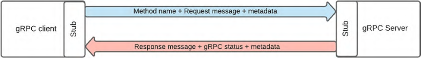
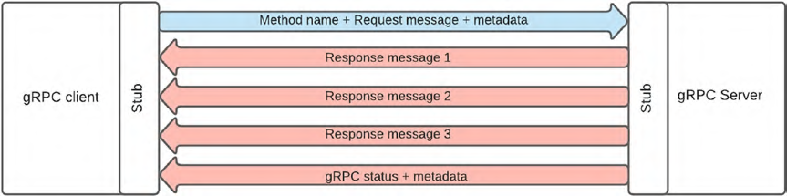
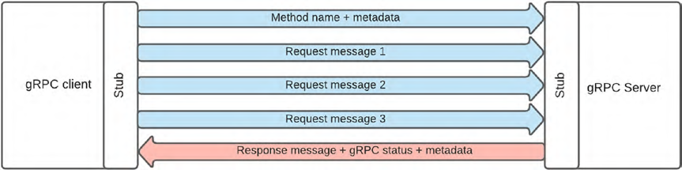
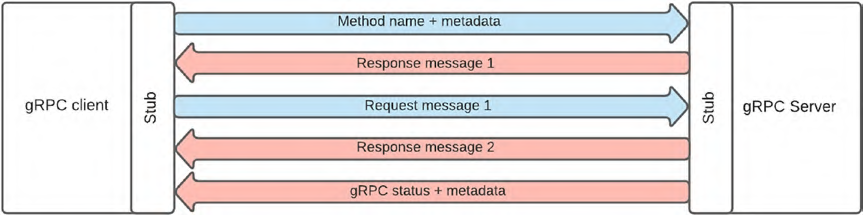
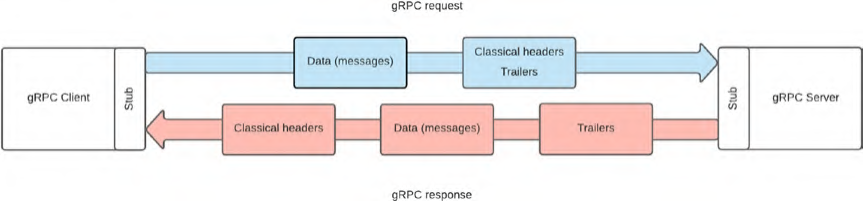
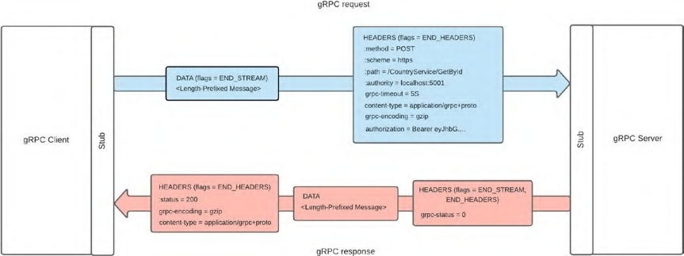
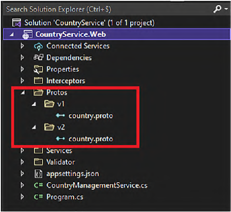
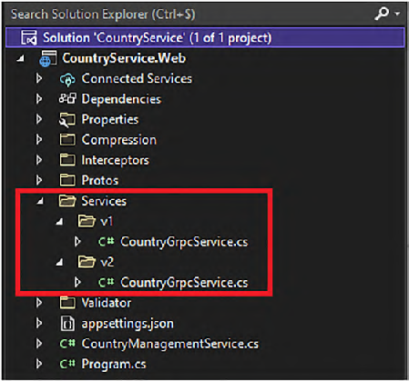
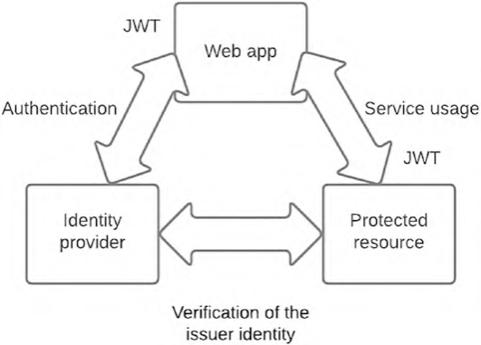

# Beginning gRPC with ASP.NET Core 6

[https://github.com/Apress/beg-grpc-w-asp.net-core-6](https://github.com/Apress/beg-grpc-w-asp.net-core-6)  
[https://github.com/grpc/grpc/blob/master/src/csharp/BUILD-INTEGRATION.md](https://github.com/grpc/grpc/blob/master/src/csharp/BUILD-INTEGRATION.md)

## Содержание

- [Chapter 2. Введение в ASP.NET Core 6](#ch2)
    - [ASP.NET Core gRPC](#ch2-1)
- [Chapter 3. Введение в спецификацию gRPC](#ch3)
    - [Введение в RPC](#ch3-1)
    - [Концепция gRPC](#ch3-2)
        - [Protobuf](#ch3-2-1)
        - [gRPC Channel](#ch3-2-2)
        - [Типы gRPC сервисов](#ch3-2-3)
        - [Статусы gRPC](#ch3-2-5)
        - [Deadline и Cancelation](#ch3-2-6)
        - [Запросы и ответы по HTTP/2](#ch3-2-7)
    - [Введение в протокол HTTP/2](#ch3-3)
    - [Преимущества, недостатки и варианты использования](#ch3-4)
- [Chapter 4. Protobuf](#ch4)
    - [Индивидуальные определения](#ch4-1)
    - [Определение сервиса](#ch4-2)
    - [Определение сообщения](#ch4-3)
        - [Скалярные типы значений](#ch4-3-1)
        - [Коллекции](#ch4-3-2)
            - [Списки](#ch4-3-2-1)
            - [Словари](#ch4-3-2-2)
        - [Перечисления](#ch4-3-3)
        - [Вложенные типы](#ch4-3-4)
        - [Импорт типов](#ch4-3-5)
        - [Any, Value, Wrappers, даты, время (предопределенные типы)](#ch4-3-6)
            - [Any](#ch4-3-6-1)
            - [Wrappers](#ch4-3-6-2)
            - [Value](#ch4-3-6-3)
            - [Дата и время](#ch4-3-6-4)
        - [Байты](#ch4-3-7)
        - [One Of](#ch4-3-8)
        - [Пустое сообщение](#ch4-3-9)
        - [Комментарии](#ch4-3-10)
- [Chapter 5. Создание ASP.NET Core gRPC приложения](#ch5)
    - [Создание gRPC приложения](#ch5-1)
    - [gRPCurl](#ch5-2)
    - [gRPCui](#ch5-3)
    - [TLS сертификаты](#ch5-4)
    - [Обработка ошибок, обработка ответа, логирование](#ch5-4)
    - [Валидация сообщений](#ch5-5)
    - [Поддержка ASP.NET Core gRPC](#ch5-6)
- [Chapter 6. Версионирование API](#ch6)
    - [Версионирование](#ch6-1)
    - [Регистрация версий Protobuf с помощью ASP.NET Core Minimal API](#ch6-2)
- [Chapter 7. Создание gRPC клиента](#ch7)
    - [Создание приложения, компиляция Protobuf-файлов](#ch7-1)
    - [Вызов gRPC-функций](#ch7-2)
    - [Оптимизация производительности](#ch7-3)
        - [Преимущества сжатия](#ch7-3-1)
        - [Определение лимита размера сообщения](#ch7-3-2)
        - [Сохранение соединения HTTP/2 открытым](#ch7-3-3)
        - [Увеличение максимального числа HTTP/2 соединений](#ch7-3-4)
        - [Получение сообщений с ошибками валидации от сервера](#ch7-3-5)
- [Chapter 8. С WCF на gRPC](#ch8)
    - [Общее и различия в WCF и gRPC](#ch8-1)
- [Chapter 9. Импорт и отображение данных с помощью ASP.NET Core Razor Pages, Hosted Services и gRPC](#ch9)
- [Chapter 10. Спецификация gRPC-web](#ch10)
    - [Спецификация gRPC-web](#ch10-1)
    - [gRPC-web javascript библиотеки](#ch10-2)
    - [gRPC-web vs REST API](#ch10-3)
- [Chapter 11. gRPC-web сервис на ASP.NET Core](#ch11)
    - [gRPC-web с экосистемой .NET](#ch11-1)
        - [gRPC-web и ASP.NET Core 6](#ch11-1-1)
        - [gRPC-web и все .NET клиенты](#ch11-1-2)
        - [gRPC-web и клиенты ASP.NET Core 3+](#ch11-1-3)
    - [Переработка CountryService для приложения браузера](#ch11-2)
    - [Поддержка ASP.NET Core gRPC-web в Microsoft Azure](#ch11-3)
- [Chapter 12. Импорт и отображение данных с Angular 12 и gRPC-web](#ch12)
    - [Генерация заглушек TypeScript с Protoc](#ch12-1)
    - [Доступ к данным с помощью Improbable клиента по gRPC-web](#ch12-2)
    - [Загрузка файла, отображение данных с помощью TypeScript, Web Worker и gRPC-web](#ch12-3)
    - [Управление данными с помощью TypeScript и gRPC-web](#ch12-4)
- [Chapter 13. Защита приложений с OpenID](#ch13)
    - [Введение в OpenID Connect](#ch13-1)
    - [Конфигурация ASP.NET Core](#ch13-2)
    - [Работа gRPCurl и gPRCui с JWT](#ch13-3)
        - [gRPCurl](#ch13-3-1)
        - [gRPCui](#ch13-3-1)
    - [Использование C# клиента с JWT](#ch13-4)
    - [Использование gRPC-web клиента с JWT](#ch13-5)
    - [Получение данных о текущем пользователе на стороне сервера](#ch13-6)
- [Приложение](#appendix)
    - [Что нового в Grpc .Net Core 9](#appendix-1)
    - [Локальная отладка](#appendix-2)

## <a id="ch2">Chapter 2. Введение в ASP.NET Core 6</a>

### <a id="ch2-1">ASP.NET Core gRPC</a>

gRPC - Google Remote Procedure Call, open-source, schema-first протокол, который использует преимущества HTTP/2 по пересылке сообщений в бинарном виде. Сообщения сериализуются и десериализуются с использованием Protocol Buffers (Protobuf), который является разновидностью Interface Definition Language (IDL).

## <a id="ch3">Chapter 3. Введение в спецификацию gRPC</a>

### <a id="ch3-1">Введение в RPC</a>

В RPC (Remote Procedure Call) клиент вызывает функцию - серверную процедуру с параметрами. Когда сервер отрабатывает процедуру, он отправляет ответ обратно клиенту. Клиент ждет ответа от сервера и не может выполнять другие операции.

Отличие RPC API от REST API (оба протокола работают поверх HTTP):

* В RPC API функционал сущеностей (например, создание, удаление) предоставляются как процедуры или функции, которые имеют входные параметры и возвращают ответ. У них нет привязок к методам HTTP (get, post и т.д.) и url-ам.
* В REST API сущность рассматривается как ресурс и использует методы HTTP и url-ы для управления ресурсом. Соглашение RESTful предписывает разработчикам использовать методы HTTP для заданных ситуаций (как правило CRUD операции). REST также определяет использование кодов статусов запроса.

### <a id="ch3-2">Концепция gRPC</a>

#### <a id="ch3-2-1">Protobuf</a>

Клиент gRPC знает о доступных процедурах/функциях и их входных/выходных параметрах через реализацию контракта Protobuf на клиенте и сервере (аналог WSDL для SOAP).

Контракт Protobuf сохраняется в файле .proto, например:

```protobuf
syntax = "proto3";

service CountryService {
    rpc GetById (CountrySearchRequest) returns (CountryReply) {}
}

message CountrySearchRequest {
    int32 CountryId = 1;
}

message CountryReply {
    int32 Id = 1;
    string Name = 2;
    string Description = 3;
}
```

#### <a id="ch3-2-2">gRPC Channel</a>

Любой запрос к gRPC серверу с любого клиента выполняется через канал. Для инициализации gRPC канала необходима следующая информация:

* адрес удаленного хоста
* порт
* креды для соединения

Канал поддерживает конфигурацию кредов для соединения с сервером и настройку кредов для каждого RPC запроса к серверу. Поддерживаются три типа соединения:

* SSL/TLS (Secure Sockets Layer/Transport Layer Security): криптографические протоколы, которые шифруют данные и аутентифицируют соединение при пересылки данных через интернет. Необходимо установить на веб сервере SSL/TLS сертификат, который содержит открытый и закрытый ключи, аутентифицирует сервер и позволяет шифровать/расшифровывать данные.
* ALTS (Application Layer Transport Security): протокол аутентификации и шифрования, разработанный Google на основе системы обмена ключей Diffie-Hellman. Похож на TLS, требует для сервера и клиента установки сертификата.
* Token-based authentication: основан на использовании JWT, содержащим информацию о текущем пользователе и выпущенным сторонним identity провайдером, а не самим приложением. Инициатор запроса запрашивает у сервера токен, затем передает его в заголовке HTTP-запроса. Клиент валидирует подлинность токена чтением метаданных, предоставленных сторонним identity-провайдером, проверяется цифровая подпись полученного токена (что данный токен пришел действительно от данного поставщика). Данный тип аутентификации наиболее распространен в веб приложениях.

В большинстве случаев креды для каждого RPC запроса к серверу конфигурируются самим вызовом, особенно при использовании токенов. В реализации gRPC для .NET, Microsoft инкапсулировала это в реализацию клиента gRPC. Разработчику достаточно добавить JWT в заголовок запроса при вызове процедуры.

Канал поддерживает опцию максимального количества переданных или принятых сообщений. Подробнее о доступных опциях настройки gRPC: [https://grpc.github.io/grpc/core/group__grpc__arg__keys.html](https://grpc.github.io/grpc/core/group__grpc__arg__keys.html).

Пример создания канала на C# с использованием кастомного сертификата и опции ограничения размера принимаемого сообщения в 5 МБ. Затем этот канал используется для генерации клиента (заглушки), который будет автоматически сгенерирован из контракта protobuf.

```c#
var channel = new Channel("https://localhost:5001", new SslCredentials("myCertificate.pem"), new [] {
    new ChannelOption("grpc.max_receive_message_length","5242880") // 5 MB
});
var countryClient = new CountryServiceClient(channel);
```

Тот же самый канал без шифрования и аутентификации:

```c#
var channel = new Channel("https://localhost:5001", ChannelCredentials.Insecure, new [] {
    new ChannelOption("grpc.max_receive_message_length","5242880") // 5 MB
});
var countryClient = new CountryServiceClient(channel);
```

Во время использования канала можно проверять его статус (свойство State), принимает следующие значения:

* Idle
* Connecting (к удаленному серверу)
* Ready (для обработки RPC)
* TransientFailure - произошла ошибка, но не фатальная, канал может быть переиспользован, когда вернется в статус Ready после вызова ConnectAsync на клиенте
* Shutdown - произошла фатальная ошибка или канал был выключен программно

#### <a id="ch3-2-3">Типы gRPC сервисов</a>

[https://habr.com/ru/companies/otus/articles/780720/](https://habr.com/ru/companies/otus/articles/780720/)  
[https://learn.microsoft.com/ru-ru/aspnet/core/grpc/client?view=aspnetcore-8.0](https://learn.microsoft.com/ru-ru/aspnet/core/grpc/client?view=aspnetcore-8.0)

* Unary - клиент инициирует удаленный запрос процедуры с заданным именем метода, метаданными и сообщением запроса, сервер возвращает ответ с gRPC статусом, сообщением ответа и метаданными. Самый простой тип запроса, аналогичный REST.



* Server-streaming - клиент отправляет один запрос, сервер начинает отправлять поток ответов. Клиент читает ответы, что может продолжаться неопределенное время. Статус gRPC и метаданные отправляются, когда все данные были переданы клиенту.



* Client-streaming - В этой модели клиент отправляет поток данных серверу. После завершения отправки потока клиент ожидает ответ от сервера. Сервер обрабатывает весь поток данных, прежде чем отправить один ответ. Этот тип подходит для сценариев, где клиенту необходимо отправить большое количество данных или серию сообщений, например, при загрузке больших файлов или пакетной обработке данных. Однако сервер может вернуть статус и метаданные до того, как клиент закончит передачу. Это может произойти при ошибке на стороне сервера, такие случаи могут вызвать сложности с определением причины ошибки.



* Bidirectional-streaming - В двунаправленном потоковом RPC клиент и сервер обмениваются потоками данных в обоих направлениях. Клиент может начать отправку серии сообщений, не дожидаясь ответов сервера, и наоборот. Этот тип RPC наиболее гибкий и подходит для сложных взаимодействий, где клиент и сервер должны активно обмениваться данными в реальном времени.



#### <a id="ch3-2-4">Трейлеры</a>

gRPC позволяет использовать метаданные в виде трейлеров. Трейлеры - это заголовки HTTP, но работают иначе. В gRPC-запросе заголовки (Headers) и трейлеры (Trailers) передаются перед данными сообщения. В gRPC-ответе заголовки передаются перед данными сообщения, а трейлеры после с gRPC-статусом (это не тоже самое что HTTP статус, но похоже). При потоковой передаче методанные передаются после передачи данных.



#### <a id="ch3-2-5">Статусы gRPC</a>

Трейлеры - метаданные, содержат всю дополнительную иноформацию, но необязательные. Статус в ответе на gRPC запрос является обязательным.

| Код | Число | Описание |
|-----|-------|----------|
| OK | 0 | Success. |
| CANCELLED | 1 | The operation was cancelled. |
| UNKNOWN | 2 | Unknown error. |
| INVALID_ARGUMENT | 3 | The client specified an invalid argument. |
| DEADLINE_EXCEEDED | 4 | The deadline expired before the operation could complete. |
| NOT_FOUND | 5 | The requested entity was not found. |
| ALREADY_EXISTS | 6 | The entity already exists. |
| PERMISSION_DENIED | 7 | The caller doesn’t have the required permission. |
| RESOURCE_EXHAUSTED | 8 | The requested resource has been exhausted. |
| FAILED_PRECONDITION | 9 | A precondition has failed. |
| ABORTED | 10 | The operation was aborted. |
| OUT_OF_RANGE | 11 | An invalid argument causes that exception during its cast. |
| UNIMPLEMENTED | 12 | The operation is not implemented. |
| INTERNAL | 13 | Internal error. |
| UNAVAILABLE | 14 | The service is currently unavailable. |
| DATA _LOSS | 15 | Unrecoverable data loss or corruption. |
| UNAUTHENTICATED | 16 | The request does not have valid authentication credentials for the operation. |

#### <a id="ch3-2-6">Deadline и Cancelation</a>

По аналогии с REST запросу gRPC может быть назначен тайм-аут, в спецификации он же называется Deadline. Если наступает Deadline, клиент отправляет DEADLINE_EXCEEDED, сервер прекращает запрос, в экосистеме .NET при этом на сервере формируется Cancelation token.

Если Deadline не указан (значение по умолчанию), запрос обрабатывается столько сколько потребуется.

#### <a id="ch3-2-7">Запросы и ответы по HTTP/2</a>

* gRPC использует классические заголовки HTTP
* использует специфичные заголовки, котрые называются трейлерами
* ответ, содержащий gRPC статус в трейлере, информирует о результате выполнения запроса
* ответ кодируется в бинарном виде
* обмен выполняется по TLS (HTTPS), можно без TLS, но это не рекомендуется
* используются POST запросы
* заголовок Content-Type: "application/grpc", "application/grpc+proto", "application/grpc+json"
* заголовок Authority содержит доменное имя сервера
* заголовок Path содержит RPC URI
* HTTP статус ответа всегда 200 OK, когда сервер начал обрабатывать запрос, может быть 503 Server Unavailable по причине недоступности

https://github.com/grpc/grpc/blob/master/doc/PROTOCOL-HTTP2.md



В примере CountryService хоститься на локальной машине, используя порт 5001. Deadline - 5 секунд. Аутентификация использует JWT. Сжатие на GZIP. Запрос выполняется успешно.

В запросе флаг end of stream (EOS, END_STREAM), установленный в фрейме DATA означает, что больше данных передаваться не будет, при потоковой передаче, он устанавливается в последнем блоке. Флаг end of headers (EOH, END_OF_HEADERS), означает, что все заголовки были переданы на сервер.

В ответе EOH означает тоже самое. Последний трейлер, отправляемый клиенту что больше нет ни данных ни заголовков для передачи.

И в ответе и в запросе используется сообщение с предопределенной длиной.

### <a id="ch3-3">Введение в протокол HTTP/2</a>

Основной целью HTTP/2 (2015), приходящим на сменую HTTP/1.1 (1999), является увеличение производительности и устойчивости работы сетевого HTTP протокола за счет новых стратегий доставки данных: 

* Мультиплексирование - использование одного соединения между клиентом и сервером для нескольких запросов, в HTTP/1 для каждого запроса устанавливалось отдельное соединение.
* Сжатие и бинарная передача данных - gRPC уже использует сжатие, HTTP/2 использует сжатие заголовков.
* Использование приоритетов для запросов (flow control).
* Поддержка проактивных push-уведомлений со стороны сервера (server push) - не поддерживается в gRPC.

### <a id="ch3-4">Преимущества, недостатки и варианты использования</a>

За счет бинарного формата данных gRPC более производительный и в отличии от REST поддерживает двунаправленную потоковую передачу. Основной недостаток - слабая поддержка браузерами и невозможность отладки в браузере (gRPC-web, описанный ниже позволяет обходить несовместимость с браузерами). Другой недосток - недоступность кеширования в браузере, однако, здесь используется другой подход - кеширование in-memory.

| | gRPC | REST | SOAP |
|-|------|------|------|
| Browser support | No | Yes | No |
| HTTP/2 support | Yes | Yes | Yes |
| Human readability | No | Yes | Yes |
| Exchange format | Binary | JSON/XML | XML |
| Performance | High | Medium | Low |
| Caching | No | Yes | No |
| Bidirectional streaming | Yes | No | Yes |

На основе особенностей gRPC наиболее удачно подходит в следующих сценариях.

* API to API (backend to backend), браузер не используется.
* Монолитное приложение в SOA, браузер не используется.
* Фоновые задания с подключением к одному или более веб-сервису.
* Клиент взаимодействует с одним REST API, который выступает как прокси, за которым стоит несколько веб-сервисов.

## <a id="ch4">Chapter 4. Protobuf<a>

Protobuf - протокол сериализации структурированных данных. Не поддерживает наследования. Файл Protobuf содержит три основные секции:

* Индивидуальные определения (individual declarations)
* Определения сервисов
* Определения сообщений

### <a id="ch4-1">Индивидуальные определения</a>

Обязательно указывать версию синтаксиса, используемую в файле, например, на момент выхода книги:

* Proto3
* Proto2
* Proto1 (deprecated)

```proto
syntax = "proto3"
```

Допустимо указывать неймспейсы для сервисов и сообщений, используя ключевое слово `package` (необязательно). Например файл

```proto
syntax = "proto3";

package gRPCDemo.v1;
```

сгенерирует два файла - один для сообщений и один для сервисов. Файл для сообщений будет выглядеть примерно так:

```c#
// <auto-generated>
// Generated by the protocol buffer compiler. DO NOT EDIT!
// source: Protos/country.proto
// </auto-generated>
#pragma warning disable 1591, 0612, 3021
#region Designer generated code
using pb = global::Google.Protobuf;
using pbc = global::Google.Protobuf.Collections;
using pbr = global::Google.Protobuf.Reflection;
using scg = global::System.Collections.Generic;
namespace GRPCDemo.V1 {
    /// <summary>Holder for reflection information generated from Protos/country.proto</summary>
    public static partial class CountryReflection {
        #region Descriptor
        /// <summary>File descriptor for Protos/country.proto</summary>
        public static pbr::FileDescriptor Descriptor {
            get { return descriptor; }
        }
        private static pbr::FileDescriptor descriptor;

        static CountryReflection() {
            byte[] descriptorData = global::System.Convert.FromBase64String(
                string.Concat("ChRQcm90b3MvY291bnRyeS5wcm90bxILZ1JQQ0RlbW8udjFiBnByb3RvMw=="));
            descriptor = pbr::FileDescriptor.FromGeneratedCode(descriptorData,
                new pbr::FileDescriptor[] { },
                new pbr::GeneratedClrTypeInfo(null, null, null));
        }
        #
    }
}
```

Сообщение еще не объявлено, но файл уже содержит код, необходимый для отображения информации (FileDescriptor и CountryReflection - см. раздел Any в этой главе).

В отличии от C# в определениях protobuf недопускается использование символов '-', '?'.

Слово `package` необязательно, однако рекомендуется его использовать, иначе объекты будут в глобальном неймспейсе.

Опция `csharp_namespace` также позволяет определять неймспейс для классов C#. Наименование package в этом случае продолжит использоваться для наименования сервиса, URL'а по которому будет вызываться удаленная процедура. Ниже пример использования опции `csharp_namespace`, в файле C# удалена часть кода автогенерации для наглядности.

```protobuf
syntax = "proto3";

package gRPCDemo.v1;

option csharp_namespace = "Apress.Sample.gRPC";

service CountryService {
    rpc GetById (CountrySearchRequest) returns (CountryReply) {}
}
```

```C#
// <auto-generated>
// Generated by the protocol buffer compiler. DO NOT EDIT!
// source: Protos/country.proto
// </auto-generated>
#pragma warning disable 0414, 1591
#region Designer generated code
using grpc = global::Grpc.Core;
namespace Apress.Sample.gRPC {
    public static partial class CountryService
    {
        static readonly string __ServiceName = "gRPCDemo.v1.CountryService";
    }
}
#endregion
```

Если наименование пакета не указано, свойство __ServiceName будет иметь значение "CountryService".

Полный список опций: https://protobuf.dev/programming-guides/proto3/#options

### <a id="ch4-2">Определение сервиса</a>

В этой секции определяется название сервиса, его процедуры и параметры. Перед названием сервиса идет ключевое слово `service`, после перечисление всех функций в фигурных скобках:

```protobuf
service ServiceName {
    rpc FunctionName1 (InputMessage1) returns (OutputMessage1) {}
    rpc FunctionName2 (InputMessage2) returns (OutputMessage2) {}
}
```
Определение функции содержит ключевое слово `rpc`, название функции, имя входного сообщения в круглых скобках, имя выходного сообщения в круглых скобках после `returns`. Если сервис принимает или отправляет потоковые сообщения перед названием сообщения добавляется слово `stream`:

```protobuf
service ServiceName {
    rpc UnaryFunction (InputMessage1) returns (OutputMessage1) {}
    rpc ClientStreamingFunction (stream InputMessage2) returns (OutputMessage2) {}
    rpc ServerStreamingFunction (InputMessage3) returns (stream OutputMessage3) {}
    rpc BidirectionalStreamingFunction (stream InputMessage4) returns (stream OutputMessage4) {}
}
```

Например, для protobuf:

```protobuf
service CountryService {
    rpc GetById(CountryByIdRequest) returns (CountryReply) {}
    rpc Delete(stream CountryRequest) returns (CountryDeletionReply) {}
    rpc Search(CountrySearchRequest) returns (stream CountryReply) {}
    rpc Create(stream CountryCreateRequest) returns (stream CountryCreationReply) {}
}
```

Будет создан абстрактный класс:

```c#
/// <summary>Base class for server-side implementations of CountryService</
summary>
[grpc::BindServiceMethod(typeof(CountryService), "BindService")]
public abstract partial class CountryServiceBase
{
    public virtual global::System.Threading.Tasks.Task<global::Apress.Sample.gRPC.CountryReply> GetById(global::Apress.Sample.gRPC.CountryByIdRequest request, grpc::ServerCallContext context)
    {
        throw new grpc::RpcException(new grpc::Status(grpc::StatusCode.Unimplemented, ""));
    }
    public virtual global::System.Threading.Tasks.Task<global::Apress.Sample.gRPC.CountryDeletionReply> Delete(grpc::IAsyncStreamReader<global::Apress.Sample.gRPC.CountryRequest> requestStream, grpc::ServerCallContext context)
    {
        throw new grpc::RpcException(new grpc::Status(grpc::StatusCode.Unimplemented, ""));
    }
    public virtual global::System.Threading.Tasks.Task Search(global::Apress.Sample.gRPC.CountrySearchRequest request, grpc::IServerStreamWriter<global::Apress.Sample.gRPC.CountryReply> responseStream, grpc::ServerCallContext context)
    {
        throw new grpc::RpcException(new grpc::Status(grpc::StatusCode.Unimplemented, ""));
    }
    public virtual global::System.Threading.Tasks.Task Create(grpc::IAsyncStreamReader<global::Apress.Sample.gRPC.CountryCreateRequest> requestStream, grpc::IServerStreamWriter<global::Apress.Sample.gRPC.CountryCreationReply> responseStream, grpc::ServerCallContext context)
    {
        throw new grpc::RpcException(new grpc::Status(grpc::StatusCode.Unimplemented, ""));
    }
}
```

Исключения, создаваемые в процессе обработки gRPC-запросов имеют специальный класс - RpcException.

### <a id="ch4-3">Определение сообщения</a>

Синтаксис определения сообщения поддерживает:

* [Скалярные типы значений](#ch4-3-1)
* [Коллекции (repeated, map)](#ch4-3-2)
* [Перечисления (enum)](#ch4-3-3)
* [Вложенные типы](#ch4-3-4)
* [Импорт типов (import)](#ch4-3-5)
* [Any, Value, Wrapper, даты, время (предопределенные типы)](#ch4-3-6)
* [Байты](#ch4-3-7)
* [One Of](#ch4-3-8)
* [Пустые сообщения](#ch4-3-9)
* [Комментарии](#ch4-3-10)

Не поддерживает:

* Наследование сообщений
* Валидацию сообщений, proto3 синтаксис (в отличии от proto2), не позволяет определять верификацию. Это должно быть реализовано на стороне клиента или gRPC сревера.
* Отсутствие сообщения как параметра функции. Т.е. даже если нет необходимости передавать какие-либо данные в функцию, или возвращать в ответе, обязательно нужно создать пустое сообщение без свойств.

Все сообщения определяются ключевым словом `message` и каждое свойство *опциональное* по умолчанию. Каждому сообщению должно быть присвоена позиция, необходимая для сериализации/десериализации и она должна быть уникальна. Каждое сгенерированное сообщение наследуется от интерфейса IMessage<T>.

```protobuf
syntax = "proto3";

package gRPCDemo.v1;

option csharp_namespace = "Apress.Sample.gRPC";

message CountryReply {
    int32 Id = 1;
    string Name = 2;
    string Description = 3;
}
```

#### <a id="ch4-3-1">Скалярные типы значений</a>

| Protobuf тип | C# тип | C# дефолтное значение |
|--------------|--------|-----------------------|
| double | double   | 0 |
| float | float   | 0 |
| int32 | int   | 0 |
| int64 | long   | 0 |
| uint32  | uint   | 0 |
| uint64  | ulong   | 0 |
| sint32  | int   | 0 |
| sint64  | long   | 0 |
| fixed32 | unit   | 0 |
| fixed64 | ulong   | 0 |
| sfixed32 | int   | 0 |
| sfixed64 | long   | 0 |
| bool | bool | false |
| string | string | string.Empty |
| bytes | ByteString | empty bytes |

#### <a id="ch4-3-2">Коллекции</a>

Поддерживаются следующие виды списков:

* Списки
* Словари

##### <a id="ch4-3-2-1">Списки</a>

Для обозначения списков используется ключевое слово `repeated`, например:

```protobuf
syntax = "proto3";

package gRPCDemo.v1;

option csharp_namespace = "Apress.Sample.gRPC";

message CountrySearchRequest {
    repeated int32 CountryIds = 1;
}
```

Результат C#:

```c#
public const int CountryIdsFieldNumber = 1;
private static readonly pb::FieldCodec<int> _repeated_countryIds_codec = pb::FieldCodec.ForInt32(10);
private readonly pbc::RepeatedField<int> countryIds_ = new pbc::RepeatedField<int>();
[global::System.Diagnostics.DebuggerNonUserCodeAttribute]
public pbc::RepeatedField<int> CountryIds {
    get { return countryIds_; }
}
```

Класс RepeatedField реализует большинство стандартных интерфейсов коллекций C#, но в большинстве случаев используется как IList\<T\>.

```c#
using Apress.Sample.gRPC;
namespace Server
{
    public class Program
    {
        public static void Main(string[] args)
        {
            // Write
            var countrySearchRequest = new CountrySearchRequest();
            countrySearchRequest.CountryIds.Add(1);
            countrySearchRequest.CountryIds.Add(2);
            countrySearchRequest.CountryIds.Add(3);

            // Read
            foreach (var countryId in countrySearchRequest.CountryIds)
            {
                // code
            }
        }
    }
}
```

##### <a id="ch4-3-2-2">Словари</a>

Словари определяются с помощью ключевого слова `map<TKey, TValue>`:

```protobuf
syntax = "proto3";

package gRPCDemo.v1;

option csharp_namespace = "Apress.Sample.gRPC";

message CountryReply {
    map<int32, string> countries = 1;
}
```

```c#
public const int CountriesFieldNumber = 1;
private static readonly pbc::MapField<int, string>.Codec _map_countries_codec = 
    new pbc::MapField<int, string>.Codec(pb::FieldCodec.ForInt32(8, 0), pb::FieldCodec.ForString(18, ""), 10);
private readonly pbc::MapField<int, string> countries_ = new pbc::MapField<int, string>();

[global::System.Diagnostics.DebuggerNonUserCodeAttribute]
public pbc::MapField<int, string> Countries {
    get { return countries_; }
}
```

В коде MapField работает как словать C#.

```c#
using Apress.Sample.gRPC;
namespace Server;

// Write
var countryReply = new CountryReply();
countryReply.Countries.Add(1, "Canada");
countryReply.Countries.Add(2, "USA");
countryReply.Countries.Add(3, "Mexico");

// Read
foreach (var country in countryReply.Countries) // country: KeyValuePair<int, string>
{
    var countryId = country.Key;
    var CountryName = country.Value;
}
```

#### <a id="ch4-3-3">Перечисления</a>

Используют ключевое слово enum, синтаксис аналогичен C#. Номера значений (0...6) содержат коды перечисления, а не позицию для сериализации/десериализации. Коды должны начинаться с 0, значение 0 - значение по умолчанию.

```protobuf
syntax = "proto3";

package gRPCDemo.v1;

option csharp_namespace = "Apress.Sample.gRPC";

message CountryReply {
    int32 CountryId = 1;
    Continent Continent = 2;
}

enum Continent {
    Unknown = 0;
    NorthAmerica = 1;
    SouthAmerica = 2;
    Europe = 3;
    120
    Africa = 4;
    Asia = 5;
    Australia = 6;
}
```

```c#
public enum Continent {
    [pbr::OriginalName("Unknown")] Unknown = 0,
    [pbr::OriginalName("NorthAmerica")] NorthAmerica = 1,
    [pbr::OriginalName("SouthAmerica")] SouthAmerica = 2,
    [pbr::OriginalName("Europe")] Europe = 3,
    [pbr::OriginalName("Africa")] Africa = 4,
    [pbr::OriginalName("Asia")] Asia = 5,
    [pbr::OriginalName("Australia")] Australia = 6,
    [pbr::OriginalName("Oceania", PreferredAlias = false)] Oceania = 6,
}
```

Спецификация позволяет резервировать значения перечислений, однако лучше выпустить новую версию API.

#### <a id="ch4-3-4">Вложенные типы</a>

Поддерживается вложение определений одних сообщений в другие:

```protobuf
syntax = "proto3";

package gRPCDemo.v1;

option csharp_namespace = "Apress.Sample.gRPC";

message CountryReply {
    message Continent {
        string Name = 1;
    }
    int32 CountryId = 1;
    Continent continent = 2; // Not working if Continent property name declared with the same case of its type
}
```

#### <a id="ch4-3-5">Импорт типов</a>

Синтаксис поддерживает импорт типов, объявленных во внешних файлах с помощью ключевого слова `import` и пути к файлу. Путь должен быть относительным для каталога, где располагаются исполняемые файлы при компиляции с помощью Protocol Buffer Compiler (*Protoc*). Также путь может быть настроен, в главе 12 будет рассматриваться ручное выполнение Protoc, в главах 5 и 7 - в составе Visual Studio.

```protobuf
syntax = "proto3";

package gRPCDemo.v1;

option csharp_namespace = "Apress.Sample.gRPC";

import "Protos/continent.proto";

message CountryReply {
    int32 CountryId = 1;
    Continent continent = 2;
}
```

Примечание. Как правило, путь в директиве import должен начинаться от каталога проекта, в котором располагаются proto-файлы. Если импортируемый proto-файл располагается в другом проекте, ссылка регистрируется в виде: `<Protobuf Include="..\ДругойПроект\Protos\file.proto" Link="Protos\file.proto" GrpcServices="Server" />`. Для управление proto-ссылками в проекте также можно использовать `dotnet-grpc`.

#### <a id="ch4-3-6">Any, Value, Wrappers, дата и время (предопределенные типы)</a>

Any, Value, Wrapper, дата и время - типы, которые имеют особое поведение и требуют специальной обработки. Они не могут быть скомпилированы как есть в C#. Поэтому Google предоставляет специальные proto-файлы которые должны быть добавлены и во время компиляции, .NET интерпретирует их с C# расширением, которое известно как расширение Protobuf's Well-Known Types.

##### <a id="ch4-3-6-1">Any</a>

Поле Any - нестрого типизированное поле. Может быть любым типом сообщения, но не примитивным типом.

Чтобы объявить поле с типом Any (google.protoguf.Any) для начала нужно выполнить импорт файла "google/protobuf/any.proto". Нет необходимости иметь файл физически на машине, для Protoc он известен как "глобальная переменная".

```protobuf
syntax = "proto3";

package gRPCDemo.v1;

option csharp_namespace = "Apress.Sample.gRPC";

import "google/protobuf/any.proto";

message CountryReply {
    int32 CountryId = 1;
    google.protobuf.Any Whatever = 2; // Could be Continent type or could be something
}
```

Как упоминалось в начале главы при компиляции сообщения, C# класс будет содержать поле FileDescription. Поле содержит Base64 строку с подписью всех типов, используемых в сообщении. Подпись генерируется на основе каждого имени сообщения и его свойств, делая подпись уникальной в пределах неймспейса. FileDescriptor - массив из объектов GeneratedClrTypeInfo. Доступ к подписи (описанию) можно получить через специальное статическое поле. Описание позволяет получить доступ к полю с типом Any, например:

```c#
using Apress.Sample.gRPC;

using Google.Protobuf.WellKnownTypes;

namespace Server;

// Write
var country = new CountryReply();
country.Whatever = Any.Pack(new Continent
{
    ContinentId = 1,
    ContinentName = "North America"
});

// Read
Continent continent;
if (country.Whatever.Is(Continent.Descriptor))
{
    continent = country.Whatever.Unpack<Continent>();
}
// OR
country.Whatever.TryUnpack(out continent);
```

##### <a id="ch4-3-6-2">Wrappers</a>

Nullable-типы C# не поддерживаются в Protobuf (они получают значения по умолчанию). Для работы с nullable-типами используются обертки (Well-Known Type wrappers).

| C# | Well-Known Type Wrapper |
|----|-------------------------|
| bool? | google.protobuf.BoolValue |
| double? | google.protobuf.DoubleValue |
| float? | google.protobuf.FloatValue |
| int? | google.protobuf.Int32Value |
| long? | google.protobuf.Int64Value |
| uint? | google.protobuf.UInt32Value |
| ulong? | google.protobuf.UInt64Value |
| string | google.protobuf.StringValue |
| ByteString | google.protobuf.BytesValue |

Чтобы использовать оберки необходимо импортировать "google/protobuf/wrappers.proto"

```protobuf
syntax = "proto3";

package gRPCDemo.v1;

option csharp_namespace = "Apress.Sample.gRPC";

import "google/protobuf/wrappers.proto";

message Continent {
    int32 ContinentId = 1;
    string ContinentName = 2;
    google.protobuf.BoolValue IsSeparatedByASea = 3;
}
```

```c#
...
    /// <summary>Field number for the "IsSeparatedByASea" field.</summary>
    public const int IsSeparatedByASeaFieldNumber = 3;
    private static readonly pb::FieldCodec<bool?> _single_isSeparatedByASea_codec = pb::FieldCodec.ForStructWrapper<bool>(26);
    private bool? isSeparatedByASea_;
    [global::System.Diagnostics.DebuggerNonUserCodeAttribute]
    public bool? IsSeparatedByASea {
        get { return isSeparatedByASea_; }
        set {
            isSeparatedByASea_ = value;
        }
    }
...
```

##### <a id="ch4-3-6-3">Value</a>

Позволяет передавать в сообщениях поля, которые не типизированы, например динамические объекты, а также коллекции и значения null. Необходимо импортировать "google/protobuf/struct.proto".

```protobuf
syntax = "proto3";

package gRPCDemo.v1;

option csharp_namespace = "Apress.Sample.gRPC";

import "google/protobuf/struct.proto";

message CountryReply {
    google.protobuf.Value CountryId = 1;
    google.protobuf.Value Continent = 2;
}
```

```c#
/// <summary>Field number for the "CountryId" field.</summary>
public const int CountryIdFieldNumber = 1;
private global::Google.Protobuf.WellKnownTypes.Value countryId_;
[global::System.Diagnostics.DebuggerNonUserCodeAttribute]
public global::Google.Protobuf.WellKnownTypes.Value CountryId {
    get { return countryId_; }
    set {
        countryId_ = value;
    }
}

/// <summary>Field number for the "Continent" field.</summary>
public const int ContinentFieldNumber = 2;
private global::Google.Protobuf.WellKnownTypes.Value continent_;
[global::System.Diagnostics.DebuggerNonUserCodeAttribute]
public global::Google.Protobuf.WellKnownTypes.Value Continent {
    get { return continent_; }
    set {
        continent_ = value;
    }
}
```

Для записи значений в поля Value доступны следующие методы:

| Type | Method | Comment |
|------|--------|---------|
| Number | Value.ForNumber | Поддерживает все .NET числовые типы |
| String | Value.ForString | |
| Objects | Value.ForStruct | Не эквивалентно структурам в C# |
| Boolean | Value.ForBool ||
| Null | Value.ForNull ||
| Collections | Value.ForList ||

Пример присвоение значений полю Value:

```c#
using Apress.Sample.gRPC;
using Google.Protobuf.WellKnownTypes;
using System;

namespace Server;

var country = new CountryReply();
country.CountryId = Value.ForNumber(1);
country.Continent = Value.ForStruct(new Struct
{
    Fields = {
        ["ContinentId"] = Value.ForNumber(1),
        ["ContinentName"] = Value.ForString("North America"),
        ["IsSeparatedByASea"] = Value.ForBool(false)
    }
});
```

Методы для чтения значений:

| Type | Method | Comment |
|------|--------|---------|
| Number | NumberValue | Возвращает значение .NET Double |
| String | StringValue | |
| Objects | StructValue | Доступ к полю структуры выполняется через свойство-словарь Fields |
| Boolean | BoolValue ||
| Null | NullValue ||
| Collections | ListValue ||

```c#
using Apress.Sample.gRPC;
using System;

namespace Server;

var country = new CountryReply(); // Received filled from a gRPC call

// Read
var countryModel = new CountryModel
{
    CountryId = Convert.ToInt32(country.CountryId.NumberValue),
    Continent = new ContinentModel
    {
        CountryId = Convert.ToInt32(country.Continent.StructValue.
        Fields["ContinentId"].NumberValue),
        ContinentName = country.Continent.StructValue.
        Fields["ContinentId"].StringValue,
        IsSeparatedByASea = country.Continent.StructValue.
        Fields["ContinentId"].BoolValue,
    }
};

public class CountryModel
{
    public int CountryId { get; set; }
    public ContinentModel Continent { get; set; }
}

public class ContinentModel
{
    public int CountryId { get; set; }
    public string ContinentName { get; set; }
    public bool IsSeparatedByASea { get; set; }
}
```

##### <a id="ch4-3-6-4">Дата и время</a>

Типы DateTimeOffset, DateTime и TimeSpan не имеют эквивалента в Protobuf, поэтому в нем реализованы Well-Known Types. Для работы с TimeSpan необходимо импортировать google/protobuf/duration.proto, для DateTimeOffset, DateTime - google/protobuf/timestamp.proto.

| .NET Тип | Protobuf Well-Known Type |
|----------|--------------------------|
| DateTimeOffset | google.protobuf.Timestamp |
| DateTime | google.protobuf.Timestamp |
| TimeSpan | google.protobuf.Duration |

```protobuf
syntax = "proto3";

package gRPCDemo.v1;

option csharp_namespace = "Apress.Sample.gRPC";

import "google/protobuf/duration.proto";
import "google/protobuf/timestamp.proto";

message FlightBooking {
    int32 BookingId = 1;
    google.protobuf.Duration FlightDuration = 2;
    google.protobuf.Timestamp DepartureTime = 3;
}
```

```c#
/// <summary>Field number for the "FlightDuration" field.</summary>
public const int FlightDurationFieldNumber = 2;
private global::Google.Protobuf.WellKnownTypes.Duration flightDuration_;
[global::System.Diagnostics.DebuggerNonUserCodeAttribute]
public global::Google.Protobuf.WellKnownTypes.Duration FlightDuration {
    get { return flightDuration_; }
    set {
        flightDuration_ = value;
    }
}

/// <summary>Field number for the "departureTime" field.</summary>
public const int DepartureTimeFieldNumber = 3;
private global::Google.Protobuf.WellKnownTypes.Timestamp departureTime_;
[global::System.Diagnostics.DebuggerNonUserCodeAttribute]
public global::Google.Protobuf.WellKnownTypes.Timestamp DepartureTime {
    get { return departureTime_; }
    set {
        departureTime_ = value;
    }
}
```

Пример работы с полями:

```c#
using Apress.Sample.gRPC;
using Google.Protobuf.WellKnownTypes;
using System;

namespace Server;

// Write
var flightBooking = new FlightBooking();
flightBooking.BookingId = 1;
flightBooking.FlightDuration = Duration.FromTimeSpan(new TimeSpan(2, 0, 0)); // 2h
flightBooking.DepartureTime = Timestamp.FromDateTime(DateTime.SpecifyKind(new DateTime(2021, 7, 1), DateTimeKind.Utc)); // July 1st 2021 or FromDateTimeOffset(DateTime.SpecifyKind(new DateTime(2021, 7, 1), DateTimeKind.Utc));

// Read
var bookingId = flightBooking.BookingId;
var bookingDuration = flightBooking.FlightDuration.ToTimeSpan();
var bookingDepartureTime = flightBooking.DepartureTime.ToDateTime(); // or ToDateTimeOffset()
```

#### <a id="ch4-3-7">Байты</a>

В следующем примере для передачи бинарных данных определено сообщение CountryImageUpload, содержащее поля FileName, MimeType, Content. Полезно сохранять MIME тип данных для дальнейшего использования в http.

```protobuf
syntax = "proto3";

package gRPCDemo.v1;

option csharp_namespace = "Apress.Sample.gRPC";

message CountryImageUpload {
    string FileName = 1;
    string MimeType = 2;
    bytes Content = 3;
}
```

```c#
/// <summary>Field number for the "FileName" field.</summary>
public const int FileNameFieldNumber = 1;
private string fileName_ = "";
[global::System.Diagnostics.DebuggerNonUserCodeAttribute]
public string FileName {
    get { return fileName_; }
    set {
        fileName_ = pb::ProtoPreconditions.CheckNotNull(value, "value");
    }
}

/// <summary>Field number for the "MimeType" field.</summary>
public const int MimeTypeFieldNumber = 2;
private string mimeType_ = "";
[global::System.Diagnostics.DebuggerNonUserCodeAttribute]
public string MimeType {
    get { return mimeType_; }
    set {
        mimeType_ = pb::ProtoPreconditions.CheckNotNull(value, "value");
    }
}

/// <summary>Field number for the "Content" field.</summary>
public const int ContentFieldNumber = 3;
private pb::ByteString content_ = pb::ByteString.Empty;
[global::System.Diagnostics.DebuggerNonUserCodeAttribute]
public pb::ByteString Content {
    get { return content_; }
    set {
        content_ = pb::ProtoPreconditions.CheckNotNull(value, "value");
    }
}
```

Пример использования:

```c#
using Apress.Sample.gRPC;
using Google.Protobuf;
using System.IO;
using System.Threading.Tasks;

namespace Server;

// Write
var uploadFile = new CountryImageUpload();
uploadFile.FileName = "Canada_flag.png";
uploadFile.MimeType = "image/png";
uploadFile.Content = ByteString.CopyFrom(File.ReadAllBytes("C:\\countries\\flags\\Canada_flag.png"));
uploadFile.Content = await ByteString.FromStreamAsync(new FileStream("C:\\countries\\flags\\Canada_flag.png", FileMode.Open)); // from Stream async
// uploadFile.Content = ByteString.FromStream(new FileStream("C:\\countries\\flags\\Canada_flag.png", FileMode.Open)); // from Stream
// uploadFile.Content = ByteString.FromBase64("MDExMTExMDAwMDAwMTEwMTAwMTAxMDEwMTAxMDEwMTAxMTAxMTAxMDA...."); // from base64 encoded file

// Read
var fileName = uploadFile.FileName;
var mimeType = uploadFile.MimeType;
var contentInBytes = uploadFile.Content.ToByteArray();
var contentInBase64 = uploadFile.Content.ToBase64();
var contentInStream = new MemoryStream();
uploadFile.Content.WriteTo(contentInStream);
```

#### <a id="ch4-3-8">One Of</a>

Функционал One Of дает возможность возвращать результат одним из нескольких предопределенных типов. Например, вместо исключения полезно передать тип, описывающий ошибку. В следующем примере в ответ на пользовательский запрос поиска страны по имени может быть возвращена информация о стране, о континенте (если пользователь случайно указал имя континента в запросе), или информация об ошибке, если ничего не было найдено.

```protobuf
syntax = "proto3";

package gRPCDemo.v1;

option csharp_namespace = "Apress.Sample.gRPC";

import "Protos/country.proto";
import "Protos/continent.proto";
import "Protos/error.proto";

message CountryOrContinentReply {
    oneof countryOrContinent {
        Country Country = 1;
        Continent Continent = 2;
        Error Error = 3;
    }
}
```

```protobuf
syntax = "proto3";

package gRPCDemo.v1;

option csharp_namespace = "Apress.Sample.gRPC";

message Country {
    int32 CountryId = 1;
    string CountryName = 2;
}
```

```protobuf
syntax = "proto3";

package gRPCDemo.v1;

option csharp_namespace = "Apress.Sample.gRPC";

message Continent {
    int32 ContinentId = 1;
    string ContinentName = 2;
}
```

```protobuf
syntax = "proto3";

package gRPCDemo.v1;

option csharp_namespace = "Apress.Sample.gRPC";

message Error {
    string SearchContent = 1;
    string Message = 2;
}
```

Опуская основную часть сгенерированного кода, можно выделить, что для каждого сообщения будет создан свой тип, а также перечисление, по которому можно определить значение какого типа получено в ответ.

```c#
/// <summary>Enum of possible cases for the "countryOrContinent" oneof.</summary>
public enum CountryOrContinentOneofCase {
    None = 0,
    Country = 1,
    Continent = 2,
    Error = 3,
}
```

Пример использования:

```c#
using Apress.Sample.gRPC;
using System;

namespace Server;

// Write
var countryOrContinentReply = new CountryOrContinentReply();
countryOrContinentReply.Continent = new Continent
{
    ContinentId = 1,
    ContinentName = "Americas"
};

// Read
switch (countryOrContinentReply.CountryOrContinentCase)
{
    case CountryOrContinentReply.CountryOrContinentOneofCase.Country:
        Console.Write("Country found.");
        break;
    case CountryOrContinentReply.CountryOrContinentOneofCase.Continent:
        Console.Write("Continent found.");
        break;
    case CountryOrContinentReply.CountryOrContinentOneofCase.Error:
        Console.Write("None of country or continent found");
        break;
    default:
        throw new ArgumentException("Unhandled response");
}
```

Подход One Of возвращает один из заданных типов, в отличии от использования Any (поле может содержать любой тип, реализующий IMessage), или Value (поддерживающее число, строку, структуру, булево, null и коллекцию).

#### <a id="ch4-3-9">Пустое сообщение</a>

Может возникнуть необходимость вызвать удаленную процедуру без передачи параметров. Однако Protobuf требует обязательную передачу параметра в функцию. В этом случае доступны два варианта:

* Создать сообственное сообщение без свойств
* Использовать Well-Known тип - Empty

Пример определения собственного пустого сообщения

```protobuf
syntax = "proto3";

package gRPCDemo.v1;

option csharp_namespace = "Apress.Sample.gRPC";

service CountryService {
    rpc GetAll(EmptyRequest) returns (CountriesReply) {}
}

message EmptyRequest {
}

message CountriesReply {
    repeated CountryReply = 1;
}

message CountryReply {
    int32 CountryId = 1;
    string CountryName = 2;
}
```

```c#
...
var emptyRequest = new EmptyRequest();
var countries = await countryClient.GetAllAsync(emptyRequest);
```

Пример использования Well-Known типа Empty. Необходимо импортировать путь "google/protobuf/Empty.proto", Protoc знает тип Empty, поэтому дополнительных действий не требуется.

```protobuf
syntax = "proto3";

package gRPCDemo.v1;

option csharp_namespace = "Apress.Sample.gRPC";

import "google/protobuf/Empty.proto";

service CountryService {
    rpc GetAll(google.protobuf.Empty) returns (CountryReplies) {}
}

message CountryReplies {
    repeated CountryReply = 1;
}

message CountryReply {
    int32 CountryId = 1;
    string CountryName = 2;
}
```

```c#
...
var emptyRequest = new Empty();
var countries = await countryClient.GetAllAsync(emptyRequest);
```

#### <a id="ch4-3-10">Комментарии</a>

Protobuf поддерживает использование комментариев аналогично C#:

```protobuf
/* Comment here */

// Comment here
```

Некоторые комментарии, сделанные в proto-файле с описанием сообщения, попадают в сгенерированный C# файл.

```protobuf
/*
Author: Anthony Giretti
Example for Apress book
*/
syntax = "proto3";

package gRPCDemo.v1;

option csharp_namespace = "Apress.Sample.gRPC";

// The Error message entity
message Error {
    string SearchContent = 1; // The initial search keyword
    string Description = 2; // The error description
}
```

```c#
/// <summary>
/// The Error message entity
/// </summary>
public sealed partial class Error : pb::IMessage<Error>
{
    /// <summary>Field number for the "SearchContent" field.</summary>
    public const int SearchContentFieldNumber = 1;

    private string searchContent_ = "";

    /// <summary>
    /// The initial search keyword
    /// </summary>
    [global::System.Diagnostics.DebuggerNonUserCodeAttribute]
    public string SearchContent {
        get { return searchContent_; }
        set {
            searchContent_ = pb::ProtoPreconditions.CheckNotNull(value, "value");
        }
    }

    /// <summary>Field number for the "Description" field.</summary>
    public const int DescriptionFieldNumber = 2;

    private string description_ = "";

    /// <summary>
    /// The error description
    /// </summary>
    [global::System.Diagnostics.DebuggerNonUserCodeAttribute]
    public string Description {
        get { return description_; }
        set {
            description_ = pb::ProtoPreconditions.CheckNotNull(value, "value");
        }
    }
}
```

## <a id="ch5">Chapter 5. Создание ASP.NET Core gRPC приложения</a>

### <a id="ch5-1">Создание gRPC приложения</a>

1. Создать проект на основе шаблона grpc (добавяться нужные зависимости).

2. В каталоге Protos добавить контракт сообщения как текстовый файл (в Rider можно добавить плагин, поддерживающий синтаксис Proto).

3. В proj файле проекта добавить вручную (в Rider можно выставить в свойствах файла), что текстовый файл компилируется как Protobuf. Можно настроить шаблон на выбор файлов (*) - подробнее здесь: https://github.com/grpc/grpc/blob/master/src/csharp/BUILD-INTEGRATION.md

4. Собрать проект, в каталоге \obj\Debug\net8.0\Protos должны появиться cs-файлы на основе контракта.

5. В каталоге Services добавить cs класс сервиса, Добавить статический неймспейс в начале файла:
`using static {csharp_namespace из proto}.{имя сервиса};`

6. Сделать новый сервис наследником от `{имя сервиса}Base`

7. Скопировать из базового класса все виртуальные методы, отредактировать:
- заменить virtual на override
- удалить неймспейс global::System.Threading.Tasks
- удалить неймспейс global::Google.Protobuf.WellKnownTypes (тип Empty) и добавить его один раз в начале файла с using
- удалить неймспейс global::Apress.Sample.gRPC, добавить через using
- удалить остатки неймспейса grpc:: (возможно потребуется добавить неймспейс Grpc.Core и т.п.)
- почистить global::
- добавить async перед Task
- удалить строки вида [System.CodeDom.Compiler.GeneratedCode("grpc_csharp_plugin", null)]

8. Добавить сервис в middleware UseEndpoints `app.MapGrpcService<CountryGrpcService>()`

### <a id="ch5-2">gRPCurl</a>

1. Добавить в приложение nuget-пакет Grpc.AspNetCore.Server.Reflection

2. В приложении зарегистрировать сервис и middleware:

```c#
var builder = WebApplication.CreateBuilder(args);
...
builder.Services.AddGrpcReflection();
...

var app = builder.Build();

app.MapGrpcReflectionService();
...
```

3. Поскольку gRPCurl написана на Go, потребуется локально также установить Go (https://golang.org/doc/install)

4. Скачать и установить последнюю версию gPRCurl, выполнить в PowerShell как админ:

```cmd
go get github.com/fullstorydev/grpcurl/...
go install github.com/fullstorydev/grpcurl/cmd/grpcurl@latest
```

можно скачать бинарники без установки: https://github.com/fullstorydev/grpcurl/releases

5. Проверка - запустить приложение, 

* запросить список сервисов (plaintext - по http)

```cmd
> grpcurl localhost:5174 list
> grpcurl -plaintext localhost:5174 list
```

* список функций

```
> grpcurl -plaintext localhost:5174 list gRPCDemo.v1.CountryService

gRPCDemo.v1.CountryService.Create

gRPCDemo.v1.CountryService.Delete

gRPCDemo.v1.CountryService.Get

gRPCDemo.v1.CountryService.GetAll

gRPCDemo.v1.CountryService.Update
```

* описание функции

```
> grpcurl -plaintext localhost:5174 describe gRPCDemo.v1.CountryService.Create

gRPCDemo.v1.CountryService.Create is a method:

rpc Create ( stream .gRPCDemo.v1.CountryCreationRequest ) returns ( stream .gRPCDemo.v1.CountryCreationReply );
```

* описание сервиса со всеми функциями

```
> grpcurl -plaintext localhost:5174 describe gRPCDemo.v1.CountryService

gRPCDemo.v1.CountryService is a service:

service CountryService {

  rpc Create ( stream .gRPCDemo.v1.CountryCreationRequest ) returns ( stream .gRPCDemo.v1.CountryCreationReply );

  rpc Delete ( stream .gRPCDemo.v1.CountryIdRequest ) returns ( .google.protobuf.Empty );

  rpc Get ( .gRPCDemo.v1.CountryIdRequest ) returns ( .gRPCDemo.v1.CountryReply );

  rpc GetAll ( .google.protobuf.Empty ) returns ( stream .gRPCDemo.v1.CountryReply );

  rpc Update ( .gRPCDemo.v1.CountryUpdateRequest ) returns ( .google.protobuf.Empty );

}
```

* описание сообщения

```
> grpcurl -plaintext localhost:5174 describe gRPCDemo.v1.CountryCreationRequest

gRPCDemo.v1.CountryCreationRequest is a message:

message CountryCreationRequest {

  string Name = 2;

  string Description = 3;

  bytes Flag = 4;

  .google.protobuf.Timestamp CreateDate = 5;

}
```

* запрос без параметров

```
> grpcurl -plaintext localhost:5174 gRPCDemo.v1.CountryService.GetAll

{

  "Id": 1,

  "Name": "Canada",

  "Description": "Canada has at least 32 000 lakes",

  "CreateDate": "2021-01-02T00:00:00Z"

}

{

  "Id": 2,

  "Name": "USA",

  "Description": "Yellowstone has 300 to 500 geysers",

  "CreateDate": "2021-01-02T00:00:00Z"

}

{

  "Id": 3,

  "Name": "Mexico",

  "Description": "Mexico is crossed by Sierra Madre Oriental and Sierra Madre Occidental mountains",

  "CreateDate": "2021-01-02T00:00:00Z"

}
```

* запрос элемента по параметру (примеры написаны для cmd, в других утилитах работа со строками и кавычками может отличаться)

```
> grpcurl -plaintext -d "{\"Id\": 1}" localhost:5174 gRPCDemo.v1.CountryService/Get

{

  "Id": 1,

  "Name": "Canada",

  "Description": "Canada has at least 32 000 lakes",

  "CreateDate": "2021-01-02T00:00:00Z"

}
```

* Передача потока во входном аргументе

```
> grpcurl -plaintext -d "{\"Id\": 1}{\"Id\": 2}" localhost:5174 gRPCDemo.v1.CountryService/Delete

{}
```

### <a id="ch5-3">gRPCui</a>

Также требует установленного Go

1. Скачать исходники с https://github.com/fullstorydev/grpcui (установка не обязательна)
2. Запустить исходный проект grpc-сервера
3. Из каталога gprcui выполнить `go run ./cmd/grpcui/grpcui.go -plaintext localhost:9019`, где localhost:9019 - адрес приложения из шага 2
4. После компиляции в браузере откроется окно с gRPCui

### <a id="ch5-4">TLS сертификаты</a>

Пример настройки серверного сертификата для Kestrel:

```json
"Kestrel": {
    "Endpoints": {
        "HttpsInlineCertFile": {
            "Url": "https: // localhost: 5001",
            "Protocols": "Http2",
            "Certificate": {
                "Path": "{yourcertificatepath} / {yourcertificate} .pfx",
                "Password": "{yourcertificatepassword}"
            }
        }
    }
}
```

### <a id="ch5-4">Обработка ошибок, обработка ответа, логирование</a>

Если в коде есть необработанное исключение, в ответ придет код ошибки Unknown

```cmd
> grpcurl -plaintext localhost:5174 gRPCDemo.v1.CountryService.GetAll
ERROR:
  Code: Unknown
  Message: Exception was thrown by handler.
```

На сервере в логах (в тестовом приложении это конслоль) будет отображаться полная информация об исключении.

Чтобы передавать на клиента более детальную информацию об исключении, в настройках необходимо указать `EnabledDetailedErrors`, например:

```c#
services.AddGrpc(options => {
    options.EnableDetailedErrors = true; // Enabling error details
    options.MaxReceiveMessageSize = 6291456;
    options.MaxSendMessageSize = 6291456;
    options.CompressionProviders = new List<ICompressionProvider>
    {
        new GzipCompressionProvider(CompressionLevel.Optimal), // gzip
        new BrotliCompressionProvider(CompressionLevel.Optimal) // br
    };
    options.ResponseCompressionAlgorithm = "br";
    options.ResponseCompressionLevel = CompressionLevel.Optimal;
});
```

В этом случае при необработанном исключении сервер вернет:

```cmd
> grpcurl -plaintext localhost:5174 gRPCDemo.v1.CountryService.GetAll
ERROR:
  Code: Unknown
  Message: Exception was thrown by handler. Exception: Something went wrong
```

Однако такой детализации также недостаточно, например, код Unknown слишком общий. `RpcException` специально спроектирован, чтобы можно было управлять данными об ошибке. В следующем примере на клиента кроме статуса также возвращается CorrelationId, чтобы легче было идентифицировать ошибку в логах. Объект Status содержит информацию, которую получить клиент gRPC.

```c#
public class CountryGrpcService : CountryServiceBase
{
    private readonly ILogger<CountryGrpcService> _logger;
...
    public override async Task GetAll(Empty request, IServerStreamWriter<CountryReply> responseStream, ServerCallContext context)
    {
        try
        {
            ...
        }
        catch (Exception e)
        {
            var correlationId = Guid.NewGuid();
            _logger.LogError(e, "CorrelationId: {0}", correlationId);
            var trailers = new Metadata();
            trailers.Add("CorrelationId", correlationId.ToString());
            // Adding the correlation to Response Trailers
            throw new RpcException(new Status(StatusCode.Internal, 
                $"Error message sent to the client with a CorrelationId: {correlationId}"), 
                trailers, 
                "Error message that will appear in log server");
        }
    }
}
```

Результат:

```cmd
> grpcurl -v -plaintext localhost:5174 gRPCDemo.v1.CountryService.GetAll

Resolved method descriptor:
rpc GetAll ( .google.protobuf.Empty ) returns ( stream .gRPCDemo.v1.CountryReply );

Request metadata to send:
(empty)

Response headers received:
(empty)

Response trailers received:
content-length: 0
content-type: application/grpc
correlationid: c2f49693-7e57-448f-ac15-7786d1395f35
date: Tue, 19 Nov 2024 15:39:58 GMT
server: Kestrel
Sent 0 requests and received 0 responses
ERROR:
  Code: Internal
  Message: Error message sent to the client with a CorreationId: c2f49693-7e57-448f-ac15-7786d1395f35
```

Также при обработке исключений можно применять интерцепторы (пространство `Grpc.Core.Interceptors`). Они позволяют отказаться от блоков try-catch, делая код чище. Можно создать несколько интерцепторов, которые будут вызываться в порядке их регистрации. Кастомный интерцептор позволяет определить поведение для каждого из типов gRPC-сервиса. Абстрактный класс `Interceptor` содержит виртуальные методы:

* UnaryServerHandler
* ClientStreamingServerHandler
* ServerStreamingServerHandler
* DuplexStreamingServerHandler

Интерцепторы - особый вид middleware. В отличии от ASP.NET Core middleware выполняются только во время исполнения gRPC-запроса (middleware ASP.NET Core выполняются живут во время всего жизненного цикла запроса). Основное же отличие между ними в том, интерцепторы gPRC могут работать с сообщением, которое еще не было сериализовано, в middleware ASP.NET Core сообщение уже сериализовано в бинарный вид.

Пример кастомного интерцептора:

```c#
using Grpc.Core;
using Grpc.Core.Interceptors;
using CountryService.Web.Interceptors.Helpers;

namespace CountryService.Web.Interceptors;

public class ExceptionInterceptor : Interceptor
{
    private readonly ILogger<ExceptionInterceptor> _logger;
    private readonly Guid _correlationId;

    public ExceptionInterceptor(ILogger<ExceptionInterceptor> logger)
    {
        _logger = logger;
        _correlationId = Guid.NewGuid();
    }

    public override async Task<TResponse> UnaryServerHandler<TRequest,TResponse>(TRequest request, ServerCallContext context, UnaryServerMethod<TRequest, TResponse> continuation)
    {
        try
        {
            return await continuation(request, context);
        }
        catch (Exception e)
        {
            throw e.Handle(context, _logger, _correlationId);
        }
    }

    // Обработчики других методов (ClientStreamingServerHandler, ServerStreamingServerHandler, DuplexStreamingServerHandler) отличаются только сигнатурой, обработчики идентичные
    ...
}
```

Обработка исключений организована на основе расширения типа Exception:

```c#
using Grpc.Core;
using Microsoft.Data.SqlClient;

namespace CountryService.gRPC.Interceptors.Helpers;

public static class ExceptionHelpers
{
    public static RpcException Handle<T>(this Exception exception, ServerCallContext context, ILogger<T> logger, Guid correlationId) =>
        exception switch
        {
            TimeoutException => HandleTimeoutException((TimeoutException)exception, context, logger, correlationId),
            SqlException => HandleSqlException((SqlException)exception, context, logger, correlationId),
            RpcException => HandleRpcException((RpcException)exception, logger, correlationId),
            _ => HandleDefault(exception, context, logger, correlationId)
        };

    private static RpcException HandleTimeoutException<T>(TimeoutException exception, ServerCallContext context, ILogger<T> logger, Guid correlationId)
    {
        logger.LogError(exception, $"CorrelationId: {correlationId} - A timeout occurred");
        var status = new Status(StatusCode.Internal, "An external resource did not answer within the time limit");
        return new RpcException(status, CreateTrailers(correlationId));
    }

    private static RpcException HandleSqlException<T>(SqlException exception, ServerCallContext context, ILogger<T> logger, Guid correlationId)
    {
        logger.LogError(exception, $"CorrelationId: {correlationId} - An SQL error occurred");
        Status status;

        if (exception.Number == -2)
        {
            status = new Status(StatusCode.DeadlineExceeded, "SQL timeout");
        }
        else
        {
            status = new Status(StatusCode.Internal, "SQL error");
        }
        return new RpcException(status, CreateTrailers(correlationId));
    }

    private static RpcException HandleRpcException<T>(RpcException exception, ILogger<T> logger, Guid correlationId)
    {
        logger.LogError(exception, $"CorrelationId: {correlationId} - An error occurred");
        var trailers = exception.Trailers;
        trailers.Add(CreateTrailers(correlationId)[0]);
        return new RpcException(new Status(exception.StatusCode, exception.Message), trailers);
    }

    private static RpcException HandleDefault<T>(Exception exception, ServerCallContext context, ILogger<T> logger, Guid correlationId)
    {
        logger.LogError(exception, $"CorrelationId: {correlationId} - An error occurred");
        return new RpcException(new Status(StatusCode.Internal, exception.Message), CreateTrailers(correlationId));
    }

    /// <summary>
    ///  Adding the correlation to Response Trailers
    /// </summary>
    /// <param name="correlationId"></param>
    /// <returns></returns>
    private static Metadata CreateTrailers(Guid correlationId)
    {
        var trailers = new Metadata();
        trailers.Add("CorrelationId", correlationId.ToString());
        return trailers;
    }
}
```

Регистрация кастомного интерцептора:

```c#
services.AddGrpc(options => {
    options.EnableDetailedErrors = true;
    ...
    options.Interceptors.Add<ExceptionInterceptor>(); // Register custom ExceptionInterceptor interceptor
});
```

Если клиент и сервер используют разные версии Protobufs, возможна ситуация, когда вызывается несуществующий сервис. Сервис в этом случае возвращает Unimplemented (видимо в книге опечатка, указано - Unknown).

Если по каким-то причинам получение статуса Unimplemented является недопустимым, можно использовать опцию IgnoreUnknownService - это позволит запросу пройти через следующий middleware, зарегистрированный после gRPC (без включенной опции выполнение прерывается и отправляется Unimplemented). Следующий пример показывать как вместо Unimplemented вернуть NotFound.

```c#
var builder = WebApplication.CreateBuilder(args);

// Add services to the container.
builder.Services.AddGrpc(options => {
    ...    
    options.IgnoreUnknownServices = true;
    ...
}

builder.Services.AddGrpcReflection();
builder.Services.AddSingleton<CountryManagementService>();

var app = builder.Build();

app.MapGrpcReflectionService();
app.MapGrpcService<CountryGrpcService>();
// Configure the HTTP request pipeline.
app.MapGet("/", () => "Communication with gRPC endpoints must be made through a gRPC client. To learn how to create a client, visit: https://go.microsoft.com/fwlink/?linkid=2086909");
app.Use(async (context, next) =>
{
    context.Response.ContentType = "application/grpc";
    context.Response.Headers.Add("grpc-status", ((int)StatusCode.NotFound).ToString());
    await next();
});

app.Run();
```

### <a id="ch5-5">Валидация сообщений</a>

ASP.NET Core gRPC нативно не поддерживает валидацию, аттрибут `required` языка C# для свойств объекта также не работает. Автор предлагает собственный nuget-пакет: `Install-Package Calzolari.Grpc.AspNetCore.Validation`.

### <a id="ch5-6">Поддержка ASP.NET Core gRPC</a>

На момент написания книги (2022, .NET 6) MS Azure и IIS не поддерживали gRPC из-за HTTP/2. На текущий момент gRPC поддерживается на IIS и локально Http.sys на Windows 11 Build 22000 и Windows Server 2022 Build 20348.

https://learn.microsoft.com/en-us/aspnet/core/grpc/aspnetcore?view=aspnetcore-5.0&tabs=visual-studio

## <a id="ch6">Chapter 6. Версионирование API</a>

### <a id="ch6-1">Версионирование</a>

Управлять версиями api gPRC можно с помощью директивы `package` и опции `csharp_namespace`. Ниже пример двух версий - в одной есть функционал запроса флага страны и эндпоинт удаления, у второй нет.

Версия 1:

```proto
syntax = "proto3";

package gRPCDemo.v1;

option csharp_namespace = "Apress.Sample.gRPC.v1";

import "google/protobuf/empty.proto";
import "google/protobuf/timestamp.proto";

service CountryService {
	rpc GetAll(google.protobuf.Empty) returns (stream CountryReply) {}
	rpc Get(CountryIdRequest) returns (CountryReply) {}
	rpc Update(CountryUpdateRequest) returns (google.protobuf.Empty) {}
	rpc Delete(CountryIdRequest) returns (google.protobuf.Empty) {}
	rpc Create(stream CountryCreationRequest) returns (stream CountryCreationReply) {}
}

message CountryReply {
    int32 Id = 1;
    string Name = 2;
    string Description = 3;
    bytes Flag = 4;
    google.protobuf.Timestamp CreateDate = 5;
    google.protobuf.Timestamp UpdateDate = 6;
}

message CountryIdRequest {
    int32 Id = 1;
}
message CountryUpdateRequest {
    int32 Id = 1;
    string Description = 3;
    google.protobuf.Timestamp UpdateDate = 6;
}

message CountryCreationRequest {
    string Name = 2;
    string Description = 3;
    bytes Flag = 4;
    google.protobuf.Timestamp CreateDate = 5;
}

message CountryCreationReply {
    int32 Id = 1;
    string Name = 2;
}
```

Версия 2:

```proto
syntax = "proto3";

package gRPCDemo.v2;

option csharp_namespace = "Apress.Sample.gRPC.v2";

import "google/protobuf/empty.proto";
import "google/protobuf/timestamp.proto";

service CountryService {
    rpc GetAll(google.protobuf.Empty) returns (stream CountryReply) {}
    rpc Get(CountryIdRequest) returns (CountryReply) {}
    rpc Update(CountryUpdateRequest) returns (google.protobuf.Empty) {}
    rpc Create(stream CountryCreationRequest) returns (stream
    CountryCreationReply) {}
}

message CountryReply {
    int32 Id = 1;
    string Name = 2;
    string Description = 3;
    google.protobuf.Timestamp CreateDate = 5;
    google.protobuf.Timestamp UpdateDate = 6;
}
message CountryIdRequest {
    int32 Id = 1;
}

message CountryUpdateRequest {
    int32 Id = 1;
    string Description = 3;
    google.protobuf.Timestamp UpdateDate = 6;
}
message CountryCreationRequest {
    string Name = 2;
    string Description = 3;
    google.protobuf.Timestamp CreateDate = 5;
}
message CountryCreationReply {
    int32 Id = 1;
    string Name = 2;
}
```

Обе версии можно разместить в одном сервисе, т.к. namespace у каждой версии уникальный, конфликта имен не возникнет. Proto-файлы лучше разместить в разных каталогах:



После компиляции в каталоге .../obj/Debug/net6.0/Protos будут два папки (v1 и v2) с C# классами.

Следующим шагом необходимо организовать файлы сервисов:



Пример реализации версии сервиса:

```c#
using Apress.Sample.gRPC.v1;

namespace CountryService.Web.Services.v1;

public class CountryGrpcService : Apress.Sample.gRPC.v1.CountryService.CountryServiceBase
{
    // Implementation
}
```

Последний шаг - регистрация сервиса в Program-файле.

```c#
...
using v1 = CountryService.Web.Services.v1;
using v2 = CountryService.Web.Services.v2;

...
var app = builder.Build();

app.MapGrpcReflectionService();
app.MapGrpcService<v1.CountryGrpcService>();
app.MapGrpcService<v2.CountryGrpcService>();
```

### <a id="ch6-2">Регистрация версий Protobuf с помощью ASP.NET Core Minimal API</a>

Распространение актуальных версий Proto-файла среди клиентов, с учетом, что версий может быть несколько, как и файлов может быть достаточно сложной задачей. В качестве решения можно реализовать несколько эндпоинтов, с помощью которых клиенты всегда могут скачать актуальную версию.

* /protos - предоставляет информацию по всем версиям каждого сервиса.
* /protos/v{version:int}/{protoName} - позволяет скачать заданную версию сервиса.
* /protos/v{version:int}/{protoName}/view - просмотр выбранной версии.

ProtoService, считывает текстовые файлы из каталога Protos приложения:

```c#
namespace CountryService.gRPC.Services;

public class ProtoService
{
    private readonly string _baseDirectory;

    public ProtoService(IWebHostEnvironment webHost)
    {
        _baseDirectory = webHost.ContentRootPath;
    }

    public Dictionary<string, IEnumerable<string>> GetAll() => 
        Directory.GetDirectories($"{_baseDirectory}/protos")
                 .Select(x => new { version = x, protos = Directory.GetFiles(x).Select(Path.GetFileName) })
                 .ToDictionary(o => Path.GetRelativePath("protos", o.version), o => o.protos);

    public string Get(int version, string protoName)
    {
        var filePath = $"{_baseDirectory}/protos/v{version}/{protoName}";
        var exist = File.Exists(filePath);

        return exist ? filePath : null;
    }

    public async Task<string> ViewAsync(int version, string protoName)
    {
        var filePath = $"{_baseDirectory}/protos/v{version}/{protoName}";
        var exist = File.Exists(filePath);

        return exist ? await File.ReadAllTextAsync(filePath) : string.Empty;
    }
}
```

Регистрация эндпоинтов в Program.cs:

```c#
...

var builder = WebApplication.CreateBuilder(args);
...
builder.Services.AddSingleton<ProtoService>();
...

app.MapGet("/protos", (ProtoService protoService) =>
{
    return Results.Ok(protoService.GetAll());
});

app.MapGet("/protos/v{version:int}/{protoName}", (ProtoService protoService, int version, string protoName) =>
{
    var filePath = protoService.Get(version, protoName);

    if (filePath != null)
        return Results.File(filePath);

    return Results.NotFound();
});

app.MapGet("/protos/v{version:int}/{protoName}/view", async (ProtoService protoService, int version, string protoName) =>
{
    var text = await protoService.ViewAsync(version, protoName);

    if (!string.IsNullOrEmpty(text))
        return Results.Text(text);

    return Results.NotFound();
});

app.Run();
```

## <a id="ch7">Chapter 7. Создание gRPC клиента</a>

### <a id="ch7-1">Создание приложения, компиляция Protobuf-файлов</a>

1. Создать консольное приложение

2. Установить nuget-пакеты
- Google.Protobuf
- Grpc.Net.ClientFactory
- Grpc.Tools

3. Создать в проекте каталог для proto-файлов и подкаталог версии, например, Protos/v1

4. Скопировать в новый каталог proto-файлы (в VS файлы можно добавить через контекстное меню Add Reference, в Rider добавляется вручную). Как описано в предыщущей главе, удобно, если серверная часть предусматривает выгрузку proto-файла. Убедиться, что в файле проекта proto добавлен следующим образом:

```xml
    ...
    <ItemGroup>
    <Protobuf Include="Protos\v1\country.proto" GrpcServices="Client" />
    </ItemGroup>
    ...
```

Аттрибут `GrpcServices` может содержать значение Both, удобно, если формируется nuget-пакет для добавления и для клиента и для сервера.

5. Собрать проект, в каталоге \obj\Debug\net8.0\Protos должны появиться cs-файлы на основе контракта. В отличии от серверной части, должен сгенерироваться класс CountryServiceClient.

6. На этом этапе можно создать минимальный код, для вызова gRPC:

```c#
using Grpc.Net.Client;
using static Apress.Sample.gRPC.v1.CountryService;

var channel = GrpcChannel.ForAddress("https://localhost:5001");
var countryClient = new CountryServiceClient(channel);
```

Переопределив метод ForAddress можно добавить логирование, управлять сжатием и т.д.

Например, логирование:

```c#
var loggerFactory = LoggerFactory.Create(logging =>
{
    logging.AddConsole();
    logging.SetMinimumLevel(LogLevel.Trace);
});

var channel = GrpcChannel.ForAddress("https://localhost:5001", new GrpcChannelOptions
{
    LoggerFactory = loggerFactory
});

var countryClient = new CountryServiceClient(channel);
```

### <a id="ch7-2">Вызов gRPC-функций</a>

Реализация вызова метода без параметров, возвращающего поток:

```c#
...
var countryClient = new CountryServiceClient(channel);

// вместо явного вызова Dispose используется using
using var serverStreamingCall = countryClient.GetAll(new Empty());

await foreach (var response in serverStreamingCall.ResponseStream.ReadAllAsync())
{
    Console.WriteLine($"{response.Name}: {response.Description}");
}

// Read headers and trailers
var serverStreamingCallHeaders = await serverStreamingCall.Response
HeadersAsync;
var serverStreamingCallTrailers = serverStreamingCall.GetTrailers();
var myHeaderValue = serverStreamingCallHeaders.GetValue("myHeaderName");
var myTrailerValue = serverStreamingCallTrailers.GetValue("myTrailerName");
```

Пример функции принимающей поток и не возвращающей результат (countryClient.Delete()). Когда передача завершена необходимо вызвать `CompleteAsync()`. Трейлеры можно прочесть только после чтения свойства `ResponseAsync`.

```c#
...
var countryClient = new CountryServiceClient(channel);

using var clientStreamingCall = countryClient.Delete();
var countriesToDelete = new List<CountryIdRequest>
{
    new CountryIdRequest {
        Id = 1
    },
    new CountryIdRequest {
        Id = 2
    }
};

// Write
foreach (var countryToDelete in countriesToDelete)
{
    await clientStreamingCall.RequestStream.WriteAsync(countryToDelete);
    Console.WriteLine($"Country with Id {countryToDelete.Id} set for deletion");
}

// Tells server that request streaming is done
await clientStreamingCall.RequestStream.CompleteAsync();

// Finish the call by getting the response
var emptyResponse = await clientStreamingCall.ResponseAsync;

// Read headers and Trailers
var clientStreamingCallHeaders = await clientStreamingCall.ResponseHeadersAsync;
var clientStreamingCallTrailers = clientStreamingCall.GetTrailers();
var myHeaderValue = clientStreamingCallHeaders.GetValue("myHeaderName");
var myTrailerValue = clientStreamingCallTrailers.GetValue("myTrailerName");
// var emptyResponse = await clientStreamingCall; // Works as well but cannot read headers and Trailers
```

Пример двунаправленной потоковой функции, сочетающей чтение и запись. Также требуется вызов `CompleteAsync()` чтобы завершить фазу записи и перейти к чтению. Заголовки могут быть считаны до окончания чтения ответа, трейлеры только после.

```c#
...
var countryClient = new CountryServiceClient(channel);

using var bidirectionnalStreamingCall = countryClient.Create();

var countriesToCreate = new List<CountryCreationRequest>
{
    new CountryCreationRequest {
        Name = "France",
        0
        Description = "Western european country",
        CreateDate = Timestamp.FromDateTime(DateTime.SpecifyKind(DateTime.UtcNow, DateTimeKind.Utc))
    },
    new CountryCreationRequest {
        Name = "Poland",
        Description = "Eastern european country",
        CreateDate = Timestamp.FromDateTime(DateTime.SpecifyKind(DateTime.UtcNow, DateTimeKind.Utc))
    }
};

// Write
foreach (var countryToCreate in countriesToCreate)
{
    await bidirectionnalStreamingCall.RequestStream.WriteAsync(countryToCreate);
    Console.WriteLine($"Country {countryToCreate.Name} set for creation");
}

// Tells server that request streaming is done
await bidirectionnalStreamingCall.RequestStream.CompleteAsync();

// Read
await foreach (var createdCountry in bidirectionnalStreamingCall.Response
Stream.ReadAllAsync())
{
    Console.WriteLine($"{createdCountry.Name} has been created with Id: {createdCountry.Id}");
}

// Read headers and Trailers
var bidirectionnalStreamingCallHeaders = await bidirectionnalStreamingCall.ResponseHeadersAsync;
var bidirectionnalStreamingCallTrailers = bidirectionnalStreamingCall.GetTrailers();
var myHeaderValue = bidirectionnalStreamingCallHeaders.GetValue("myHeaderName");
var myTrailerValue = bidirectionnalStreamingCallTrailers.GetValue("myTrailerName");
```

Пример запроса, возвращающего единственное значение. Может вызываться синхронно (Get) и асинхронно (GetAsync).

```c#
...
var countryClient = new CountryServiceClient(channel);
var countryCall = countryClient.GetAsync(new CountryIdRequest { Id = 1 });
var country = await countryCall.ResponseAsync;
Console.WriteLine($"{country.Id}: {country.Name}");

// Read headers and Trailers
var countryCallHeaders = await countryCall.ResponseHeadersAsync;
var countryCallTrailers = countryCall.GetTrailers();
var myHeaderValue = countryCallHeaders.GetValue("myHeaderName");
var myTrailerValue = countryCallTrailers.GetValue("myTrailerName");
// var country = await countryClient.GetAsync(new CountryIdRequest { Id = 1 }); // Works as well but Headers and Trailers cannot be accessed
```

В главе 3 описывалась возможность устанавливать таймауты (deadlines) для запросов:

```c#
var countryClient = new CountryServiceClient(channel);

var countryIdRequest = new CountryIdRequest { Id = 1 };
try
{
    // установка таймаута для запроса
    var countryCall = countryClient.GetAsync(countryIdRequest, deadline: DateTime.UtcNow.AddSeconds(30));
    var country = await countryCall.ResponseAsync;
    Console.WriteLine($"{country.Id}: {country.Name}");

    // Read headers and Trailers
    var countryCallHeaders = await countryCall.ResponseHeadersAsync;
    var countryCallTrailers = countryCall.GetTrailers();
    var myHeaderValue = countryCallHeaders.GetValue("myHeaderName");
    var myTrailerValue = countryCallTrailers.GetValue("myTrailerName");
}
catch (RpcException ex) when (ex.StatusCode == StatusCode.DeadlineExceeded)
{
    Console.WriteLine($"Get country with Id: {countryIdRequest.Id} has timed out");
    var trailers = ex.Trailers;
    var correlationId = trailers.GetValue("correlationId");
}
catch (RpcException ex)
{
    Console.WriteLine($"An error occured while getting the country with Id: {countryIdRequest.Id}");
    var trailers = ex.Trailers;
    var correlationId = trailers.GetValue("correlationId");
}
```

Клиент gRPC также как и сервер позволяет устанавливать интерцептор в котором можно переопределить методы:

- AsyncClientStreamingCall: вызов интерцептора для функции, читающей поток с клиента
- AsyncDuplexStreamingCall: вызов интерцептора для двунаправленной потоковой функции
- AsyncServerStreamingCall: вызов интерцептора для функции, возвращающей поток
- AsyncUnaryCall: вызов интерцептора для функции, возвращающей единственное значение

Пример интерцептора:

```c#
using Grpc.Core;
using Grpc.Core.Interceptors;
using Microsoft.Extensions.Logging;

namespace CountryService.Client
{
    public class TracerInterceptor : Interceptor
    {
        private readonly ILogger<TracerInterceptor> _logger;
        
        ic TracerInterceptor(ILogger<TracerInterceptor> logger)
        {
            _logger = logger;
        }
        
        public override AsyncClientStreamingCall<TRequest, TResponse> AsyncClientStreamingCall<TRequest, TResponse>
        (
            ClientInterceptorContext<TRequest, TResponse> context, 
            AsyncClientStreamingCallContinuation<TRequest, TResponse> continuation
        )
        where TRequest : class
        where TResponse : class
        {
            _logger.LogDebug($"Executing {context.Method.Name} {context.Method.Type} method on server {context.Host}");
            return continuation(context);
        }

        public override AsyncDuplexStreamingCall<TRequest, TResponse> AsyncDuplexStreamingCall<TRequest, TResponse>
        (
            ClientInterceptorContext<TRequest, TResponse> context, 
            AsyncDuplexStreamingCallContinuation<TRequest, TResponse> continuation
        )
        where TRequest : class
        where TResponse : class
        {
            _logger.LogDebug($"Executing {context.Method.Name} {context.Method.Type} method on service {context.Method.ServiceName}");
            return continuation(context);
        }

        public override AsyncServerStreamingCall<TResponse> AsyncServerStreamingCall<TRequest, TResponse>
        (
            TRequest request, 
            ClientInterceptorContext<TRequest, TResponse> context, 
            AsyncServerStreamingCallContinuation<TRequest, TResponse> continuation
        )
        where TRequest : class
        where TResponse : class
        {
            _logger.LogDebug($"Executing {context.Method.Name} {context.Method.Type} method on service {context.Method.ServiceName}");
            return continuation(request, context);
        }

        public override AsyncUnaryCall<TResponse> AsyncUnaryCall<TRequest, TResponse>
        (
            TRequest request, 
            <TRequest, TResponse> context, 
            AsyncUnaryCallContinuation<TRequest, TResponse> continuation
        )
        where TRequest : class
        where TResponse : class
        {
            _logger.LogDebug($"Executing {context.Method.Name} {context.Method.Type} method on service {context.Method.ServiceName}");
            return continuation(request, context);
        }
    }
}
```

Подключение интерцептора в файле Program:

```c#
using CountryService.Client;
using Google.Protobuf.WellKnownTypes;
using Grpc.Core;
using Grpc.Core.Interceptors;
using Grpc.Net.Client;
using Microsoft.Extensions.Logging;
using System;
using static Apress.Sample.gRPC.v1.CountryService;

var loggerFactory = LoggerFactory.Create(logging =>
{
    logging.AddConsole();
    logging.SetMinimumLevel(LogLevel.Trace);
});

var logger = loggerFactory.CreateLogger<TracerInterceptor>();
var channel = GrpcChannel.ForAddress("https://localhost:5001");
var countryClient = new CountryServiceClient(channel.Intercept(new TracerInterceptor(logger)));

using var serverStreamingCall = countryClient.GetAll(new Empty());

await foreach (var response in serverStreamingCall.ResponseStream.ReadAllAsync())
{
    Console.WriteLine($"{response.Name}: {response.Description}");
}

logger.LogDebug("Call to GetAll function ended");
```

При написании gRPC-клиентов необходимо учитывать, в отличии от HttpClient для вызовов REST, клиент gRPC не реализует IDisposable. В отличии от gRPC-канала, который реализует IDisposable интерфейс. Поэтому когда канал больше не нужен, необходимо вызвать его метод Dispose(), HttpMessageInvoker, который выполняет HTTP-вызовы также будет очищен. Чтобы отменить регистрацию канала необходимо вызвать ShutDownAsync().

```c#
var channel = GrpcChannel.ForAddress("https://localhost:5001");
var countryClient = new CountryServiceClient(channel);

// Perform calls
channel.Dispose();
await channel.ShutdownAsync();
```

Переиспользование gRPC канала для всех клиентов позволяет повысить производительность, в этом случае не создается новый TCP сокет, не открывается новое TLS соединение, не открывается новое HTTP/2 соединение.

### <a id="ch7-3">Оптимизация производительности</a>

Выгоды использования одного канала были описаны в предыдущей главе. Ниже описываются другие опции:

- сжатие
- максимальный размер сообщения
- поддержка открытого канала HTTP/2
- увеличение числа HTTP/2 соединений при достижении предела, для предотвращения очередей

#### <a id="ch7-3-1">Преимущества сжатия</a>

В главе 5 было показано, как настроить сжатие на серверной стороне с заданным провайдером сжатия - Brotli. Сжатие настроено, но не будет применяться, пока клиент не пришлет в запросе заголовок HeaderGrpcAcceptEncoding с соотвествующим значением.

Ниже показано, как на клиенте добавить сжатие Brotli (считается более чем на 20% эффективней Gzip) в конфигурации канала.

```c#
using CountryService.Client.Compression;
using Google.Protobuf.WellKnownTypes;
using Grpc.Core;
using Grpc.Net.Client;
using Grpc.Net.Compression;
using Microsoft.Extensions.Logging;
using System;
using System.Collections.Generic;
using static Apress.Sample.gRPC.v1.CountryService;

var loggerFactory = LoggerFactory.Create(logging =>
{
    logging.AddConsole();
    logging.SetMinimumLevel(LogLevel.Trace);
});

var channel = GrpcChannel.ForAddress("https://localhost:5001", new GrpcChannelOptions {
    LoggerFactory = loggerFactory,
    // настройка сжатия Brotli
    CompressionProviders = new List<ICompressionProvider>
    {
        new BrotliCompressionProvider()
    }
});

// var countryClient = new CountryServiceClient(channel.Intercept(new TracerInterceptor(logger)));
var countryClient = new CountryServiceClient(channel);

using var serverStreamingCall = countryClient.GetAll(new Empty());
await foreach (var response in serverStreamingCall.ResponseStream.ReadAllAsync())
{
    Console.WriteLine($"{response.Name}: {response.Description}");
}

channel.Dispose();
await channel.ShutdownAsync();
```

#### <a id="ch7-3-2">Определение лимита размера сообщения</a>

Аналогично серверной части, на клиенте также можно установить размер входящего и исходящего сообщения с помощью класса GrpcChannelOptions.

```c#
using CountryService.Client.Compression;
using Grpc.Net.Client;
using Grpc.Net.Compression;
using Microsoft.Extensions.Logging;
using System;
using System.Collections.Generic;
using static Apress.Sample.gRPC.v1.CountryService;

var loggerFactory = LoggerFactory.Create(logging =>
{
    logging.AddConsole();
    logging.SetMinimumLevel(LogLevel.Trace);
});
var channel = GrpcChannel.ForAddress("https://localhost:5001", new GrpcChannelOptions {
    LoggerFactory = loggerFactory,
    CompressionProviders = new List<ICompressionProvider>
    {
        new BrotliCompressionProvider()
    },
    // максимальные размеры сообщений
    MaxReceiveMessageSize = 6291456, // 6 MB,
    MaxSendMessageSize = 6291456 // 6 MB
});
var countryClient = new CountryServiceClient(channel);
```

#### <a id="ch7-3-3">Сохранение соединения HTTP/2 открытым</a>

Полезно, чтобы не терять времени на открытие нового соединения. Настраивается с помощью класса SocketsHttpHandler в свойстве HttpHandler класса GrpcChannelOptions. Следующий пример посылает на сервер ping keep-alive каждые 15 секунд в течении 5 минут, если за 5 минут запроса не последует, канал будет закрыт. Также добавлен тайм-аут в 5 секунд, если ответ от сервера будет приходить с задержкой.

```c#
using Grpc.Net.Client;
using Microsoft.Extensions.Logging;
using System;
using System.Net.Http;
using static Apress.Sample.gRPC.v1.CountryService;

var loggerFactory = LoggerFactory.Create(logging =>
{
    logging.AddConsole();
    logging.SetMinimumLevel(LogLevel.Trace);
});

// период keep-alive
var handler = new SocketsHttpHandler
{
    KeepAlivePingDelay = TimeSpan.FromSeconds(15),
    PooledConnectionIdleTimeout = TimeSpan.FromMinutes(5),
    // Timeout.InfiniteTimeSpan for infinite idle connection
    KeepAlivePingTimeout = TimeSpan.FromSeconds(5)
};

var channel = GrpcChannel.ForAddress("https://localhost:5001", new GrpcChannelOptions {
    LoggerFactory = loggerFactory,
    HttpHandler = handler
});

// var countryClient = new CountryServiceClient(channel.Intercept(new TracerInterceptor(logger)));
var countryClient = new CountryServiceClient(channel);
```

Чтобы ping в примере выше заработал, необходимо выполнить хотя бы один запрос.

#### <a id="ch7-3-4">Увеличение максимального числа HTTP/2 соединений</a>

Аналогично Kestrel, серверы поддерживают по умолчанию 100 одновременных запросов по одному HTTP/2 соединению. Канал gRPC использует одно HTTP/2 соединение, однако нагрузка может потребовать больше, чем 100 одновременных запросов. В этом случае запросы ставяться в очередь. С помощью SocketsHttpHandler можно настроить несколько HTTP/2 подключений для одного канала.

```c#
    ...
    var handler = new SocketsHttpHandler
    {
        KeepAlivePingDelay = TimeSpan.FromSeconds(15),
        PooledConnectionIdleTimeout = TimeSpan.FromMinutes(5),
        KeepAlivePingTimeout = TimeSpan.FromSeconds(5),
        EnableMultipleHttp2Connections = true
    };
    ...
```

#### <a id="ch7-3-5">Получение сообщений с ошибками валидации от сервера</a>

Описана реализация на основе nuget-пакета от автора книги Calzolari.Grpc.Net.Client.Validation.

## <a id="ch8">Chapter 8. С WCF на gRPC</a>

### <a id="ch8-1">Общее и различия в WCF и gRPC</a>

WCF использует подход code-first, gRPC - schema-first (proto-файлы). Аналогом proto-файлов для WCF служит файл WSDL, на основе которого генерируется клиент-прокси.

## <a id="ch9">Chapter 9. Импорт и отображение данных с помощью ASP.NET Core Razor Pages, Hosted Services и gRPC</a>

В целом описывается типовое решение, состоящее из проектов:
* CountryService.gRPC
* CountryService.DAL
* CountryService.BLL
* CountryService.Domain

Где ountryWiki.DAL.Repositories реализует репозиторий, который для доступа к данным использует gRPC-клиент CountryServiceClient внедряемый через DI. Клиентские потоки возвращаются через IAsyncEnumerable<T>, подробнее об интерфейсе здесь:
https://anthonychu.ca/post/async-streams-dotnet-core-3-iasyncenumerable/

Например, обращение к gRPC в DAL и результат IAsyncEnumerable<T>:

```c#
public async IAsyncEnumerable<CountryModel> GetAllAsync()
{
    using var serverStreamingCall = _countryServiceClient.GetAll(new Empty());

    while (await serverStreamingCall.ResponseStream.MoveNext())
    {
        yield return serverStreamingCall.ResponseStream.Current.ToDomain();
    }
}
```

Однако, в книге автор использует `IAsyncEnumerable<T>` только для слоя данных, выше, слой бизнес-логики, уже возвращает `Task<IEnumerable<T>>`. Т.к. с одной стороны в бизнес-логике нет необходимости повторно проходить по списку, с другой стороны реализация доступа к списку может поменяться и `IAsyncEnumerable<T>` станет неактуальным. В коде это выглядит примерно так:

```c#
public async Task<IEnumerable<CountryModel>> GetAllAsync()
{
    var countries = new List<CountryModel>();
    // GetAllAsync() здесь возвращает IAsyncEnumerable<CountryModel>
    await foreach (var country in _countryRepository.GetAllAsync())
    {
        countries.Add(country);
    }
    return countries;
}
```

## <a id="ch10">Chapter 10. Спецификация gRPC-web</a>

Поскольку gRPC использует бинарную передачу данных, браузеры нативно не поддерживают данный формат. Раньше можно было встретить подход, при котором над gRPC делалась обертка REST. У данного подхода есть недостатки:

- необходимость в создании дополнительного приложения (дополнительный код, риск новых багов и пр.)
- потеря производительности (вместо HTTP/2 приходится выполнять конвертацию в json для HTTP/1)
- REST не поддерживает потоковые данные за исключением видео или аудио файлов.

Две компании в 2016 объединили усилия для разработки спецификации gRPC-web, которая должна была решить данные ограничения - Improbable и Google.

### <a id="ch10-1">Спецификация gRPC-web</a>

Данная спецификация решает следующие проблемы:

- unary и потоковые вызовы
- gRPC-трейлеры присутствуют в теле ответа, в отличии от gRPC
- поддержка HTTP/2 и готовность использовать протокол, если есть поддержка браузера
- два заголовка Content-Type:
    - applicaiton/grpc-web+proto - обрабатывает бинарные данные
    - application/grpc-web-text - обрабатывает текстовые данные в base64

В целом принцип тот же, что при использовании REST API - прокси конвертирует запросы HTTP/2 в HTTP/1 и обратно и конвертируют текстовые данные в бинарные если используется транспорт application/grpc-web-text. Но в отличии от REST API нет отдельного приложения. В качестве прокси можно использовать Envoy (https://grpc.io/docs/platforms/web/basics/).

С ASP.NET Core нет необходимости использовать прокси (см. главу 11).

### <a id="ch10-2">gRPC-web javascript библиотеки</a>

Дальше выпуска спецификации у Improbable и Google в совместной работе дело не пошло, поэтому они выпустили отдельные javascript-библиотеки для работы по gRPC-web. Библиотеки работают похожим образом, но есть отличия.

- Библиотека Google не поддерживает XmlHttpRequest (XHR) и Fetch API для поддержки ajax-запросов.
- В библиотеке Improbable добавлена поддержка выбора транспорта (base-64 или бинарный) на основе возможностей браузера.

По этим причинам автор предпочитает использовать Improbable, хотя в отличии от Google она не поддерживает дедлайны и интерцепторы. Подробнее об использовании интерцепторов в JavaScript библиотеке здесь: https://grpc.io/blog/grpc-web-interceptor/

Сводная таблица сравнения библиотек:

| Библиотека | XHR | Fetch | Unary | Server Streaming | Client and Bidirectional Streaming |
|------------|-----|-------|-------|------------------|------------------------------------|
| Improbable | Да | Да | Да | Да | Нет |
| Google text | Да | Нет | Да | Да | Нет |
| Google binary | Да | Нет | Да | Нет | Нет |

### <a id="ch10-3">gRPC-web vs REST API</a>

Т.к. gRPC нативно не поддерживается браузерами, а gRPC-web хоть частично и закрывает проблемы, нет однозначног ответа использовать ли REST API или gRPC-web в своем проекте. Однако достоверно можно сказать, что даже на HTTP/1 (т.к. не все браузеры полностью поддерживают HTTP/2) производительность даже на base-64 транспорте у gRPC-web будет выше (https://devblogs.microsoft.com/dotnet/grpc-web-for-net-now-available/).

Поддержку браузерами HTTP/2 можно посмотреть здесь: https://caniuse.com/http2 (*примечание, на текущий момент 12.2024 все основные браузеры давно поддерживают*)

В итоге:

- gRPC-web обеспечивает более высокую производительность
- gRPC-web заглушки имеют строгую типизацию (как и gRPC)
- Нет необходимости в документации swagger - контракт описывается в protobuf
- REST API широко распрастранен, и его сложно будет полностью заменить в ближайшее время

## <a id="ch11">Chapter 11. gRPC-web сервис на ASP.NET Core</a>

### <a id="ch11-1">gRPC-web с экосистемой .NET</a>

#### <a id="ch11-1-1">gRPC-web и ASP.NET Core 6</a>

ASP.NET Core 6 для gRPC-web реализует те же функции, что и gRPC, кроме: клиент в браузера не поддерживает клиентский и двунаправленный потоковый сервис (только unary и серверный потоковый сервис, см раздел "Переработка CountryService для приложения браузера").

Перевести сервис с gRPC на gRPC-web в ASP.NET Core 6 элементарно, но если клиентом является не браузерное приложение смысл может быть только в одном - если клиент не поддерживает HTTP/2. В этом случае использование HTTP/1 альтернативы для gRPC (а именно gRPC-web) будет оправданным. К таким клиентам относятся - .NET Core 2, .NET Framework, Blazor WebAssembly, Mono, Xamarin, UWP, Unity. Также на момент написания книги MS Azure не поддерживал HTTP/2.

Чтобы перевести gRPC-сервис на gRPC-web:

1. Установить nuget `Grpc.AspNetCore.Web`
2. В Program.cs добавить:

```c#
// если все grpc-сервисы переводяться на grpc-web (предпочтение автора)
app.UseGrpcWeb(new GrpcWebOptions { DefaultEnabled = true });
// или для конкретного сервиса
app.UseGrpcWeb();
app.MapGrpcService<CountryGrpcService>().EnableGrpcWeb();
```

#### <a id="ch11-1-2">gRPC-web и все .NET клиенты</a>

Раздел описывает создание клиента для версий .NET младше ASP.NET Core 3.0 с использованием HttpClientHandler.

#### <a id="ch11-1-3">gRPC-web и клиенты ASP.NET Core 3+</a>

Раздел описывает создание клиента для версий старше ASP.NET Core 3.0, но младше ASP.NET Core 6.0 с использованием GrpcWebHandler.

### <a id="ch11-2">Переработка CountryService для приложения браузера</a>

Т.к. браузеры не поддерживают клиентские и двунаправленные потоки, в книге предлагается следующая реализация. Создается три proto-файла:

- country.shared.proto - содержит определения сообщений, которые используются в других файлах
- country.proto - полная версия для клиента, которая уже была написана
- country.browser.proto - версия для клиента браузера

Версия proto-файла для браузера полностью повторяет полную версию за исключением одного метода (определения остальных опущены) и названием сервиса:

- country.proto

```protobuf
syntax = "proto3";
option csharp_namespace = "CountryService.gRPC.v1";
package CountryService.v1;

import "google/protobuf/empty.proto";
import "Protos/v1/country.shared.proto";

service CountryService {
    ...
    // может использовать клиентский поток
    rpc Create(stream CountryCreationRequest) returns (stream CountryCreationReply) {}
}
```

- country.browser.proto

```protobuf
syntax = "proto3";
option csharp_namespace = "CountryService.gRPC.v1";
package CountryService.v1;

import "google/protobuf/empty.proto";
import "Protos/v1/country.shared.proto";

service CountryServiceBrowser {
    ...
    // не может использовать клиентский поток
    rpc Create(CountryCreationRequest) returns (stream CountryCreationReply) {}
}
```

Автор использует копи-паст в proto-файле для браузера вместо наследования по двум причинам:

- CountryServiceBrowser теоретически может потребовать другую реализацию сервиса
- клиенту не потребуется передавать два файла - и country.proto и country.browser.proto

При использовании импортированных proto-файлов потребуется дополнительный шаг - компиляция вручную, для `protoc` указывается параметр `proto-path`:

```cmd
protoc --plugin=protoc-gen-grpc=grpc_csharp_plugin \
    --csharp_out=OUT_DIR \
    --grpc_out=OUT_DIR \
    --grpc_opt=lite_client,no_server PROTO_DIR\country.proto \
    --proto_path=IMPORT_PROTO_PATH
```

где, OUT_DIR - целевой каталог заглушек, PROTO_DIR - каталог с исходными proto-файлами, IMPORT_PROTO_PATH - путь к каталогу с proto-файлами, которые необходимо импортировать.

(Примечание, в книге неочевидно, как импортировать сгенерированные файлы в проект)

Visual Studio не требует ручного выполнения команды, если proto-файлы не импортируют кастомные proto-файлы. Пример регистрации proto-файлов в проекте сервера CountryService.gRPC:

```xml
<Project Sdk="Microsoft.NET.Sdk.Web">
    ...
    <ItemGroup>
        <Protobuf Include="Protos\v1\country.proto" Link="country.proto" GrpcServices="Server" />
        <Protobuf Include="Protos\v1\country.browser.proto" Link="country.browser.proto" GrpcServices="Server" />
        <Protobuf Include="Protos\v1\country.shared.proto" Link="country.shared.proto" GrpcServices="Server" />
    </ItemGroup>
</Project>
```

Клиента CountryWiki.DAL:

```xml
<Project Sdk="Microsoft.NET.Sdk">
    ...
    <ItemGroup>
        <Protobuf Include="Protos\v1\country.proto" Link="country.proto" GrpcServices="Client" />
        <Protobuf Include="Protos\v1\country.shared.proto" Link="country.shared.proto" GrpcServices="Client" />
    </ItemGroup>
</Project>
```

Особенности в реализации CountryGrpcServiceBrowser:

```c#
namespace CountryService.gRPC.Services;

public class CountryGrpcServiceBrowser : CountryServiceBrowserBase
{
    public override async Task Create(CountriesCreationRequest request, 
        IServerStreamWriter<CountryCreationReply> responseStream, 
        ServerCallContext context)
    {
        foreach (var countryToCreate in request.Countries)
        {
            var createdCountryId = await _countryService.CreateAsync(new CreateCountryModel
            {
                Name = countryToCreate.Name,
                Description = countryToCreate.Description,
                Anthem = countryToCreate.Anthem,
                CapitalCity = countryToCreate.CapitalCity,
                FlagUri = countryToCreate.FlagUri,
                Languages = countryToCreate.Languages
            });

            await responseStream.WriteAsync(new CountryCreationReply
            {
                Id = createdCountryId,
                Name = countryToCreate.Name,
            });
        };
        await Task.CompletedTask;
    }
}
```

Последние шаги - зарегистрировать класс CountryGrpcServiceBrowser как сервис и настроить CORS для доступа к серверу с клиентского браузера.

Также для корректной работы gRPC-web потребуется разрешение для дополнительных заголовков:

- Grpc-Status
- Grpc-Message
- Grpc-Encoding
- Grpc-Accept-Encoding

```c#
var builder = WebApplication.CreateBuilder(args);

// Add services to the container.
builder.Services.AddGrpc(options => 
{
    options.EnableDetailedErrors = true;
    options.IgnoreUnknownServices = true;
    options.MaxReceiveMessageSize = 6291456; // 6 MB
    options.MaxSendMessageSize = 6291456; // 6 MB
    options.CompressionProviders = new List<ICompressionProvider>
    {
        new BrotliCompressionProvider() // br
    };
    options.ResponseCompressionAlgorithm = "br"; // grpc-accept-encoding
    options.ResponseCompressionLevel = CompressionLevel.Optimal;
    // compression level used if not set on the provider
    options.Interceptors.Add<ExceptionInterceptor>(); // Register custom ExceptionInterceptor interceptor
});

builder.Services.AddGrpcReflection();
builder.Services.AddScoped<ICountryRepository, CountryRepository>();
builder.Services.AddScoped<ICountryServices, CountryServices>();
builder.Services.AddSingleton<ProtoService>();
builder.Services.AddDbContext<CountryContext>(options => 
    options.UseSqlServer(builder.Configuration.GetConnectionString("CountryService")));
// собственно CORS
builder.Services.AddCors(o => o.AddPolicy("AllowAll", builder =>
{
    builder
        .AllowAnyOrigin()
        .AllowAnyMethod()
        .AllowAnyHeader()
        .WithExposedHeaders("Grpc-Status", "Grpc-Message","Grpc-Encoding","Grpc-Accept-Encoding");
}));

var app = builder.Build();
// еще CORS
app.UseCors("AllowAll");
app.UseGrpcWeb(new GrpcWebOptions { DefaultEnabled = true });
app.MapGrpcReflectionService();
app.MapGrpcService<CountryGrpcService>();
// регистрация сервиса gRPC
app.MapGrpcService<CountryGrpcServiceBrowser>();
app.MapGet("/protos", (ProtoService protoService) =>
{
    return Results.Ok(protoService.GetAll());
});
app.MapGet("/protos/v{version:int}/{protoName}", (ProtoService
protoService, int version, string protoName) =>
{
    var filePath = protoService.Get(version, protoName);
    if (filePath != null)
        return Results.File(filePath);
    return Results.NotFound();
});
app.MapGet("/protos/v{version:int}/{protoName}/view", async (ProtoService protoService, int version, string protoName) =>
{
    var text = await protoService.ViewAsync(version, protoName);
    if (!string.IsNullOrEmpty(text))
        return Results.Text(text);
    return Results.NotFound();
});
// Run the app
app.Run();
```

### <a id="ch11-3">Поддержка ASP.NET Core gRPC-web в Microsoft Azure</a>

Пример конфигурации Kestrel:

```json
{
    "Logging": {
        "LogLevel": {
            "Default": "Information",
            "Microsoft": "Warning",
            "Microsoft.Hosting.Lifetime": "Information"
        }
    },
    "AllowedHosts": "*",
    "Kestrel": {
        "EndpointDefaults": {
            "Protocols": "Http1AndHttp2"
        }
    }
}
```

## <a id="ch12">Chapter 12. Импорт и отображение данных с Angular 12 и gRPC-web</a>

### <a id="ch12-1">Генерация заглушек TypeScript с Protoc</a>

1. **Скачать корректную версию Protoc и Protobuf Well-Known Types**

Последнюю версию можно взять здесь: https://protobuf.dev/downloads/

В книге приводилась другая ссылка (https://github.com/protocolbuffers/protobuf/releases), актуальная для версии 3.19.3.

Архив содержит protoc для выбранной платформы и proto-файлы. Содержимое каталога google/protobuf из архива автор предлагает скопировать в каталог c:\Protobufs.

2. **Скачать плагин ts-protoc-gen**

Когда создан каркас spa-приложения (в книге это CountryWiki.Angular), необходимо добавить пакет: 

```cmd
npm install ts-protoc-gen
```

3. **Скачать Improbable gRPC-web библиотеку и Google Protobufs библиотеку**

```cmd
npm install @improbable-eng/grpc-web
npm install @types/google-protobuf
npm install google-protobuf
```

`@improbable-eng/grpc-web` - gRPC-web клиент от Improbable.

4. **Выполнение команды Protoc**

В каркасе spa-приложения добавить каталог src/app/protos/v1 и разместить в нем proto-файлы (country.browser.proto, country.shared.proto).

Из каталога src выполнить команду:

```cmd
protoc --plugin=protoc-gen-ts="{ABSOLUTE_PATH}/node_modules/.bin/protoc-gen-ts.cmd"
--js_out="import_style=commonjs,binary:./app/generated"
--ts_out="service=grpc-web:./app/generated" country.browser.proto country.shared.proto
--proto_path="{ABSOLUTE_PATH}/src/protos/v1"
--proto_path="C:/Protobufs"
```

Где {ABSOLUTE_PATH} - абсолютный путь каталога node_modules, должен быть абсолютным на Windows, на Linux может быть относительным. Плагин **protoc-gen-ts** на Windows должен иметь расширение **.cmd**. **./app/generated** - каталог, где будут размещены заглушки, должен быть создан на момент генерации, т.к. protoc не создает его автоматически. Далее через пробел перечисляются все кастомные proto-файлы, обязательно включая файлы которые импортируются директивой `import` в proto-файлах. Завершает две директивы **--proto_path**, первая говорит где брать файлы для компиляции, вторая - где лежат Well-Known Type Protobuf файлы, если в проекте Well-Known Types не используются, последнюю директиву можно не указывать.

Если компиляция выполнится успешно в каталоге generated появятся *.d.ts и *.js файлы.

### <a id="ch12-2">Доступ к данным с помощью Improbable клиента по gRPC-web</a>

Improbable предоставляет общую функцию как для unary-вызовов так и для вызова потока сервера: `grpc.invoke(methodDescriptor: MethodDescriptor, props: InvokeRpcOptions)`. MethodDescriptor - это определение TypeScript метода, который планируется вызвать. Он определен в файле `{ProtobufName}_pb_services.d.ts`. Например:

```typescript
type CountryServiceBrowserCreate = {
    readonly methodName: string;
    readonly service: typeof CountryServiceBrowser;
    readonly requestStream: false;
    readonly responseStream: true;
    readonly requestType: typeof country_shared_pb.CountriesCreationRequest;
    readonly responseType: typeof country_shared_pb.CountryCreationReply;
}

export class CountryServiceBrowser {
    static readonly servicename: string;
    static readonly GetAll: CountryServiceBrowserGetAll;
    static readonly Get: CountryServiceBrowserGet;
    static readonly Update: CountryServiceBrowserUpdate;
    static readonly Delete: CountryServiceBrowserDelete;
    static readonly Create: CountryServiceBrowserCreate;
}
```

Для вызова CountryServiceBrowserCreate в параметре MethodDescriptor нужно передать CountryServiceBrowser.Create.

Второй параметр InvokeRpcOptions включает следующие поля:

- host - url хоста, например, https://localhost:5001.
- request - сообщение, отправляемое на сервер, например, `new Empty()`.
- metadata - трейлеры, передаваемые на сервер, например `new grpc.Metadata({"TrailerKey": "TrailerValue"})`.
- onHeaders - функция обратного вызова для обработки заголовков, например `(headers: grpc.Metadata) => { const headersValue
= headers.get("HeaderKey"); }`.
- onMessage - функция обратного вызова для обработки сообщений, например `(countryReply: CountryReply) => { const
country = countryReply.toObject(); }`. Каждое сообщение, полученое от сервера нуждается в десериализации с помощью метода ToObject. Функция обратного вызова вызывается один раз для unary и каждый раз, когда получено сообщение при потоковой передачи от сервера.
- onEnd - функция обратного вызова, вызывается в конце запроса и позволяет обработать ответ от сервер, такой как - gRPC-статус, трейлеры и любые строковые сообщения, например: `(code: grpc.Code, msg: string | undefined, trailers: grpc.Metadata, endMessage:
String) => { if (code !== grpc.Code.OK) { ... } else { ... } }`
- transport - опциональный, позволяет передавать с браузера куки на сервер во время cross-origin запросов, например: `grpc.
CrossBrowserHttpTransport({ withCredentials: true });`. Подробнее https://github.com/improbable-eng/grpc-web/blob/master/client/grpc-web/docs/transport.md
- debug - опциональный, позволяет в браузере выводит отладочную информацию в консоль.

Вызов метода `grpc.invoke()` возвращает объект `Request`, содержащий метод `close`. Вызов метода разрывает соединение с сервером и отменяет запрос.

```javascript
const request = grpc.invoke(…, …);
request.close()
```

Пример клиента на Angular:

```
import { grpc } from "@improbable-eng/grpc-web";
import { Empty } from "google-protobuf/google/protobuf/empty_pb";
import { CountryServiceBrowser } from "../generated/country.browser_pb_
service";
import { CountriesCreationRequest, CountryCreationReply, CountryIdRequest,
CountryReply, CountryUpdateRequest } from "../generated/country.shared_pb";
import { CountryCreationModelMapper } from "../mappers/
countryCreationModelMapper";
import { CountryReplyMapper } from "../mappers/countryReplyMapper";
import { CountryCreationModel } from "../models/countryCreationModel";
import { CountryModel } from "../models/countryModel";
import { environment } from '../../environments/environment';
import { Injectable } from "@angular/core";
import { CountryUpdateModel } from "../models/countryUpdateModel";
import { UploadResultModel } from "../models/uploadResultModel";

@Injectable()
export class CountryService {
    public GetAll(countries: CountryModel[]): void {
        grpc.invoke(CountryServiceBrowser.GetAll, {
            request: new Empty(),
            host: environment.host,
            onMessage: (countryReply: CountryReply) => {
                let country = new CountryModel();
                CountryReplyMapper.Map(country, countryReply.toObject())
                countries.push(country);
            },
            onEnd: (code: grpc.Code, msg: string | undefined, trailers: grpc.Metadata) => 
                this.onEnd(code, msg, trailers, "All countries have been downloaded")
        });
    }

    public Create(countriesToCreate: CountryCreationModel[], uploadResult: UploadResultModel, callback: Function): void {
    let countriesCreationRequest = new CountriesCreationRequest();
    CountryCreationModelMapper.Maps(countriesCreationRequest, countriesToCreate);
    grpc.invoke(CountryServiceBrowser.Create, {
            request: countriesCreationRequest,
            host: environment.host,
            onEnd: (code: grpc.Code, msg: string | undefined, trailers: grpc.Metadata) => {
                uploadResult.isProcessing = false;
                callback();
                this.onEnd(code, msg, trailers, "All countries have been created")
            }
        });
    }

    public Delete(id: number): void {
        let request = new CountryIdRequest();
        request.setId(id);
        grpc.invoke(CountryServiceBrowser.Delete, {
            request: request,
            host: environment.host,
            onEnd: (code: grpc.Code, msg: string | undefined, trailers: grpc.Metadata) => 
                this.onEnd(code, msg, trailers, 'Country with Id ${id} has been deleted')
        });
    }

    public Get(id: number, country: CountryModel): void {
        let request = new CountryIdRequest();
        request.setId(id);
        grpc.invoke(CountryServiceBrowser.Get, {
            request: request,
            host: environment.host,
            onMessage: (countryReply: CountryReply) => {
            CountryReplyMapper.Map(country, countryReply.toObject());
            },
            onEnd: (code: grpc.Code, msg: string | undefined, trailers: grpc.Metadata) => 
                this.onEnd(code, msg, trailers, 'Country with Id ${id} was successfully found')
        });
    }

    public Update(countryUpdateModel: CountryUpdateModel): void {
        let request = new CountryUpdateRequest();
        request.setId(countryUpdateModel.id);
        request.setDescription(countryUpdateModel.description);
        grpc.invoke(CountryServiceBrowser.Update, {
            request: request,
            host: environment.host,
            onEnd: (code: grpc.Code, msg: string | undefined, trailers: grpc.Metadata) => 
                this.onEnd(code, msg, trailers, 'Country with Id ${countryUpdateModel.id} was successfully updated')
        });
    }

    private onEnd(code: grpc.Code, msg: string | undefined, trailers: grpc.Metadata, endMessage: String): void {
        if (code == grpc.Code.OK) {
            console.log(endMessage)
        } else {
            console.log('Hit an error status: ${grpc.Code[code]}');
            if (msg) {
                console.log('message: ${msg}');
            }
            trailers.forEach(trailer => {
                console.log('With the trailer ${trailer}: ${trailers.get(trailer)}');
            });
        }
    }
}
```

Далее в книге рассматриваются вспомогательные классы.

### <a id="ch12-3">Загрузка файла, отображение данных с помощью TypeScript, Web Worker и gRPC-web</a>

Раздел содержит описание реализации на Angular отображения/добавления элементов списка стран, загрузки двоичного файла, привязанного к элементу списка.

### <a id="ch12-4">Управление данными с помощью TypeScript и gRPC-web</a>

Раздел содержит описание реализации на Angular валидации и обновления элементов списка стран.

## <a id="ch13">Chapter 13. Защита приложений с OpenID</a>

### <a id="ch13-1">Введение в OpenID Connect</a>

OpenID - стандарт идентификация, построенный поверх протокола OAuth 2.0, который является протоколом авторизации. OpenID основан на принципе делегирования аутентификации - эта отвественность делигируется стороннему сервису (сервис-провайдер, identity-провайдер). Поскольку сервис полностью независим от приложения, он может использоваться множеством приложений для разработки единой аутентификации. Это и есть определение SSO (single sign-on).



Клиент аутентифицируется с помощью сервис-провайдера, который выпускает JSON Web Token (JWT), используемый для доступа к защищенному ресурсу. Ресурс валидирует полученный токен, запрашивая метаданные от identity-провайдера, чтобы убедиться, что JWT действительно выпущен данным identity-провайдером. Метаданные запрашиваются только один раз и затем приложение может валидировать JWT автономно, без повторных обращений к identity-провайдеру. JWT - это json объект, к которому добавлена подпись и заголовок, который содержит алгорит подписи и тип токена ('JWT'). Вся структура закодирована в Base64 и разделена точками на три части.

https://jwt.io/
https://habr.com/ru/articles/842056/
https://datatracker.ietf.org/doc/html/rfc7519
https://openid.net/developers/how-connect-works/ - детальное описание OpenID.

Далее в книге примеры построены на использовании OpenID на основе Azure Active Directory. Рассматривается только access_token, работа с id_token и refresh_token не рассматривается.

### <a id="ch13-2">Конфигурация ASP.NET Core</a>

Первоначально в приложении нужно установить nuget-пакет Microsoft.AspNetCore.Authentication.JwtBearer и прописать в GlobalUsings.cs:

```c#
global using Microsoft.AspNetCore.Authentication.JwtBearer;
```

Далее в Program.cs определить аутентификацию и авторизацию.

Стадия конфигурации включает:

* метод расширения AddAuthentication() - позволяет определить аутентификацию на основе JWT (значение JwtBearerDefaults.AuthenticationScheme).
* метод расширения AddJwtBearer() - позволяет настроить *Authority* (url identity-провайдера) и Audience (целевое приложение, для которого выпущен JWT), оба значения предоставляются identity-провайдером, другие параметры - ValidateLifetime и ValidateIssuer - устанавливаются в True, параметр Clockskew - задает интервал после окончания действия токена, когда приложение все еще признает его валидным (например, 5-минутный интервал).
* метод расширения AddAuthorization() - позволяет настраивать авторизации в приложении с помощью аттрибута Authorize.

Стадия активации включает добавлением только двух middleware для аутентификации и авторизации:

* UseAuthentication()
* UseAuthorization()

Оба вызова обязательно должны идти после UseCors() и UseGrpcWeb() middleware.

Пример файла Program.cs:

```c#
var builder = WebApplication.CreateBuilder(args);

// Add services to the container.
builder.Services.AddAuthentication(options =>
{
    options.DefaultAuthenticateScheme = JwtBearerDefaults.AuthenticationScheme;
    options.DefaultChallengeScheme = JwtBearerDefaults.AuthenticationScheme;
}).AddJwtBearer(options =>
{
    options.Authority = "https://login.microsoftonline.com/136544d9-xxxxxxxx-xxxx-10accb370679/v2.0";
    options.Audience = "257b6c36-xxxx-xxxx-xxxx-6f2cd81cec43";
    options.TokenValidationParameters.ValidateLifetime = true;
    options.TokenValidationParameters.ValidateIssuer = true;
    options.TokenValidationParameters.ClockSkew = TimeSpan.FromMinutes(5);
});
builder.Services.AddAuthorization();

builder.Services.AddGrpc(options => {
    options.EnableDetailedErrors = true;
    options.MaxReceiveMessageSize = 6291456; // 6 MB
    options.MaxSendMessageSize = 6291456; // 6 MB
    options.CompressionProviders = new List<ICompressionProvider>
    {
        new BrotliCompressionProvider() // br
    };
    options.ResponseCompressionAlgorithm = "br"; // grpc-accept-encoding
    options.ResponseCompressionLevel = CompressionLevel.Optimal;
    // compression level used if not set on the provider
    options.Interceptors.Add<ExceptionInterceptor>();
    // Register custom ExceptionInterceptor interceptor
});
builder.Services.AddGrpcReflection();
builder.Services.AddScoped<ICountryRepository, CountryRepository>();
builder.Services.AddScoped<ICountryServices, CountryServices>();
builder.Services.AddSingleton<ProtoService>();
builder.Services.AddDbContext<CountryContext>(options => options.
UseSqlServer(builder.Configuration.GetConnectionString("CountryService")));
builder.Services.AddCors(o => o.AddPolicy("AllowAll", builder =>
{
    builder
        .AllowAnyOrigin()
        .AllowAnyMethod()
        .AllowAnyHeader()
        .WithExposedHeaders("Grpc-Status", "Grpc-Message", "Grpc-Encoding", "Grpc-Accept-Encoding");
}));
builder.Services.AddHttpContextAccessor();

var app = builder.Build();

app.UseCors("AllowAll");
app.UseGrpcWeb(new GrpcWebOptions { DefaultEnabled = true });
app.MapGrpcReflectionService();
app.MapGrpcService<CountryGrpcService>();
app.MapGrpcService<CountryGrpcServiceBrowser>();

app.UseAuthentication();
app.UseAuthorization();

app.MapGet("/protos", (ProtoService protoService) =>
{
    return Results.Ok(protoService.GetAll());
});

app.MapGet("/protos/v{version:int}/{protoName}", (ProtoService protoService, int version, string protoName) =>
{
    var filePath = protoService.Get(version, protoName);
    if (filePath != null)
    return Results.File(filePath);
    return Results.NotFound();
});

app.MapGet("/protos/v{version:int}/{protoName}/view", async (ProtoService protoService, int version, string protoName) =>
{
    var text = await protoService.ViewAsync(version, protoName);
    if (!string.IsNullOrEmpty(text))
        return Results.Text(text);
    return Results.NotFound();
});

// Run the app
app.Run();
```

Чтобы добавить авторизацию в gRPC-сервис необходимо добавить аттрибут Authorize к классу gRPC-сервиса или части (или всем) методам. Аттрибут AllowAnonymous добавленный к методу настраивает анонимный доступ по эндпоинту. Аттрибут Authorize назначеный методу переопределяет аналогичный атрибут класса. Аттрибут Authrorize может иметь дополнительный параметр Roles, который ограничивает доступ к эндпоинту только пользователям с заданной ролью. Неаутентифицированные пользователи при обращении к такому методу будут получать gRPC-статус UNAUTHENTICATED, аутентифицированные, но без необходимой роли gRPC-статус - PERMISSIONDENIED.

```c#
namespace CountryService.gRPC.Services;

[Authorize]
public class CountryGrpcService : CountryServiceBase
{
    private readonly ICountryServices _countryService;

    public CountryGrpcService(ICountryServices countryService)
    {
        _countryService = countryService;
    }

    [Authorize(Roles = "SuperAdmin")]
    public override async Task GetAll(Empty request, IServerStreamWriter<CountryReply> responseStream, ServerCallContext context)
    {
        ...
    }

    public override async Task<CountryReply> Get(CountryIdRequest request, ServerCallContext context)
    {
        ...
    }

    public override async Task<Empty> Update(CountryUpdateRequest request, ServerCallContext context)
    {
        ...
    }

    public override async Task<Empty> Delete(CountryIdRequest request, ServerCallContext context)
    {
        ...
    }

    public override async Task Create(IAsyncStreamReader<CountryCreationRequest> requestStream, IServerStreamWriter<CountryCreationReply> responseStream, ServerCallContext context)
    {
        ...
    }
}
```

Расшифровать токен можно на сайте https://jwt.io

### <a id="ch13-3">Работа gRPCurl и gPRCui с JWT</a>

#### <a id="ch13-3-1">gRPCurl</a>

Если сервис защищен с помощью OpenID, то попытка обратиться к нему без передачи JWT закончится ответом Unauthorized (401). Добавить токен можно с помощью заголовка `-H
"authorization: bearer {TOKEN}"`, например:

```cmd
grpcurl -H 'authorization: bearer eyJOeXAiO....NMd1Q' localhost:5001 CountryService.v1.CountryService/GetAll
```

#### <a id="ch13-3-1">gRPCui</a>

На вкладке Request Form в разделе Request Metadata нужно добавить элемент: Name - authorization, Value - bearer eyJOeXAiO....NMd1Q

### <a id="ch13-4">Использование C# клиента с JWT</a>

Ниже представлен код с добавлением токена JWT, а также обработка ошибок UNAUTHENTICATED и PERMISSIONDENIED с конструкцией catch ... when:

```c#
public async IAsyncEnumerable<CountryModel> GetAllAsync(string token)
{
    var list = new List<CountryModel>();

    try
    {
        // добавление токена
        var metadata = new Metadata();
        metadata.Add("authorization", $"bearer {token}");
        using var serverStreamingCall = _countryServiceClient.GetAll(new Empty(), metadata);

        while (await serverStreamingCall.ResponseStream.MoveNext())
        {
            list.Add(serverStreamingCall.ResponseStream.Current.ToDomain());
        }
    }
    // обработка RpcException с UNAUTHENTICATED
    catch (RpcException ex) when (ex.StatusCode == StatusCode.Unauthenticated)
    {
        _logger.LogError(ex, "Token was missing or invalid");
    }
    // обработка RpcException с PERMISSIONDENIED
    catch (RpcException ex) when (ex.StatusCode == StatusCode.PermissionDenied)
    {
        _logger.LogError(ex, "Token was valid but missed particular role");
    }
    catch (RpcException ex)
    {
        _logger.LogError(ex, "an error occurred");
    }

    foreach (var country in list)
    {
        yield return country;
    }
}
```

### <a id="ch13-5">Использование gRPC-web клиента с JWT</a>

Библиотека Improbable предоставляет тип `grpc.Metadata` с помощью которого можно установить заголовок с токеном:

```typescript
public GetAll(countries: CountryModel[], token: String): void {
    const metadata = new grpc.Metadata();
    metadata.set("authorization", 'bearer ${token}');
    grpc.invoke(CountryServiceBrowser.GetAll, {
        request: new Empty(),
        host: environment.host,
        metadata: metadata,
        onMessage: (countryReply: CountryReply) => {
            let country = new CountryModel();
            CountryReplyMapper.Map(country, countryReply.toObject());
            countries.push(country);
        },
        onEnd: (code: grpc.Code, msg: string | undefined, trailers: grpc.Metadata) => this.onEnd(code, msg, trailers, "All countries have been downloaded")
    });
}
```

В случае отсутствия или некорректного токена в консоли браузера будут отображаться ошибки Unauthenticated или PermissionDenied.

### <a id="ch13-6">Получение данных о текущем пользователе на стороне сервера</a>

Данные пользователя можно получить с помощью объекта ServerCallContext через объект HttpContext.User, например:

```c#
namespace CountryService.gRPC.Services;

[Authorize]
public class CountryGrpcService : CountryServiceBase
{
    ...

    [Authorize(Roles = "SuperAdmin")]
    public override async Task GetAll(Empty request, IServerStreamWriter<CountryReply> responseStream, ServerCallContext context)
    {
        var user = context.GetHttpContext().User;
        ...
    }

    ...
}
```
              
## <a id="appendix">Приложение</a>

### <a id="appendix-1">Что нового в Grpc .Net Core 9</a>

В gRPC для .NET Core 9 по сравнению с версией 6 появились следующие ключевые изменения и улучшения:

- **Управление версиями gRPC-сервисов**  
  В ASP.NET Core 9 улучшена поддержка версионирования gRPC-сервисов. Теперь можно более гибко управлять изменениями контрактов, минимизируя нарушения совместимости клиентов. Для этого рекомендуется использовать версии в имени пакета (`package`) в `.proto` файлах, что позволяет параллельно размещать несколько версий служб (например, `greet.v1.Greeter` и `greet.v2.Greeter`). Это помогает избежать проблем с удалением или переименованием полей и сообщений, а также с изменением пространств имён C# (`csharp_namespace`)[1].

- **Конфигурация и время жизни служб**  
  В .NET 9 для gRPC-сервисов в ASP.NET Core по умолчанию используется ограниченное время жизни служб (Scoped), что упрощает внедрение зависимостей с ограниченной областью, например, `DbContext`. В отличие от gRPC C-Core, где службы обычно имеют синглтон-время жизни, это улучшает интеграцию с ASP.NET Core DI и повышает безопасность и управляемость состояния служб. При необходимости можно явно зарегистрировать службу как Singleton[2].

- **Настройка параметров служб gRPC**  
  Появилась более удобная и централизованная конфигурация параметров служб через `GrpcServiceOptions` при регистрации сервисов через `AddGrpc`. Например, можно легко настроить максимальный размер принимаемых сообщений (`MaxReceiveMessageSize`), сжатие ответов и другие параметры[2][5].

- **Поддержка сжатия ответов**  
  В .NET 9 расширена поддержка сжатия ответов на уровне сервера и отдельных служб с возможностью выбора алгоритма (например, gzip) и уровня сжатия. Это позволяет уменьшить объём передаваемых данных без значительных изменений в коде[5].

- **Улучшения логирования и диагностики**  
  Внедрение логирования и диагностики gRPC-сервисов стало более интегрированным с ASP.NET Core. Используется стандартный механизм логирования через `ILogger`, что упрощает отладку и мониторинг[2].

- **Удаление зависимости от Grpc.Core**  
  В .NET 9 продолжается переход на полностью управляемую реализацию gRPC для .NET (`grpc-dotnet`), которая использует встроенные в .NET TLS и HTTP/2 стеки, что уменьшает размер приложения и упрощает деплой. Пакет `Grpc.Core` рекомендуется удалять из проектов при миграции[2][3].

Источники:  
[1] https://learn.microsoft.com/ru-ru/aspnet/core/grpc/versioning?view=aspnetcore-9.0  
[2] https://learn.microsoft.com/ru-ru/aspnet/core/grpc/migration?view=aspnetcore-9.0  
[3] https://grpc.io/blog/grpc-csharp-future/  
[4] https://github.com/grpc/grpc-dotnet  
[5] https://habr.com/ru/companies/otus/articles/516766/  
[6] https://ru.stackoverflow.com/questions/1386304/asp-net-core-grpc-%D0%BE%D1%81%D1%82%D0%B0%D0%BD%D0%BE%D0%B2%D0%B8%D1%82%D1%8C-%D0%BE%D0%B1%D1%80%D0%B0%D0%B1%D0%BE%D1%82%D0%BA%D1%83-%D0%B7%D0%B0%D0%BF%D1%80%D0%BE%D1%81%D0%B0-%D0%BF%D0%BE-%D1%82%D0%B0%D0%B9%D0%BC%D0%B0%D1%83%D1%82%D1%83  
[7] https://grpc.io/blog/page/2/  
[8] https://ru.stackoverflow.com/questions/tagged/grpc?tab=Newest  
